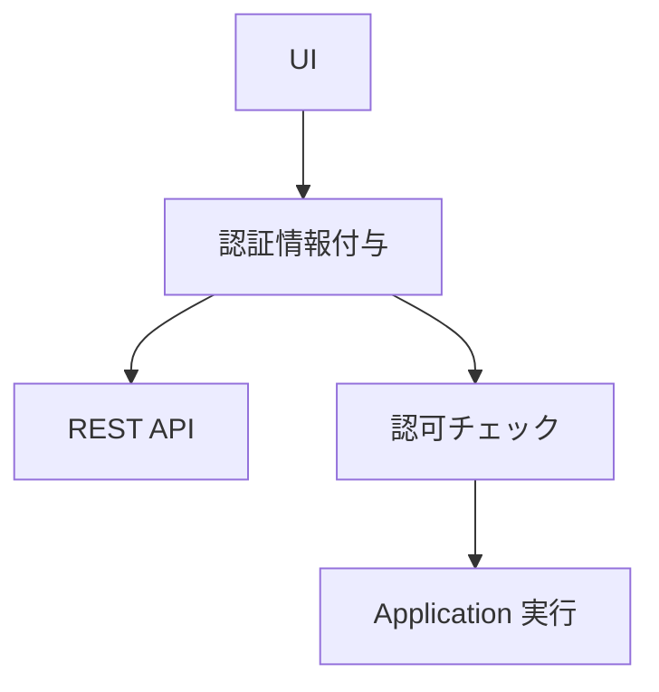
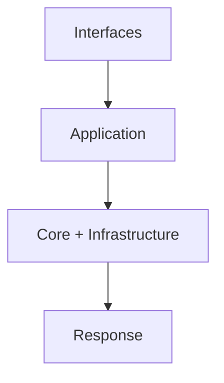

<!--
目的：「フォルダー構成、主要ファイル、技術スタック、ビルド、責務、実行ロジック」の明文化
-->

# S2J Similarity Service - アーキテクチャー

本ドキュメントでは、本プロジェクトを **Composer パッケージとして実装するための指針** を定義します。

## 全体構成

### 設計意図 (ゴール)

類似度算出ロジックを、環境非依存かつ再利用可能な形で提供しつつ、副作用 (外部 API、I/O) を制御可能にします。

### 設計方針 (規約)

* コアロジックと副作用を分離します。
* レイヤーごとに責務を限定します。
* 外部依存は、インターフェース経由で扱います。

### フォルダー構成 (想定)

```plaintext id="arch_structure"
s2j-similarity-service/
├─── `README.md`
├─── `README.txt`
├─── `LICENSE`
├─── `package.json`  # ビルド設定
├─── node_modules/  # 依存 npm モジュール
├─── `vite.config.ts`
├─── `tsconfig.json`
├─── `eslint.config.js`  # ESLint 設定
├─── docs/  # 仕様・設計ドキュメント
├┬── src/
│├┬─ Core/  # ドメインロジック
││└─ ...
│├┬─ Contracts/  # データ構造、外部契約
││└─ ...
│├┬─ Infrastructure/  # 外部 API、I/O
││└─ ...
│├┬─ Application/  # ユースケース単位の処理
││└─ ...
│├┬─ Interfaces/  # 外部 (PHP、REST、UI) との接続点
││└─ ...
│└┬─ types/  # プラグイン用のグローバル型定義
│　├─ `index.ts`
│　├─ `api.ts`  # TypeScript 型 (自動生成)
│　└─ `dom.d.ts`  # DOM
└┬── dist/  # Vite ビルド成果物 (Git 管理外)
　└┬─ js/
　　└─ ...
```

## レイヤー構成

### Core

#### 設計意図 (ゴール)

純粋なドメインロジックを保持します。

#### 設計方針 (規約)

* 副作用を持ちません。
* 外部依存を持ちません。

### Contracts

#### 設計意図 (ゴール)

データ構造と外部契約を定義します。

#### 設計方針 (規約)

* 型・スキーマを Source of Truth とします。
* 入出力仕様を一元管理します。

### Infrastructure

#### 設計意図 (ゴール)

外部 API や I/O を扱います。

#### 設計方針 (規約)

* Core から直接参照させません。
* インターフェースを介して接続します。

### Application

#### 設計意図 (ゴール)

ユースケース単位の処理を定義します。

#### 設計方針 (規約)

* Core と Infrastructure を調停します。
* トランザクション境界を担います。

### アプリケーションサービス「SimilarityService」

本サービスは、ユースケースの単位となります。
本サービスの責務は、下記の通りです。

* テキスト入力を受け取ります。
* Embedding を取得します。
* Core に委譲して、スコアを算出します。

### Interfaces

#### 設計意図 (ゴール)

外部 (PHP、REST、UI) との接続点とします。

#### 設計方針 (規約)

* 入出力の整形と検証を担当します。
* 認証・認可をここで扱います。

## 責務分離ポリシー

### 設計意図 (ゴール)

変更影響を局所化し、保守性を高めます。

### 設計方針 (規約)

* What (契約・仕様) と How (実装) を分離します。
* Source of Truth は Contracts に集約します。

| レイヤー | 責務 |
| -------------- | ---------- |
| Contracts | What |
| Core | How (純ロジック) |
| Infrastructure | How (副作用) |
| Application | 制御 |
| Interfaces | 入出力 |

## Validation の Source of Truth

バリデーションは、Contracts 層のスキーマを唯一の正とします。
Interfaces 層は、このスキーマに基づいて検証を行います。

## 副作用 (External API) の扱い

### 設計意図 (ゴール)

外部 API 依存を隔離し、テスト容易性を確保します。

### 設計方針 (規約)

* Embedding API は Infrastructure に閉じ込めます。
* Application 経由でのみ呼び出します。
* 例外は、ドメインエラーに変換します。

## 権限設計

### 設計意図 (ゴール)

最小権限の原則を維持し、安全な API 利用を保証します。

### 設計方針 (規約)

* 認証と認可を Interfaces 層に集約します。
* UI と API の権限モデルを一致させます。

### 認証・認可フロー



### 認可チェック

* 各エンドポイントで明示的に実施します。
* ユースケース単位で権限を定義します。

## Runtime Validation

### 設計意図 (ゴール)

不正入力を早期に検出し、システム全体の整合性を維持します。

### 設計方針 (規約)

* スキーマを Source of Truth とします。
* Interfaces 層で検証します。

## エラーハンドリング、ログ

### 設計意図 (ゴール)

エラーの一貫性とデバッグ容易性を確保します。

### 設計方針 (規約)

* エラー構造を統一します。
* ログは Infrastructure に集約します。

## フロントエンドとの状態管理

### 設計意図 (ゴール)

API レスポンスに応じた、一貫した UI 挙動を保証します。

### 設計方針 (規約)

* ステータスごとに、状態遷移を定義します。
* リトライ可能な設計とします。

## レイヤー横断の処理フロー

### 設計意図 (ゴール)

処理の流れと、責務境界を明確にします。

### 設計方針 (規約)

* Application をトランザクション境界とします。



## 冪等性 (べきとうせい)

### 設計意図 (ゴール)

再実行時の副作用を制御します。

### 設計方針 (規約)

* 読み取り系は、冪等を確保します。
* 書き込み系は、設計に応じて制御します。

## 技術スタック

* PHP (Composer)
* Node.js (npm)
* OpenAI Embedding API

## ビルド、契約生成

### 設計意図 (ゴール)

契約と実装の乖離を防ぎます。

### 設計方針 (規約)

* OpenAPI を契約の Source of Truth とします。
* 型・バリデーションを自動生成します。

## End-to-End 実行フロー

### 設計意図 (ゴール)

ユーザーが、最短で動作理解できるようにします。

### 設計方針 (規約)

* 最小構成で動作する例を提供します。

```php id="sample_e2e"
$service = new SimilarityService($config);
$score = $service->calculate($textA, $textB);
```
