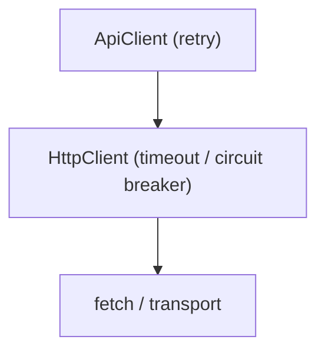
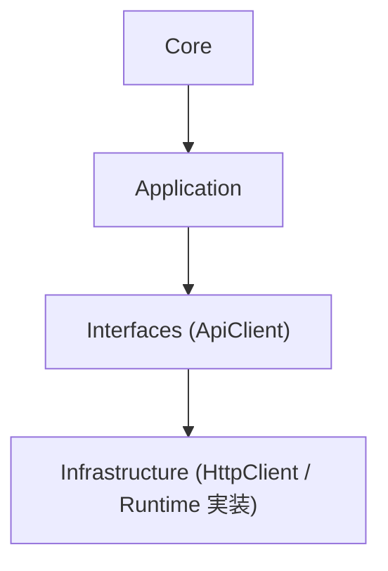
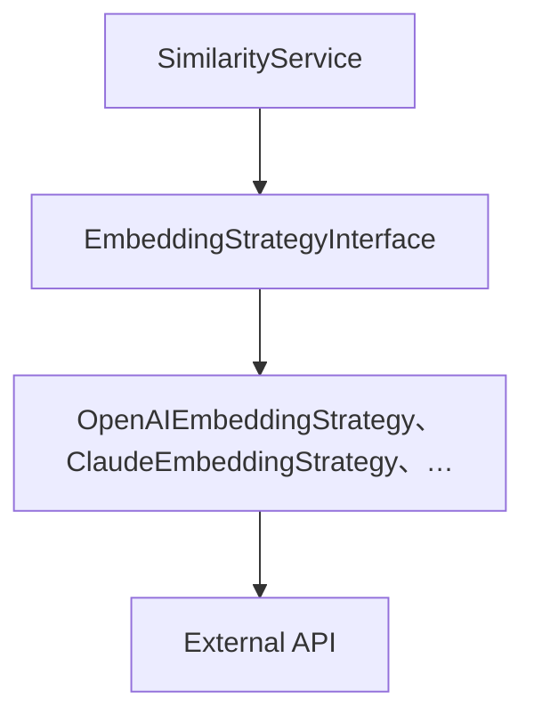
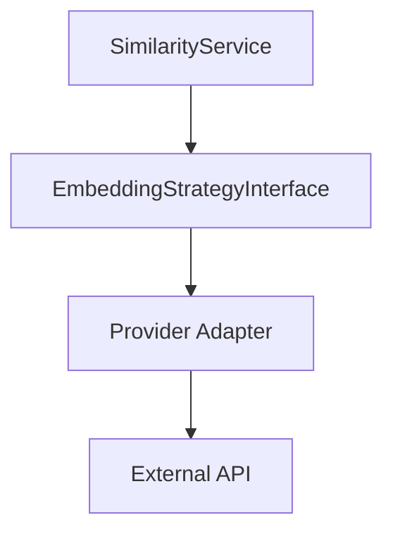
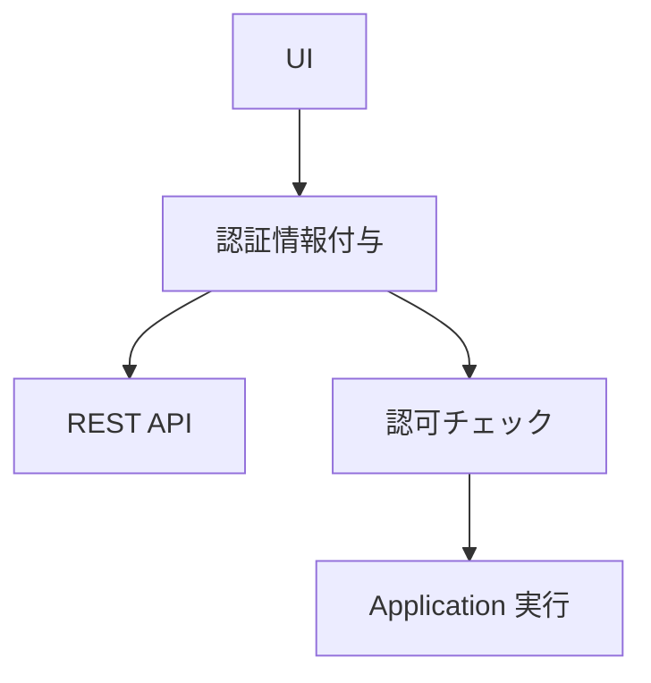
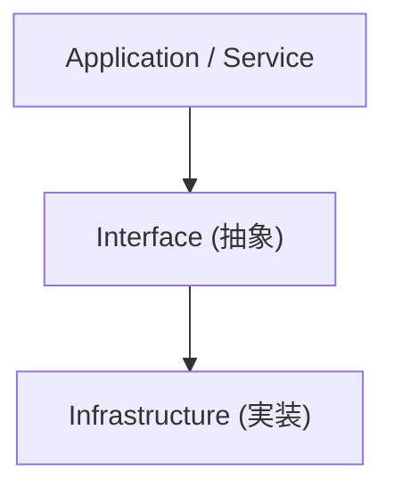
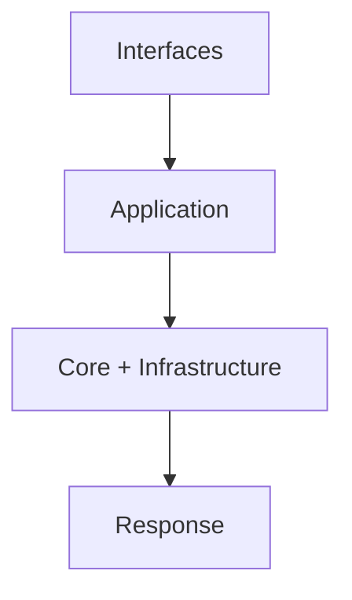
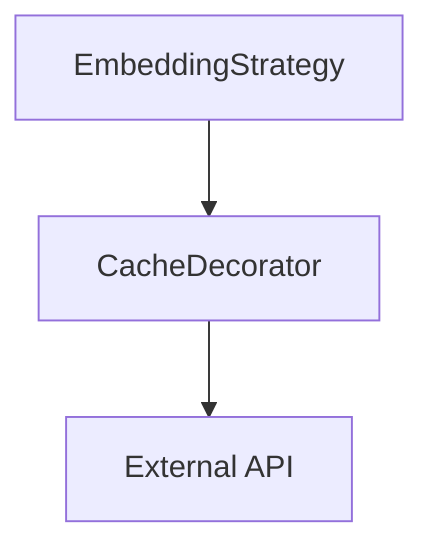

<!--
目的：「フォルダー構成、主要ファイル、技術スタック、ビルド、責務、実行ロジック」の明文化
-->

# S2J Similarity Service - アーキテクチャー

本ドキュメントでは、本プロジェクトを **Composer パッケージとして実装するための指針** を定義します。

## 全体構成

### 設計意図 (ゴール)

類似度算出ロジックを、環境非依存かつ再利用可能な形で提供しつつ、副作用 (外部 API、I/O) を制御可能にします。

### 設計方針 (規約)

* コアロジックと副作用を分離します。
* レイヤーごとに責務を限定します。
* 外部依存は、インターフェース経由で扱います。

### フォルダー構成 (想定)

* dist は、スコープごとに独立する生成物です。他コードから、直接依存してはなりません (常に src または generated を参照すること)。
  * `root/dist`: アプリケーションビルド成果物
  * `packages/*/dist`: 各パッケージの配布成果物
* generated ディレクトリは、src とは独立した領域であり、schema (OpenAPI) から生成される契約の派生物です。手動編集は禁止します。
* generate スクリプトは、以下を保証します。
  * 冪等性 (べきとうせい。何度実行しても同じ結果)
  * 生成物の完全上書き
  * 手動編集の消去

```plaintext id="arch_structure"
s2j-similarity-service/
├─── `README.md`
├─── `README.txt`
├─── `LICENSE`
├─── `package.json`  # ビルド設定
├─── node_modules/  # 依存 npm モジュール
├─── `vite.config.ts`
├─── `tsconfig.json`
├─── `eslint.config.js`  # ESLint 設定
├─── docs/  # 仕様・設計ドキュメント
├┬── src/  # TypeScript
│├┬─ Core/  # ドメインロジック
││└─ ...
│├┬─ Contracts/  # データ構造、外部契約
││└─ ...
│├┬─ Infrastructure/  # 外部 API、I/O
││└─ ...
│├┬─ Application/  # ユースケース単位の処理
││└─ ...
│├┬─ Interfaces/  # 外部 (PHP、REST、UI) との接続点
││├─ `ApiClient.ts`
││└─ ...
│└┬─ types/  # グローバル型定義 (手書き型のみ)
│　├─ `index.ts`
│　└─ `dom.d.ts`  # DOM
├┬─── packages/
│├┬── ts-client/  # Contracts
││├┬─ generated/  # schema/openai.yaml から codegen
│││├┬─ models/
││││└─ `types.ts`  # TypeScript 型 (契約型のみ)
│││├┬─ schemas/
││││└─ `schema.ts`  # Zod スキーマ
│││└┬─ api/  # 任意 (純粋生成のみ)
│││　└─ `rawClients.ts`
││├┬─ dist/  # npm パッケージ配布用
│││├─ `types.js`  # types.ts のトランスパイル物
│││├─ `schema.js`  # schema.ts のトランスパイル物
│││└─ `rawClients.js`  # 任意の純粋生成された api ファイルのトランスパイル物
││├─ `package.json`
││└─ ...
│└┬── php/
│　├┬─ src/
│　│└┬─ Contracts/
│　│　└┬─ DTO/  # scripts/generate/php.sh で schema/openai.yaml から codegen された php DTO
│　│　　├─ `SimilarityRequest.php`
│　│　　├─ `SimilarityResponse.php`
│　│　　├─ `EmbeddingRequest.php`
│　│　　└─ `EmbeddingResponse.php`
│　└─ ...
├┬── schema/  # Source of Truth
│├─ `openapi.yaml`
│└─ ...
├┬── scripts/
│└┬─ generate/
│　├─ `all.zsh`  # 共通の入り口
│　├─ `ts.zsh`
│　├─ `php.zsh`
│　└─ ...
└┬── dist/  # Vite ビルド成果物 (Git 管理外)
　└┬─ js/
　　└─ ...  # src 直下の Core、Contracts、Infrastructure、Application、Interfaces のトランスパイル物
```

## レイヤー構成

### Core

#### 設計意図 (ゴール)

純粋なドメインロジックを保持します。

#### 設計方針 (規約)

* 副作用を持ちません。
* 外部依存を持ちません。

### Contracts

#### 設計意図 (ゴール)

データ構造と外部契約を定義します。

#### 設計方針 (規約)

* 型・スキーマを Source of Truth とします。
* 入出力仕様を一元管理します。

### Contracts の分類

本プロジェクトにおける Contracts は、2種類存在します。

* External Contracts (OpenAPI)
  * `schema/openapi.yaml` を唯一の Source of Truth します。
  * codegen により生成されます。
* Internal Contracts (`src/Contracts`)
  * アプリケーション内部のインターフェース定義です。
  * 外部契約とは独立して定義されます。

### Infrastructure

#### 設計意図 (ゴール)

外部 API や I/O を扱います。

#### 設計方針 (規約)

* Core から直接参照させません。
* インターフェースを介して接続します。

### Application

#### 設計意図 (ゴール)

ユースケース単位の処理を定義します。

#### 設計方針 (規約)

* Core と Infrastructure を調停します。
* トランザクション境界を担います。

#### SimilarityService

本サービスは、ユースケース単位のエントリーポイントです。
本サービスの責務は、下記の通りです。

* テキスト入力を受け取ること。
* EmbeddingProvider を用いて、ベクトルを取得すること。
* Core に委譲して、類似度スコアを算出すること。

### Interfaces

#### 設計意図 (ゴール)

外部 (PHP、REST、UI) との接続点とします。

#### 設計方針 (規約)

* 入出力の整形と検証を担当します。
* 認証・認可をここで扱います。

#### ApiClient の責務

ApiClient は、外部 API コールの高レベルインターフェースを提供します。

ApiClient の責務は、下記の通りです。

* 認証すること (API キー付与)。
* リトライを制御すること。
* エラーをハンドリングすること。
* rawClient をラップすること。

下記は、ApiClient の責務に含まれません。

* DTO 定義 (generated に委譲)
* ビジネスロジック (Application に委譲)

## `generated/api` の位置付け

`generated/api` は、OpenAPI から自動生成される低レベルクライアントです。

* 認証、リトライ、エラーハンドリングは含みません。
* 直接利用は推奨しません。
* `src/Interfaces/ApiClient` から利用します。

## 責務分離ポリシー

### 設計意図 (ゴール)

変更影響を局所化し、保守性を高めます。

### 設計方針 (規約)

* What (契約・仕様) と How (実装) を分離します。
* Source of Truth は Contracts に集約します。

### レイヤーごとの責務

| レイヤー | 責務 |
| -------------- | ---------- |
| Contracts | What |
| Core | How (純ロジック) |
| Infrastructure | How (副作用) |
| Application | 制御 |
| Interfaces | 入出力 |

### Validation の Source of Truth

バリデーションの定義は、Contracts 層の OpenAPI を唯一の正とします。

* Contracts は、概念仕様です。
* Interfaces は、OpenAPI 由来のスキーマで runtime validation を実施します。

## 通信レイヤの責務分離



### ルール

* リトライは、HttpClient に持たせない。
* タイムアウトは、ApiClient に持たせない。
* サーキットブレーカーは、HttpClient の責務とする。

## Runtime 依存の分離

### 構造



### ルール

* runtime 依存は、Infrastructure 層に閉じ込めます。
* Core / Application は、runtime を知りません。
* Interfaces は、抽象のみを扱います。

## 副作用 (External API) の扱い

### 設計意図 (ゴール)

外部 API 依存を隔離し、テスト容易性を確保します。

### 設計方針 (規約)

* Embedding API は Infrastructure に閉じ込めます。
* Application 経由でのみコールします。
* 例外は、ドメインエラーに変換します。

## 外部 API 連携の設計 (Strategy + Adapter)

### 設計意図 (ゴール)

外部 Embedding API への依存を分離し、プロバイダ差し替えとテスト容易性を確保します。

### 設計方針 (規約)

* Strategy パターンにより、抽象化します。
* Adapter パターンにより、外部 API をラップします。
* Core、Application は、具体実装に依存しません。

### 構成



### インターフェース定義 (概念)

```php
interface EmbeddingStrategyInterface {
    public function embed(string $text): array;
}
```

### 実装責務

| 要素 | 責務 |
| --------- | ------- |
| Interface | 契約定義 |
| Strategy | API コール |
| Adapter | レスポンス変換 |

### 依存の向き

* Application → Interface に依存します。
* Interface → 実装には依存しません。
* 実装 → 外部 API に依存します。

### 効果

* プロバイダの差し替えが、可能になります。
* Mock 実装が容易になります。
* 外部 API の変更影響を局所化できます。

## Embedding 抽象化レイヤー

### 設計意図 (ゴール)

ドメインロジックを外部 API 依存から分離します。

### 責務

* 依存方向を制御すること。
* 抽象化を維持すること。

### 非責務

* API 仕様定義
* 型定義

### 構成



### 依存ルール

* Core は EmbeddingStrategyInterface のみに依存する
* Adapter は Infrastructure 層に配置する
* 外部 API は Adapter 以外から直接呼ばない

## 権限設計

### 設計意図 (ゴール)

最小権限の原則を維持し、安全な API 利用を保証します。

### 設計方針 (規約)

* 認証と認可を Interfaces 層に集約します。
* UI と API の権限モデルを一致させます。

### 認証・認可フロー



### 認可チェック

* 各エンドポイントで明示的に実施します。
* ユースケース単位で権限を定義します。

## DI と依存方向

### 構造



### ルール

* 上位層は、Interface のみを参照します。
* 実装は、外部から注入します。
* Service 内で依存を生成しません。

## Runtime Validation

### 設計意図 (ゴール)

不正入力を早期に検出し、システム全体の整合性を維持します。

### 設計方針 (規約)

* スキーマを Source of Truth とします。
* Interfaces 層で検証します。

## エラーハンドリング、ログ

### 設計意図 (ゴール)

エラーの一貫性とデバッグ容易性を確保します。

### 設計方針 (規約)

* エラー構造を統一します。
* ログは Infrastructure に集約します。

## フロントエンドとの状態管理

### 設計意図 (ゴール)

API レスポンスに応じた、一貫した UI 挙動を保証します。

### 設計方針 (規約)

* ステータスごとに、状態遷移を定義します。
* リトライ可能な設計とします。

## レイヤー横断の処理フロー

### 設計意図 (ゴール)

処理の流れと、責務境界を明確にします。

### 設計方針 (規約)

* Application をトランザクション境界とします。



## キャッシュの配置

### 構造



### ルール

* キャッシュは、Infrastructure 層に配置します。
* Core / Application は、キャッシュを認識しません。

## 冪等性 (べきとうせい)

### 設計意図 (ゴール)

再実行時の副作用を制御します。

### 設計方針 (規約)

* 読み取り系は、冪等を確保します。
* 書き込み系は、設計に応じて制御します。

## 技術スタック

* PHP (Composer)
* Node.js (npm)
* OpenAI Embedding API

## ビルド、契約生成

### 設計意図 (ゴール)

契約と実装の乖離を防ぎます。

### 設計方針 (規約)

* OpenAPI を契約の Source of Truth とします。
* 型、バリデーションを自動生成します。

## End-to-End 実行フロー

### 設計意図 (ゴール)

ユーザーが、最短で動作理解できるようにします。

### 設計方針 (規約)

* 最小構成で動作する例を提供します。

```php id="sample_e2e"
$service = new SimilarityService($config);
$score = $service->calculate($textA, $textB);
```
