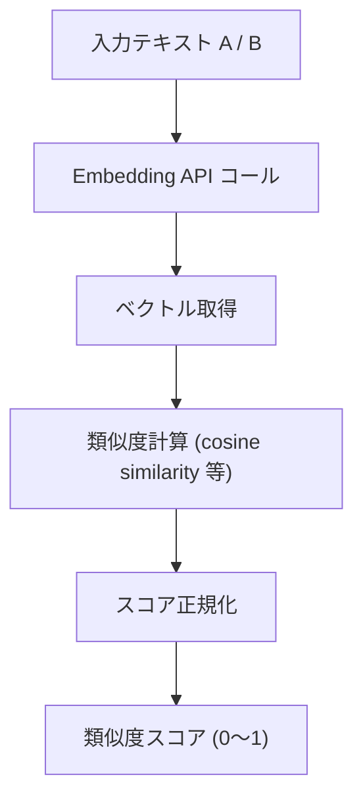
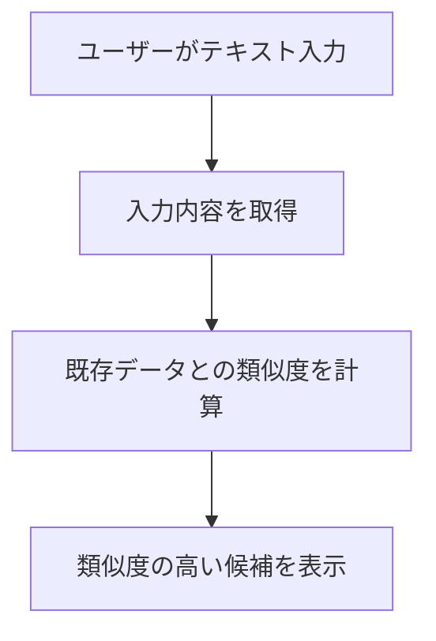
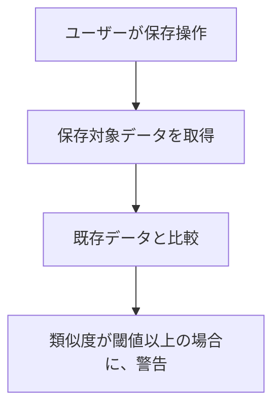
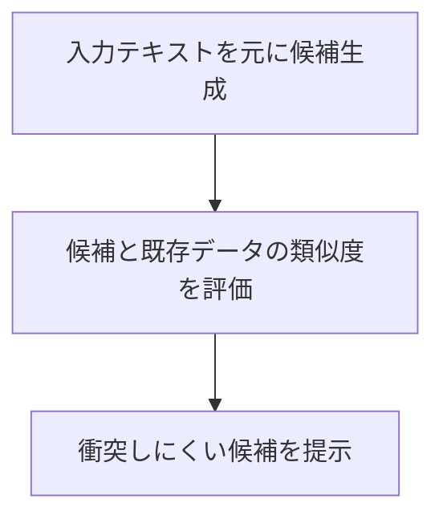

<!-- 
目的：「想定ユースケース、解決する課題、処理フロー」の明文化
 -->

# S2J Similarity Service - コンセプト

本ドキュメントは、本プロジェクトの **背景理解** を目的とします。
本ライブラリが「何を前提とし」「どのような場面で使われ」「何を解決し」「何を対象外とするか」を明確にします。

## 前提条件

本ライブラリは、以下の前提で利用されることを想定します。

* テキスト同士の「意味的な近さ (semantic similarity)」を評価したいケース
* 外部の Embedding API (例：OpenAI 等) を利用可能であること
* 入力テキストは自然言語 (日本語・英語など) であること
* リアルタイムまたは準リアルタイムでの類似度判定が求められること

また、本ライブラリは

* PHP (Composer) および Node.js (npm) 環境で利用可能です。
* 特定のフレームワーク (たとえば、WordPress) には依存しません。

## 想定ユースケース

本ライブラリは、以下のような用途での利用を想定します。

### コンテンツ管理支援

* 記事タイトルの重複・類似チェック
* 投稿内容の類似検出 (簡易的な重複排除)

### スラッグ生成支援

* 既存スラッグとの類似度を基にした、候補生成補助
* 類似コンテンツとの、衝突回避

### 検索補助 (軽量用途)

* クエリーと既存データの、意味的近さの評価
* 厳密な検索ではなく、近似的な一致判定

### 編集支援

* 入力中テキストと既存コンテンツの、近似提示
* 類似コンテンツの、リアルタイム提示

## 解決する課題

従来の単純な文字列比較では、以下の課題があります。

* 表記揺れ (たとえば、全角/半角、言い換え) に弱い
* 意味的に近いが、文字列が異なるケースを検出できない
* 人間の感覚に近い「似ている」の判断が困難

また、意味的類似度 (semantic similarity) を扱う場合、以下の実装上の課題があります。

* 2つのテキストが「意味的にどれだけ近いか」を定量的に知りたいが、Embedding 生成および類似度計算 (たとえば、cosine similarity) を自前で実装する必要がある
* 外部 API の呼び出し、エラーハンドリング、リトライ制御などを個別に実装する負担が大きい
* Embedding のキャッシュや最適化戦略を都度設計する必要がある

さらに、運用・拡張の観点では、以下の課題があります。

* Embedding プロバイダ (たとえば、OpenAI、Claude、Gemini) やモデルを将来的に差し替えたいが、実装が特定 API に強く依存していると、変更コストが高くなる
* プロバイダごとの差異 (レスポンス形式・制約) を吸収する、統一的なインターフェースが必要

本ライブラリは、Embedding ベースの類似度計算を抽象化することで、下記を提供します。

* 意味的な近さを、数値として扱える
* 表記揺れや言い換えに対して、頑健になる
* Embedding 生成および類似度計算の実装を、隠蔽できる
* 外部 API 依存を抽象化し、容易にプロバイダー差し替えできる
* 一貫したインターフェース・基準で、類似度判定を利用できる

これにより、ユーザーは「類似度を使うこと」に集中でき、実装および運用の複雑性を大幅に低減できます。

## Composer パッケージとしての非対応スコープ

本ライブラリは、汎用的な類似度計算サービスであり、以下は対象外とします。

* 大規模検索エンジン (全文検索、ランキング最適化)
* ベクトルデータベース機能 (保存・インデックス管理)
* 高度な機械学習パイプライン (再学習・モデル管理)
* UI コンポーネントの提供 (画面そのものの実装)
* WordPress 等の特定 CMS への直接依存

これらは、上位レイヤー (アプリケーション側) で実装されることを前提とします。

## 処理フロー

本ライブラリにおける基本的な処理の流れは、以下の通りです。

**注記:**

* Embedding は、キャッシュされる場合があります。
* API コール失敗時のリトライやフォールバックは、別途定義されます。

## 画面 UI で想定される操作フロー

本ライブラリは UI を提供しませんが、典型的な操作フローは以下の通りです。

### パターン1 - リアルタイム入力支援

### パターン2 - 保存時チェック

### パターン3 - 候補生成補助

