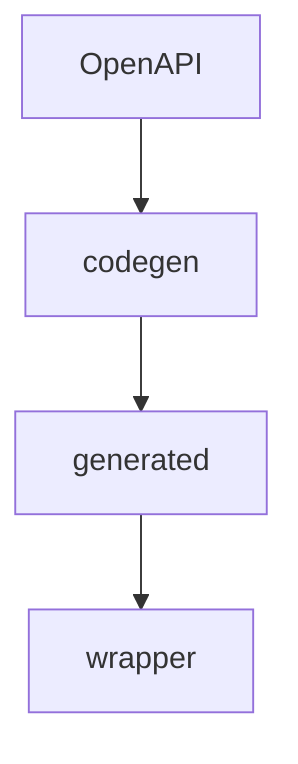
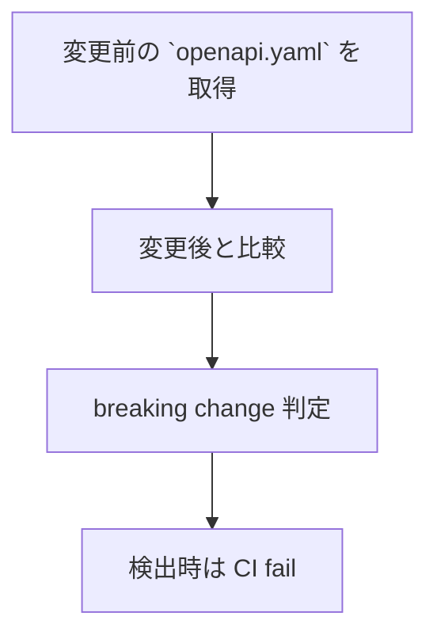
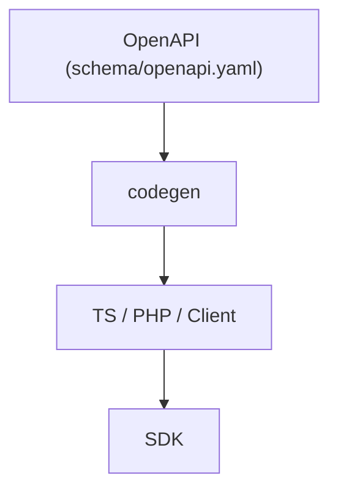
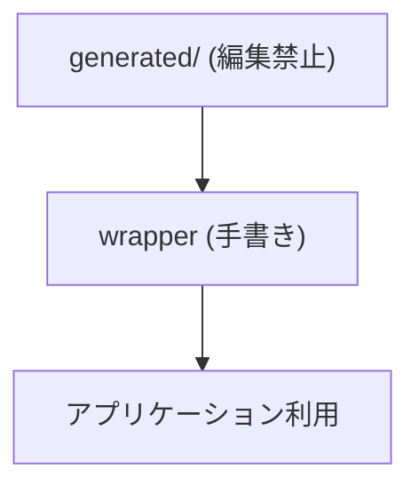
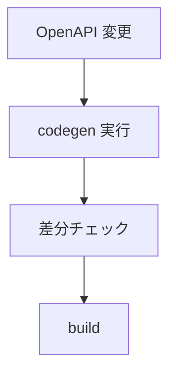
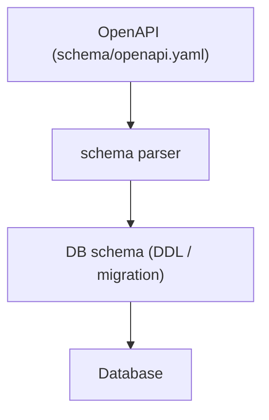
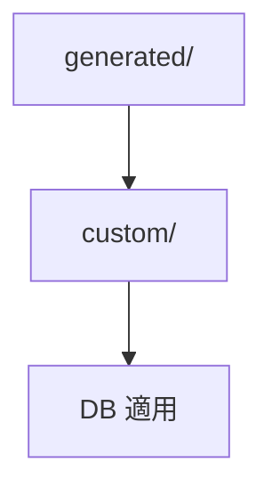

<!-- 
 生成戦略
 -->

# S2J Similarity Service - 生成戦略

## 概要

本仕様は、OpenAPI を Source of Truth とし、各言語 (TypeScript、PHP) 向けの型、スキーマ、クライアントを自動生成するしくみを定義します。

## 設計意図、設計方針、非対象

### 設計意図 (ゴール)

OpenAPI から全言語の契約、SDK を生成します。

* API 契約から、すべての型、DTO、クライアントを自動生成します。
* 手動実装による不整合を、排除します。
* 言語間で完全に一致した契約を、保証します。

### 設計方針 (規約)

* OpenAPI を唯一の契約定義 (SoT) します。
* generated ディレクトリは、手動編集を禁止とします。
* 生成物は、(直接編集せず) wrapper で拡張します。

### 責務

* OpenAPI から、各言語向けコード生成の仕様を定義すること。
* 生成対象 (TS 型、Zod、PHP DTO) を明確化すること。
* 生成フローおよび生成物配置ルールを定義すること。

### 非責務

* 生成物の内部ロジック設計
* SDK の利用方法
* 実行時の通信処理

### 非対象 (Out of Scope)

* ビジネスロジックの生成
* UI / SDK の利用設計
* 実行時の通信制御

### 入力

* `schema/openapi.yaml`

### 出力

* TypeScript 型
* Zod スキーマ
* API Client
* PHP DTO

### 原則

* 生成物は、編集禁止
* Wrapper で拡張する

### フロー



## DTO の役割

### 設計意図 (ゴール)

生成コードの責務を限定します。

### 設計方針 (規約)

* DTO は、外部契約の表現のみです。
* ビジネスロジックを持ちません。

### 非責務

* 計算処理
* バリデーションロジック (最小限を除く)

## OpenAPI → Error 型マッピング

OpenAPI のレスポンス仕様と DomainError を、対応付けます。

### 設計意図 (ゴール)

* API 仕様とエラー処理を、一致させます。
* 型安全なエラー処理を、実現します。

### 設計方針 (規約)

* HTTP ステータスベースで、マッピングします。
* 必要に応じて、レスポンスボディも解析します。

### 責務

* OpenAPI 仕様とエラー処理の、整合性を維持すること。
* 型安全なエラーを変換すること。

### 非責務

* エラー UI 表示
* ログ集約

### マッピング定義

| HTTP Status | DomainError |
| ----------- | --------------- |
| 400 | ValidationError |
| 401 | ApiError |
| 403 | ApiError |
| 404 | ApiError |
| 429 | ApiError |
| 500-599 | ApiError |

### 実装例

```ts
function mapError(res: Response, body: any): DomainError {
  if (res.status === 400) {
    return new ValidationError(body?.message ?? "Bad Request");
  }

  if (res.status >= 500) {
    return new ApiError(res.status, "Server Error");
  }

  return new ApiError(res.status, body?.message ?? "API Error");
}
```

### ApiClient 内での利用

```ts
if (!res.ok) {
  const body = await res.json().catch(() => ({}));
  throw mapError(res, body);
}
```

### 拡張ポイント

* OpenAPI の `default`、`error` スキーマの解析
* エラーコードベースで分岐
* i18n 対応

## OpenAPI Breaking Change 検出

本プロジェクトでは、OpenAPI の変更に対して、breaking change を自動検出します。

### 設計意図 (ゴール)

* API 互換性の破壊を防ぎます。
* 「意図しない breaking change」を検出します。
* semantic-release と連携します。

### 設計方針 (規約)

* OpenAPI の差分を CI で比較します。
* breaking change は、CI を fail させます。
* 明示的に許可する場合のみ、通過させます。

### 責務

* API 互換性を保証すること。
* 破壊的変更を可視化すること。

### 非責務

* ビジネスロジックの変更検出
* パフォーマンス影響分析

### Breaking Change の例

| 変更内容 | 判定 |
| ---------- | -- |
| フィールド削除 | ❌  |
| 型変更 | ❌  |
| required 追加 | ❌  |
| フィールド追加 | ✔  |

### semantic-release との連携

* breaking change 検出時:
  * CI fail
  * または `BREAKING CHANGE` を要求

### 運用ルール

* breaking change は、必ずレビュー対象とすること。
* リリース時は、major version を付与すること。

### 検出ツール

* openapi-diff
* oasdiff (推奨)

### 検証フロー



### GitHub Actions 例

```yaml id="oas_ci"
name: OpenAPI Diff

on: [pull_request]

jobs:
  openapi-diff:
    runs-on: ubuntu-latest

    steps:
      - uses: actions/checkout@v4

      - name: Install oasdiff
        run: go install github.com/Tufin/oasdiff@latest

      - name: Compare OpenAPI
        run: |
          oasdiff breaking \
            origin/main:schema/openapi.yaml \
            schema/openapi.yaml
```

## 完全コード生成 (SDK 含む)

本プロジェクトでは、OpenAPI を単一の契約 (Source of Truth) とし、SDK、型、バリデーション、クライアント実装までを自動生成します。

### 設計意図 (ゴール)

* 手書きコードを最小化します。
* 契約と実装の乖離を、完全に排除します。
* 開発速度と品質を、同時に向上させます。

### 設計方針 (規約)

* OpenAPI を唯一の入力とします。
* 生成コードは、手動編集を禁止とします。
* カスタマイズは、Adapter / Wrapper で行います。

### 責務

* SDK を自動生成すること。
* 契約との一致を保証すること。

### 非責務

* ビジネスロジック
* UI の実装

### 対象生成物

| 対象 | 内容 |
| ------------ | ------------------ |
| TypeScript 型 | DTO 型 |
| Zod スキーマ | runtime validation |
| API Client | fetch wrapper |
| PHP DTO | サーバー連携用 |
| エラーモデル | DomainError |

### データフロー



### 生成構成

```plaintext id="codegen_structure"
packages/
  ts-client/generated/
    models/
    schemas/
    api/

  php/src/Contracts/DTO/
```

### カスタマイズ戦略



### CI フロー



### 利点

* 手書きコードが削減されること。
* 一貫性が保証されること。
* 多言語への対応が容易であること。

### 注意点

* generator に依存する可能性があります。
* カスタマイズに制約が課される可能性があります。

### 例 (ラップ)

```ts id="codegen_wrap"
import { rawSimilarity } from "./generated/api";

export async function similarity(input) {
  return rawSimilarity(input);
}
```

## OpenAPI → DB schema 連動

本プロジェクトでは、OpenAPI を契約の Source of Truth とし、DB スキーマ (テーブル、カラム、制約) を自動生成・同期します。

### 設計意図 (ゴール)

* API 仕様と DB 構造の乖離を、排除します。
* データモデルの一貫性を保証します。
* スキーマ変更の影響範囲を明確化します。

### 設計方針 (規約)

* OpenAPI の schema/components をもとに、DB を定義します。
* 生成物 (DDL、マイグレーション) は、手動編集を禁止します。
* カスタムは、拡張レイヤで対応します。

### 責務

* DB スキーマを生成すること。
* データ構造の一貫性を維持すること。

### 非責務

* クエリーの最適化
* インデックスの設計 (高度調整)

### マッピングルール

| OpenAPI | DB |
| ------- | -------------- |
| string | VARCHAR / TEXT |
| integer | INT |
| number | FLOAT |
| boolean | BOOLEAN |
| object | JSON / テーブル |
| array | JSON / リレーション |

### データフロー



### 生成物

```plaintext id="db_output"
db/
  migrations/
    001_create_similarity.sql
  schema.sql
```

### マイグレーション戦略

* 差分ベースで生成します。
* backward compatibility を考慮します。
* breaking change は、明示します。

### 拡張ポイント



### 利点

* API と DB の完全一致ができること。
* スキーマ管理が簡素化できること。
* 開発速度が向上できること。

### 注意点

* 正規化 vs JSON の設計判断が必要です。
* 複雑なリレーションの表現制限が必要です。

## 生成物の取り扱い

### 設計意図 (ゴール)

生成物を派生物として扱い、Source of Truth を一元化します。

### 設計方針 (規約)

* 生成物は、OpenAPI から再生成可能であることとします。
* 手動での編集は、禁止とします。
* 変更は、必ず schema を通して行います。

### 注意

生成物の更新は、[コード生成パイプライン](../engineering/codegen_pipeline.md) のルールに従います。

## OpenAPI Code Generation Governance

### 設計意図 (ゴール)

OpenAPI schema を唯一の契約定義 (Single Source of Truth) とし、各言語向け生成物の一貫性・再現性・公開境界を保証します。

本ライブラリは、WordPress プラグインやテーマへの組込みを前提とするため、本番環境での code generation を前提とせず、開発、CI、release 時のみ生成します。

### 設計原則

```plaintext
OpenAPI is the source of truth
Generated code is reproducible
PHP artifacts are distributable
TS generated code is development-only
Public API is handwritten and stable
```

### 設計方針 (規約)

* `schema/openapi.yaml` を唯一の契約定義とします。
* code generation は、開発環境 / CI / release build のみで実行します。
* 本番 WordPress 環境では、code generation を実行しません。
* PHP DTO は、Composer 配布物へ同梱します。
* TypeScript generated code は、開発用途に限定します。
* TS generated/raw client は、WordPress ユーザー向け公開 API としません。
* codegen 出力は、deterministic (再現可能) でなければなりません。
* CI により、生成差分ゼロを保証します。

### 非対象 (Out of Scope)

* GraphQL codegen
* O/R マッパー codegen
* DB schema generation
* browser-side runtime generation
* npm package としての TS SDK 公開

### 責務

* OpenAPI を、Single Source に保つこと。
* code generation の再現性を、保証すること。
* generated/public の境界を、定義すること。
* CI による整合性を検証すること。
* WordPress 配布モデルと整合させること。

### 非責務

* runtime code generation
* WordPress 本番環境での build
* TS SDK の standalone 配布
* IDE plugin support
* GUI OpenAPI editor

### Source of Truth

[OpenAPI schema](../../schema/openapi.yaml) を契約定義の唯一の正本とし、ここから下記を派生させます。

* PHP DTO
* TypeScript types
* Zod schema
* raw client
* ErrorResponse types

### 生成基盤

#### 実行スクリプト

`scripts/generate/all.zsh` を code generation の唯一の入口とします。

#### 再現性固定

`openapitools.json` により、OpenAPI Generator のバージョン、設定を固定し、開発者の環境差異による生成揺れを防止します。

### 出力先

#### PHP DTO (配布対象)

`src/Contracts/DTO/Generated/` の用途は、下記のとおりです。

* Composer 配布
* 本番 WordPress runtime
* DTO / ErrorResponse

#### TypeScript generated (開発専用)

`tools/generated/ts/` の用途は、下記のとおりです。

* 管理画面
* build tooling
* Playground
* Zod validation
* internal testing

### 実行タイミング

#### 必須

* OpenAPI schema 更新時
* CI
* release build

#### 禁止

本番環境 (production WordPress runtime) での code generation 実行は、禁止します。

### CI 品質ゲート

#### 必須ルール

CI では、以下を実行します。

```bash
./scripts/generate/all.zsh
git diff --exit-code
```

#### 判定

生成差分が存在する場合、`CI FAIL` とします。

#### 目的

* schema と generated code の乖離防止
* コミット漏れ検知
* deterministic build 保証

### 公開範囲

#### 公開対象

Composer 配布物は、下記とします。

```plaintext
src/Contracts/DTO/Generated/
```

#### 非公開対象

以下は、WordPress ユーザー向け公開 API としません。

```plaintext
tools/generated/ts/
raw client
generated TS SDK
```

### SDK との整合

[型安全な SDK 設計](../interfaces/sdk_spec.md) に従い、下記とします。

* generated code = internal implementation
* stable API = wrapper client

ユーザーは generated client を直接利用しません。

### release ルール

release artifact には、下記を含めます。

* PHP DTO
* Contracts
* handwritten SDK

release artifact には、下記を含めません。

* TS generated raw client
* dev-only tools
* Zod artifacts (公開用途)
