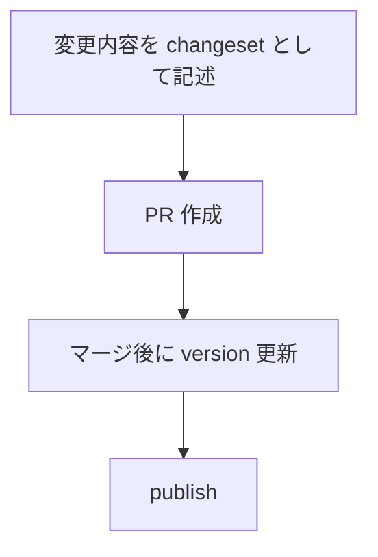
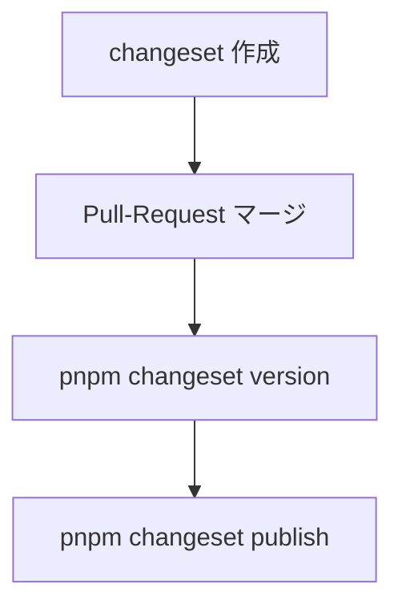
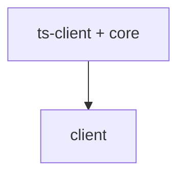
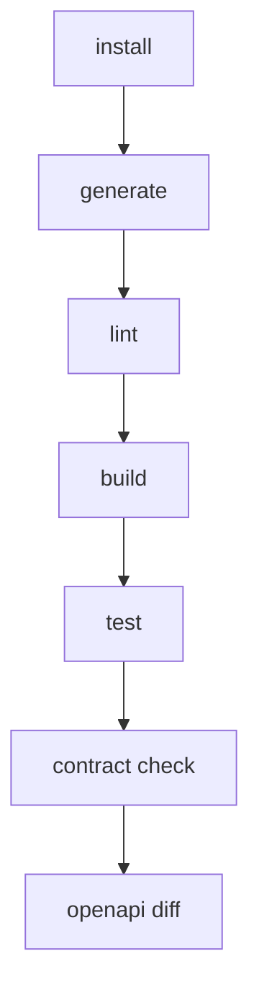

<!-- 
 CI/CD / semantic-release
 -->

# S2J Similarity Service - ビルドおよびリリース

## 概要

本プロジェクトでは、OpenAPI (`schema/openapi.yaml`) を唯一の契約 (Source of Truth) とし、CI によって生成物との整合性を自動検証します。

本仕様は、ビルド、テスト、リリースを含む CI/CD パイプラインの設計を定義します。

## 設計意図、設計方針、非対象

### 設計意図 (ゴール)

* 再現性のある、ビルド環境を確立します。
* 自動バージョニングとリリースを実現します。
* 品質ゲートを CI に組み込みます。

* 契約 (OpenAPI) と実装 (生成コード) の乖離を防止します。
* レビュー前に、不整合を検出します。
* リリース品質を担保します。

### 設計方針 (規約)

* semantic-release または Changesets により、自動的にリリースします。
* すべての生成物は、CI 上で検証します。
* lint / typecheck / test を必須とします。

* 生成物は、常に OpenAPI から再生成します。
* 生成差分がある場合は、CI を失敗させます。
* 生成物の手動編集は、禁止します。

### 責務

* 契約と生成物の同期を保証すること。
* 破壊的変更を早期検知すること。

* ビルド、テスト、リリースフローを定義すること。
* CI/CD における品質ゲートを設計すること。
* バージョニングおよびリリース戦略を統一すること。

### 非責務

* 実行時のバグ検出 (別途テスト)
* パフォーマンス検証

* インフラストラクチャのデプロイ (IaC)
* ランタイム監視
* SDK / API の設計

### 非対象 (Out of Scope)

* インフラストラクチャのデプロイ
* ランタイム運用監視
* 個別プロジェクトの手動リリース手順

### 検証フロー

```mermaid id="ci_flow"
flowchart TD
  A["`openapi.yaml` を変更"] --> B["generate スクリプト実行"]
  B --> C["差分チェック (git diff)"]
  C --> D["差分があれば、CI fail"]
```

### 検証対象

| 対象 | 内容 |
| ------------ | --------------------- |
| TypeScript 型 | `generated/models` |
| Zod スキーマ | `generated/schemas` |
| PHP DTO | `php/src/Contracts/DTO` |

### 失敗条件

* 生成結果に差分がある
* codegen エラー
* スキーマ不整合

### 実行コマンド

```bash id="ci_cmd"
./scripts/generate/all.zsh
git diff --exit-code
```

### GitHub Actions 例

```yaml id="ci_yaml"
name: Contract Check

on: [push, pull_request]

jobs:
  contract:
    runs-on: ubuntu-latest

    steps:
      - uses: actions/checkout@v4

      - name: Install dependencies
        run: npm ci

      - name: Generate code
        run: ./scripts/generate/all.zsh

      - name: Check diff
        run: git diff --exit-code
```

## semantic-release (自動バージョニング)

本プロジェクトでは、semantic-release を利用して、バージョニングおよびリリースを自動化します。

### 設計意図 (ゴール)

* バージョン管理の、人為的ミスを防ぎます。
* OpenAPI 変更と SDK バージョンを自動同期します。
* リリースプロセスを標準化します。

### 設計方針 (規約)

* Conventional Commits を必須とします。
* バージョンは、コミット内容から自動決定します。
* 手動での version 更新は、禁止します。

### 責務

* バージョン管理を自動化すること。
* リリースノートを生成すること。

### 非責務

* 破壊的変更の検出 (別途ツールで実施)

### リリース対象

* npm (TypeScript SDK)
* GitHub Release

### バージョン決定ルール

| コミット種別 | バージョン |
| --------------- | ----- |
| BREAKING CHANGE | major |
| fix | patch |
| feat | minor |

### OpenAPI との関係

* OpenAPI の変更は、必ずコミットに反映すること。
* breaking change は、`BREAKING CHANGE` を付与すること。

### 設定例

```json id="semantic_release_config"
{
  "branches": ["main"],
  "plugins": [
    "@semantic-release/commit-analyzer",
    "@semantic-release/release-notes-generator",
    "@semantic-release/npm",
    "@semantic-release/github"
  ]
}
```

### GitHub Actions 例

```yaml id="semantic_release_ci"
name: Release

on:
  push:
    branches: [main]

jobs:
  release:
    runs-on: ubuntu-latest

    steps:
      - uses: actions/checkout@v4

      - run: npm ci

      - run: npx semantic-release
```

## バージョン更新ルール

### 設計方針 (規約)

* OpenAPI に breaking change がある場合
  * API のメジャーバージョンを更新します。
  * SDK のメジャーバージョンも更新します。

### CI 連携

* breaking change 検出時に警告または fail します。

## Vite、build 最適化

本プロジェクトでは、ビルドの高速化と配布物の最適化のために Vite を採用します。

### 設計意図 (ゴール)

* 高速なビルドと開発体験の向上を目指します。
* Tree-shaking により、軽量化を目指します。
* ライブラリとしての最適な出力を目指します。

### 設計方針 (規約)

* 各パッケージは、ライブラリモードでビルドします。
* 不要なコードは、出力しません (Tree-shaking)。
* 依存は、external 指定します。

### 責務

* ビルドを最適化すること。
* 配布物を軽量化すること。

### 非責務

* 型生成 (tsc)
* API 契約生成 (OpenAPI)

### Vite 設定 (ライブラリモード)

```ts id="vite_config"
import { defineConfig } from "vite";

export default defineConfig({
  build: {
    lib: {
      entry: "src/index.ts",
      name: "S2JSimilarity",
      formats: ["es", "cjs"]
    },
    rollupOptions: {
      external: ["zod"],
    }
  }
});
```

### 出力構成

```plaintext id="vite_output"
dist/
  index.es.js
  index.cjs.js
  index.d.ts
```

### 最適化ポイント

#### Tree-shaking

* named export を使用します。
* sideEffects を false に設定します。

#### external 指定

```json id="vite_external"
{
  "sideEffects": false
}
```

#### sourcemap

```ts id="vite_sourcemap"
build: {
  sourcemap: true
}
```

### turborepo との連携

```bash id="vite_turbo"
pnpm turbo run build
```

## Changesets vs semantic-release の比較

本プロジェクトでは、リリース管理手法として Changesets と semantic-release を比較し、用途に応じて選択します。

### 設計意図 (ゴール)

* モノレポ環境における、最適なリリース戦略を選択します。
* バージョン管理の透明性と、自動化のバランスを取ります。

### 責務

* バージョン管理方式を定義すること。
* チーム運用を標準化すること。

### 非責務

* API 互換性の保証 (OpenAPI diff に委譲)
* リリース内容のレビュー

### 比較概要

| 項目 | semantic-release | Changesets |
| ------- | ---------------- | --------------- |
| バージョン決定 | 自動 (コミットベース) | 手動 (changeset 記述) |
| モノレポ対応 | 弱い | 強い |
| リリース粒度 | 全体 | パッケージ単位 |
| 学習コスト | 低 | 中 |
| 柔軟性 | 低 | 高 |

### semantic-release の特徴

* Conventional Commits にもとづいて、完全自動化できます。
* リリースに人手は不要です。
* 単一パッケージに最適です。

### Changesets の特徴

* 変更内容を、明示的に記述します。
* バージョン管理は、パッケージ単位です。
* モノレポに最適です。

### 採用方針

本プロジェクトでは、以下を推奨します。

* モノレポ構成においては、Changesets を採用すること。
* 将来的に単一 SDK 化する場合は、semantic-release に移行可能とすること。

### 本プロジェクトでの推奨

| 条件 | 推奨 |
| ----------- | ---------------- |
| 単一パッケージ | semantic-release |
| モノレポ (複数 SDK) | Changesets |

### Changesets 運用フロー



### Changeset 例

```md id="changeset_example"
---
"@s2j/similarity-client": minor
---

Add new embedding endpoint
```

## pnpm + Changesets + turborepo の実構成

本プロジェクトでは、モノレポ管理・バージョン管理・ビルド最適化を統合するため、以下の構成を採用します。

### 設計意図 (ゴール)

* パッケージ間の整合性を維持します。
* リリースを自動化します。
* ビルド効率の最大化を目指します。

### 責務

* モノレポ全体を統合管理すること。
* ビルドとリリースを自動化すること。

### 非責務

* 各パッケージの内部設計
* API 仕様の定義 (OpenAPI)

### 採用技術

| 技術 | 役割 |
| ---------- | ------------ |
| pnpm | パッケージ管理 |
| Changesets | バージョン管理・リリース |
| turborepo | タスク実行・キャッシュ  |

### ディレクトリ構成

```plaintext id="mono_real"
.
├ package.json
├ pnpm-workspace.yaml
├ turbo.json
├ .changeset/
├ packages/
│  ├ ts-client/
│  ├ core/
│  └ client/
├ schema/
├ scripts/
└ src/
```

### リリースフロー



### CI 連携

* generate → build → test → changeset publish
* OpenAPI diff と連携

### `pnpm-workspace.yaml`

```yaml id="pnpm_ws"
packages:
  - "packages/*"
```

### `turbo.json`

```json id="turbo_real"
{
  "pipeline": {
    "generate": {
      "outputs": []
    },
    "build": {
      "dependsOn": ["^build"],
      "outputs": ["dist/**"]
    },
    "lint": {},
    "test": {}
  }
}
```

### ルート `package.json` (抜粋)

```json id="root_pkg"
{
  "private": true,
  "scripts": {
    "generate": "turbo run generate",
    "build": "turbo run build",
    "release": "changeset publish"
  },
  "devDependencies": {
    "turbo": "^1.12.0",
    "@changesets/cli": "^2.26.0"
  }
}
```

### Changesets 初期化

```bash id="changeset_init"
pnpm changeset init
```

## `package.json` の具体的な分割設計

本プロジェクトでは、パッケージごとに責務を分離した `package.json` を定義します。

### 設計意図 (ゴール)

* 各パッケージの独立性を確保します。
* 依存関係を明確化します。
* 配布単位を分離します。

### 責務

* パッケージ単位の構成を定義すること。
* 依存関係を明示化すること。

### 非責務

* ビルドツールの設定
* CI の実装

### 依存関係の整理

```plaintext
ts-client   ← 単独 (OpenAPI 依存)
core        ← 単独 (純ロジック)
```



### バージョン管理

* Changesets により、各パッケージ単位で管理します。
* 依存関係は、自動更新します。

### ルート `package.json`

```json id="pkg_root"
{
  "name": "s2j-similarity-service",
  "private": true,
  "scripts": {
    "generate": "turbo run generate",
    "build": "turbo run build",
    "release": "changeset publish"
  }
}
```

### ts-client (Contracts)

```json id="pkg_ts"
{
  "name": "@s2j/similarity-client",
  "version": "0.1.0",
  "main": "dist/index.js",
  "types": "dist/index.d.ts",
  "files": ["dist"],
  "scripts": {
    "generate": "bash ../../scripts/generate/ts.zsh",
    "build": "tsc"
  },
  "dependencies": {
    "zod": "^3.22.0"
  }
}
```

### core (Domain)

```json id="pkg_core"
{
  "name": "@s2j/similarity-core",
  "version": "0.1.0",
  "main": "dist/index.js",
  "types": "dist/index.d.ts",
  "scripts": {
    "build": "tsc"
  },
  "dependencies": {}
}
```

### client (Interfaces)

```json id="pkg_client"
{
  "name": "@s2j/similarity-client-runtime",
  "version": "0.1.0",
  "main": "dist/index.js",
  "types": "dist/index.d.ts",
  "scripts": {
    "build": "tsc"
  },
  "dependencies": {
    "@s2j/similarity-client": "workspace:*",
    "@s2j/similarity-core": "workspace:*"
  }
}
```

### exports (推奨)

```json id="pkg_exports"
{
  "exports": {
    ".": {
      "import": "./dist/index.js",
      "types": "./dist/index.d.ts"
    }
  }
}
```

## tsconfig 分割設計

本プロジェクトでは、モノレポ構成に対応するため、TypeScript 設定を分割し、継承構造で管理します。

### 設計意図 (ゴール)

* 設定の重複を排除します。
* パッケージごとに最適化します。
* ビルドの一貫性を確保します。

### 設計方針 (規約)

* ルートに、共通設定を定義します。
* 各パッケージは、継承します。
* 出力先 (dist) は、パッケージごとに分離します。

### 責務

* TypeScript 設定を統一すること。
* ビルド構造を明確化すること。

### 非責務

* バンドル (Vite など)
* 実行環境の設定

### ビルド方針

* 各パッケージは、独立してビルド可能とします。
* turborepo により、並列ビルド可能とします。

### 構成

```plaintext id="tsconfig_structure"
tsconfig.base.json
packages/
  ts-client/tsconfig.json
  core/tsconfig.json
  client/tsconfig.json
```

### `tsconfig.base.json`

```json id="tsconfig_base"
{
  "compilerOptions": {
    "target": "ES2020",
    "module": "ESNext",
    "moduleResolution": "Node",
    "strict": true,
    "esModuleInterop": true,
    "skipLibCheck": true
  }
}
```

### 各パッケージの tsconfig

```json id="tsconfig_pkg"
{
  "extends": "../../tsconfig.base.json",
  "compilerOptions": {
    "outDir": "dist",
    "rootDir": "src"
  },
  "include": ["src"]
}
```

## ESLint と Prettier 共通化

本プロジェクトでは、コード品質とフォーマットを統一するため、ESLint と Prettier を共通設定として管理します。

### 設計意図 (ゴール)

* コードスタイルを統一します。
* バグの早期検出を目指します。
* チーム開発の効率化を目指します。

### 設計方針 (規約)

* ルートに、共通設定を配置します。
* 各パッケージは、設定を継承します。
* フォーマットは、Prettier に一元化します。

### 責務

* コード品質を統一すること。
* スタイルを標準化すること。

### 非責務

* ビジネスロジックの検証
* パフォーマンス最適化

### CI 連携

* lint エラーで CI fail します。
* format 差分を検出します。

### 構成

```plaintext id="lint_structure"
`eslint.config.js`
`.prettierrc`
```

### ESLint 設定例

```js id="eslint_config"
export default [
  {
    files: ["**/*.ts"],
    languageOptions: {
      parser: "@typescript-eslint/parser"
    },
    rules: {
      "no-unused-vars": "warn"
    }
  }
];
```

### Prettier 設定例

```json id="prettier_config"
{
  "semi": true,
  "singleQuote": true,
  "trailingComma": "all"
}
```

### 実行コマンド

```bash id="lint_cmd"
pnpm lint
pnpm format
```

## CI フル構成

本プロジェクトでは、品質保証のために CI パイプラインを構築します。

### 設計意図 (ゴール)

* 変更による破壊を防ぎます。
* 自動検証による品質を担保します。
* リリースの信頼性を向上します。

### 設計方針 (規約)

* すべての変更は、CI を通過する必要があります。
* 契約、コード、スタイルを検証します。
* 並列実行で高速化します。

### 責務

* 品質を保証すること。
* 自動検証すること。

### 非責務

* 手動レビュー
* 本番監視

### 品質ゲート

| チェック | 内容 |
| -------- | ----- |
| generate | 契約同期  |
| lint | コード品質 |
| build | 型チェック |
| test | 動作保証 |
| diff | 生成差分 |

### 失敗条件

* lint でエラーが検出された
* build で失敗した
* generate で差分が検出された
* breaking change が検出された

### パイプライン構成



### GitHub Actions 例

```yaml id="ci_full_yaml"
name: CI

on: [push, pull_request]

jobs:
  ci:
    runs-on: ubuntu-latest

    steps:
      - uses: actions/checkout@v4

      - run: npm ci

      - run: ./scripts/generate/all.zsh

      - run: pnpm lint

      - run: pnpm build

      - run: pnpm test

      - run: git diff --exit-code
```

### 並列化 (turborepo)

```bash id="ci_turbo"
pnpm turbo run build --parallel
```

## Codegen 整合性チェック

### 設計意図 (ゴール)

生成物と OpenAPI のズレを CI 上で検出し、破綻を防ぎます。

### 設計方針 (規約)

* CI で codegen を再実行します。
* 差分がある場合は、build を失敗させます。

### 責務

* 開発者の手動ミスを防ぐこと。
* 生成物の一貫性を保証すること。
