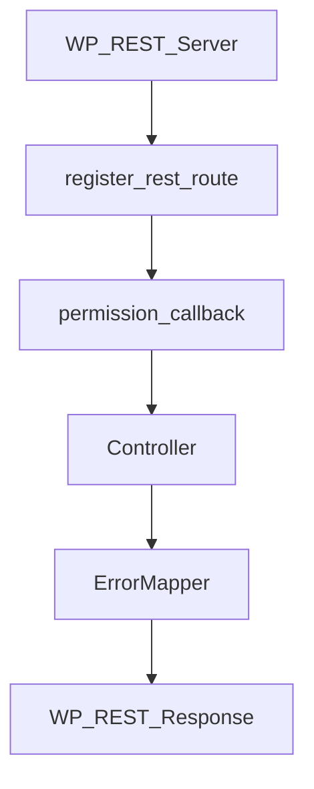

# S2J Similarity Service - CI 品質ゲート

## CI 品質ゲート方針

### 設計意図 (ゴール)

本リポジトリ全体について、品質保証、契約整合、回帰検知を自動化し、仕様と実装の乖離を継続的に防止します。

本プロジェクトは、下記から構成されるため、それぞれの責務に応じた品質ゲートを CI 上で分離して実行します。

* PHP Core
* WordPress REST 統合
* OpenAPI 契約
* コード生成
* TypeScript SDK

### 設計方針 (規約)

* 品質ゲートは、CI 上で自動実行します。
* 失敗時は、merge 不可とします。
* ジョブは、責務単位で分離します。
* OpenAPI 契約整合は、コード生成の再現性で保証します。
* WordPress 統合は、PHP ユニットテストと分離します。
* TypeScript SDK は、独立ジョブとします。
* 外部プロバイダ API 依存のテストは、CI に含めません。

### 責務

CI の責務は、下記のとおりです。

* 回帰の検出
* 契約の一貫性
* 生成された成果物の検証
* PHP の品質ゲート
* WordPress 統合検証
* TypeScript SDK 検証
* 決定論的なリリースの安全性

### 非責務

CI の非責務は、下記のとおりです。

* インフラストラクチャの稼働率検証
* プロバイダの SLA 確認
* 本番環境の監視
* デプロイのオーケストレーション
* ブラウザー互換性の検証

### 非対象 (Out of Scope)

* プレビュー deployment
* SaaS スモークテスト
* ブラウザーのマトリックステスト
* ビジュアル回帰テスト
* 負荷テスト
* カオスエンジニアリング

### CI マトリックス

#### ジョブ1: PHP 品質

対象は、下記のとおりです。

```bash
composer run test:unit
composer run phpstan
composer run phpcs
```

下記コード例は、「Linting」(スタイルガイド違反を自動修正) させています。

```bash
composer run phpcbf
```

下記コード例は、PHPStan による静的解析と、PHPCS による「Linting」をまとめて実行しています。

```bash
composer run lint:php
```

#### ジョブ2: WordPress 統合

対象は、下記のとおりです。

* WorDBless
* WP_REST_Server

下記を検証します。

* ルートの登録
* リクエストの検証
* 権限コールバック
* コントローラのディスパッチ
* REST エラーのマッピング
* ステータスコード
* Retry-After

#### ジョブ3: OpenAPI / コード生成

対象は、下記のとおりです。

```bash
./scripts/generate/all.zsh
git diff --exit-code
```

下記を目的とします。

* スキーマのドリフト検出
* 生成されたアーティファクトの一貫性
* 決定論的ビルド

#### ジョブ4: TypeScript SDK

対象は、下記のとおりです。

```bash
npm test -w @s2j/similarity-client
npm run build -w @s2j/similarity-client
npm run typecheck -w @s2j/similarity-client
```

### CI で実行しないもの

下記は、実行しません。

* ブラウザー E2E
* Playwright
* Cypress
* OpenAI API ライブ・アクセス
* Claude API ライブ・アクセス
*  Gemini API ライブ・アクセス
* パフォーマンスベンチマーク
* 負荷テスト

## OpenAPI レスポンス契約検証 (JSON Schema Validation)

### 設計意図 (ゴール)

WordPress REST API Adapter の実装が、OpenAPI 契約で定義されたレスポンス形式を継続的に満たしていることを CI 上で機械的に検証し、HTTP 契約 drift を早期検知します。

本プロジェクトでは、OpenAPI を Single Source of Truth として採用しているが、WordPress REST runtime の controller / adapter / serializer は手書き実装です。

そのため、下記が OpenAPI 契約から逸脱する可能性があります。本品質ゲートは、その drift を CI 上で検出することを目的とします。

* リクエストのルーティング
* コントローラへのディスパッチ
* レスポンスのシリアライズ
* エラーのマッピング

### 設計方針 (規約)

* OpenAPI レスポンス契約は、CI 上で機械検証します。
* 検証対象は、WordPress REST integration test の実レスポンスとします。
* OpenAPI schema を、Single Source of Truth とします。
* 検証は、OpenAPI 由来の JSON Schema を用います。
* 初期スコープは、最小限とします。
* スキーマのカバレッジは、段階的に拡張します。
* リクエストの検証とは、別品質ゲートとして扱います。

### 設計原則

```text
OpenAPI is the contract
WordPress responses must prove compliance
Validate real HTTP responses
Start small, expand safely
```

### 非対象 (Out of Scope)

* OpenAPI の網羅的な検証
* すべてのレスポンスの組み合わせ
* パフォーマンス検証
* 負荷テスト
* 外部 API のレスポンス検証
* 生成された SDK の検証

### 責務

* HTTP 契約のドリフトを検出すること。
* OpenAPI 契約の遵守を確認すること。
* シリアライザの回帰を検出すること。
* ErrorResponse 契約を検証すること。
* WordPress REST アダプタの正確性を検証すること。

### 非責務

* ビジネスロジックの正確性
* similarity アルゴリズムの正確性
* プロバイダ API の正確性
* SDK レスポンスの検証
* ブラウザーの互換性
* フロントエンド統合

### 検証対象: Success response

* HTTP `200`
* 主要なレスポンスフィールド

たとえば

```json
{
  "similarity": 0.92
}
```

または

```json
{
  "embedding": [...]
}
```

### 検証対象: Error response

* `ErrorResponse`
* `error.type`
* `error.message`

たとえば

```json
{
  "error": {
    "type": "rate_limit",
    "message": "Too many requests"
  }
}
```

### 実行経路

検証対象は、下記を通過した実レスポンスとします。モックレスポンスは、対象外とします。



### 段階的な導入方針

初期導入は、小規模な範囲とし、下記を対象とします。

* `/v1/similarity`
* success response
* `ErrorResponse`

将来的に、下記に拡張を検討しています。

* レスポンスヘッダー
* オプションフィールド
* 列挙型の対応範囲
* `/v1/embedding`
* スキーマの完全なカバー範囲

### CI 統合

既存の CI ジョブ「WordPress 統合」に組み込みます。

```text
WP_REST_Server
WorDBless
```

* 統合テストの延長として実行します。
* 新規スタンドアローン E2E ジョブは、作成しません。

リポジトリでの実装は、下記のとおりです。

* `tests/Support/OpenApiResponseContractValidator.php` が `schema/openapi.yaml` の `#/components/schemas/*` を解決し、JSON Schema として検証に渡します。
* `tests/Integration/WordPressRestAdapterIntegrationTest.php` が **POST `/v1/similarity` 相当**の実レスポンスに対し、成功時は `SimilarityResponse`、ドメイン由来のエラーは `ErrorResponse` を検証します (WordPress ネイティブの `WP_Error` 形のみの応答は、本節の OpenAPI `ErrorResponse` とは別形のため対象外)。

### 推奨実装

OpenAPI spec から schema を参照し、実レスポンスを検証します。

実装候補は、下記のとおりです。

* OpenAPI スキーマバリデータ
* JSON スキーマバリデータ
* PHP スキーマバリデータ

本リポジトリでは、**JSON スキーマバリデータ**として `justinrainbow/json-schema`、OpenAPI YAML の読込に `symfony/yaml` (^6.4、PHP 8.0 互換) を Composer `require-dev` しています。

### CI マトリックス上の位置付け

下記の理由から、「ジョブ2: WordPress 統合」に配置されます。

* これは、「HTTP 統合の品質ゲート」だから。
* OpenAPI/codegen ジョブ ではない。
