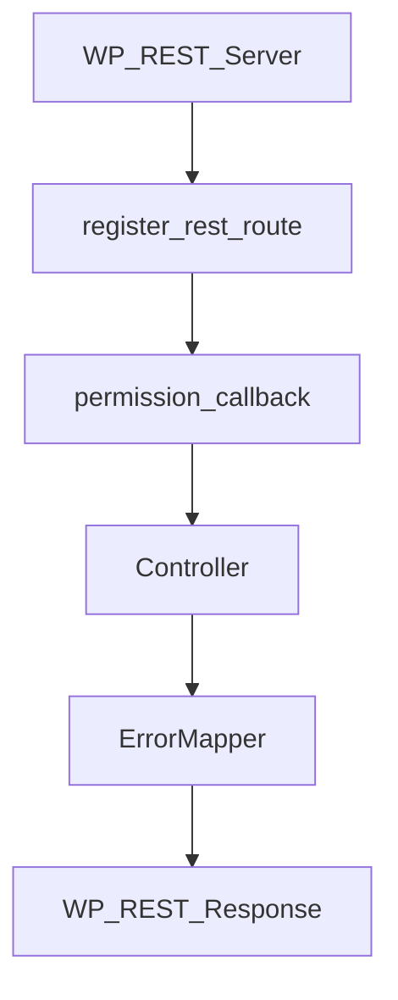
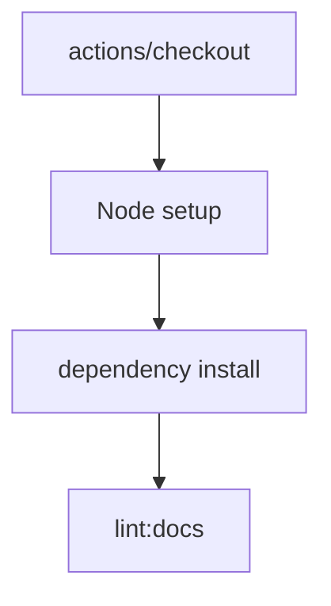

# S2J Similarity Service - CI 品質ゲート

## CI 品質ゲート方針

### 設計意図 (ゴール)

本リポジトリ全体について、品質保証、契約整合、回帰検知を自動化し、仕様と実装の乖離を継続的に防止します。

本プロジェクトは、下記から構成されるため、それぞれの責務に応じた品質ゲートを CI 上で分離して実行します。

* PHP Core
* WordPress REST 統合
* OpenAPI 契約
* コード生成
* TypeScript SDK

### 設計方針 (規約)

* 品質ゲートは、CI 上で自動実行します。
* 失敗時は、merge 不可とします。
* ジョブは、責務単位で分離します。
* OpenAPI 契約整合は、コード生成の再現性で保証します。
* WordPress 統合は、PHP ユニットテストと分離します。
* TypeScript SDK は、独立ジョブとします。
* 外部プロバイダ API 依存のテストは、CI に含めません。

### 責務

CI の責務は、下記のとおりです。

* 回帰の検出
* 契約の一貫性
* 生成された成果物の検証
* PHP の品質ゲート
* WordPress 統合検証
* TypeScript SDK 検証
* 決定論的なリリースの安全性

### 非責務

CI の非責務は、下記のとおりです。

* インフラストラクチャの稼働率検証
* プロバイダの SLA 確認
* 本番環境の監視
* デプロイのオーケストレーション
* ブラウザー互換性の検証

### 非対象 (Out of Scope)

* プレビュー deployment
* SaaS スモークテスト
* ブラウザーのマトリックステスト
* ビジュアル回帰テスト
* 負荷テスト
* カオスエンジニアリング

### CI マトリックス

#### ジョブ1: PHP 品質

対象は、下記のとおりです。

```bash
composer run test:unit
composer run phpstan
composer run phpcs
```

下記コード例は、「Linting」(スタイルガイド違反を自動修正) させています。

```bash
composer run phpcbf
```

下記コード例は、PHPStan による静的解析と、PHPCS による「Linting」をまとめて実行しています。

```bash
composer run lint:php
```

#### ジョブ2: WordPress 統合

対象は、下記のとおりです。

* WorDBless
* WP_REST_Server

下記を検証します。

* ルートの登録
* リクエストの検証
* 権限コールバック
* コントローラのディスパッチ
* REST エラーのマッピング
* ステータスコード
* Retry-After

#### ジョブ3: OpenAPI / コード生成

対象は、下記のとおりです。

```bash
./scripts/generate/all.zsh
git diff --exit-code
```

下記を目的とします。

* スキーマのドリフト検出
* 生成されたアーティファクトの一貫性
* 決定論的ビルド

#### ジョブ4: TypeScript SDK

対象は、下記のとおりです。

```bash
npm test -w @s2j/similarity-client
npm run build -w @s2j/similarity-client
npm run typecheck -w @s2j/similarity-client
```

### CI で実行しないもの

下記は、実行しません。

* ブラウザー E2E
* Playwright
* Cypress
* OpenAI API ライブ・アクセス
* Claude API ライブ・アクセス
*  Gemini API ライブ・アクセス
* パフォーマンスベンチマーク
* 負荷テスト

## OpenAPI レスポンス契約検証 (JSON Schema Validation)

### 設計意図 (ゴール)

WordPress REST API Adapter の実装が、OpenAPI 契約で定義されたレスポンス形式を継続的に満たしていることを CI 上で機械的に検証し、HTTP 契約 drift を早期検知します。

本プロジェクトでは、OpenAPI を Single Source of Truth として採用しているが、WordPress REST runtime の controller / adapter / serializer は手書き実装です。

そのため、下記が OpenAPI 契約から逸脱する可能性があります。本品質ゲートは、その逸脱を CI 上で検出することを目的とします。

* リクエストのルーティング
* コントローラへのディスパッチ
* レスポンスのシリアライズ
* エラーのマッピング

### 設計方針 (規約)

* OpenAPI レスポンス契約は、CI 上で機械検証します。
* 検証対象は、WordPress REST 統合テストの実レスポンスとします。
* OpenAPI schema を、Single Source of Truth とします。
* 検証は、OpenAPI 由来の JSON Schema を用います。
* 初期スコープは、最小限とします。
* スキーマのカバレッジは、段階的に拡張します。
* リクエストの検証とは、別品質ゲートとして扱います。

### 設計原則

* OpenAPI が契約となる
* WordPress のレスポンスは、準拠していることを証明しなければならない
* 実際の HTTP レスポンスを検証する
* 小規模から始め、安全に拡張する

### 非対象 (Out of Scope)

* OpenAPI の網羅的な検証
* すべてのレスポンスの組み合わせ
* パフォーマンス検証
* 負荷テスト
* 外部 API のレスポンス検証
* 生成された SDK の検証

### 責務

* HTTP 契約のドリフトを検出すること。
* OpenAPI 契約の遵守を確認すること。
* シリアライザの回帰を検出すること。
* ErrorResponse 契約を検証すること。
* WordPress REST アダプタの正確性を検証すること。

### 非責務

* ビジネスロジックの正確性
* similarity アルゴリズムの正確性
* プロバイダ API の正確性
* SDK レスポンスの検証
* ブラウザーの互換性
* フロントエンド統合

### 検証対象: Success response

* HTTP `200`
* 主要なレスポンスフィールド

たとえば

```json
{
  "similarity": 0.92
}
```

または

```json
{
  "embedding": [...]
}
```

### 検証対象: Error response

* `ErrorResponse`
* `error.type`
* `error.message`

たとえば

```json
{
  "error": {
    "type": "rate_limit",
    "message": "Too many requests"
  }
}
```

### 実行経路

検証対象は、下記を通過した実レスポンスとします。モックレスポンスは、対象外とします。



### 段階的な導入方針

初期導入は、小規模な範囲とし、下記を対象とします。

* `/v1/similarity`
* `/v1/embedding` (OpenAPI のパス表記。WordPress 実装では `POST /s2j/v1/embedding` 相当)
* 各エンドポイントの success response (`SimilarityResponse` / `EmbeddingResponse`)
* ドメイン由来の `ErrorResponse` (検証エラー **400** を含む)

将来的に、下記に拡張を検討しています。

* レスポンスヘッダー
* オプションフィールド
* 列挙型の対応範囲
* スキーマの完全なカバー範囲

### CI 統合

既存の CI ジョブ「WordPress 統合」に組み込みます。

```text
WP_REST_Server
WorDBless
```

* 統合テストの延長として実行します。
* 新規スタンドアローン E2E ジョブは、作成しません。

リポジトリでの実装は、下記のとおりです。

* `tests/Support/OpenApiResponseContractValidator.php` が `schema/openapi.yaml` の `#/components/schemas/*` を解決し、JSON Schema として検証に渡します。
* `tests/Integration/WordPressRestAdapterIntegrationTest.php` が **POST `/v1/similarity` 相当** および **POST `/v1/embedding` 相当** の実レスポンスに対し、成功時はそれぞれ `SimilarityResponse` / `EmbeddingResponse`、ドメイン由来のエラーおよび入力検証エラー (**400**) は `ErrorResponse` を検証します (WordPress ネイティブの `WP_Error` 形のみの応答は、本節の OpenAPI `ErrorResponse` とは別形のため、対象外)。

### 推奨実装

[OpenAPI 契約の統合仕様](docs/contracts/openapi_spec.md) から schema を参照し、実レスポンスを検証します。

実装候補は、下記のとおりです。

* OpenAPI スキーマバリデータ
* JSON スキーマバリデータ
* PHP スキーマバリデータ

本リポジトリでは、**JSON スキーマバリデータ** として `justinrainbow/json-schema`、OpenAPI YAML の読込に `symfony/yaml` (^6.4、PHP v8.0互換) を Composer `require-dev` しています。

### CI マトリックス上の位置付け

下記の理由から、「ジョブ2: WordPress 統合」に配置されます。

* これは、「HTTP 統合の品質ゲート」だから。
* OpenAPI/codegen ジョブ ではない。

---

## CI 品質ゲートの段階的な拡張方針

### 設計意図 (ゴール)

本プロジェクトの CI 品質ゲートについて、現在の実装規模、責務分離、実行コストを踏まえつつ、段階的に品質保証レベルを引き上げられる拡張方針を定義します。

本プロジェクトは、WordPress プラグイン / テーマへ組み込まれる Composer ライブラリを主製品としつつ、OpenAPI を Single Source of Truth とした REST API、コード生成、TypeScript SDK を併せ持つ複合構成です。

そのため、品質ゲートは、一度に最大化するのではなく、下記を考慮しながら、成熟度に応じて段階的に拡張します。

* 実装責務
* 実行時間
* 保守コスト
* 契約 drift のリスク

### 設計原則

* 品質ゲートは、製品の成熟度に応じて拡大すべきである
* 理論上の完全性ではなく、実際のリスクを検証すべきである
* 不安定な外部の依存関係よりも、決定論的な CI を優先すべきである
* WordPress との統合は、必須である
* 外部プロバイダへの依存は、任意である

### 設計方針 (規約)

* CI 品質ゲートは、段階的に拡張します。
* 現時点で必須な品質ゲートと、将来的に導入可能な品質ゲートを明確に分離します。
* merge blocker とする品質ゲートは、明示します。
* 実装責務に対して過剰なテストは、要求しません。
* CI の実行時間・安定性・保守コストを、考慮します。
* 外部 API や不安定な外部環境に依存する品質ゲートは、標準採用しません。
* 段階拡張は、[本仕様書](docs/engineering/ci.md) を唯一の正とします。

### 責務

* CI 品質ゲートの成熟ロードマップを定義すること。
* 必須 / 推奨 / 任意ゲートを分類すること。
* merge blocker 基準を明確化すること。
* CI コストを制御すること。
* 品質ゲートの過剰設計を防止すること。
* 品質保証レベルを継続的に向上すること。

### 非責務

* 個別テスト実装詳細
* コード生成の実装詳細
* OpenAPI 契約の詳細
* SDK runtime 検証の方針
* パッケージ依存関係ポリシー
* デプロイのオーケストレーション

### 非対象 (Out of Scope)

* ブラウザー E2E
* Playwright
* Cypress
* OpenAI API ライブアクセス
* Claude API ライブアクセス
* Gemini API ライブアクセス
* 負荷テスト
* カオスエンジニアリング
* 分散型の耐障害性テスト
* 本番環境のモニタリング

### CI マトリックスとの関係

本段階定義は、下記の CI マトリックスのジョブ構成と対応します。段階拡張に応じて、ジョブを追加・強化します。

* ジョブ1: PHP の品質
* ジョブ2: WordPress 統合
* ジョブ3: OpenAPI / コード生成
* ジョブ4: TypeScript SDK

### 段階定義: フェーズ1 (必須 / 基本品質ゲート)

実装の健全性と静的品質を担保するのが、目的です。

#### PHP

```bash
composer test
phpstan
phpcs
```

または `pint` を別方針として採用します。

#### TypeScript SDK

```bash
pnpm build
pnpm typecheck
```

下記を目的とします。

* ユニット整合性
* 静的解析
* コーディング標準
* ビルドの再現性

### 段階定義: フェーズ2 (必須 / 統合品質ゲート)

下記を対象に、WordPress 実ランタイムとの統合整合を担保するのが、目的です。

* REST 統合の正確性
* WordPress アダプタの正確性

対象は、下記のとおりです。

* WorDBless
* WP_REST_Server

下記を検証します。

* register_rest_route
* リクエストの検証
* permission_callback
* コントローラのディスパッチ
* ErrorMapper
* HTTP ステータス
* Retry-After

### 段階定義: フェーズ3 (推奨 / 契約品質ゲート)

下記を対象に、OpenAPI 契約との整合を継続保証するのが、目的です。

* コード生成の再現性
* OpenAPI レスポンススキーマの検証
* TypeScript SDK ユニットテスト

#### コード生成の再現性

```bash
./scripts/generate/all.zsh
git diff --exit-code
```

#### OpenAPI レスポンススキーマの検証

WordPress REST 統合テストの実レスポンスについて、下記を OpenAPI 由来 JSON Schema で機械検証します。

* success response
* `ErrorResponse`

初期導入は、小さなスコープとします。

#### TypeScript SDK ユニットテスト

```bash
pnpm test -w @s2j/similarity-client
```

ユニットテストの目的は、下記のとおりです。

* 契約の drift 検出
* SDK の回帰検出
* 生成された成果物の一貫性

対象は、下記のとおりです。

* モック化 HttpClient
* タイムアウト
* リトライ
* エラーの標準化
* リクエストの構築

### 段階定義: フェーズ4 (任意 / 高度品質ゲート)

下記は、導入候補です。実装成熟度、CI コスト、保守負荷を見て判断します。

* 依存関係の監査
* セキュリティスキャン
* カバレッジ閾値
* 変異テスト
* パフォーマンスベンチマーク
* パッケージパブリッシュの dry-run

## ドキュメント品質ゲート

### 設計意図 (ゴール)

本プロジェクトの仕様書、README、設計文書を、実装コードと同等の品質対象として扱い、文書品質の継続的な維持を CI 上で保証します。

本プロジェクトでは、下記ファイルは、単なる補助資料ではなく、設計、実装、CI、コード生成の判断根拠となる、プロダクト資産です。

* `README.md`
* `docs/**`
* OpenAPI 関連の説明文書
* engineering policy
* architecture / contracts / interfaces 仕様

そのため Markdown 文書の品質についても、下記のような運用ではなく、CI 品質ゲートとして自動検証します。

* ローカルのみ
* 任意実行
* 人手レビュー依存

### 設計方針 (規約)

* Markdown / documentation lint を、正式な CI 品質ゲートとします。
* `README.md` および `docs/**` を品質対象とします。
* lint ルールは、`@s2j/docs-linter` を Single Source of Truth とします。
* ローカル実行と CI 実行で同一ルールを適用します。
* PR / push ごとに対象変更時のみ実行します。
* merge blocker として required check に含めます。
* ドキュメント品質を人手レビューのみに依存しません。
* lint 失敗時は、merge 不可とします。

### 設計原則

* ドキュメントは、製品であり、単なる解説ではない
* ドキュメントの品質は、CI によって保証される
* ローカルと CI のルールは、一致していなければならない
* 変更されたドキュメントのみが、ドキュメントの lint をトリガーする

### 責務

* Markdown 構文の品質
* ドキュメントの一貫性
* 用語の不一致の検出
* 誤字・スタイルルールの適用
* ローカル/CI ルールの整合性
* ドキュメントのマージゲート適用

### 非責務

* 技術的な正確性の検証
* アーキテクチャーの整合性
* セマンティック契約の検証
* OpenAPI スキーマの検証
* PHP の静的解析
* TypeScript の型安全性
* コード生成の検証

### 対象範囲

* README.md
* docs/**
* *.md (必要に応じて拡張)

### 対象外

* vendor/
* node_modules/
* dist/
* generated artifacts

code-generated Markdown を将来的に含める場合は、別途定義します。

### lint ルール

`@s2j/docs-linter` 経由 (たとえば `npm run lint:docs` または `pnpm lint:docs`) で実行します。

実行方法は、リポジトリの package manager policy に従います。

### CI 実行方針

#### 実行条件

無関係な PHP / TS 変更で docs lint を毎回実行しないため、下記を対象に、変更時のみ実行します。

* README.md
* docs/**
* package.json
* package-lock.json
* pnpm-lock.yaml
* @s2j/docs-linter config

#### workflow

たとえば、下記のような処理フローとなる `docs-lint` という名称で、専用 job または専用 workflow とします。



#### required check

「Merge Gate としてのドキュメント品質」を目的として、GitHub branch protection において required check とします。

### ローカル実行

下記目的のため、CI と同一コマンド (たとえば `npm run lint:docs` または `pnpm lint:docs`) をローカルで実行可能とします。

* プッシュ前の検証
* コントリビューターへの、フィードバックの迅速化
* CI の失敗の削減

### `docs/engineering/ci.md` との関係

本品質ゲートは、CI 品質ゲートの一部です。

CI Matrix 上は、独立 job (たとえば `job 5: documentation quality`) として扱っても良いし、軽量 job として既存 lint job に統合してもかまいません。

### 完了条件 (100%)

以下を満たした時点で100%とします。

* `docs/engineering/ci.md` に本品質ゲート方針を明文化
* `.github/workflows/ci.yml` または専用 workflow に docs lint job を追加
* `README.md` / `docs/**` 変更時のみ実行
* `actions/checkout`
* Node runtime setup
* dependency install
* `lint:docs`
* branch protection required check 化
* ローカル実行手順を `README.md` に明記
