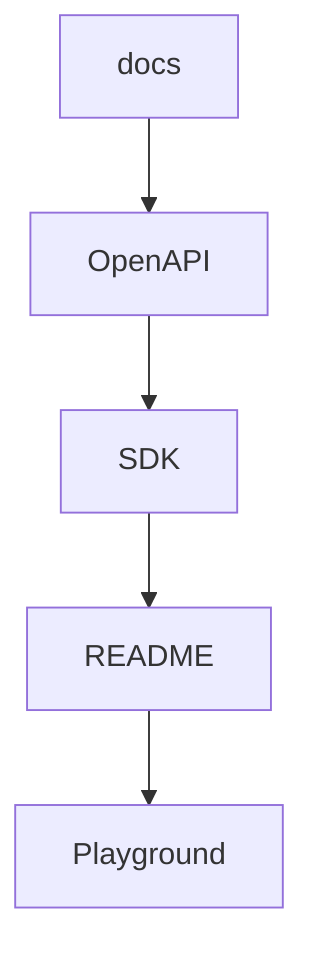
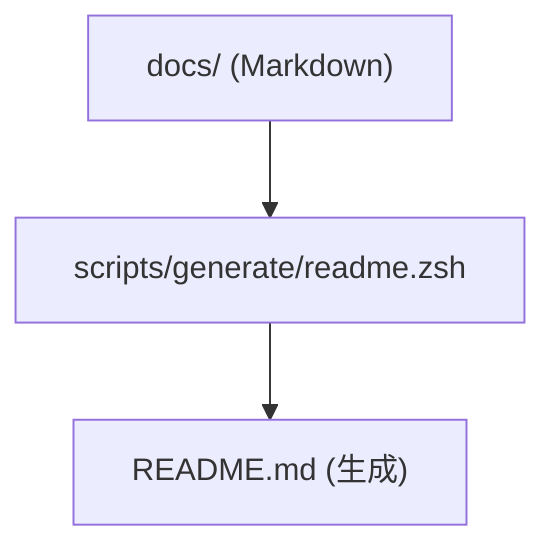
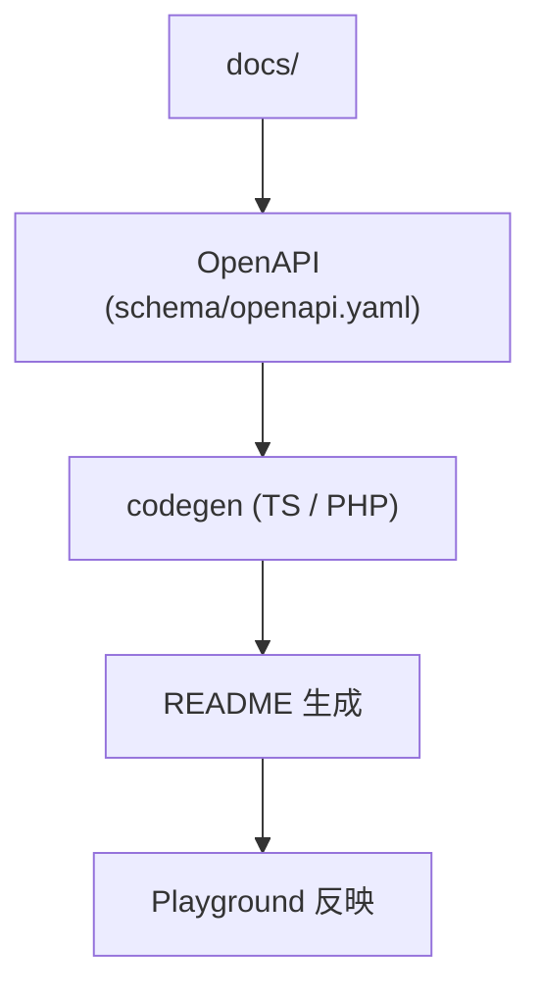
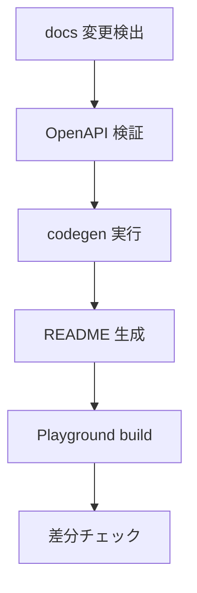

<!-- 
 docs→OpenAPI→SDK
 -->

# S2J Similarity Service - コード生成パイプライン

## 概要

本仕様は、docs → OpenAPI → SDK → README → Playground へと連動する、コード生成パイプラインを定義します。

## 設計意図、設計方針、非対象

### 設計意図 (ゴール)

* ドキュメントと実装を完全同期します。
* 単一変更点から、全成果物を生成します。
* 人手による更新ミスを排除します。

### 設計方針 (規約)

* `docs` を起点とした、一方向フローとします。
* OpenAPI を中間表現として、統一します。
* `examples` を、実行コードの唯一のソースとします。

### 責務

* docs → OpenAPI → SDK → README → Playground の生成フローを定義すること。
* 各生成ステップの依存関係を整理すること。
* 自動同期ルールを定義すること。

### 非責務

* 個別 codegen ツールの実装詳細
* SDK 内部構造
* UI 表現

### 非対象 (Out of Scope)

* GUI 編集ツールの実装詳細
* CI/CD の詳細定義
* SDK 内部ロジック

### CI

* 差分チェックが必須

### フロー



## README テンプレート設計

本プロジェクトでは、各パッケージにおいて一貫した README 構造を採用し、ユーザーが最短で理解・導入できるようにします。

### 設計意図 (ゴール)

* 初見ユーザーの理解コストを下げます。
* ドキュメント品質を均一化します。
* Quick Start への導線を最短化します。

### 設計方針 (規約)

* README は、「導入→使用→詳細」の順で構成します。
* すべてのパッケージで、同一テンプレートを使用します。
* 1分以内に動くサンプルを、最上部に置きます。

### 責務

* 初期導入のガイドであること。
* 利用の入口を提供すること。

### 非責務

* 詳細な仕様説明 (docs へ委譲)
* 実装の解説

### 記述ルール

* コードは、最小限にします。
* 冗長な説明は、docs に委譲します。
* 実行可能な例のみ、掲載します。

### Runtime 対応

| runtime | パッケージ |
| ------- | ------------------------------ |
| Node | @s2j/similarity-client |
| Edge | @s2j/similarity-client-edge |
| Browser | @s2j/similarity-client-browser |

### テンプレート構成

```plaintext id="readme_structure"
# パッケージ名

## Overview
## Quick Start (最重要)
## Installation
## Usage
## Runtime対応
## API 概要
## Advanced (任意)
## FAQ
## License
```

### Overview

* 何をするライブラリか
* どの問題を解決するか
* どの環境で使えるか

### Quick Start (例)

```ts id="readme_quick"
import { createClient } from "@s2j/similarity-client";

const client = createClient({ baseUrl: "..." });

const score = await client.similarity({
  text1: "hello",
  text2: "hi"
});

console.log(score);
```

## README 自動生成 (docs から)

本プロジェクトでは、docs 配下の仕様書を Source of Truth とし、README を自動生成することで、ドキュメントの一貫性を維持します。

### 設計意図 (ゴール)

* ドキュメントの二重管理を防ぎます。
* README と仕様書の乖離を排除します。
* 更新コストを削減します。

### 設計方針 (規約)

* docs を一次情報 (Source of Truth) とします。
* README は、生成物とします (手編集禁止)。
* CI で差分検出・強制同期します。

### 責務

* README を自動生成すること。
* ドキュメントと同期すること。

### 非責務

* docs の内容品質
* Markdown の整形

### 利点

* 常に最新の README を維持できること。
* メンテナンスコストを削減できること。
* ドキュメントの信頼性を向上できること。

### 注意点

* README の手動編集は、禁止にしてください。
* docs の構造変更に注意してください。

### データフロー



### 対象ソース

| docs | README 反映 |
| ------------- | ------------------- |
| overview.md | Overview |
| usage_spec.md | Usage / Quick Start |
| concept.md | Background |

### 生成戦略

* セクション単位で抽出します。
* Markdown をそのまま転用します。
* 必要に応じてテンプレートに埋め込みます。

### スクリプト例

```bash id="readme_script"
#!/bin/zsh

cat docs/overview.md > README.md
cat docs/interfaces/usage_spec.md >> README.md
```

### CI 検証

```bash id="readme_ci"
./scripts/generate/readme.zsh
git diff --exit-code
```

## docs → OpenAPI → README → Playground の完全連動

本プロジェクトでは、ドキュメント・契約・実行環境を一貫したパイプラインで連動させます。

### 設計意図 (ゴール)

* 仕様と実装の乖離を、完全に排除します。
* すべてのアウトプットを、単一の情報源から生成します。
* ドキュメント更新を、即座に実行環境へ反映します。

### 設計方針 (規約)

* Source of Truth は、docs と OpenAPI に限定します。
* README、SDK、Playground は、すべて生成物とします。
* 手動編集は、禁止します。

### 責務

* 全レイヤの同期を保証すること。
* 情報の一貫性を維持すること。

### 非責務

* コンテンツの品質
* UX のデザイン

### 利点

* 常に整合した状態を維持できること。
* ドキュメント信頼性を最大化できること。
* 開発効率を向上できること。

### 注意点

* 初期構築コストが高くなります。
* パイプラインが複雑化します。

### 全体フロー



### 役割分担

| レイヤ | 役割 |
| ---------- | ----- |
| docs | 意図・仕様 |
| OpenAPI | 契約 |
| codegen | 実装補助 |
| README | 利用ガイド |
| Playground | 実行環境  |

### 同期ポイント

* OpenAPI 更新 → 型 / SDK 再生成
* docs 更新 → README 再生成
* Usage 変更 → Playground 更新

### 失敗条件

* README と docs が不一致である。
* OpenAPI と型が不一致である。
* Playground サンプルが不整合である。

### CI フロー



## サンプルコード自動同期

本プロジェクトでは、README、docs、Playground に掲載するサンプルコードを、単一ソースから自動同期します。

### 設計意図 (ゴール)

* サンプルコードの乖離を防ぎます。
* コピー & ペーストで動く保証を維持します。
* メンテナンスコスト削減します。

### 設計方針 (規約)

* サンプルコードは、`/examples/` に集約します。
* README、docs、Playground は、参照のみとします。
* CI で動作検証を行います。

### 責務

* サンプルを一元管理すること。
* 動作を保証すること。

### 非責務

* 実運用コード
* パフォーマンスの最適化

### 利点

* 常に動くサンプルであること。
* ドキュメントの信頼性を向上できること。
* 開発効率を向上できること。

### 注意点

* examples の責務が、肥大化します。
* サンプル粒度を管理する必要があります。

### テスト方針

* すべての examples は、実行可能であること。
* 型エラーがゼロであること。
* API 応答を確認すること。

### NG パターン

* README に直接コードを記述しないでください。
* Playground 専用コードを分岐しないでください。
* 手動で更新しないでください。

### CI 検証

```bash id="example_ci"
pnpm test:examples
```

### Playground 連携

* examples/browser.ts を直接読み込みます。
* UI から切り替えできます。

### ディレクトリ構成

```plaintext id="examples_structure"
examples/
  basic.ts
  node.ts
  edge.ts
  browser.ts
```

### スクリプト例

```bash id="example_sync"
cp examples/basic.ts playground/main.ts
```

### 利用方法

#### README への埋め込み

````md id="example_embed"
```ts
// examples/basic.ts
```
````

(ビルド時に内容を展開)

## OpenAPI 検証ルール

### 設計意図 (ゴール)

契約の不整合を CI 上で検出し、生成物の破綻を防ぎます。

### CI ポリシー

* schema 変更時に、必ず検証します。
* 不整合がある場合は、ビルドを失敗します。

### チェック項目

* `required` が正しく定義されているか ?
* `nullable` の使用が適切か ?
* `enum` が完全列挙されているか ?

### 推奨ツール

* openapi-cli / spectral など

## Codegen 再生成タイミング

### 設計意図 (ゴール)

生成物と Source of Truth (OpenAPI) の不整合を防ぎ、常に同期された状態を維持します。

### 設計方針 (規約)

* OpenAPI 変更時は必ず codegen を実行します。
* 生成物は常に最新状態であることを保証します。
* 手動更新は禁止します。

### 責務

* codegen 実行タイミングを定義すること。
* 生成物の整合性を維持すること。

### 非責務

* codegen ツールの選定
* SDK の設計
* OpenAPI の内容定義

### 再生成トリガー

| トリガー | 必須 |
|----------|------|
| `schema/openapi.yaml` 変更 | 必須 |
| contracts 変更 | 必須 |
| 生成スクリプト変更 | 必須 |

### ローカル開発ルール

* 開発者は、schema 変更後に `scripts/generate/all` を実行します。
* 生成差分は、必ずコミットします。

### pre-commit チェック

#### 方針

* 生成物と schema の差分を検出します。
* 不整合がある場合は、警告を出します。

### CI 検証

#### 方針

* CI 上で codegen を再実行します。
* 差分が存在する場合は、ビルドを失敗させます。

```plaintext id="ci_rule"
if git diff --exit-code generated/; then
  pass
else
  fail
fi
```

### 禁止事項

* generated ディレクトリを手動で編集しない。
* schema と生成物の不整合状態でマージしない。
