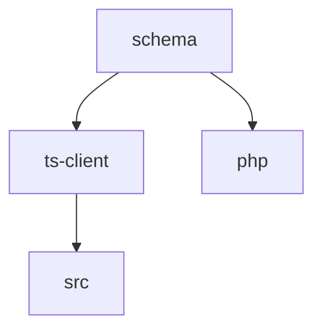

<!-- 
 pnpm/turbo
 -->

# S2J Similarity Service - モノレポ構成とパッケージ管理

## 概要

本仕様は、pnpm / turborepo を用いたモノレポ構成とパッケージ管理戦略を定義します。

## 設計意図、設計方針、非対象

### 設計意図 (ゴール)

* 複数パッケージを一貫管理します。
* ビルド効率を最適化します。
* 依存関係を明確化します。

### 設計方針 (規約)

* packages 単位で、責務を分離します。
* キャッシュを活用して高速ビルドします。
* バージョン管理を統一します。

### 責務

* パッケージ分割戦略を定義すること。
* 依存関係の管理ルールを明確化すること。
* ビルド効率化 (キャッシュ、並列化) を設計すること。

### 非責務

* 各パッケージの内部実装
* CI/CD 詳細
* runtime 差異の扱い

### 非対象 (Out of Scope)

* 単一パッケージ構成
* 言語別ビルド詳細
* CI 実装

## モノレポ管理 (pnpm、turborepo)

本プロジェクトは、複数パッケージ (TypeScript SDK、PHP DTO、Core) を単一リポジトリで管理するため、モノレポ構成を採用します。

### 設計意図 (ゴール)

* 契約 (OpenAPI) を中心に、複数言語の実装を同期します。
* パッケージ間の整合性を保ちます。
* CI、ビルドの効率化を図ります。

### 設計方針 (規約)

* パッケージは、`packages/` 配下に配置します。
* 依存関係は、ワークスペースで管理します。
* ビルド・生成は、タスクランナーで統合します。

### 責務

* パッケージ間の整合性を維持すること。
* ビルドを効率化すること。

### 非責務

* 各パッケージの内部設計
* 外部の配布戦略

### ディレクトリ構成

```plaintext id="monorepo_structure"
packages/
  ts-client/
  php/
src/
schema/
scripts/
```

### 依存関係



### タスク例

```bash id="monorepo_cmd"
pnpm turbo run generate
pnpm turbo run build
```

### pnpm (パッケージ管理)

#### 特徴

* 高速インストール
* ディスク効率
* ワークスペース対応

#### 設定例

```yaml id="pnpm_workspace"
packages:
  - "packages/*"
```

### turborepo (タスク管理)

#### 特徴

* ビルドキャッシュ
* 並列実行
* タスク依存関係の管理

#### 設定例

```json id="turbo_config"
{
  "pipeline": {
    "generate": {},
    "build": {
      "dependsOn": ["^build"],
      "outputs": ["dist/**"]
    }
  }
}
```

## Runtime 別パッケージ

### 設計方針 (規約)

* runtime ごとにパッケージを分離します。
* core ロジックは、共有パッケージに集約します。

### 例

```plaintext id="mono_runtime"
packages/
  core/
  node/
  edge/
  browser/
```
