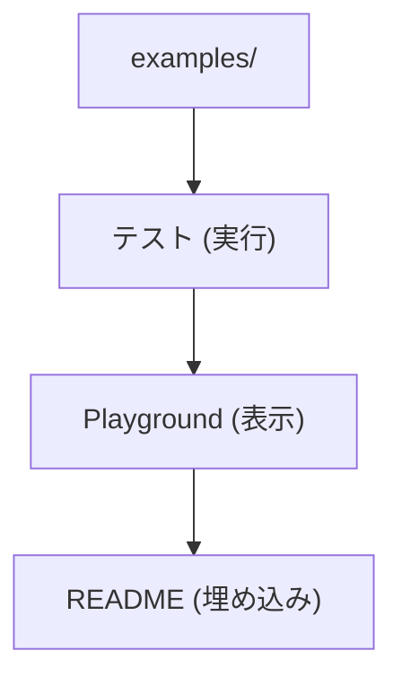
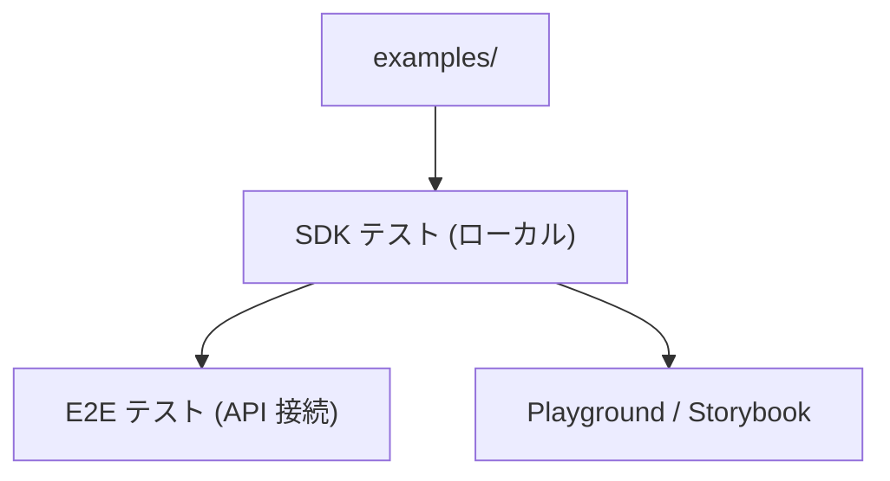
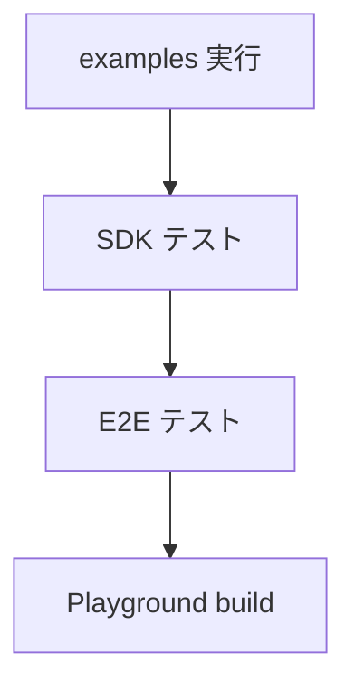
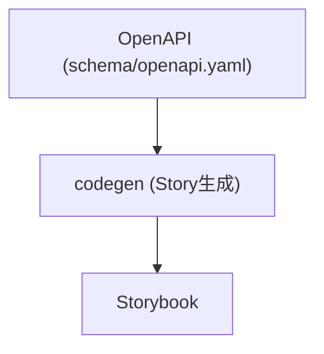
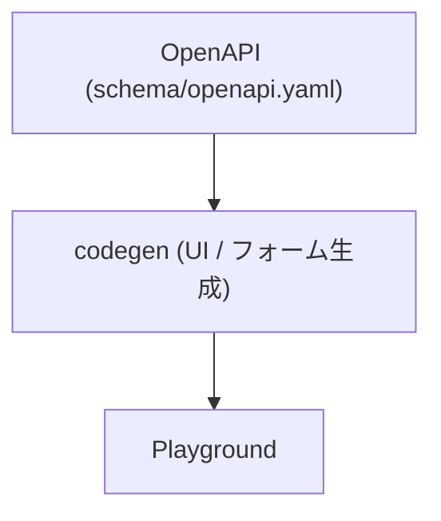
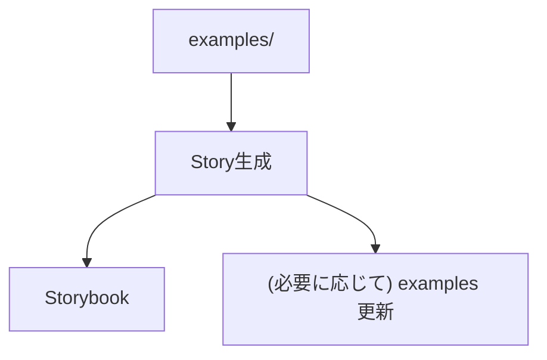

<!-- 
 playground / examples 系
 -->

# S2J Similarity Service - Playground 環境と `examples`

## 概要

本仕様は、ブラウザ上で SDK を実行可能な Playground 環境と examples の共有戦略を定義します。

## 設計意図、設計方針、非対象

### 設計意図 (ゴール)

* SDK の動作確認を即座に行える環境を提供します。
* examples / test / UI ドキュメントを統一します。
* 学習コストを削減します。

### 設計方針 (規約)

* examples を単一ソースとして利用します。
* Playground / Storybook / Test を連動させます。
* OpenAPI から UI を自動生成可能とします。

### 責務

* Playground / examples / test を統一設計すること。
* 実行可能サンプルを提供すること。
* UI ドキュメント連携を定義すること。

### 非責務

* 本番 UI
* デザイン仕様
* アクセス制御

### 非対象 (Out of Scope)

* 本番 UI の提供
* 高度な UI デザイン
* ユーザー管理機能

## playground (ブラウザ実行環境)

本プロジェクトでは、ブラウザ上で SDK を試せる playground を提供します。

### 設計意図 (ゴール)

* インストール不要で試用可能にします。
* 学習コストを下げます。
* 動作確認を容易にします。

### 設計方針 (規約)

* CDN (esm.sh) を利用します。
* ブラウザのみで完結します。
* 最小 UI で提供します。

### 責務

* 試用環境を提供すること。
* UX を向上すること。

### 非責務

* 本番利用
* セキュリティの保証

### 利用用途

* デモ
* 検証
* ドキュメント補助

### 発展

* Monaco Editor 統合
* サンプルテンプレート切替

### 注意点

* API キーの扱い (公開禁止)
* レート制限

### デプロイ

| 方法 | 内容 |
| ---------------- | ------ |
| GitHub Pages | 静的配信 |
| Vercel | 即時デプロイ |
| CloudFlare Pages | Edge 配信 |

### 構成

```plaintext id="playground_structure"
playground/
  index.html
  main.ts
```

### 実装例 (HTML)

```html id="playground_html"
<script type="module">
  import { createClient } from "https://esm.sh/@s2j/similarity-client-browser";

  const client = createClient({ baseUrl: "..." });

  const result = await client.similarity({
    text1: "hello",
    text2: "hi"
  });

  console.log(result);
</script>
```

### UI (最小)

* テキスト入力 (2つ)
* 実行ボタン
* 結果表示

### オプション

* エラーメッセージ表示
* API キー入力欄
* ログ表示

## examples → テスト → Playground の完全共有

本プロジェクトでは、examples を中心に「実装・テスト・体験」を完全に共有する構成を採用します。

### 設計意図 (ゴール)

* サンプルコードの信頼性を担保します。
* 実装とドキュメントの乖離を防ぎます。
* Playground とテストを統一します。

### 設計方針 (規約)

* examples を、唯一の実行コードとします。
* テストは、examples をそのまま実行します。
* Playground は、examples をロードします。

### 責務

* 実行可能サンプルを管理すること。
* テストと統合すること。

### 非責務

* 実サービスコード
* パフォーマンスの最適化

### 利点

* サンプルが必ず動くこと。
* テストとドキュメントが一致すること。
* 保守コストを削減できること。

### 注意点

* examples の肥大化に注意してください。
* 実運用コードと分離してください。

### データフロー



### ディレクトリ構成

```plaintext id="examples_full"
examples/
  basic.ts
  node.ts
  edge.ts
  browser.ts

tests/
  examples.test.ts

playground/
  main.ts
```

### テスト戦略

```ts id="examples_test"
import example from "../examples/basic";

test("basic example works", async () => {
  const result = await example();
  expect(result).toBeDefined();
});
```

### Playground 連携

```ts id="examples_playground"
import example from "../examples/browser";

await example();
```

### README 連携

* examples/basic.ts をそのまま埋め込みます。
* ビルド時に展開します。

## Storybook 的な UI ドキュメント

本プロジェクトでは、API の利用方法を可視化するために、Storybook 的な UI ドキュメント環境を構築します。

### 設計意図 (ゴール)

* API の動作を、視覚的に理解できるようにします。
* Playground よりも体系的なドキュメントを提供します。
* ユースケースごとの理解を促進します。

### 設計方針 (規約)

* examples をベースに、UI を構築します。
* ストーリー単位でユースケースを定義します。
* インタラクティブ操作を可能にします。

### 責務

* ユースケースを可視化すること。
* 体験型ドキュメントを提供すること。

### 非責務

* 本番 UI
* API 仕様の定義

### 利点

* 視覚的な理解が期待できること。
* デモとして活用できること。
* QA、営業資料として利用できること。

### 注意点

* UI が肥大化します。
* メンテナンスコストが増加します。

### 構成

```plaintext id="storybook_structure"
docs-ui/
  stories/
    basic.ts
    similarity.ts
  components/
    Form.tsx
    Result.tsx
```

### ストーリー例

```ts id="storybook_example"
export const BasicSimilarity = async () => {
  const result = await client.similarity({
    text1: "hello",
    text2: "hi"
  });

  return result;
};
```

### UI 要素

* 入力フォーム
* 実行ボタン
* 結果表示
* エラー表示

### 技術選択 (例)

| ツール | 用途 |
| --------- | ---- |
| Storybook | UI 管理 |
| Vite | ビルド |
| React | UI |

### Playground との違い

| 項目 | Playground | Storybook |
| -- | ---------- | --------- |
| 目的 | 試す | 理解する |
| 構造 | 単一 | 複数シナリオ |
| UI | 最小 | リッチ |

### examples との関係

* stories は、examples をラップします。
* ロジックは、共有します。

## examples → SDK テスト → E2E 連動

本プロジェクトでは、examples を中心に SDK テストおよび E2E テストを連動させることで、実装・契約・体験の完全一致を保証します。

### 設計意図 (ゴール)

* サンプルコードが「常に動く」ことを保証します。
* SDK の実装と API 契約の整合性を検証します。
* 実際の利用シナリオをそのままテストにします。

### 設計方針 (規約)

* examples を唯一の実行シナリオとします。
* SDK テストは、examples を直接実行します。
* E2E テストは、実 API と接続して検証します。

### 責務

* 実行可能シナリオを保証すること。
* SDK 品質を担保すること。

### 非責務

* API サーバーの品質
* パフォーマンスの測定

### 全体フロー



### CI フロー



### 利点

* サンプル = テスト = 仕様
* 実環境での動作が保証されること。
* バグが早期検出できること。

### 注意点

* API キー管理 (CI) が必要です。
* 外部依存による「不安定性」を否定できません。

### ディレクトリ構成

```plaintext id="e2e_structure"
examples/
  basic.ts
  similarity.ts

tests/
  sdk/
    examples.test.ts
  e2e/
    similarity.e2e.test.ts
```

### SDK テスト

```ts id="sdk_test"
import example from "../../examples/basic";

test("example works", async () => {
  const result = await example();
  expect(result).toBeDefined();
});
```

### E2E テスト

```ts id="e2e_test"
test("similarity API works", async () => {
  const result = await client.similarity({
    text1: "hello",
    text2: "hi"
  });

  expect(result.score).toBeGreaterThan(0);
});
```

## OpenAPI から Story 自動生成

本プロジェクトでは、OpenAPI 定義から Story (UI ドキュメント) を自動生成し、API 仕様と体験を一致させます。

### 設計意図 (ゴール)

* API 仕様と UI ドキュメントの乖離を防ぎます。
* 新規エンドポイント追加時の負担を軽減します。
* Storybook を自動更新します。

### 設計方針 (規約)

* OpenAPI を唯一の契約定義とします。
* Story は、自動生成します。
* 手動編集は、禁止します (必要な場合は override)。

### 責務

* Story を自動生成すること。
* API 仕様と同期を取ること。

### 非責務

* UI デザインの最適化
* UX の改善

### 生成対象

* エンドポイントごとの Story
* リクエスト入力フォーム
* レスポンス表示

### UI 生成要素

* フォーム (schema から生成)
* バリデーション (Zod)
* レスポンスビュー

### データフロー



### 利点

* API 追加時に自動反映できること。
* UI ドキュメントの維持コストを削減できること。
* 一貫性を確保できること。

### 注意点

* UI の柔軟性が制限されます。
* 自動生成コードの可読性に影響があります。

### override

```plaintext id="story_override"
stories/custom/
  similarity.custom.ts
```

### 生成例

```ts id="story_generated"
export const SimilarityStory = async () => {
  const result = await client.similarity({
    text1: "sample1",
    text2: "sample2"
  });

  return result;
};
```

### スクリプト例

```bash id="story_script"
./scripts/generate/story.zsh
```

## OpenAPI → Playground 自動生成

本プロジェクトでは、OpenAPI 定義から Playground を自動生成し、API 仕様と実行環境を完全に一致させます。

### 設計意図 (ゴール)

* Playground の手動更新を不要にします。
* API 仕様変更を即時反映します。
* ドキュメントと実行環境の乖離を排除します。

### 設計方針 (規約)

* OpenAPI を唯一の入力とします。
* Playground UI は、自動生成します。
* 手動編集は、禁止します (override のみ許可)。

### 責務

* Playground を自動生成すること。
* API 仕様と同期すること。

### 非責務

* UI デザインの最適化
* UX のチューニング

### 利点

* API 追加時に自動反映できること。
* Playground を常時最新化できること。
* 仕様書が実行可能であること。

### 注意点

* UI の自由度が制限されます。
* 自動生成コードが複雑化します。

### 生成対象

* エンドポイント一覧
* 入力フォーム (schema ベース)
* レスポンス表示
* エラーハンドリング UI

### UI 構成

```plaintext id="playground_ui"
EndpointSelector
RequestForm
ExecuteButton
ResponseViewer
ErrorViewer
```

### データフロー



### 技術要素

* Zod (バリデーション)
* React / Vanilla (UI)
* fetch (実行)

### 実装例 (概念)

```ts id="playground_gen"
const schema = loadOpenAPI();

const endpoints = parseEndpoints(schema);

renderUI(endpoints);
```

### override

```plaintext id="playground_override"
playground/custom/
  similarity.tsx
```

## examples → Story 双方向同期

本プロジェクトでは、examples と Story (UI ドキュメント) を双方向に同期し、サンプルコードと可視化ドキュメントを常に一致させます。

### 設計意図 (ゴール)

* examples と Story の乖離を防ぎます。
* UI ドキュメントを常に最新に保ちます。
* サンプルコードを唯一の実装とします。

### 設計方針 (規約)

* examples を Source of Truth とします。
* Story は、examples から生成します。
* 必要に応じて、Story → examples の逆生成も許可します。

### 責務

* examples と Story の同期を取ること。
* UI ドキュメントの整合性を取ること。

### 非責務

* UI の設計
* UX の改善

### データフロー



### 利点

* サンプルと UI を完全一致できること。
* メンテナンスコストを削減できること。
* 開発効率を向上できること。

### 注意点

* 双方向同期の複雑性を考慮する必要があります。
* override の管理が必要になります。

### 推奨

* 基本は examples → Story の一方向にすること。
* 双方向は、必要最小限にすること。

### 自動生成スクリプト

```bash id="story_sync_script"
./scripts/generate/story-from-examples.zsh
```

### CI 検証

```bash id="story_sync_ci"
git diff --exit-code
```

### 同期方法

#### examples → Story

```ts id="story_from_examples"
import example from "../../examples/similarity";

export const SimilarityStory = async () => {
  return await example();
};
```

#### Story → examples (オプション)

```plaintext id="story_reverse"
UI編集 → コード生成 → examples更新
```
