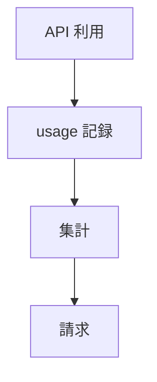
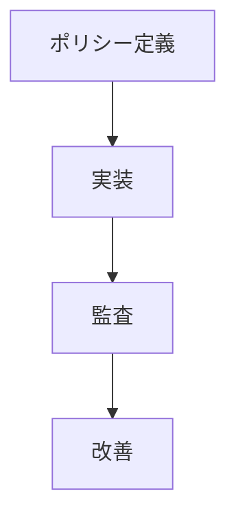
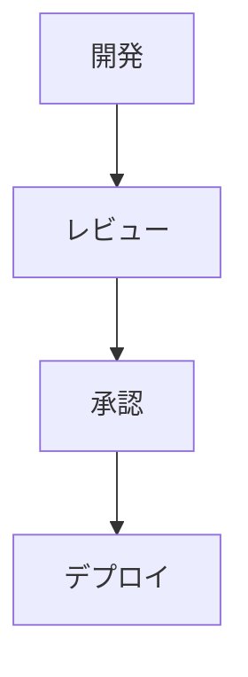

<!-- 
 SOC2 / ISO / SOX
 -->

# S2J Similarity Service - コンプライアンス

## 概要

本仕様は、監査、課金、サービス品質保証 (SLA) などの「コンプライアンス」および「外部に対する説明責任」に関する設計を定義します。

## 設計意図、設計方針、非対象

### 設計意図 (ゴール)

* 監査証跡を確保します。
* サービス品質を保証します。
* 契約、課金を明確化します。

### 設計方針 (規約)

* すべての操作を監査ログとして記録します。
* サービス品質保証 (SLA) を数値で定義します。
* 課金は usage ベースで管理します。

### 責務

* 監査ログを設計すること。
* SLA、Rate Limit、Billing を定義すること。
* 外部監査・内部統制に対応すること。

### 非責務

* 認証・認可ロジック
* データ保存場所の制御
* ビジネス判断

### 非対象 (Out of Scope)

* 財務処理
* 法務判断
* UI 表示

## 監査ログ (Audit Log)

本プロジェクトでは、すべての重要操作およびデータアクセスを記録する、監査ログを実装します。

### 設計意図 (ゴール)

* セキュリティインシデントを追跡します。
* 操作履歴を可視化します。
* コンプライアンス対応 (監査証跡) します。

### 設計方針 (規約)

* すべての変更系操作をログ対象とします。
* tenant 単位でログを分離します。
* 改竄耐性 (append-only) を確保します。

### 責務

* 操作履歴を記録すること。
* 監査証跡を提供すること。

### 非責務

* リアルタイム分析
* BI の可視化

### 対象イベント

| 種別 | 内容 |
| ----- | ------------------------ |
| API 操作 | create / update / delete |
| 認証 | login / logout |
| 権限変更 | role 更新 |
| 設定変更 | config 更新 |

### データモデル

```plaintext id="audit_model"
audit_logs
  id
  tenant_id
  user_id
  action
  resource
  payload
  timestamp
```

### 保存戦略

* append-only (更新禁止)
* 長期保存 (S3 / BigQuery 等)

### 出力形式

* JSON (構造化ログ)
* 外部ログ基盤連携 (Datadog 等)

### 利点

* トレーサビリティを確保できること。
* セキュリティを強化できること。
* 問題解析を高速化できること。

### 注意点

* ログ肥大化に注意してください。
* 個人情報の扱いに注意してください。

## SLA / Rate Limiting

本プロジェクトでは、サービス品質保証 (SLA) およびリクエスト制御 (Rate Limiting) を実装します。

### 設計意図 (ゴール)

* サービスの安定性を確保します。
* 過負荷を防止します。
* プランごとに差別化します。

### 設計方針 (規約)

* tenant 単位で制限を適用します。
* SLA と Rate Limit を連動させます。
* API レイヤで制御します。

### 責務

* リクエストを制御すること。
* SLA を保証すること。

### 非責務

* トラフィックの予測
* 自動スケーリング

### Rate Limiting

| 単位 | 例 |
| -- | ------------- |
| 秒 | 10req/sec |
| 分 | 1000req/min |
| 日 | 10000req/day |

### 実装方式

* Token Bucket
* Redis ベースカウンタ

### SLA 指標

| 指標 | 内容 |
| ----- | ------- |
| 可用性 | 99.9% |
| レイテンシ | < 200ms |
| エラー率 | < 1% |

### エラーレスポンス

```json id="rate_error"
{
  "error": "rate_limit_exceeded",
  "retry_after": 60
}
```

### プラン連動

| プラン | 制限 |
| ---------- | -- |
| Free | 低 |
| Pro | 中 |
| Enterprise | 高 |

### 利点

* サービスを安定化できること。
* 公平性を確保できること。
* 商用化に対応できること。

### 注意点

* 過度な制限に注意してください。
* バーストに対応してください。

## 課金 (Billing)

本プロジェクトでは、利用量に応じた課金およびプラン管理を実装します。

### 設計意図 (ゴール)

* サービスを収益化します。
* 利用量に応じた、公平な料金を設定します。
* プランを差別化します。

### 設計方針 (規約)

* usage ベース課金を基本とします。
* tenant 単位で課金を管理します。
* 外部決済サービスと連携します。

### 責務

* 利用量を計測すること。
* 課金を処理すること。

### 非責務

* 会計処理
* 税務対応

### 課金モデル

| モデル | 内容 |
| ------------ | ----- |
| usage-based | API 回数 |
| subscription | 月額 |
| hybrid | 両方 |

### データモデル

```plaintext id="billing_model"
usage_logs
  tenant_id
  endpoint
  count

plans
  name
  limits
  price
```

### フロー



### 決済連携

* Stripe
* Paddle
* PayPal

### プラン例

| プラン | 内容 |
| ---------- | ---- |
| Free | 制限あり |
| Pro | 高制限 |
| Enterprise | カスタム |

### 利点

* 収益化に対応できること。
* 柔軟な料金体系にできること。
* スケーラビリティに対応できること。

### 注意点

* 課金の精度に注意してください。
* 不正利用に注意してください。

## セキュリティ監査 (`SOC2` / ISO)

本プロジェクトでは、`SOC2` や `ISO27001` などのセキュリティ基準に準拠した監査体制を整備します。

### 設計意図 (ゴール)

* 信頼性を担保します。
* 「企業導入」要件を満たし込みます。
* リスクを管理します。

### 設計方針 (規約)

* 監査ログを完全に保持します。
* コントロール (統制項目) を定義します。
* 定期的に内部監査・外部監査を実施します。

### 責務

* セキュリティを統制すること。
* 監査に対応すること。

### 非責務

* 事業戦略
* UI/UX

### 対応領域

| 領域 | 内容 |
| ------ | ------------ |
| アクセス管理 | IAM / RBAC |
| ログ管理 | Audit Log |
| インフラ | セキュリティ設定 |
| 開発 | CI/CD セキュリティ |

### `SOC2` 観点

* Security
* Availability
* Confidentiality

### `ISO27001` 観点

* リスク管理
* 資産管理
* インシデント対応

### フロー



### 利点

* 企業の信頼性を向上できること。
* セキュリティを強化できること。
* 「契約要件」に対応できること。

### 注意点

* ドキュメント整備の負荷が増加し、コスト増加が不可避です。

## 内部統制 (SOX)

本プロジェクトでは、財務報告の信頼性を確保するため、SOX (サーベンス・オクスリー法) に準拠した内部統制を整備します。

### 設計意図 (ゴール)

* 「上場企業」要件に対応します。
* 財務データの信頼性を確保します。
* 不正を防止します。

### 設計方針 (規約)

* 職務分掌 (Separation of Duties) を徹底します。
* 変更管理を厳格に行います。
* 監査証跡を保持します。

### 責務

* 内部統制を実装すること。
* 監査に対応すること。

### 非責務

* 財務戦略
* 経営判断

### 開発プロセス



### コントロール

| 項目 | 内容 |
| ------ | ---------- |
| アクセス管理 | 権限分離 |
| 変更管理 | Pull-Request / 承認フロー |
| ログ | 監査ログ |

### 技術統制

* CI/CD の承認フロー
* 本番アクセス制限
* ログ監査

### 利点

* 不正を防止できること。
* 信頼性を向上できること。
* 監査に対応できること。

### 注意点

* プロセスの増加に注意してください。
* 開発速度の低下に注意してください。
