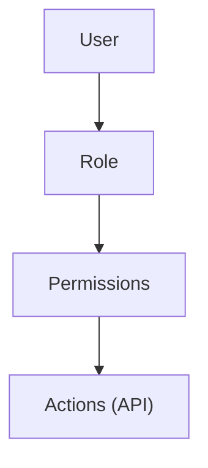
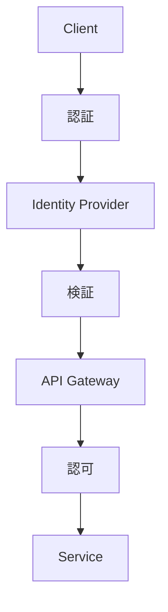

<!-- 
 zero trust
 -->

# S2J Similarity Service - セキュリティ設計

## 概要

本仕様は、認証・認可・アクセス制御を含むセキュリティ設計を定義します。

## 設計意図、設計方針、非対象

### 設計意図 (ゴール)

* 不正アクセスを防止します。
* 最小権限を徹底します。
* セキュアな通信を確保します。

### 設計方針 (規約)

* ゼロトラストモデルを採用します。
* Role Base Access 制御 (RBAC) により、権限を管理します。
* テナント単位で分離します。

### 責務

* 認証・認可を設計すること。
* アクセスを制御すること (RBAC、テナント分離)。
* ゼロトラストセキュリティを適用すること。

### 非責務

* 監査制度 (`SOC2` 等)
* データ保存ポリシー
* UI セキュリティ

### 非対象 (Out of Scope)

* UI セキュリティ
* 法令解釈
* 外部監査への対応

## 機密情報の管理

### 設計意図 (ゴール)

API キーなどの機密情報の漏洩を防止します。

### 設計方針 (規約)

* API キーは、アプリケーション層で管理します。
* SDK や生成物に埋め込みません。
* ログ・トレースに含めません。

### 注意

ブラウザー環境では、API キーを直接利用せず、サーバー経由でアクセスします。

## マルチテナント対応

本プロジェクトでは、複数の顧客・組織 (テナント) を単一基盤上で安全に分離・運用するためのマルチテナント設計を採用します。

### 設計意図 (ゴール)

* 複数顧客を同時運用します。
* データ分離により、セキュリティを確保します。
* スケーラビリティ向上を目指します。

### 設計方針 (規約)

* すべてのリクエストは、`tenant_id` を持ちます。
* データアクセスは、tenant 単位で制限します。
* テナント境界を越えるアクセスは、禁止します。

### 責務

* テナントを分離すること。
* データアクセスを制御すること。

### 非責務

* 認証方式の定義
* UI の分離

### 分離戦略

| 方式 | 特徴 |
| ------------ | ---------- |
| Row-level | 軽量 / 単一 DB |
| Schema-level | 中規模 |
| DB-level | 高分離 / 高コスト |

### 推奨方式

* 初期: Row-level (tenant_id カラム)
* 拡張: Schema-level に移行可能

### データモデル

```plaintext id="tenant_model"
table: similarity_requests
  id
  tenant_id
  input
  output
```

### API 設計

* ヘッダー or トークンから tenant_id を取得します。
* middleware で強制適用します。

### セキュリティ

* tenant_id の改竄防止
* 認証と連携 (JWT 等)

### 利点

* スケーラブルであること。
* 運用効率が向上できること。
* セキュリティを確保できること。

### 注意点

* クエリー漏れによる、データ混在の可能性があります。
* テナントごとの制限管理が必要です。

## RBAC (権限管理)

本プロジェクトでは、Role Base Access 制御 (RBAC) により、ユーザーの権限を管理します。

### 設計意図 (ゴール)

* 権限を明確化します。
* セキュリティを強化します。
* 操作制御を一元化します。

### 設計方針 (規約)

* Role → Permission → Action の構造を採用します。
* API レベルで権限チェックを行います。
* フロントは、補助的に制御します。

### 責務

* アクセスを制御すること。
* 権限を管理すること。

### 非責務

* 認証 (別レイヤ)
* UI 制御の完全保証

### モデル



### 例

| Role | 権限 |
| ------ | ------ |
| admin | 全操作 |
| editor | 作成・更新 |
| viewer | 読み取りのみ |

### API 連携

* middleware で権限チェック
* エンドポイント単位で制御

### OpenAPI 連携

```yaml id="rbac_openapi"
security:
  - bearerAuth: []
```

### フロント連携

* UI 表示制御
* ボタン非表示

### 利点

* 柔軟に権限を管理できること。
* セキュリティを強化できること。

### 注意点

* Role 設計の複雑化に注意する必要があります。
* 過剰な権限に注意する必要があります。

## ゼロトラストセキュリティ

本プロジェクトでは、「何も信頼しない (ever Trust, Always Verify)」を前提とした「ゼロトラストセキュリティ」モデルを採用します。

### 設計意図 (ゴール)

* 内部セキュリティ/外部セキュリティの境界に依存しません。
* 高度化する脅威に対応します。
* 「エンタープライズ」要件を満たし込みます。

### 設計方針 (規約)

* すべてのアクセスを検証します。
* 最小権限の原則を徹底します。
* 継続的に認証・認可します。

### 責務

* 全アクセスを検証すること。
* 継続的に認可すること。

### 非責務

* UI/UX の最適化
* 業務ロジック

### コア原則

| 原則 | 内容 |
| ----------------- | ---- |
| Verify explicitly | 常に検証 |
| Least privilege | 最小権限 |
| Assume breach | 侵害前提 |

### 実装要素

* 強固な認証 (OAuth2 / OIDC / MFA)
* RBAC / ABAC による認可
* mTLS による通信保護
* デバイス／コンテキスト検証

### アーキテクチャー



### 利点

* セキュリティを強化できること。
* 横断的にアクセス制御できること。
* 内部脅威に対して対策できること。

### 注意点

* パフォーマンスに影響するので、実装の複雑性に注意してください。
