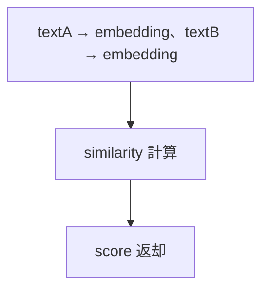
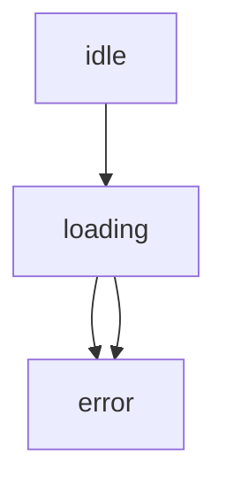

<!--
目的：「REST API エンドポイント、リクエスト/レスポンス、権限、セキュリティ、nonce」の明文化
-->

# S2J Similarity Service - REST API 仕様

本ドキュメントは、類似度の算出機能を外部から利用するための **REST API インターフェース仕様** を定義します。
本仕様は、Contracts 層のデータ契約に準拠します。

## 概要

本 API は、以下を提供します。

* テキストから Embedding を生成する API
* 2つのテキストの類似度を算出する API

* Contracts 層の DTO を変更した場合、本 API も追従します。
* 将来的に OpenAPI で定義できます。
* フロントエンドは型生成を前提とします。

## Contracts との関係

本 API は、Contracts 層の DTO を直接公開しません。

内部で、以下のように変換します。

* text → Embedding → vector
* vector → Similarity

したがって、本 API は、Application 層のユースケース API として定義されます。

## 契約レイヤとの関係

本 API は、Contracts 層の DTO (vector ベース) を直接公開しません。

代わりに、以下の変換を内部で行います。

* text → Embedding → vector
* vector → Similarity 計算

したがって、本 API は、「Application 層のユースケース API」として位置付けられます。

## 設計意図、設計方針、非対象

### 設計意図 (ゴール)

フロントエンドや外部システムから、**統一されたインターフェースで、類似度機能を利用可能にします**。

### 設計方針 (規約)

* Contracts の DTO を、そのまま API 契約とします。
* レスポンス形式を統一します。
* 認証・認可を、明示的に扱います。
* エラーは、機械可読な形式で返します。

本 API は、Contracts 層の DTO を直接公開しません。

代わりに、下記の「変換」を内部で行います。

* text → Embedding → vector
* vector → Similarity

したがって、本 API は、Application 層のユースケース API として定義されます。

### 非対象 (Out of Scope)

* UI 実装
* セッション管理
* プロバイダ固有の API 露出

## エンドポイント一覧

| メソッド | パス | 説明 |
| ---- | -------------- | ------------ |
| POST | `/v1/embedding`  | Embedding 生成 |
| POST | `/v1/similarity` | 類似度算出 |

## 共通仕様

### 1. リクエストヘッダー

```plaintext id="headers"
Content-Type: application/json
Authorization: Bearer {token}
```

### 2. リクエストのレスポンス形式 - 成功

```json id="success_format"
{
  "data": {},
  "meta": {}
}
```

### 3. リクエストのレスポンス形式 - エラー

```json id="error_format"
{
  "error": {
    "type": "string",
    "message": "string",
    "details": {}
  }
}
```

### 4. HTTP ステータスコード

| コード | 意味 |
| --- | ---------- |
| `200` | 成功 |
| `400` | バリデーションエラー |
| `401` | 未認証 |
| `403` | 権限不足 |
| `429` | レート制限 |
| `500` | サーバーエラー |

## API バージョニング戦略

### 設計意図 (ゴール)

API の互換性を維持しつつ、破壊的変更を安全に導入できるようにします。

### 設計方針 (規約)

* URI パスに、バージョンを含めます。
* メジャーバージョンのみを URL に含めます。
* 後方互換性を重視します。

### 責務

* API バージョンを定義すること。
* 互換性ポリシーを明確化すること。

### 非責務

* SDK のバージョン管理
* 内部コードのバージョン

### エンドポイント形式

```plaintext id="api_version_path"
/v1/similarity
/v1/embedding
```

### バージョンルール

| 種別 | 変更内容 | URL 変更 |
|------|----------|---------|
| PATCH | バグ修正 | なし |
| MINOR | 後方互換あり機能追加 | なし |
| MAJOR | 破壊的変更 | 必須 |

### 互換性ポリシー

* 同一メジャーバージョン内では、後方互換を維持します。
* 既存フィールドの削除は、禁止します。
* 新規フィールド追加は、optional とします。

### 廃止 (Deprecation)

* 旧バージョンは、一定期間、併存させます。
* deprecation notice をレスポンスヘッダーで通知します。

### ヘッダー (任意)

```plaintext id="api_header"
X-API-Version: 1
```

## `/v1/embedding`

### 概要

テキストから Embedding を生成します。

### リクエスト

```json id="embed_req"
{
  "text": "string",
  "model": "string"
}
```

#### バリデーション

* text: 必須、空文字は不可です。
* model: 任意です。

### リクエストのレスポンス

```json id="embed_res"
{
  "data": {
    "vector": [number],
    "dimension": number
  }
}
```

## `/v1/similarity`

### 概要

2つのテキストの類似度を算出します。

### リクエスト

```json id="sim_req"
{
  "textA": "string",
  "textB": "string",
  "model": "string"
}
```

#### バリデーション

* textA: 必須、空文字は不可です。
* textB: 必須、空文字は不可です。
* model: 任意です。

### リクエストのレスポンス

```json id="sim_res"
{
  "data": {
    "similarityScore": number
  }
}
```

### 処理内容 - 内部



## 認証・認可

### 設計意図 (ゴール)

最小権限の原則にもとづき、安全なアクセス制御を行います。

### 設計方針 (規約)

* Bearer Token を使用します。
* エンドポイントごとに、権限チェックを実施します。

### 認可例

| エンドポイント | 権限 |
| ----------- | ---- |
| `/embedding`  | read |
| `/similarity` | read |

## Runtime Validation

### 設計意図 (ゴール)

不正入力を早期に排除します。

### 設計方針 (規約)

* リクエスト受信時に、スキーマを検証します。
* Contracts の定義と一致させます。

## 類似度スコアの意味

レスポンスの `score` は、以下を満たします。

* 範囲: 0.0〜1.0
* 意味: 意味的な類似度 (1に近いほど、類似)

アルゴリズムの詳細は、[類似度算出の仕様](../core/similarity_spec.md) をご覧ください。

## エラーハンドリング

### 設計意図 (ゴール)

クライアントでの処理を、容易にします。

### 設計方針 (規約)

* エラー構造を統一します。
* type により、分岐可能にします。

## レート制限

### 設計意図 (ゴール)

API を安定的に運用します。

### 設計方針 (規約)

* エンドポイント単位で、制限します。
* `429` を返却します。

## フロントエンド状態遷移

### 設計意図 (ゴール)

UI 側での一貫した挙動を保証します。

### 状態遷移の契約

クライアントは、下図の状態遷移を前提とします。



エラー種別により、UI の挙動を分岐します。

* ValidationError: 入力修正
* ProviderError: リトライ可能

### リトライ

* network / timeout のみ、自動リトライします。
* validation エラーは、リトライ不可とします。
