<!--
目的：「REST API エンドポイント、リクエスト/レスポンス、権限、セキュリティ、nonce」の明文化
-->

# S2J Similarity Service - REST API 仕様

本ドキュメントは、類似度の算出機能を外部から利用するための **REST API インターフェース仕様** を定義します。
本仕様は、Contracts 層のデータ契約に準拠します。

## 概要

本 API は、以下を提供します。

* テキストから Embedding を生成する API
* 2つのテキストの類似度を算出する API

* Contracts 層の DTO を変更した場合、本 API も追従します。
* 将来的に OpenAPI で定義できます。
* フロントエンドは型生成を前提とします。

## Contracts との関係

本 API は、Contracts 層の DTO を直接公開しません。

内部で、以下のように変換します。

* text → Embedding → vector
* vector → Similarity

したがって、本 API は、Application 層のユースケース API として定義されます。

## 契約レイヤとの関係

本 API は、Contracts 層の DTO (vector ベース) を直接公開しません。

代わりに、以下の変換を内部で行います。

* text → Embedding → vector
* vector → Similarity 計算

したがって、本 API は、「Application 層のユースケース API」として位置付けられます。

## 設計意図、設計方針、非対象

### 設計意図 (ゴール)

フロントエンドや外部システムから、**統一されたインターフェースで、類似度機能を利用可能にします**。

### 設計方針 (規約)

* Contracts の DTO を、そのまま API 契約とします。
* レスポンス形式を統一します。
* 認証・認可を、明示的に扱います。
* エラーは、機械可読な形式で返します。

本 API は、Contracts 層の DTO を直接公開しません。

代わりに、下記の「変換」を内部で行います。

* text → Embedding → vector
* vector → Similarity

したがって、本 API は、Application 層のユースケース API として定義されます。

### 非対象 (Out of Scope)

* UI 実装
* セッション管理
* プロバイダ固有の API 露出

## エンドポイント一覧

| メソッド | パス | 説明 |
| ---- | -------------- | ------------ |
| POST | `/v1/embedding`  | Embedding 生成 |
| POST | `/v1/similarity` | 類似度算出 |

## 共通仕様

### 1. リクエストヘッダー

```plaintext id="headers"
Content-Type: application/json
Authorization: Bearer {token}
```

### 2. リクエストのレスポンス形式 - 成功

成功時の JSON ボディは、常に次のトップレベル構造です (`meta` は空オブジェクト `{}` も許容します)。

```json id="success_format"
{
  "data": {},
  "meta": {}
}
```

* `data`: エンドポイント固有の結果 (下記 `/v1/embedding`、`/v1/similarity` の例を参照)。
* `meta`: 実装が付与する任意のメタデータ (例: 相関 ID、処理時間)。将来の拡張用にキーを追加しても後方互換となります。

**契約上の参照**: `schema/openapi.yaml` の `SimilarityResponse`、`EmbeddingResponse` は、このエンベロープを Single Source として表現します。

### 3. リクエストのレスポンス形式 - エラー

```json id="error_format"
{
  "error": {
    "type": "string",
    "message": "string",
    "details": {}
  }
}
```

### 4. HTTP ステータスコード

| コード | 意味 |
| --- | ---------- |
| `200` | 成功 |
| `400` | バリデーションエラー |
| `401` | 未認証 |
| `403` | 権限不足 |
| `429` | レート制限 |
| `500` | サーバーエラー |

## 命名整合性

### 設計方針 (規約)

* REST と SDK の命名は、一致させます。

```plaintext
POST /v1/similarity
service->similarity()
```

## API バージョニング戦略

### 設計意図 (ゴール)

API の互換性を維持しつつ、破壊的変更を安全に導入できるようにします。

### 設計方針 (規約)

* URI パスに、バージョンを含めます。
* メジャーバージョンのみを URL に含めます。
* 後方互換性を重視します。

### 責務

* API バージョンを定義すること。
* 互換性ポリシーを明確化すること。

### 非責務

* SDK のバージョン管理
* 内部コードのバージョン

### エンドポイント形式

```plaintext id="api_version_path"
/v1/similarity
/v1/embedding
```

### バージョンルール

| 種別 | 変更内容 | URL 変更 |
|------|----------|---------|
| PATCH | バグ修正 | なし |
| MINOR | 後方互換あり機能追加 | なし |
| MAJOR | 破壊的変更 | 必須 |

### 互換性ポリシー

* 同一メジャーバージョン内では、後方互換を維持します。
* 既存フィールドの削除は、禁止します。
* 新規フィールド追加は、optional とします。

### 廃止 (Deprecation)

* 旧バージョンは、一定期間、併存させます。
* deprecation notice をレスポンスヘッダーで通知します。

### ヘッダー (任意)

```plaintext id="api_header"
X-API-Version: 1
```

## `/v1/embedding`

### 概要

テキストから Embedding を生成します。

### リクエスト

```json id="embed_req"
{
  "text": "string",
  "model": "string"
}
```

#### バリデーション

* text: 必須、空文字は不可です。
* model: 任意です。

### リクエストのレスポンス

共通の成功エンベロープ (`data` / `meta`) に従います。

```json id="embed_res"
{
  "data": {
    "vector": [number],
    "dimension": number
  },
  "meta": {}
}
```

## `/v1/similarity`

### 概要

2つのテキストの類似度を算出します。

### リクエスト

```json id="sim_req"
{
  "textA": "string",
  "textB": "string",
  "model": "string"
}
```

#### バリデーション

* textA: 必須、空文字は不可です。
* textB: 必須、空文字は不可です。
* model: 任意です。

### リクエストのレスポンス

共通の成功エンベロープ (`data`、`meta`) に従います。

```json id="sim_res"
{
  "data": {
    "similarityScore": number
  },
  "meta": {}
}
```

### 処理内容 - 内部

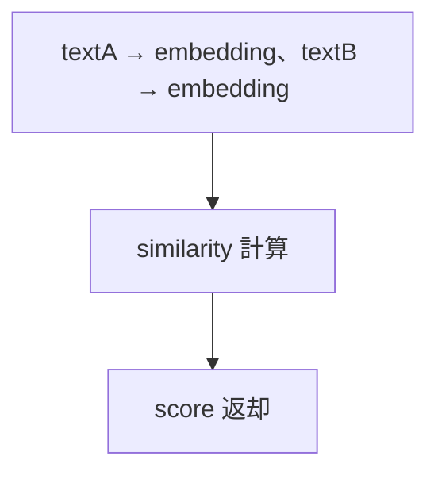

## 認証・認可

### 設計意図 (ゴール)

最小権限の原則にもとづき、安全なアクセス制御を行います。

### 設計方針 (規約)

* Bearer Token を使用します。
* エンドポイントごとに、権限チェックを実施します。

### 認可例

| エンドポイント | 権限 |
| ----------- | ---- |
| `/embedding`  | read |
| `/similarity` | read |

## Runtime Validation

### 設計意図 (ゴール)

不正入力を早期に排除します。

### 設計方針 (規約)

* リクエスト受信時に、スキーマを検証します。
* Contracts の定義と一致させます。

## 類似度スコアの意味

レスポンスの `data.similarityScore` は、以下を満たします。

* 範囲: 0.0〜1.0
* 意味: 意味的な類似度 (1に近いほど、類似)

アルゴリズムの詳細は、[類似度算出の仕様](../core/similarity_spec.md) をご覧ください。

## エラーハンドリング

### 設計意図 (ゴール)

クライアントでの処理を、容易にします。

### 設計方針 (規約)

* エラー構造を統一します。
* type により、分岐可能にします。

## レート制限

### 設計意図 (ゴール)

API を安定的に運用します。

### 設計方針 (規約)

* エンドポイント単位で、制限します。
* `429` を返却します。

## フロントエンド状態遷移

### 設計意図 (ゴール)

UI 側での一貫した挙動を保証します。

### 状態遷移の契約

クライアントは、下図の状態遷移を前提とします。

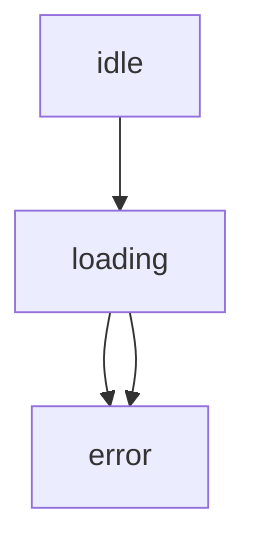

エラー種別により、UI の挙動を分岐します。

* ValidationError: 入力修正
* ProviderError: リトライ可能

### リトライ

* network / timeout のみ、自動リトライします。
* validation エラーは、リトライ不可とします。

## エラー仕様 (REST ↔ DomainError 対応)

### 設計意図 (ゴール)

REST API と PHP SDK のエラー表現を統一し、コール側が一貫した方法でエラー処理できるようにします。

### 設計方針 (規約)

* REST のエラーレスポンスは、共通フォーマットを使用します。
* `error.type` を唯一の分類キーとします。
* PHP 側では、`DomainError` 派生クラスにマッピングします。
* エラー分類は、安定した値 (enum 的) とし、文字列の揺れを許しません。
* HTTP ステータスコードと `error.type` は、対応関係を持ちます。

### 非対象 (Out of Scope)

* `i18n` (多言語エラーメッセージ)
* UI 表示フォーマット
* エラー文言のローカライズ

### 責務

* REST と SDK のエラー表現を、統一すること。
* エラー分類の安定性を、保証すること。
* コール側の分岐処理を、容易にすること。

### 非責務

* エラーの表示方法
* ログ収集・可視化
* 再試行戦略 (リトライポリシーは、別仕様)

### REST エラーフォーマット

```json id="error_format"
{
  "error": {
    "type": "validation_error",
    "message": "Invalid input",
    "details": {
      "field": "text"
    }
  }
}
```

### エラー対応表 (REST → PHP)

| HTTP | error.type | PHP クラス | 説明 |
|------|------------------|------------------------|------|
| 400 | validation_error | ValidationError | 入力不正 |
| 401 | auth_error | AuthenticationError | 認証失敗 |
| 403 | permission_error | AuthorizationError | 権限不足 |
| 404 | not_found | NotFoundError | リソースなし |
| 408 | timeout | TimeoutError | タイムアウト |
| 429 | rate_limit | RateLimitError | レート制限 |
| 500 | internal_error | InternalError | サーバー内部 |
| 502/503 | provider_error | ProviderError | 外部 API 障害 |
| - | network_error | NetworkError | 通信エラー |

### マッピングルール

* REST レスポンス受信時
  * `error.type` をもとに DomainError を生成します。
* SDK 内部例外
  * DomainError を REST 形式に変換可能とします。
* `details` は、構造化データとして保持します。

### PHP 側設計

```php id="error_php"
abstract class DomainError extends \Exception {}

class ValidationError extends DomainError {}
class AuthenticationError extends DomainError {}
class AuthorizationError extends DomainError {}
class NotFoundError extends DomainError {}
class TimeoutError extends DomainError {}
class RateLimitError extends DomainError {}
class ProviderError extends DomainError {}
class NetworkError extends DomainError {}
class InternalError extends DomainError {}
```

### エラー変換フロー

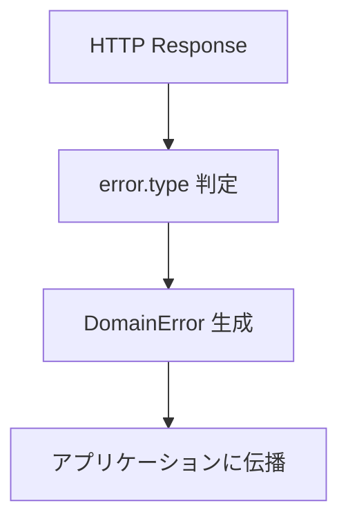

### details の扱い

* 任意の構造を許可します (JSON オブジェクト)。
* フィールドエラーなどを含めます。

例:

```json id="error_details"
{
  "field": "text",
  "reason": "empty"
}
```

## 提供形態 (ランタイム / フレームワーク)

### 設計意図 (ゴール)

本サービスの REST API を、特定の実行環境に依存せずに提供可能とし、多様なホスティング環境で再利用できる構成とします。

### 設計原則

```plaintext id="rest_principle"
Coreは、環境を知らない
RESTは、薄く保つ
Adapterで世界を繋ぐ
```

### 設計方針 (規約)

* REST API は、「参照実装 (Reference Implementation)」として定義します。
* 特定のフレームワーク (Laravel / Express 等) には、依存しません。
* コアロジック (SimilarityService) は、フレームワーク非依存とします。
* 各ランタイムへの統合は、Adapter 層で行います。
* HTTP 層は、薄いラッパーとして実装します。

### 非対象 (Out of Scope)

* 特定フレームワークの実装詳細
* デプロイ手順の詳細 (IaC / CI/CD)
* インフラストラクチャ構成 (VPC / LB 等)

### 責務

* REST API の論理仕様を定義すること。
* フレームワーク非依存な構造を保証すること。
* Adapter による統合ポイントを明確化すること。

### Adapter の責務

* HTTP → DTO に変換すること。
* DTO → Service コールすること。
* エラー変換 (DomainError → REST) すること。

### 非責務

* 実行環境の選定
* フレームワークの導入
* デプロイ / 運用設計

### アーキテクチャー

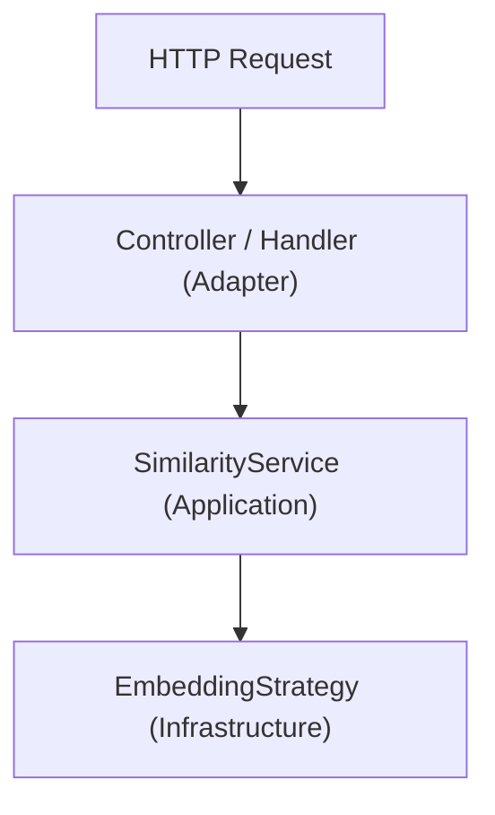

### デプロイ形態

```plaintext id="rest_deploy"
* コンテナ (Docker)
* サーバレス (Lambda / Workers)
* 従来サーバ (Apache / Nginx + PHP)
```

### 提供形態

#### 1. コア (必須)

* PHP Composer ライブラリとして提供します。
* フレームワーク非依存とします。

```plaintext id="rest_core"
SimilarityService (Application)
EmbeddingStrategy (Infrastructure)
```

#### 2. REST API (参照実装)

* 軽量な HTTP ハンドラとして提供します。
* 任意の環境に組込み可能とします。

##### 例

```plaintext id="rest_examples"
* PHP: Slim / Laravel / Symfony
* Node: Express / Fastify
* Edge: Cloudflare Workers
```

#### 3. 推奨ランタイム (参考)

| 種別 | 推奨 |
|------|------|
| PHP | Laravel / Slim |
| Node | Fastify |
| Edge | CloudFlare Workers |

※ あくまで参考であり、依存関係は持ちません。

### フレームワーク依存の扱い

#### 方針

* フレームワーク固有コードは、分離します。
* ライブラリ本体には含めません。

#### 例

```plaintext id="rest_adapter"
adapters/
  laravel/
  express/
  workers/
```

## 認証・認可 (Bearer Token)

### 設計意図 (ゴール)

REST API に対するアクセスを安全に制御しつつ、ホスト環境に依存しない柔軟な認証モデルを提供します。

### 設計原則

```plaintext id="auth_principle"
認証は、入口で止める
Coreに持ち込まない
権限は、軽く、拡張可能に
```

### 設計方針 (規約)

* 認証は、Bearer Token を使用します。
* 認証処理は、Adapter 層で実施します (Core / Application には持ち込まない)。
* トークン検証ロジックは、差し替え可能とします。
* 認可 (権限) は、シンプルなスコープベースとします。
* SDK / Core は、認証状態を保持しません。

### 非対象 (Out of Scope)

* ユーザー管理 (DB / IAM)
* OAuth フロー実装
* トークン発行
* セッション管理

### 責務

* 認証方式を統一すること。
* 検証ポイントを明確化すること。
* 認可モデルを最小定義すること。

### Adapter の責務

* Authorization ヘッダーを抽出すること。
* トークンを検証すること。
* AuthContext を生成すること。
* 権限をチェックすること。

### 非責務

* 認証基盤の提供
* トークンのライフサイクル管理
* 認証サーバーの構築

### 認証方式

#### ヘッダー

```http id="auth_header"
Authorization: Bearer <token>
```

#### 検証フロー

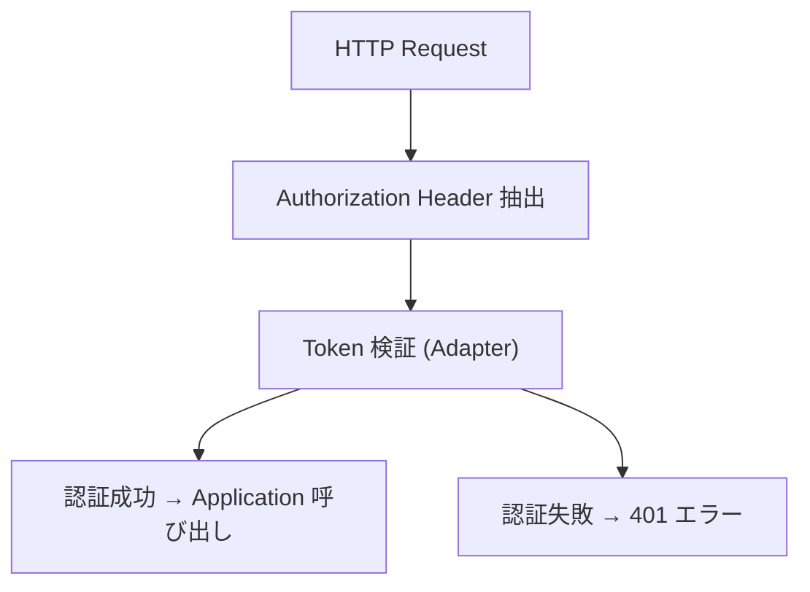

### トークン検証方式

#### 対応モデル (いずれか)

1. 固定トークン (シンプル運用)
2. JWT (署名検証)
3. 外部認証サーバー (OAuth / API Gateway)

#### 抽象インターフェース (概念)

```php id="auth_interface"
interface AuthenticatorInterface
{
    public function authenticate(string $token): AuthContext;
}
```

### 認可 (Authorization)

#### 方針

* スコープベース制御を採用します。
* エンドポイントごとに必要スコープを定義します。

#### 例

```plaintext id="auth_scope"
similarity:read
embedding:write
admin:*
```

#### 判定

```plaintext id="auth_check"
if (!in_array(required_scope, context.scopes)) {
  throw AuthorizationError
}
```

### エラー仕様

| 状態 | HTTP | error.type |
|------|------|-----------|
| 未認証 | 401 | auth_error |
| 権限不足 | 403 | permission_error |

### AuthContext

```php id="auth_context"
class AuthContext
{
    public string $subject;   // ユーザー or サービス
    public array $scopes;    // 権限
}
```

### Core / Application の扱い

#### ルール

* 認証ロジックは、含めません。
* AuthContext は、必要に応じて引数として受け取ります。

## レート制限 (Rate Limiting)

### 設計意図 (ゴール)

サービスの安定性と公平性を確保しつつ、クライアントに対して予測可能なスロットリング挙動を提供します。

### 設計原則

```plaintext id="rate_principle"
制限は、明確に
挙動は、予測可能に
通知は、必ず返す
```

### 設計方針 (規約)

* レート制限は、Adapter 層で実施します。
* 単位は、「時間あたりリクエスト数」とします (requests per window)。
* 制限は、API キー (または subject) 単位で適用します。
* 超過時は、`HTTP 429` を返却します。
* `Retry-After` を必ず返却します。
* 制限値は、環境ごとに設定可能とします。

### 非対象 (Out of Scope)

* 分散キャッシュ実装 (Redis 等)
* インフラストラクチャレベルのレート制御 (CDN / WAF)
* 課金との連動

### 責務

* レート制限の、単位と値を定義すること。
* クライアントへの通知形式を統一すること。
* Adapter 実装の指針を提供すること。

### Adapter の責務

* リクエスト数をカウントすること。
* 制限を判定すること。
* レスポンス (429 / headers) を生成すること。

### 非責務

* 実際のストレージ (Redis / Memory) 実装
* スケーリング戦略
* SLA 管理

### 制限モデル

#### 基本単位

```plaintext id="rate_unit"
requests / minute
```

#### デフォルト値 (推奨)

| プラン | 上限 |
|--------|------|
| default | 1request/sec |
| high | 5request/sec |
| burst | 10request/sec (短時間バースト) |

#### 補足

* 上限は、ホスト環境で調整可能です。
* 将来的にテナント別設定に拡張可能です。

### 判定方式

#### 推奨アルゴリズム

下記のいずれか。

* Token Bucket
* Sliding Window

#### 判定フロー

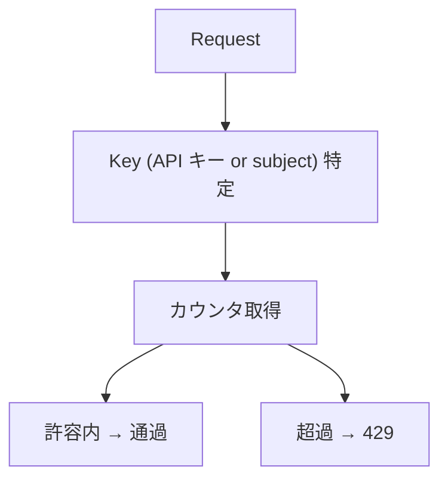

### レスポンス仕様

#### HTTP ステータス

```plaintext id="rate_status"
429 Too Many Requests
```

#### ヘッダー

```http id="rate_headers"
Retry-After: 30
X-RateLimit-Limit: 60
X-RateLimit-Remaining: 0
X-RateLimit-Reset: 1710000000
```

#### ボディ

```json id="rate_body"
{
  "error": {
    "type": "rate_limit",
    "message": "Rate limit exceeded",
    "details": {
      "limit": 60,
      "remaining": 0
    }
  }
}
```

### Retry-After の定義

* 単位: 秒 (integer)
* 次のリクエストが許可されるまでの待機時間

### 適用単位

下記のいずれか。

* API キー単位 (推奨)
* AuthContext.subject

### Core / Application の扱い

#### ルール

* レート制限は、関知しません。
* エラーは、DomainError (RateLimitError) として伝播可能とします。

### 拡張 (将来)

```plaintext id="rate_future"
* エンドポイント別制限
* テナント別制限
* 動的スロットリング
```

## HTTP サーバー実装 (Routing / Controller)

### 設計意図 (ゴール)

OpenAPI による REST 契約定義と、実際の HTTP サーバー実装 (routing / controller) を明確に分離し、実装状況と責務を正確に管理可能にします。

### 設計原則

```plaintext id="rest_impl_principle"
OpenAPI は、契約
HTTP runtime は、実装
Controller は、Adapter
```

### 設計方針 (規約)

* OpenAPI は、「HTTP 契約」の source of truth とします。
* REST API の「実装完了」は、HTTP runtime 実装を含みます。
* routing / controller が存在しない場合、REST API は未実装扱いとします。
* HTTP 層は、Adapter として実装します。
* Core / Application は、HTTP を認識しません。

### 非対象 (Out of Scope)

* Web UI
* API Gateway 構築
* Kubernetes ingress
* CDN / WAF 設定
* GraphQL endpoint

### 責務

* HTTP runtime 実装の成立条件を定義すること。
* REST 契約と runtime の違いを明確化すること。
* Controller / Routing の責務を定義すること。

### Controller の責務

* Request → DTO に変換すること。
* DTO validation すること。
* Application 呼び出しすること。
* DomainError → ErrorResponse に変換すること。
* HTTP status code を決定すること。

### Routing の責務

* endpoint パスを解決すること。
* HTTP method を判定すること。
* middleware を適用すること。

### Adapter 層

#### 方針

* HTTP 層は、Adapter として扱います。
* フレームワーク依存を隔離します。

#### 例

```plaintext id="rest_impl_adapter"
adapters/http/
  laravel/
  slim/
  express/
  workers/
```

### 非責務

* フレームワーク選定
* デプロイ
* インフラストラクチャ構成
* 認証基盤そのもの

### OpenAPI の位置付け

#### 方針

* OpenAPI は、「契約」であり runtime ではありません。
* schema 定義のみでは API 実装完了とは見なしません。

### ErrorResponse との関係

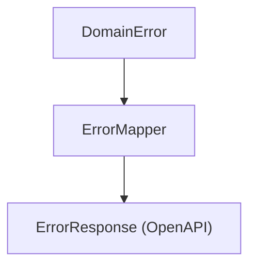

### 現在の実装状況

#### 実装済み

```plaintext id="rest_impl_done"
✔ OpenAPI schema
✔ ErrorResponse
✔ DTO codegen
✔ SDK contracts
```

#### 未実装

```plaintext id="rest_impl_todo"
✖ HTTP routing
✖ Controller / Handler
✖ Request validation runtime
✖ Response serialization
✖ HTTP middleware
```

#### REST API の成立条件

以下を満たした場合に「REST API 実装済み」とします。

```plaintext id="rest_impl_requirements"
1. OpenAPI schema 存在
2. HTTP routing 実装
3. Controller / Handler 実装
4. Error mapping 実装
5. Request validation 実装
6. HTTP integration test
```

### 推奨構成

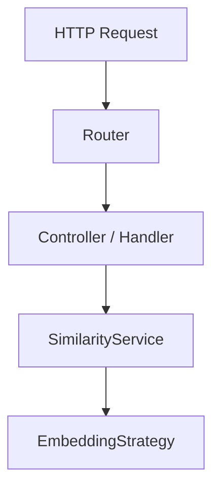

### テスト要件

#### 必須

* integration test
* HTTP status assertion
* ErrorResponse assertion

#### 推奨

* OpenAPI contract test
* schema validation

## エラー種別の命名規則 (error.type)

### 設計意図 (ゴール)

REST API、OpenAPI、PHP SDK、TypeScript SDK 間で、一貫したエラー識別子を提供し、変換コストと命名揺れを排除します。

### 設計方針 (規約)

* `error.type` は、snake_case を正式仕様とします。
* OpenAPI schema は、snake_case を source of truth とします。
* PHP `DomainError::$type` も、snake_case を使用します。
* PHP のクラス名のみ、PascalCase を使用します。
* TypeScript SDK は、string literal union に snake_case を使用します。

### 設計原則

```plaintext id="error_principle"
識別子は、snake_case
クラス名は、PascalCase
JSON は、言語非依存
```

### 非対象 (Out of Scope)

* i18n エラーメッセージ
* UI 表示用ラベル
* stack trace 標準化
* GraphQL error extensions

### 責務

* エラー識別子を統一すること。
* OpenAPI / SDK 間の整合を保証すること。
* runtime 間の変換を容易にすること。

### 非責務

* エラー文言の翻訳
* ログフォーマット
* APM 製品との統合

### 正式命名

| 概念 | 命名 |
|------|------|
| REST error.type | snake_case |
| OpenAPI enum | snake_case |
| PHP `DomainError::$type` | snake_case |
| PHP class 名 | PascalCase |
| TS literal type | snake_case |

### 正式一覧

| error.type | PHP Class |
|------------|-----------|
| validation_error | ValidationError |
| auth_error | AuthenticationError |
| permission_error | AuthorizationError |
| not_found | NotFoundError |
| timeout | TimeoutError |
| rate_limit | RateLimitError |
| provider_error | ProviderError |
| network_error | NetworkError |
| internal_error | InternalError |

### REST 例

```json id="error_rest_example"
{
  "error": {
    "type": "validation_error",
    "message": "Invalid input",
    "details": {
      "field": "text"
    }
  }
}
```

### PHP 例

```php id="error_php_example"
abstract class DomainError extends \Exception
{
    public string $type;
}

class ValidationError extends DomainError
{
    public string $type = 'validation_error';
}
```

### TypeScript 例

```ts id="error_ts_example"
type ErrorType =
  | 'validation_error'
  | 'rate_limit'
  | 'provider_error'
```

### OpenAPI 例

```yaml id="error_openapi_example"
type:
  type: string
  enum:
    - validation_error
    - auth_error
    - rate_limit
```

### PascalCase を使用しない理由

* JSON / REST と整合しない
* TypeScript literal と不整合
* OpenAPI enum に不向き
* 言語依存が強い

### PascalCase の利用範囲

#### 許可対象

```plaintext id="error_pascal"
PHP class 名
TypeScript class 名
```

#### 禁止対象

```plaintext id="error_no_pascal"
REST error.type
OpenAPI enum
JSON payload
```

### migration 方針

#### 旧

```plaintext id="error_old"
ValidationError
ProviderError
```

#### 新

```plaintext id="error_new"
validation_error
provider_error
```

### ErrorMapper

#### 設計方針 (規約)

* REST ↔ DomainError 変換を提供します。
* snake_case を唯一の識別子とします。

#### 変換フロー

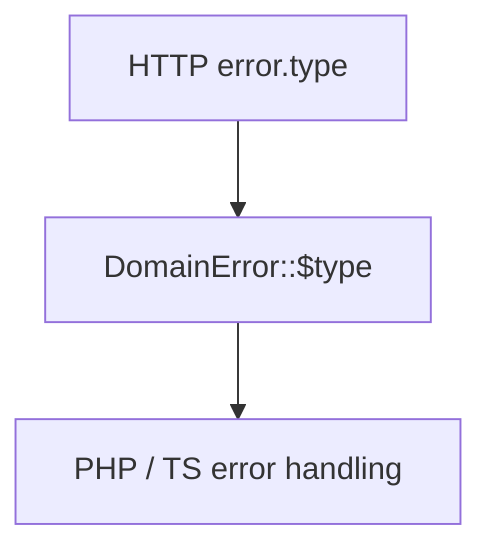

## HTTP integration test (WordPress REST API Adapter)

### 設計意図 (ゴール)

REST API 仕様と実装の整合を、WordPress 実ランタイム上で検証可能にします。

本ライブラリは WordPress REST API (`register_rest_route`) を HTTP runtime として利用するため、単なる Service 層テストではなく、WordPress の REST 実行経路を通した integration test を正式な品質基準とします。

### 設計原則

```plaintext
REST は、WordPress runtime を通して検証する
Core は、unit test
HTTP は、integration test
```

### 設計方針 (規約)

* HTTP integration test は、WordPress 実ランタイム上で実行します。
* `WP_REST_Server` を経由して endpoint を検証します。
* `register_rest_route` に登録された routing を通します。
* `permission_callback` を含めて検証します。
* OpenAPI 契約との整合を確認します。
* Controller / Adapter 単体ではなく、HTTP entrypoint 全体を対象とします。

### 責務

* WordPress REST runtime 上での endpoint 品質を保証すること。
* REST 契約との整合を確認すること。
* HTTP entrypoint の回帰を検知すること。
* Adapter 実装を検証すること。

### 非責務

* Core algorithm correctness
* external provider uptime
* performance benchmark
* load test
* browser E2E

### 推奨テスト基盤

* PHPUnit
* WordPress test suite
* `WP_UnitTestCase`
* `rest_do_request()`
* `WP_REST_Server`

### テスト実装方針

#### Route registration

以下を検証します。

* namespace
* route パス
* HTTP メソッド

たとえば

```plaintext
/s2j/v1/similarity
POST
```

#### Request test

下記を対象に、`WP_REST_Request` を生成して dispatch します。

* 正常系
* validation error
* authentication failure
* authorization failure
* rate limit
* provider error
* timeout

#### Error mapping

下記のように、エラーに対して、適切なエラーレスポンスを示すことを保証します。

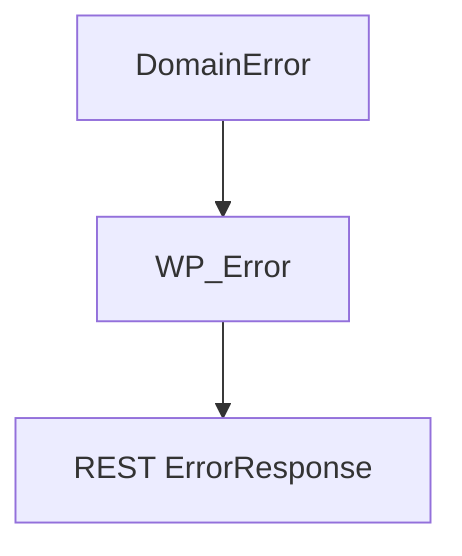

たとえば

* ValidationError → `400`
* AuthenticationError → `401`
* RateLimitError → `429`
* ProviderError → `503`

#### Response assertion

以下を検証します。

* status code
* response body
* JSON schema
* error.type
* Retry-After header (必要時)

### テストダブル方針

Embedding provider は、下記の理由により、実 API を呼ばずに、stub / fake を使用します。

* CI 安定性
* API key 不要
* deterministic test

### テスト構成

#### 実行経路

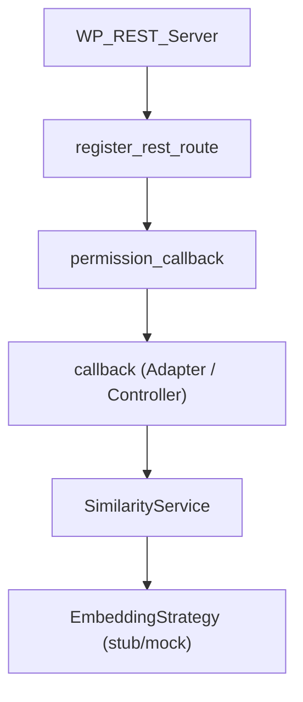

### テスト対象

#### 対象

* route registration
* HTTP method
* request validation
* permission check
* authentication
* request → DTO mapping
* Application 呼び出し
* DomainError → `WP_Error`
* response serialization
* HTTP status code

#### 非対象

* Similarity algorithm 自体 (unit test)
* Embedding provider 実 API 呼び出し
* WordPress Core 自体の動作保証
* browser UI
* JavaScript SDK

### OpenAPI 契約との整合

#### 方針

HTTP integration test の目的には、`schema/openapi.yaml` との契約整合の確認を含みます。整合確認の対象は、下記のとおりです。

* パス
* メソッド
* request スキーマ
* response スキーマ
* ErrorResponse スキーマ

## WordPress REST API Adapter の完成条件

### 設計意図 (ゴール)

WordPress REST API を HTTP runtime とする本ライブラリにおいて、REST API の成立条件、責務境界、運用上の契約を明確化し、実装完了の判定を一貫して行えるようにします。

本仕様では、下記を統合して定義します。

* OpenAPI 契約
* WordPress REST runtime
* Controller / Adapter 実装
* 認証
* 権限
* レート制御
* integration test

### 設計原則

```plaintext
REST = OpenAPI + WordPress runtime
Authentication is adapter responsibility
Rate limits are deployment policy
```

### 設計方針 (規約)

* REST API は、OpenAPI 契約 と WordPress 実 runtime の両方で成立します。
* `register_rest_route` を、唯一の HTTP routing とします。
* `callback` / `permission_callback` を、Adapter (Controller) として扱います。
* HTTP integration test は、WordPress 実 runtime (`WP_REST_Server`) を通します。
* 認証・権限は、WordPress REST API のしくみに準拠します。
* Rate limiting の enforcement 値は、インフラストラクチャ / ホスト側で決定します。
* ライブラリは、RateLimitError と `Retry-After` 表現を保証します。
* OpenAPI のパスは、論理契約として扱い、WordPress URL は、runtime endpoint として扱います。

### 非対象 (Out of Scope)

* Slim / Laravel runtime
* standalone HTTP server
* infrastructure provisioning
* Kubernetes ingress
* external auth provider implementation

### 責務

* REST API の成立条件を定義すること。
* WordPress runtime 上の品質を保証すること。
* 認証 / 権限の adapter 責務を明確化すること。
* RateLimitError 契約を保証すること。
* OpenAPI と runtime endpoint の関係を定義すること。

### 非責務

* API Gateway enforcement
* WAF
* distributed throttling
* OAuth server
* infrastructure quotas
* CDN edge rate limiting

### 現在の実装状況

以下は、実装済みとします。

* `schema/openapi.yaml`
* `register_rest_route`
* `SimilarityController`
* `EmbeddingController`
* `ErrorMapper`
* request validation
* `tests/Integration/WordPressRestAdapterIntegrationTest.php`
* `WorDBless`
* `WP_REST_Server`

統合テストの対象となる HTTP ステータスは、下記とします。

* `200` OK
* `401` Unauthorized
* `403` Forbidden
* `429` Too Many Requests
* `Retry-After`

### REST API の成立条件

REST API は、以下を満たした場合に成立とします。

1. OpenAPI schema が存在する
2. WordPress routing が実装されている
3. Controller / Adapter が実装されている
4. Error mapping が実装されている
5. request validation が実装されている
6. WordPress runtime 上の HTTP integration test が存在する

### HTTP integration test

#### 方針

* integration test は、`WP_REST_Server` を経由して実施します。
* 単なる Service unit test では、REST 成立条件を満たしません。

#### 対象

検証対象は、下記のとおりです。

* route registration
* HTTP method
* request validation
* permission callback
* controller dispatch
* error mapping
* response serialization
* status code
* headers

### 認証モデル

#### 方針

* 認証は、WordPress REST API に準拠します。
* 最小実装 (Bearer token string match) は許容するが、正式仕様としては adapter 実装責務とします。

#### 推奨モデル

たとえば

* Application Passwords
* JWT
* OAuth-compatible gateway
* custom Bearer validation

### 権限モデル

#### 方針

* 権限判定は、`permission_callback` で行います。

#### 責務

責務は、下記のとおりです。

* 認証済み確認
* capability check
* API access policy

### レート制御

#### 方針

ライブラリは、下記の表現を提供します。

* `RateLimitError`
* `Retry-After`

#### 非責務

下記の具体値は、ホスト / インフラストラクチャ側の責務とします。

* requests per minute
* burst
* quota
* distributed enforcement

#### 例

下記は、deployment policy であり、本仕様の固定値ではありません。

* 60リクエスト/分
* Retry-After: 30

### OpenAPI パスと WordPress エンドポイント

#### 契約

* OpenAPI の `/v1/similarity` は、論理 API パスを表します。
* WordPress 実エンドポイントは、`/wp-json/s2j/v1/similarity` となります。

#### 方針

* README / REST API 仕様で、この対応を明示します。

### JSON Schema validation

* integration test による実レスポンス検証は、実装済みとします。

#### 残判断

* OpenAPI レスポンスの JSON Schema 検証を CI に載せ、engineering policy として別途判断します。

## REST API (HTTP Runtime / WordPress REST Adapter)

### 設計意図 (ゴール)

OpenAPI で定義された下記の REST API 契約を、「WordPress REST API を HTTP runtime とする」実装として成立させます。

* `POST /v1/similarity`
* `POST /v1/embedding`

本ライブラリは、WordPress プラグイン / テーマへの組込みを主用途とするため、独自 HTTP サーバーを持たず、WordPress Core の REST infrastructure 上で契約を実現します。

また、下記の整合を保証し、ユーザーが迷わず利用できる状態を完成条件とします。

* OpenAPI 契約
* WordPress runtime
* integration test
* ユーザー向け導線

### 設計方針 (規約)

* OpenAPI schema を HTTP 契約の source of truth とします。
* HTTP runtime は、WordPress REST API を使用します。
* `register_rest_route()` を唯一の routing mechanism とします。
* controller は、REST Adapter として実装します。
* `permission_callback` により認証 / 権限を判定します。
* `WP_REST_Server` を通る integration test を REST 成立条件とします。
* REST エラーは、`ErrorMapper` により DomainError に対応付けます。
* OpenAPI パスは、論理契約、WordPress エンドポイントは runtime エンドポイントとします。
* [READ ME](../../README.md) (ユーザー向け導線) で runtime エンドポイントを明示します。

### 設計原則

```plaintext
REST contract is OpenAPI
HTTP runtime is WordPress
Integration means WP_REST_Server
User-facing endpoint documentation is mandatory
```

### 責務

* OpenAPI 契約を WordPress runtime 上で成立させること。
* HTTP adapter の品質を保証すること。
* runtime エンドポイントの解釈を明確化すること。
* ユーザー導線を整備すること。

### 非責務

* インフラストラクチャ provisioning
* distributed rate limiting
* external IAM
* deployment automation

### HTTP Adapter の責務

* WordPress ルーティングを登録すること。
* リクエストを解析すること。
* リクエストを検証すること。
* 認証 (authentication) すること。
* 承認 (authorization) すること。
* アプリケーションをディスパッチすること。
* DomainError をマッピングすること。
* HTTP レスポンスを生成すること。

### Domain / Core の責務

* 類似度を計算すること。
* オーケストレーションを embed すること。
* プロバイダを抽象化すること。

### REST Adapter の非責務

REST Adapter は、以下を責務としません。

* WordPress Core 自体の品質保証
* API Gateway
* WAF
* CDN
* infrastructure throttling
* external auth provider implementation

### 非対象 (Out of Scope)

* Slim / Laravel / Symfony runtime
* standalone HTTP server
* GraphQL endpoint
* WebSocket transport
* Kubernetes ingress
* infrastructure deployment

### 実装済み

下記は、実装済みとします。

#### 契約

* `schema/openapi.yaml`
* `POST /v1/similarity`
* `POST /v1/embedding`
* `ErrorResponse`

#### HTTP runtime

* `register_rest_route`
* Routes
* `SimilarityController`
* `EmbeddingController`
* request validation
* `ErrorMapper`

#### integration test

* `tests/Integration/WordPressRestAdapterIntegrationTest.php`
* WorDBless
* `WP_REST_Server`

下記 HTTP エラーは、検証済みです。

* `200` OK
* `401` Unauthorized
* `403` Forbidden
* `429` Too Many Requests
* `Retry-After`

#### URL contract

下記仕様は、実装に反映済みです。

* OpenAPI logical パス

```plaintext
/v1/similarity
/v1/embedding
```

* WordPress runtime エンドポイント

```plaintext
/wp-json/s2j/v1/similarity
/wp-json/s2j/v1/embedding
```

または

```plaintext
?rest_route=/s2j/v1/similarity
?rest_route=/s2j/v1/embedding
```

なお、integration test では、`rest_url()` により、URL 形式を検証します。

### REST API の成立条件

下記を満たした場合、REST API は成立とします。

1. OpenAPI schema が存在する
2. WordPress routing が存在する
3. controller / adapter が存在する
4. request validation が存在する
5. error mapping が存在する
6. WordPress runtime integration test が存在する

### 100% 完了条件

#### 必須

[READ ME](../../README.md) に下記を明記することにより、ユーザーがエンドポイント解釈で迷わない状態の完成とします。

* OpenAPI logical パス
* WordPress runtime エンドポイント
* 組込み手順
* REST 利用例

#### 任意

「CI に OpenAPI レスポンス JSON Schema 検証を載せる」は、任意の quality enhancement とし、これは engineering policy として別途確定します。
