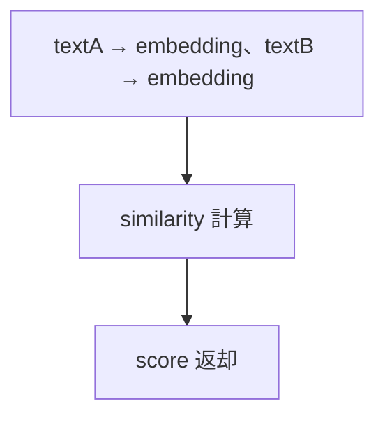
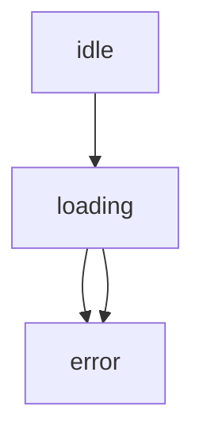
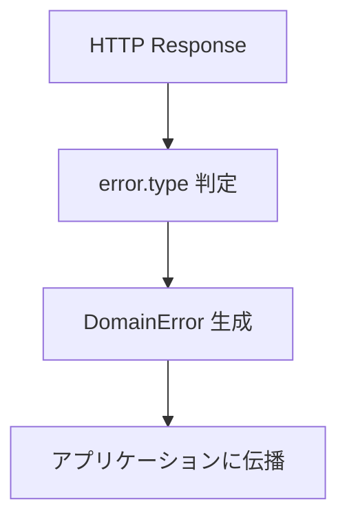
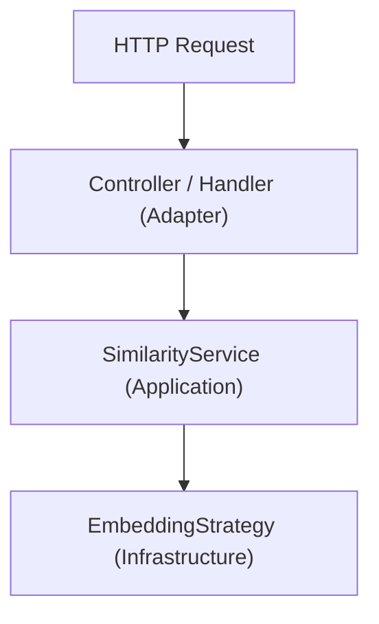
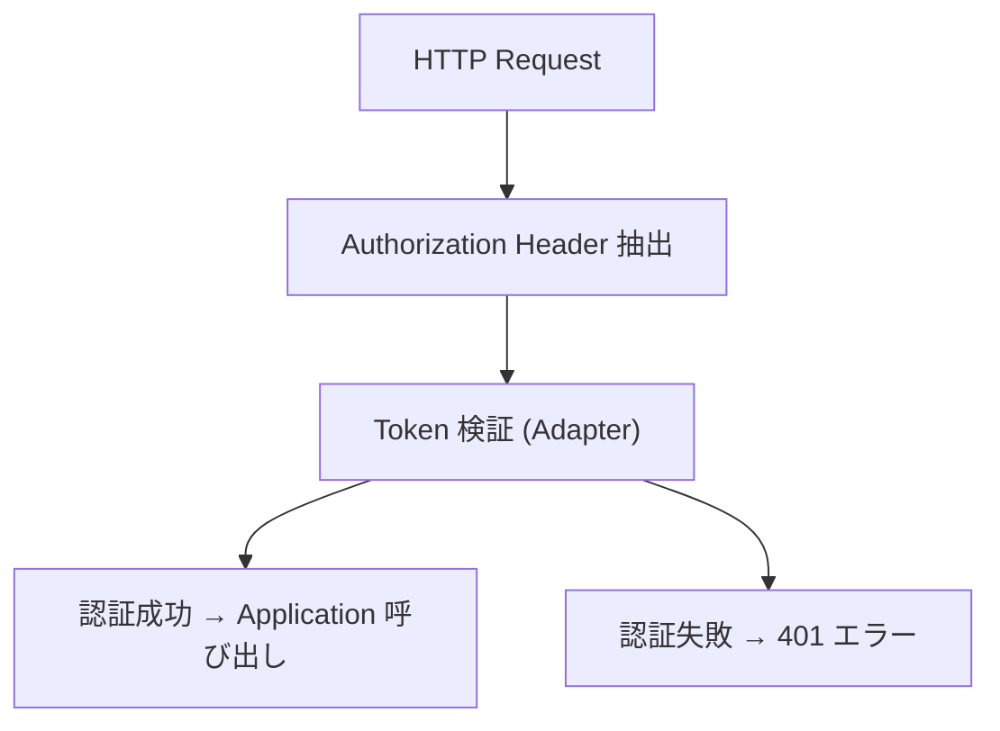
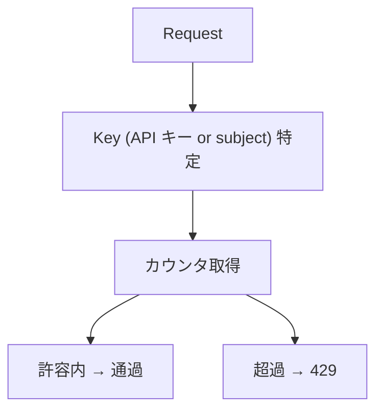

<!--
目的：「REST API エンドポイント、リクエスト/レスポンス、権限、セキュリティ、nonce」の明文化
-->

# S2J Similarity Service - REST API 仕様

本ドキュメントは、類似度の算出機能を外部から利用するための **REST API インターフェース仕様** を定義します。
本仕様は、Contracts 層のデータ契約に準拠します。

## 概要

本 API は、以下を提供します。

* テキストから Embedding を生成する API
* 2つのテキストの類似度を算出する API

* Contracts 層の DTO を変更した場合、本 API も追従します。
* 将来的に OpenAPI で定義できます。
* フロントエンドは型生成を前提とします。

## Contracts との関係

本 API は、Contracts 層の DTO を直接公開しません。

内部で、以下のように変換します。

* text → Embedding → vector
* vector → Similarity

したがって、本 API は、Application 層のユースケース API として定義されます。

## 契約レイヤとの関係

本 API は、Contracts 層の DTO (vector ベース) を直接公開しません。

代わりに、以下の変換を内部で行います。

* text → Embedding → vector
* vector → Similarity 計算

したがって、本 API は、「Application 層のユースケース API」として位置付けられます。

## 設計意図、設計方針、非対象

### 設計意図 (ゴール)

フロントエンドや外部システムから、**統一されたインターフェースで、類似度機能を利用可能にします**。

### 設計方針 (規約)

* Contracts の DTO を、そのまま API 契約とします。
* レスポンス形式を統一します。
* 認証・認可を、明示的に扱います。
* エラーは、機械可読な形式で返します。

本 API は、Contracts 層の DTO を直接公開しません。

代わりに、下記の「変換」を内部で行います。

* text → Embedding → vector
* vector → Similarity

したがって、本 API は、Application 層のユースケース API として定義されます。

### 非対象 (Out of Scope)

* UI 実装
* セッション管理
* プロバイダ固有の API 露出

## エンドポイント一覧

| メソッド | パス | 説明 |
| ---- | -------------- | ------------ |
| POST | `/v1/embedding`  | Embedding 生成 |
| POST | `/v1/similarity` | 類似度算出 |

## 共通仕様

### 1. リクエストヘッダー

```plaintext id="headers"
Content-Type: application/json
Authorization: Bearer {token}
```

### 2. リクエストのレスポンス形式 - 成功

成功時の JSON ボディは、常に次のトップレベル構造です (`meta` は空オブジェクト `{}` も許容します)。

```json id="success_format"
{
  "data": {},
  "meta": {}
}
```

* `data`: エンドポイント固有の結果 (下記 `/v1/embedding`、`/v1/similarity` の例を参照)。
* `meta`: 実装が付与する任意のメタデータ (例: 相関 ID、処理時間)。将来の拡張用にキーを追加しても後方互換となります。

**契約上の参照**: `schema/openapi.yaml` の `SimilarityResponse`、`EmbeddingResponse` は、このエンベロープを Single Source として表現します。

### 3. リクエストのレスポンス形式 - エラー

```json id="error_format"
{
  "error": {
    "type": "string",
    "message": "string",
    "details": {}
  }
}
```

### 4. HTTP ステータスコード

| コード | 意味 |
| --- | ---------- |
| `200` | 成功 |
| `400` | バリデーションエラー |
| `401` | 未認証 |
| `403` | 権限不足 |
| `429` | レート制限 |
| `500` | サーバーエラー |

## 命名整合性

### 設計方針 (規約)

* REST と SDK の命名は、一致させます。

```plaintext
POST /v1/similarity
service->similarity()
```

## API バージョニング戦略

### 設計意図 (ゴール)

API の互換性を維持しつつ、破壊的変更を安全に導入できるようにします。

### 設計方針 (規約)

* URI パスに、バージョンを含めます。
* メジャーバージョンのみを URL に含めます。
* 後方互換性を重視します。

### 責務

* API バージョンを定義すること。
* 互換性ポリシーを明確化すること。

### 非責務

* SDK のバージョン管理
* 内部コードのバージョン

### エンドポイント形式

```plaintext id="api_version_path"
/v1/similarity
/v1/embedding
```

### バージョンルール

| 種別 | 変更内容 | URL 変更 |
|------|----------|---------|
| PATCH | バグ修正 | なし |
| MINOR | 後方互換あり機能追加 | なし |
| MAJOR | 破壊的変更 | 必須 |

### 互換性ポリシー

* 同一メジャーバージョン内では、後方互換を維持します。
* 既存フィールドの削除は、禁止します。
* 新規フィールド追加は、optional とします。

### 廃止 (Deprecation)

* 旧バージョンは、一定期間、併存させます。
* deprecation notice をレスポンスヘッダーで通知します。

### ヘッダー (任意)

```plaintext id="api_header"
X-API-Version: 1
```

## `/v1/embedding`

### 概要

テキストから Embedding を生成します。

### リクエスト

```json id="embed_req"
{
  "text": "string",
  "model": "string"
}
```

#### バリデーション

* text: 必須、空文字は不可です。
* model: 任意です。

### リクエストのレスポンス

共通の成功エンベロープ (`data` / `meta`) に従います。

```json id="embed_res"
{
  "data": {
    "vector": [number],
    "dimension": number
  },
  "meta": {}
}
```

## `/v1/similarity`

### 概要

2つのテキストの類似度を算出します。

### リクエスト

```json id="sim_req"
{
  "textA": "string",
  "textB": "string",
  "model": "string"
}
```

#### バリデーション

* textA: 必須、空文字は不可です。
* textB: 必須、空文字は不可です。
* model: 任意です。

### リクエストのレスポンス

共通の成功エンベロープ (`data`、`meta`) に従います。

```json id="sim_res"
{
  "data": {
    "similarityScore": number
  },
  "meta": {}
}
```

### 処理内容 - 内部



## 認証・認可

### 設計意図 (ゴール)

最小権限の原則にもとづき、安全なアクセス制御を行います。

### 設計方針 (規約)

* Bearer Token を使用します。
* エンドポイントごとに、権限チェックを実施します。

### 認可例

| エンドポイント | 権限 |
| ----------- | ---- |
| `/embedding`  | read |
| `/similarity` | read |

## Runtime Validation

### 設計意図 (ゴール)

不正入力を早期に排除します。

### 設計方針 (規約)

* リクエスト受信時に、スキーマを検証します。
* Contracts の定義と一致させます。

## 類似度スコアの意味

レスポンスの `data.similarityScore` は、以下を満たします。

* 範囲: 0.0〜1.0
* 意味: 意味的な類似度 (1に近いほど、類似)

アルゴリズムの詳細は、[類似度算出の仕様](../core/similarity_spec.md) をご覧ください。

## エラーハンドリング

### 設計意図 (ゴール)

クライアントでの処理を、容易にします。

### 設計方針 (規約)

* エラー構造を統一します。
* type により、分岐可能にします。

## レート制限

### 設計意図 (ゴール)

API を安定的に運用します。

### 設計方針 (規約)

* エンドポイント単位で、制限します。
* `429` を返却します。

## フロントエンド状態遷移

### 設計意図 (ゴール)

UI 側での一貫した挙動を保証します。

### 状態遷移の契約

クライアントは、下図の状態遷移を前提とします。



エラー種別により、UI の挙動を分岐します。

* ValidationError: 入力修正
* ProviderError: リトライ可能

### リトライ

* network / timeout のみ、自動リトライします。
* validation エラーは、リトライ不可とします。

## エラー仕様 (REST ↔ DomainError 対応)

### 設計意図 (ゴール)

REST API と PHP SDK のエラー表現を統一し、コール側が一貫した方法でエラー処理できるようにします。

### 設計方針 (規約)

* REST のエラーレスポンスは、共通フォーマットを使用します。
* `error.type` を唯一の分類キーとします。
* PHP 側では、`DomainError` 派生クラスにマッピングします。
* エラー分類は、安定した値 (enum 的) とし、文字列の揺れを許しません。
* HTTP ステータスコードと `error.type` は、対応関係を持ちます。

### 非対象 (Out of Scope)

* `i18n` (多言語エラーメッセージ)
* UI 表示フォーマット
* エラー文言のローカライズ

### 責務

* REST と SDK のエラー表現を、統一すること。
* エラー分類の安定性を、保証すること。
* コール側の分岐処理を、容易にすること。

### 非責務

* エラーの表示方法
* ログ収集・可視化
* 再試行戦略 (リトライポリシーは、別仕様)

### REST エラーフォーマット

```json id="error_format"
{
  "error": {
    "type": "validation_error",
    "message": "Invalid input",
    "details": {
      "field": "text"
    }
  }
}
```

### エラー対応表 (REST → PHP)

| HTTP | error.type | PHP クラス | 説明 |
|------|------------------|------------------------|------|
| 400 | validation_error | ValidationError | 入力不正 |
| 401 | auth_error | AuthenticationError | 認証失敗 |
| 403 | permission_error | AuthorizationError | 権限不足 |
| 404 | not_found | NotFoundError | リソースなし |
| 408 | timeout | TimeoutError | タイムアウト |
| 429 | rate_limit | RateLimitError | レート制限 |
| 500 | internal_error | InternalError | サーバー内部 |
| 502/503 | provider_error | ProviderError | 外部 API 障害 |
| - | network_error | NetworkError | 通信エラー |

### マッピングルール

* REST レスポンス受信時
  * `error.type` をもとに DomainError を生成します。
* SDK 内部例外
  * DomainError を REST 形式に変換可能とします。
* `details` は、構造化データとして保持します。

### PHP 側設計

```php id="error_php"
abstract class DomainError extends \Exception {}

class ValidationError extends DomainError {}
class AuthenticationError extends DomainError {}
class AuthorizationError extends DomainError {}
class NotFoundError extends DomainError {}
class TimeoutError extends DomainError {}
class RateLimitError extends DomainError {}
class ProviderError extends DomainError {}
class NetworkError extends DomainError {}
class InternalError extends DomainError {}
```

### エラー変換フロー



### details の扱い

* 任意の構造を許可します (JSON オブジェクト)。
* フィールドエラーなどを含めます。

例:

```json id="error_details"
{
  "field": "text",
  "reason": "empty"
}
```

## 提供形態 (ランタイム / フレームワーク)

### 設計意図 (ゴール)

本サービスの REST API を、特定の実行環境に依存せずに提供可能とし、多様なホスティング環境で再利用できる構成とします。

### 設計原則

```plaintext id="rest_principle"
Coreは、環境を知らない
RESTは、薄く保つ
Adapterで世界を繋ぐ
```

### 設計方針 (規約)

* REST API は、「参照実装 (Reference Implementation)」として定義します。
* 特定のフレームワーク (Laravel / Express 等) には、依存しません。
* コアロジック (SimilarityService) は、フレームワーク非依存とします。
* 各ランタイムへの統合は、Adapter 層で行います。
* HTTP 層は、薄いラッパーとして実装します。

### 非対象 (Out of Scope)

* 特定フレームワークの実装詳細
* デプロイ手順の詳細 (IaC / CI/CD)
* インフラ構成 (VPC / LB 等)

### 責務

* REST API の論理仕様を定義すること。
* フレームワーク非依存な構造を保証すること。
* Adapter による統合ポイントを明確化すること。

### Adapter の責務

* HTTP → DTO に変換すること。
* DTO → Service コールすること。
* エラー変換 (DomainError → REST) すること。

### 非責務

* 実行環境の選定
* フレームワークの導入
* デプロイ / 運用設計

### アーキテクチャー



### デプロイ形態

```plaintext id="rest_deploy"
* コンテナ (Docker)
* サーバレス (Lambda / Workers)
* 従来サーバ (Apache / Nginx + PHP)
```

### 提供形態

#### 1. コア (必須)

* PHP Composer ライブラリとして提供します。
* フレームワーク非依存とします。

```plaintext id="rest_core"
SimilarityService (Application)
EmbeddingStrategy (Infrastructure)
```

#### 2. REST API (参照実装)

* 軽量な HTTP ハンドラとして提供します。
* 任意の環境に組込み可能とします。

##### 例

```plaintext id="rest_examples"
* PHP: Slim / Laravel / Symfony
* Node: Express / Fastify
* Edge: Cloudflare Workers
```

#### 3. 推奨ランタイム (参考)

| 種別 | 推奨 |
|------|------|
| PHP | Laravel / Slim |
| Node | Fastify |
| Edge | CloudFlare Workers |

※ あくまで参考であり、依存関係は持ちません。

### フレームワーク依存の扱い

#### 方針

* フレームワーク固有コードは、分離します。
* ライブラリ本体には含めません。

#### 例

```plaintext id="rest_adapter"
adapters/
  laravel/
  express/
  workers/
```

## 認証・認可 (Bearer Token)

### 設計意図 (ゴール)

REST API に対するアクセスを安全に制御しつつ、ホスト環境に依存しない柔軟な認証モデルを提供します。

### 設計原則

```plaintext id="auth_principle"
認証は、入口で止める
Coreに持ち込まない
権限は、軽く、拡張可能に
```

### 設計方針 (規約)

* 認証は、Bearer Token を使用します。
* 認証処理は、Adapter 層で実施します (Core / Application には持ち込まない)。
* トークン検証ロジックは、差し替え可能とします。
* 認可 (権限) は、シンプルなスコープベースとします。
* SDK / Core は、認証状態を保持しません。

### 非対象 (Out of Scope)

* ユーザー管理 (DB / IAM)
* OAuth フロー実装
* トークン発行
* セッション管理

### 責務

* 認証方式を統一すること。
* 検証ポイントを明確化すること。
* 認可モデルを最小定義すること。

### Adapter の責務

* Authorization ヘッダーを抽出すること。
* トークンを検証すること。
* AuthContext を生成すること。
* 権限をチェックすること。

### 非責務

* 認証基盤の提供
* トークンのライフサイクル管理
* 認証サーバーの構築

### 認証方式

#### ヘッダー

```http id="auth_header"
Authorization: Bearer <token>
```

#### 検証フロー



### トークン検証方式

#### 対応モデル (いずれか)

1. 固定トークン (シンプル運用)
2. JWT (署名検証)
3. 外部認証サーバー (OAuth / API Gateway)

#### 抽象インターフェース (概念)

```php id="auth_interface"
interface AuthenticatorInterface
{
    public function authenticate(string $token): AuthContext;
}
```

### 認可 (Authorization)

#### 方針

* スコープベース制御を採用します。
* エンドポイントごとに必要スコープを定義します。

#### 例

```plaintext id="auth_scope"
similarity:read
embedding:write
admin:*
```

#### 判定

```plaintext id="auth_check"
if (!in_array(required_scope, context.scopes)) {
  throw AuthorizationError
}
```

### エラー仕様

| 状態 | HTTP | error.type |
|------|------|-----------|
| 未認証 | 401 | auth_error |
| 権限不足 | 403 | permission_error |

### AuthContext

```php id="auth_context"
class AuthContext
{
    public string $subject;   // ユーザー or サービス
    public array $scopes;    // 権限
}
```

### Core / Application の扱い

#### ルール

* 認証ロジックは、含めません。
* AuthContext は、必要に応じて引数として受け取ります。

## レート制限 (Rate Limiting)

### 設計意図 (ゴール)

サービスの安定性と公平性を確保しつつ、クライアントに対して予測可能なスロットリング挙動を提供します。

### 設計原則

```plaintext id="rate_principle"
制限は、明確に
挙動は、予測可能に
通知は、必ず返す
```

### 設計方針 (規約)

* レート制限は、Adapter 層で実施します。
* 単位は、「時間あたりリクエスト数」とします (requests per window)。
* 制限は、API キー (または subject) 単位で適用します。
* 超過時は、`HTTP 429` を返却します。
* `Retry-After` を必ず返却します。
* 制限値は、環境ごとに設定可能とします。

### 非対象 (Out of Scope)

* 分散キャッシュ実装 (Redis 等)
* インフラレベルのレート制御 (CDN / WAF)
* 課金との連動

### 責務

* レート制限の、単位と値を定義すること。
* クライアントへの通知形式を統一すること。
* Adapter 実装の指針を提供すること。

### Adapter の責務

* リクエスト数をカウントすること。
* 制限を判定すること。
* レスポンス (429 / headers) を生成すること。

### 非責務

* 実際のストレージ (Redis / Memory) 実装
* スケーリング戦略
* SLA 管理

### 制限モデル

#### 基本単位

```plaintext id="rate_unit"
requests / minute
```

#### デフォルト値 (推奨)

| プラン | 上限 |
|--------|------|
| default | 1request/sec |
| high | 5request/sec |
| burst | 10request/sec (短時間バースト) |

#### 補足

* 上限は、ホスト環境で調整可能です。
* 将来的にテナント別設定に拡張可能です。

### 判定方式

#### 推奨アルゴリズム

下記のいずれか。

* Token Bucket
* Sliding Window

#### 判定フロー



### レスポンス仕様

#### HTTP ステータス

```plaintext id="rate_status"
429 Too Many Requests
```

#### ヘッダー

```http id="rate_headers"
Retry-After: 30
X-RateLimit-Limit: 60
X-RateLimit-Remaining: 0
X-RateLimit-Reset: 1710000000
```

#### ボディ

```json id="rate_body"
{
  "error": {
    "type": "rate_limit",
    "message": "Rate limit exceeded",
    "details": {
      "limit": 60,
      "remaining": 0
    }
  }
}
```

### Retry-After の定義

* 単位: 秒 (integer)
* 次のリクエストが許可されるまでの待機時間

### 適用単位

下記のいずれか。

* API キー単位 (推奨)
* AuthContext.subject

### Core / Application の扱い

#### ルール

* レート制限は、関知しません。
* エラーは、DomainError (RateLimitError) として伝播可能とします。

### 拡張 (将来)

```plaintext id="rate_future"
* エンドポイント別制限
* テナント別制限
* 動的スロットリング
```
