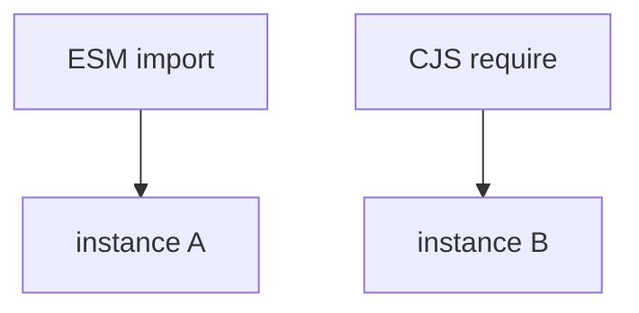
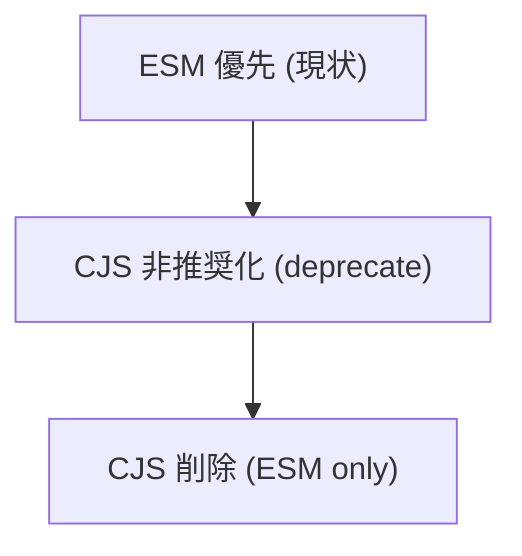
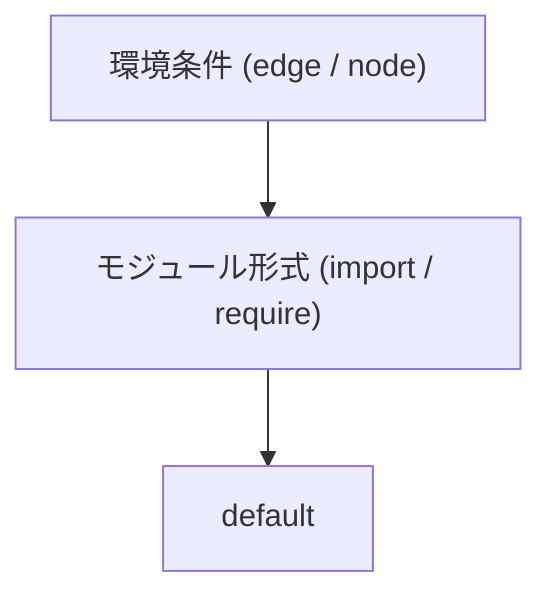
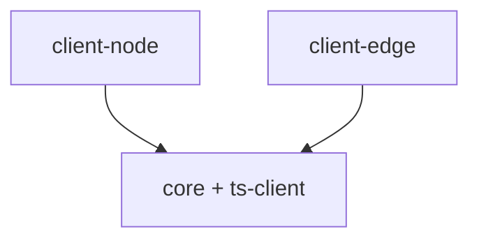

<!-- 
 node/edge/browser
 -->

# S2J Similarity Service - Runtime 仕様

## 概要

本仕様は、Node / Edge / Browser 各環境における runtime 対応とビルド戦略を定義します。

## 設計意図、設計方針、非対象

### 設計意図 (ゴール)

* 環境差異を吸収します。
* 最適な実行環境を提供します。
* runtime 依存のバグを排除します。

### 設計方針 (規約)

* runtime はパッケージ単位で分離します。
* 自動検出は行いません。
* conditional exports を使用します。

### 責務

* runtime (node / edge / browser) 差異を定義すること。
* build の出し分け戦略を定義すること。
* package exports を設計すること。

### 非責務

* API クライアント設計
* business logic
* CI/CD

### 非対象 (Out of Scope)

* runtime 判定ロジック
* UI 実装
* ビジネスロジック

### 対応環境

* node
* edge
* browser

### package 構成

```
client-node
client-edge
client-browser
```

### CDN

* `esm.sh`
* unpkg

## package exports 戦略 (ESM、CJS 対応)

本プロジェクトでは、異なる実行環境 (Node.js、Browser) に対応するため、ESM と CJS の両形式を提供します。

### 設計意図 (ゴール)

* Node.js とブラウザの互換性を確保します。
* ユーザーの、環境差異を吸収します。
* 将来的な ESM 移行に対応します。

### 設計方針 (規約)

* ESM を第一優先とします。
* CJS は、互換性のために提供します。
* exports フィールドで、明示的に定義します。

### 責務

* 実行環境の互換性を提供すること。
* 安定した API を公開すること。

### 非責務

* ランタイム・ポリフィル
* レガシー環境対応 (Internet Explorer など)

### 条件分岐

| 環境 | 使用形式 |
| ---------- | ------- |
| Node (ESM) | import |
| Node (CJS) | require |
| Browser | import |

### 互換性

* Node v14+
* bundler (Vite、webpack、Rollup) 対応

### 注意点

* deep import をしないでください。
* exports に定義されたパスのみ、公開してください。

### サブパスのエクスポート (任意)

```json id="pkg_subpath"
{
  "exports": {
    "./core": {
      "import": "./dist/core.es.js",
      "require": "./dist/core.cjs.js"
    }
  }
}
```

### `package.json` 設定

```json id="pkg_exports_full"
{
  "type": "module",
  "main": "./dist/index.cjs.js",
  "module": "./dist/index.es.js",
  "types": "./dist/index.d.ts",
  "exports": {
    ".": {
      "import": "./dist/index.es.js",
      "require": "./dist/index.cjs.js",
      "types": "./dist/index.d.ts"
    }
  }
}
```

## dual package hazard 回避設計

本プロジェクトでは、ESM と CJS の両形式を提供する際に発生する「dual package hazard (モジュールの二重読み込み問題)」を回避します。

### 設計意図 (ゴール)

* 同一モジュールが、ESM と CJS で別インスタンスとして読み込まれる事態を防ぎます。
* 状態不整合 (singleton 崩壊) を防止します。
* 利用環境差による、バグを排除します。

### 設計方針 (規約)

* 単一の内部実装に、統一します。
* exports により、entry を制御します。
* 「状態」を持つモジュールを避けます (原則 stateless)。

### 責務

* モジュールの一貫性を保証すること。
* 実行時バグを防止すること。

### 非責務

* bundler 依存の解決
* Node の仕様変更に対応

### 問題例

下図の場合、同一モジュールが2つ存在してしまいます。



### NG パターン

* 状態を持つキャッシュ
* static singleton
* グローバル変数

### 推奨パターン

* pure function
* factory function
* DI によるインスタンス管理

### 回避戦略

#### 1. 内部実装を単一にする

```plaintext id="dual_strategy1"
src/ (単一ソース)
 ↓
dist/index.es.js
dist/index.cjs.js
```

#### 2. exports で統制

```json id="dual_exports"
{
  "exports": {
    ".": {
      "import": "./dist/index.es.js",
      "require": "./dist/index.cjs.js"
    }
  }
}
```

#### 3. singleton を持たない設計

* グローバル状態を持たない
* DI (Dependency Injection) を使用

## NodeNext、bundler 解像度問題

Node.js (NodeNext) と bundler (Vite、webpack) では、モジュール解決方式が異なるため、互換性を確保します。

### 設計意図 (ゴール)

* Node.js と bundler 間の解像度差異を吸収します。
* import エラーを防止します。
* 型解決と実行解決を一致させます。

### 設計方針 (規約)

* exports フィールドを、唯一の公開インターフェースとします。
* 拡張子を明示します。
* TypeScript の moduleResolution を NodeNext に統一します。

### 責務

* モジュール解決の一貫性を確保すること。
* 環境差異を吸収すること。

### 非責務

* 古い Node バージョンの対応
* 特定 bundler の最適化

### 解像度の違い

| 環境 | 解決方法 |
| -------- | ---------- |
| NodeNext | exports 優先 |
| bundler | 拡張子補完あり |

### 推奨ルール

* 相対パスには、拡張子を付与します。
* deep import を禁止します。
* exports に定義されたパスのみ、使用します。

### bundler 対応

* Vite、Rollup は、exports を解釈します。
* webpack は、設定に依存します。

### 問題例

```ts id="resolve_problem"
// NG (NodeNext で失敗)
import { foo } from "./utils";
```

### 正しい記述

```ts id="resolve_ok"
import { foo } from "./utils.js";
```

### TypeScript 設定

```json id="ts_nodenext"
{
  "compilerOptions": {
    "module": "NodeNext",
    "moduleResolution": "NodeNext"
  }
}
```

### exports による統制

```json id="resolve_exports"
{
  "exports": {
    "./utils": {
      "import": "./dist/utils.js"
    }
  }
}
```

## ESM only 化戦略

本プロジェクトでは、将来的に ESM (ECMAScript Modules) のみを提供する構成に移行します。

### 設計意図 (ゴール)

* モジュール解決を、簡素化します。
* dual package hazard を完全排除します。
* edge runtime との完全互換を目指します。

### 設計方針 (規約)

* ESM を標準とします。
* CJS は、段階的に廃止します。
* exports フィールドで制御します。

### 責務

* モジュール戦略を統一すること。
* 将来の保守性を向上すること。

### 非責務

* 旧環境のサポート
* 自動移行ツールの提供

### 現状

* ESM + CJS のデュアル構成です。

### 移行ステップ



### 変更点

| 項目 | 内容 |
| ------- | ---- |
| require | 使用不可 |
| import | 必須 |
| 拡張子 | 明示 |

### ユーザーへの影響

* Node.js は、v16+ 推奨
* bundler は、対応済み

### 非推奨対応

```plaintext id="esm_warn"
CJS ユーザーには、deprecation warning を表示
```

### 利点

* 設計を単純化できること。
* ビルドを軽量化できること。
* エッジ互換性を向上できること。

### 注意点

* 古い環境との互換性が低下します。
* 移行期間の確保が必要です。

### `package.json`

```json id="esm_pkg"
{
  "type": "module",
  "exports": {
    ".": {
      "import": "./dist/index.js"
    }
  }
}
```

## runtime 別 build 出し分け (edge、node)

本プロジェクトでは、実行環境 (Edge、Node.js) ごとに最適化された、ビルド成果物を出し分けます。

### 設計意図 (ゴール)

* 実行環境ごとの制約差 (API、バンドルサイズ) を吸収します。
* パフォーマンスの最適化 (Edge は軽量。Node は機能重視) を目指します。
* 互換性の維持と将来の拡張性を確保します。

### 設計方針 (規約)

* 単一ソース (src) から複数ターゲットにビルドします。
* 環境差は、entry ポイントで吸収します。
* 実行時分岐ではなく、**ビルド時分岐** を優先します。

### 責務

* 環境ごとの最適ビルドを提供すること。
* 実行時の互換性を担保すること。

### 非責務

* 実行時の環境判定
* polyfill の提供

### ターゲット

| ターゲット | 想定環境 | 特徴 |
| ----- | -------------------------------- | ---------- |
| edge | CloudFlare Workers / Vercel Edge | 軽量・標準 API のみ |
| node | Node.js | フル機能・互換性重視 |

### 実装指針

* `edge.ts`: fetch、Web 標準 API のみ使用します。
* `node.ts`: 必要に応じて、Node API を使用します。
* 共通ロジックは、`index.ts` に集約します。

### 注意点

* Node 専用依存は、edge に含めないでください (external)。
* 環境判定コード (`process.env` など) は、極力排除してください。

### entry 構成

```plaintext id="runtime_entry"
src/
  index.ts        ← 共通
  runtime/
    edge.ts       ← Edge 用
    node.ts       ← Node 用
```

### 出力構成

```plaintext id="runtime_dist"
dist/
  edge.js
  node.es.js
  node.cjs.js
```

### Vite 設定例

```ts id="runtime_vite"
import { defineConfig } from "vite";

export default defineConfig([
  {
    build: {
      lib: {
        entry: "src/runtime/edge.ts",
        formats: ["es"],
        fileName: "edge"
      },
      target: "es2022"
    }
  },
  {
    build: {
      lib: {
        entry: "src/runtime/node.ts",
        formats: ["es", "cjs"],
        fileName: "node"
      },
      target: "node18"
    }
  }
]);
```

## conditional exports の高度設計

本プロジェクトでは、Node.js の conditional exports を利用して、環境ごとに適切な entry ポイントを提供します。

### 設計意図 (ゴール)

* 実行環境に応じた、最適コードを自動選択します。
* 不要なバンドルを回避します。
* API 公開面を明確化します。

### 設計方針 (規約)

* exports を、唯一の公開インターフェースとします。
* 環境ごとに、明示的に entry を分離します。
* deep import を禁止します。

### 責務

* 環境別 entry を提供すること。
* API 公開面を統制すること。

### 非責務

* 実行環境の検出
* bundler 設定の補助

### 注意点

* 条件は、最小限にしてください (複雑化の防止)。
* bundler が、edge 条件を理解しない場合があります。
* default は、必ず定義してください。

### 推奨ルール

* すべての公開 API は、exports を経由すること。
* 内部ファイルの直接参照は、禁止します。
* バージョン変更時に exports を見直すこと。

### 基本構成

```json id="exports_basic"
{
  "exports": {
    ".": {
      "edge": "./dist/edge.js",
      "node": {
        "import": "./dist/node.es.js",
        "require": "./dist/node.cjs.js"
      },
      "default": "./dist/node.es.js"
    }
  }
}
```

### 条件一覧

| 条件 | 説明 |
| ------- | ------------ |
| import | ESM |
| require | CJS |
| node | Node.js |
| edge | Edge runtime |
| default | フォールバック |

### 解決の優先順位



### サブパス設計

```json id="exports_subpath"
{
  "exports": {
    "./core": {
      "import": "./dist/core.es.js"
    },
    "./client": {
      "import": "./dist/node.es.js"
    }
  }
}
```

### 利用例

```ts id="exports_usage"
// Edge 環境
import { createClient } from "@s2j/similarity-client";

// Node 環境 (自動的に node 版)
import { createClient } from "@s2j/similarity-client";
```

## edge、node の完全分離 (package 分割)

本プロジェクトでは、実行環境ごとの最適化をさらに強化するため、Edge 用と Node.js 用のパッケージを完全に分離する構成を採用します。

### 設計意図 (ゴール)

* 環境ごとの依存関係を完全に分離します。
* バンドルサイズの最小化を目指します。
* 実行時の不整合 (環境依存コード) を排除します。

### 設計方針 (規約)

* パッケージ単位で runtime を分離します。
* 共通ロジックは、core に集約します。
* 各 runtime は、独立して配布可能とします。

### 責務

* runtime ごとに完全分離すること。
* 依存関係を明確化すること。

### 非責務

* 単一パッケージの簡便性
* 自動 runtime 選択

### パッケージ構成

```plaintext id="pkg_runtime_split"
packages/
  core/           ← 共通ロジック
  client-node/    ← Node.js 用
  client-edge/    ← Edge 用
  ts-client/      ← Contracts
```

### 依存関係

下図の、`core`、`ts-client` は、それぞれ独立したものです。



### 特徴

| パッケージ | 特徴 |
| ----------- | ------------------ |
| client-node | Node API 使用可 |
| client-edge | fetch / Web 標準 API のみ |

### conditional exports との関係

* 単一パッケージ方式の代替
* 明示的な依存選択が可能

### 利点

* 環境依存バグを排除できること。
* 明確な責務を分離できること。
* バンドルを最適化できること。

### 注意点

* パッケージ数が増加します。
* バージョン整合性の管理が必要です。

### 推奨ケース

* エッジ最適化が重要な場合
* Node 依存が強い場合

### 利用例

```ts id="runtime_import_node"
import { createClient } from "@s2j/similarity-client-node";
```

```ts id="runtime_import_edge"
import { createClient } from "@s2j/similarity-client-edge";
```

## browser 専用 build

本プロジェクトでは、ブラウザ環境向けに最適化されたビルドを提供します。

### 設計意図 (ゴール)

* フロントエンドでの利用を最適化します。
* バンドルサイズを削減します。
* Node 依存を排除します。

### 設計方針 (規約)

* browser 専用 entry を提供します。
* Node 依存コードを含めません。
* Tree-shaking を最大限活用します。

### 責務

* ブラウザ環境に対応すること。
* 軽量ビルドを提供すること。

### 非責務

* Node 互換性
* サーバーサイド処理

### 制約

* `fs`、`path` などは使用できません。
* `require` には非対応です。
* 環境変数への依存を排除します。

### 最適化ポイント

* `sideEffects: false`
* 小さな依存のみ採用します。
* 動的 import を最小化します。

### 利点

* バンドルが軽量であること。
* フロントエンド適合であること。
* ロードが高速であること。

### 注意点

* SSR との互換性を考慮してください。
* bundler 依存を解決してください。

### entry 構成

```plaintext id="browser_entry"
src/
  runtime/
    browser.ts
```

### `package.json`

```json id="browser_pkg"
{
  "exports": {
    ".": {
      "browser": "./dist/browser.js",
      "import": "./dist/node.es.js"
    }
  }
}
```

### Vite 設定例

```ts id="browser_vite"
export default {
  build: {
    lib: {
      entry: "src/runtime/browser.ts",
      formats: ["es"],
      fileName: "browser"
    },
    target: "es2020"
  }
};
```

### 出力

```plaintext id="browser_dist"
dist/
  browser.js
```

### 利用例

(bundler が、browser フィールドを解決)

```ts id="browser_use"
import { createClient } from "@s2j/similarity-client";
```

## runtime の自動的な検出戦略

本プロジェクトでは、ユーザーの負担を軽減するため、実行環境 (Node、Edge、Browser) を自動検出し、適切な実装を選択するしくみを提供します。

### 設計意図 (ゴール)

* ユーザーが、runtime を意識せずに、使用できます。
* 設定ミスによるバグを防止します。
* DX (開発体験) を向上します。

### 設計方針 (規約)

* 実行環境は、ランタイムで検出します。
* 検出ロジックは。最小限にします。
* 明示指定 (override) を可能にします。

### 責務

* runtime を簡易判定すること。
* 初期選択を自動化すること。

### 非責務

* 完全な環境識別
* build 時最適化 (conditional exports に委譲)

### 検出対象

| runtime | 判定方法 |
| ------- | -------------------------------------- |
| Node.js | `typeof process !== "undefined"` |
| Edge | `typeof WebSocketPair !== "undefined"` |
| Browser | `typeof window !== "undefined"` |

### 推奨

* production では、明示指定すること。
* 開発時のみ、自動検出すること。

### 注意点

* bundler による静的解析と、競合する可能性があります。
* 環境判定は、完全ではありません。

### 実装例

```ts id="runtime_detect"
export function detectRuntime(): "node" | "edge" | "browser" {
  if (typeof WebSocketPair !== "undefined") {
    return "edge";
  }

  if (typeof window !== "undefined") {
    return "browser";
  }

  if (typeof process !== "undefined") {
    return "node";
  }

  return "node";
}
```

### ファクトリ統合

```ts id="runtime_factory"
export function createClientAuto(config: Config) {
  const runtime = detectRuntime();

  switch (runtime) {
    case "edge":
      return createEdgeClient(config);
    case "browser":
      return createBrowserClient(config);
    default:
      return createNodeClient(config);
  }
}
```

### override

```ts id="runtime_override"
createClientAuto({
  runtime: "edge"
});
```

## edge runtime (CloudFlare Workers 対応)

本プロジェクトでは、エッジ環境 (CloudFlare Workers など) での実行を考慮して設計します。

### 設計意図 (ゴール)

* 低レイテンシでの API コールを目指します。
* サーバーレス環境への対応を目指します。
* 将来的なエッジ分散処理への拡張を目指します。

### 設計方針 (規約)

* Node.js 固有 API に依存しません。
* fetch ベースの実装を採用します。
* 軽量でバンドル可能な構成とします。

### 責務

* エッジ環境での動作を保証すること。
* 軽量実行を実現すること。

### 非責務

* Node.js 専用最適化
* 長時間処理

### 制約

* `fs` / `path` などの Node API は、使用不可とします。
* require (CJS) は、非対応とします。
* 同期処理は、制限されます。

### 対応環境

| 環境 | 対応 |
| ------------------ | ----- |
| CloudFlare Workers | ✔ |
| Vercel Edge | ✔ |
| Deno | ✔ (一部) |

### 実装方針

#### HttpClient

* fetch ベース (標準 API)
* AbortController 対応

#### 依存関係

* 軽量ライブラリのみ使用します。
* Node 専用パッケージは、禁止します。

### 注意点

* 環境依存コードを分離してください。
* polyfill に依存しないでください。

### バンドル

```ts id="edge_vite"
export default {
  build: {
    target: "es2022"
  }
};
```

## runtime 自動検出の削除 (完全ビルド依存化)

本プロジェクトでは、runtime の自動的な検出戦略を廃止し、ビルド時およびパッケージ選択により、実行環境を確定する方式に移行します。

### 設計意図 (ゴール)

* runtime 判定ロジックの不確実性を排除します。
* bundler、tree-shaking と競合しない設計にします。
* 実行時の分岐をゼロにします。

### 設計方針 (規約)

* runtime は、ビルドまたはパッケージで確定します。
* 実行時の環境判定は、行いません。
* ユーザーに、明示的選択を委ねます。

### 責務

* 実行環境を明示的に選択すること。
* 実行時分岐を排除すること。

### 非責務

* 自動的な最適化
* 環境の推測

### 廃止対象

* `detectRuntime()` のような関数
* runtime 自動切り替えロジック

### conditional exports との関係

* 自動検出の代替として利用します。
* 環境ごとに最適な entry を選択します。

### 利点

* 挙動が完全に決定的になること。
* バンドルサイズを削減できること。
* デバッグ容易性を向上できること。

### 欠点

* ユーザーの選択負担が増加します。

### 推奨

* ドキュメントで明確に誘導すること。
* デフォルトパッケージを (node などで) 用意すること。

### 新しい利用方法

```ts id="no_auto_runtime"
import { createClient } from "@s2j/similarity-client-node";
```

```ts id="no_auto_runtime_edge"
import { createClient } from "@s2j/similarity-client-edge";
```

## CDN 配布 (unpkg、`esm.sh`)

本プロジェクトでは、npm パッケージに加えて CDN 経由での利用を可能とします。

### 設計意図 (ゴール)

* ビルド不要での利用を可能とします。
* 試用・プロトタイピングの容易化を目指します。
* ブラウザ環境で直接利用を目指します。

### 設計方針 (規約)

* ESM 形式で配布します。
* CDN 向けに軽量化します。
* browser build を利用します。

### 責務

* ブラウザ直接利用を提供すること。
* 配布チャネルを拡張すること。

### 非責務

* CDN の可用性保証
* キャッシュ制御

### 最適化

* minify (Vite)
* tree-shaking
* sideEffects: false

### バージョン指定

```plaintext id="cdn_version"
https://esm.sh/@s2j/similarity-client@1.2.0
```

### 注意点

* CDN キャッシュ
* バージョン固定を推奨します。
* セキュリティ (信頼性)

### 対応 CDN

| CDN | 特徴 |
| -------- | ----- |
| unpkg | npm 直結 |
| `esm.sh` | ESM 変換 |
| jsDelivr | 高速 CDN |

### 利用例 (unpkg)

```html id="cdn_unpkg"
<script type="module">
  import { createClient } from "https://unpkg.com/@s2j/similarity-client/dist/browser.js";
</script>
```

### 利用例 (`esm.sh`)

```html id="cdn_esm"
<script type="module">
  import { createClient } from "https://esm.sh/@s2j/similarity-client";

  const client = createClient({ baseUrl: "..." });
</script>
```

### `package.json` 設定

```json id="cdn_pkg"
{
  "unpkg": "./dist/browser.js",
  "jsdelivr": "./dist/browser.js"
}
```

## CDN 専用パッケージ分離

本プロジェクトでは、CDN 利用を最適化するために、CDN 専用の軽量パッケージを分離します。

### 設計意図 (ゴール)

* CDN 配布用に最適化されたビルドを、提供します。
* 不要なコードや依存を排除します。
* 初期ロード時間を最小化します。

### 設計方針 (規約)

* CDN 用は、専用パッケージとして分離します。
* browser build のみ含めます。
* 依存は、最小限にします。

### 責務

* CDN 配布を最適化すること。
* 軽量 SDK を提供すること。

### 非責務

* フル機能の提供
* サーバーサイドの対応

### CDN パッケージ内容

* browser build (ESM)
* 最小限の API
* 軽量依存のみ

### 最適化

* minify 必須
* tree-shaking 前提
* sideEffects: false

### 利点

* バンドルが最小であること。
* CDN が最適化されること。
* フロントエンドに特化できること。

### 注意点

* Node 機能は、提供しません。
* (軽量化のため) API が制限されます。

### 推奨ケース

* デモ
* 小規模フロントエンド
* CDN 直利用

### パッケージ構成

```plaintext id="cdn_pkg_structure"
packages/
  client-browser/   ← CDN 専用
  client-node/
  client-edge/
  core/
  ts-client/
```

### `package.json`

```json id="cdn_pkg_json"
{
  "name": "@s2j/similarity-client-browser",
  "type": "module",
  "exports": {
    ".": "./dist/browser.js"
  },
  "unpkg": "./dist/browser.js",
  "jsdelivr": "./dist/browser.js"
}
```

### 利用例

```html id="cdn_pkg_use"
<script type="module">
  import { createClient } from "https://esm.sh/@s2j/similarity-client-browser";

  const client = createClient({ baseUrl: "..." });
</script>
```
