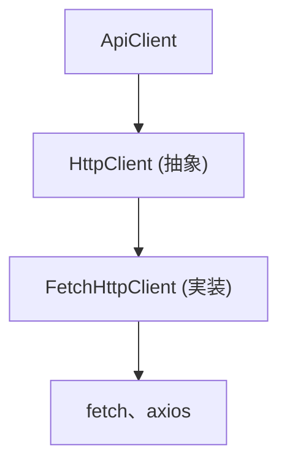
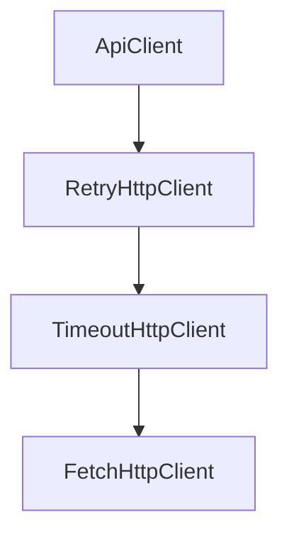
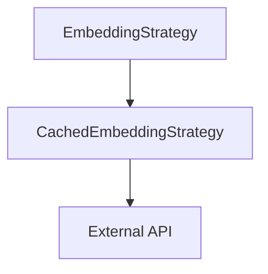
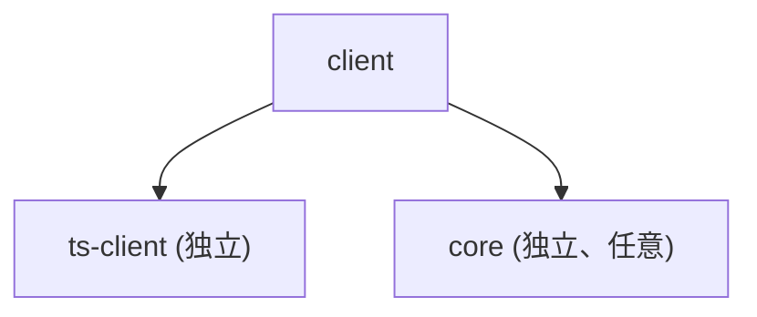
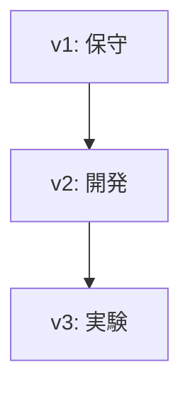

<!-- 
 SDK 設計
 -->

# S2J Similarity Service - 型安全な SDK 設計

## 概要

本仕様は、型安全な SDK の設計および API クライアントの構成を定義します。

## 設計意図、設計方針、非対象

### 設計意図 (ゴール)

型安全な API クライアントを提供します。

* 型安全な API コールを目指します。
* ユーザーの実装負担を軽減します。
* API 変更に追従します。

### 設計方針 (規約)

* generated client を内部利用します。
* HttpClient を抽象化します。
* DI による拡張性を確保します。

* fetch abstraction
* retry / timeout
* DI 可能

### 責務

* SDK の構造を設計すること。
* ApiClient / HttpClient を定義すること。
* 型安全インターフェースを提供すること。

### 非責務

* OpenAPI 契約定義
* codegen 実装
* runtime 分岐

### 非対象 (Out of Scope)

* UI 提供
* サーバー実装
* 認証基盤

### 構成

* ApiClient
* HttpClient (Decorator)
* Error (DomainError)

### 依存

* generated client を内部利用

## 設定スコープ (API キー管理)

### 設計意図 (ゴール)

API キーなどの機密情報を、適切なスコープで管理し、セキュリティと柔軟性を両立します。

### 設計方針 (規約)

* SDK は、API キーを保持しません。
* API キーは、コール側で管理します。
* 必要に応じて、Strategy に注入します。

### 責務

* API キー管理のスコープを定義すること。
* 機密情報の取り扱いルールを定義すること。

### 非責務

* API キーの発行管理
* 認証基盤
* secrets 管理ツール

### 設定スコープ

| レイヤ | API キー保持 |
|----------|------------|
| SDK (ApiClient / Service) | ❌ 保持しない |
| EmbeddingStrategy | ⭕ 注入により保持可能 |
| コール側 (アプリケーション) | ⭕ 保持する |

### 注入方法

#### パターン A (推奨)

Strategy に注入します。

```ts id="cfg_strategy"
new OpenAIEmbeddingStrategy({
  apiKey: process.env.OPENAI_API_KEY
})
```

#### パターン B

コール時に渡します。

```ts id="cfg_call"
await strategy.embed(text, {
  apiKey
})
```

### 禁止事項

* SDK 内で API キーを保持しません。
* グローバル変数で管理しません。
* ログに API キーを出力しません。

### セキュリティ考慮

* API キーは環境変数で管理します。
* クライアント (browser) で直接保持しません。
* 必要に応じて、プロキシ経由で利用します。

## 非同期 API 設計

### 設計意図 (ゴール)

非同期 I/O と同期計算を、統一された API で扱います。

### 設計方針 (規約)

* SDK の公開 API は、async とします。
* 内部で async → sync の橋渡しをします。

### 責務

* 非同期と同期の橋渡しをすること。
* 一貫した API を提供すること。

### 非責務

* 低レベル I/O
* 計算ロジック

### API 例

```ts id="sdk_async"
async function similarity(
  a: string,
  b: string
): Promise<number>
```

### 内部処理

```plaintext id="async_flow"
1. embed(a) → async
2. embed(b) → async
3. cosineSimilarity → sync
```

### ルール

* 外部 I/O は、すべて async で統一します。
* 計算は、sync で統一します。
* API は、async で統一します。

## 並列制御のスコープ

### 設計意図 (ゴール)

過剰な API コールを防ぎます。

### 設計方針 (規約)

* concurrency は、ApiClient インスタンス単位で管理します。

### 注意

* グローバル制御は、行いません。
* 複数インスタンス利用時は、コール側で制御します。

## ApiClient 仕様 (型安全インターフェース)

本セクションでは、外部 API との通信を担う `ApiClient` の仕様を定義します。
本クライアントは、OpenAPI から生成された型 (TypeScript、Zod) を利用し、型安全な API コールを提供します。

* ApiClient は、Interfaces 層に属します。
* Application 層は、ApiClient のみを依存対象とします。
* 実装は、DI により差し替え可能とします。

### 設計意図 (ゴール)

* API コールを、型安全にします。
* 契約 (OpenAPI) と実装の、乖離を防ぎます。
* エラーハンドリングとリトライを、統一します。

### 設計方針 (規約)

* OpenAPI から生成された型のみを使用します。
* raw client (generated/api) は、直接使用しません。
* ApiClient が、唯一の外部 API 窓口となります。
* 入出力は、すべて型で保証します。

### エラーハンドリング方針

* `4xx`: ValidationError
* `5xx`: ServerError
* Network: Retry 対象

### 責務

| 項目 | 内容 |
| ------- | -------------------------- |
| 認証 | API キーを付与すること。 |
| 通信 | HTTP リクエストを実行すること。 |
| バリデーション | Zod による runtime validation を実行すること。 |
| エラー処理 | HTTP エラーの統一処理を実行すること。 |

### 非責務

| 項目 | 内容 |
| ------- | --------------------- |
| DTO 定義 | generated に委譲 |
| 類似度計算 | Core に委譲 |
| プロバイダ処理 | EmbeddingStrategy に委譲 |

### rawClient との関係

* generated/api の raw client は、低レベル API です。
* ApiClient は、これをラップします。
* raw client の直接使用は、禁止します。

### インターフェース定義

```ts
import { SimilarityRequest, SimilarityResponse } from "@s2j/similarity-client";

export interface ApiClient {
  calculateSimilarity(
    request: SimilarityRequest
  ): Promise<SimilarityResponse>;

  generateEmbedding(
    request: EmbeddingRequest
  ): Promise<EmbeddingResponse>;
}
```

### 実装例 (fetch ベース)

```ts
import { z } from "zod";
import {
  SimilarityRequest,
  SimilarityResponse,
} from "@s2j/similarity-client";
import { SimilarityResponseSchema } from "@s2j/similarity-client";

export class DefaultApiClient implements ApiClient {
  constructor(
    private readonly baseUrl: string,
    private readonly apiKey?: string
  ) {}

  async calculateSimilarity(
    request: SimilarityRequest
  ): Promise<SimilarityResponse> {
    const res = await fetch(`${this.baseUrl}/v1/similarity`, {
      method: "POST",
      headers: {
        "Content-Type": "application/json",
        ...(this.apiKey && { Authorization: `Bearer ${this.apiKey}` }),
      },
      body: JSON.stringify(request),
    });

    if (!res.ok) {
      throw new Error(`API error: ${res.status}`);
    }

    const json = await res.json();

    // runtime validation (Zod)
    return SimilarityResponseSchema.parse(json);
  }
}
```

### エラーのロギング戦略

ApiClient は、エラー発生時にログを出力するが、ログ処理は、抽象化された Logger インターフェースを通じて行います。

#### 設計意図 (ゴール)

* ログ出力先は、差し替え (console、Datadog、Sentry) 可能にします。
* エラー観測性を向上させます。
* ドメインロジックとログ処理を分離します。

#### 設計方針 (規約)

* ログは、Logger インターフェース経由で出力します。
* DomainError を、そのままログに出しません (整形します)。
* 個人情報 (PII) は、ログに含めません。

#### 責務

* エラーの観測性を向上すること。
* ログ出力を統一すること。

#### 非責務

* ログ保存先の管理
* アラート設定

#### ログポリシー

| 項目 | 内容 |
| --------- | ----- |
| エラー内容 | 必須 |
| HTTP ステータス | 必須 |
| リクエストボディ | 原則非出力 |
| 個人情報 | 出力禁止 |

#### Logger インターフェース

```ts id="logger_if"
export interface Logger {
  error(message: string, meta?: Record<string, unknown>): void;
  warn(message: string, meta?: Record<string, unknown>): void;
  info(message: string, meta?: Record<string, unknown>): void;
}
```

#### デフォルト実装

```ts id="logger_console"
export class ConsoleLogger implements Logger {
  error(msg: string, meta?: any) {
    console.error(msg, meta);
  }
  warn(msg: string, meta?: any) {
    console.warn(msg, meta);
  }
  info(msg: string, meta?: any) {
    console.info(msg, meta);
  }
}
```

#### ApiClient 内での利用

```ts id="logger_use"
try {
  return await this.http.request(...);
} catch (err) {
  this.logger.error("API request failed", {
    errorType: err?.type,
    message: err?.message,
  });
  throw err;
}
```

### OpenAPI Error Schema の拡張

OpenAPI にエラー用スキーマを定義し、DomainError との対応関係を明確化します。

#### 設計意図 (ゴール)

* API エラーの構造を統一します。
* クライアント側で型安全に扱います。
* エラーハンドリングの一貫性を確保します。

#### 設計方針 (規約)

* すべてのエラーは、共通フォーマットで返します。
* `error.code` によって、分類可能とします。
* OpenAPI に、明示的に定義します。

#### 責務

* エラー構造を標準化すること。
* API 契約との整合性を確保すること。

#### 非責務

* エラー表示のデザイン
* メッセージ翻訳

#### OpenAPI 例

```yaml id="error_schema"
components:
  schemas:
    ErrorResponse:
      type: object
      required: [code, message]
      properties:
        code:
          type: string
          example: INVALID_INPUT
        message:
          type: string
        details:
          type: object
          nullable: true
```

#### ステータス別レスポンス

```yaml id="error_response"
responses:
  '400':
    description: Validation Error
    content:
      application/json:
        schema:
          $ref: '#/components/schemas/ErrorResponse'
```

#### DomainError との対応

| error.code | DomainError |
| -------------- | --------------- |
| INVALID_INPUT | ValidationError |
| UNAUTHORIZED | ApiError |
| RATE_LIMIT | ApiError |
| INTERNAL_ERROR | ApiError |

#### マッピング実装例

```ts id="error_map2"
function mapErrorResponse(body: any): DomainError {
  switch (body.code) {
    case "INVALID_INPUT":
      return new ValidationError(body.message);
    default:
      return new ApiError(500, body.message);
  }
}
```

#### 拡張ポイント

* エラーコードの、列挙型化 (enum)
* i18n 対応
* フロント UI との連携

## ApiClient の DI (Dependency Injection) 設計

ApiClient は、依存性注入 (DI) により、構築されます。
これにより、通信実装・設定・ポリシーを柔軟に差し替え可能とします。

### 設計意図 (ゴール)

* テスト容易性を向上します (モック可能)。
* 環境ごとの差し替え (開発、本番) を可能とします。
* 通信ポリシー (Retry、Timeout) を外部化します。

### 設計方針 (規約)

* ApiClient は、具象 HttpClient に依存しません。
* 依存は、すべてコンストラクタで注入します。
* デフォルト構成を、ファクトリで提供します。

### 責務

* 依存関係を明示化すること。
* 「実装の差し替え性」を確保すること。

### 非責務

* 設定値の管理 (環境変数など)
* インスタンスのグローバル管理

### コンストラクタ定義

```ts id="di_ctor"
export class DefaultApiClient implements ApiClient {
  constructor(
    private readonly http: HttpClient,
    private readonly baseUrl: string,
    private readonly apiKey?: string
  ) {}
}
```

### ファクトリ (推奨)

```ts id="di_factory"
export function createApiClient(config: {
  baseUrl: string;
  apiKey?: string;
  timeoutMs?: number;
  retryCount?: number;
}): ApiClient {
  const base = new FetchHttpClient();

  const http =
    new RetryHttpClient(
      new TimeoutHttpClient(
        base,
        config.timeoutMs ?? 5000
      ),
      config.retryCount ?? 2
    );

  return new DefaultApiClient(http, config.baseUrl, config.apiKey);
}
```

### テスト時の差し替え

```ts id="di_mock"
const mockHttpClient: HttpClient = {
  request: async () => ({ similarityScore: 0.9 })
};

const client = new DefaultApiClient(mockHttpClient, "http://test");
```

## Dependency Injection (DI) 設計

### 設計意図 (ゴール)

依存関係を明示的に注入することで、テスト容易性と実装の柔軟性を確保します。

### 設計方針 (規約)

* コンストラクタインジェクションを採用します。
* Service は、外部依存を直接生成しません。
* Interface に依存し、実装には依存しません。

### 責務

* 依存関係の注入方法を定義すること。
* 初期化パターンを統一すること。

### 非責務

* 実装の詳細
* runtime 判定
* DI フレームワーク導入

### コンストラクタ定義

```ts id="di_constructor"
type SimilarityServiceOptions = {
  embeddingStrategy: EmbeddingStrategyInterface
  httpClient: HttpClient
}

class SimilarityService {
  constructor(private options: SimilarityServiceOptions) {}
}
```

### 初期化例

```ts id="di_usage"
const service = new SimilarityService({
  embeddingStrategy: new OpenAIEmbeddingStrategy(...),
  httpClient: new FetchHttpClient(...)
})
```

### Factory (任意)

#### 設計意図 (ゴール)

初期化ロジックを集中管理します。

#### 例

```ts id="di_factory"
function createSimilarityService(): SimilarityService {
  return new SimilarityService({
    embeddingStrategy: new OpenAIEmbeddingStrategy(),
    httpClient: new FetchHttpClient()
  })
}
```

### DI のルール

* new は、entry ポイント (Factory / usage) に限定します。
* Service 内で new を行ってはなりません。
* runtime 差異は、DI により吸収します。

### テスト戦略

```ts id="di_test"
const mockStrategy = {
  embed: async () => mockEmbedding
}

const service = new SimilarityService({
  embeddingStrategy: mockStrategy,
  httpClient: mockHttpClient
})
```

## Logger、Tracer の注入

### 設計意図 (ゴール)

ログ出力を、外部から制御可能にします。

### 設計方針 (規約)

* SDK は、logger を保持するが実装しません。
* ログ出力は、DI により制御します。

### インターフェース

```ts id="logger_interface"
export interface Logger {
  info(message: string, meta?: Record<string, unknown>): void
  error(message: string, meta?: Record<string, unknown>): void
}
```

### 利用例

```ts id="logger_usage"
new ApiClient({
  httpClient,
  logger
})
```

## エラーハンドリングモデル

### 設計意図 (ゴール)

ApiClient の失敗時挙動を一意に定義し、ユーザーおよび SDK 実装間での扱いの不一致を防ぎます。

### 設計方針 (規約)

* ApiClient は、**例外 (throw) モデル** を採用します。
* 成功時はデータを返却し、失敗時は例外を throw します。
* Result 型 (ok / error) は、採用しません。

### 責務

* エラー処理モデルを統一すること。
* コール側の利用パターンを固定すること。

### 非責務

* ログ出力
* リトライ制御
* UI 表示

### インターフェース

```ts id="api_throw_model"
const result = await client.similarity(input)
// エラー時は例外が throw される
```

### エラー分類

| 種別 | 内容 |
|------|------|
| NetworkError | 通信失敗 |
| TimeoutError | タイムアウト |
| ApiError | API レスポンスエラー |
| ValidationError | 入力不正 |
| EmbeddingError | 外部 API 失敗 |

### エラー型

```ts id="api_error_type"
class DomainError extends Error {
  code: string
  cause?: unknown
}
```

### 例外の伝播ルール

* HttpClient → DomainError に変換
* EmbeddingStrategy → DomainError に変換
* ApiClient → そのまま throw

## Runtime 非依存設計

### 設計意図 (ゴール)

ApiClient を runtime から独立させます。

### 設計方針 (規約)

* ApiClient は、HttpClient インターフェースにのみ依存します。
* fetch 実装は、DI により注入します。

### 例

```ts id="sdk_di"
new ApiClient({
  httpClient: new NodeHttpClient()
})
```

### 注意

ApiClient 内で runtime を判定しません。

## HttpClient 実装 (Decorator パターン)

本プロジェクトでは、HttpClient に対する機能拡張を、デコレータパターンで実現します。

### 設計意図 (ゴール)

* Retry、Timeout、Circuit Breaker を、疎結合に追加します。
* 機能の組み合わせを柔軟にします。
* 単一責務を維持します。

### 設計方針 (規約)

* HttpClient は、最小インターフェースとします。
* 機能は、すべてデコレータとして実装します。
* デコレータは、HttpClient をラップします。

### 責務

* 各デコレータは、単一の通信機能を提供すること。
* 合成によって、機能を拡張すること。

### 非責務

* API 仕様の解釈 (ApiClient)
* DTO の検証 (Zod)

### インターフェース

```ts
export interface HttpClient {
  request<TResponse>(
    input: RequestInfo,
    init?: RequestInit
  ): Promise<TResponse>;
}
```

### ベース実装

```ts
export class FetchHttpClient implements HttpClient {
  async request<TResponse>(
    input: RequestInfo,
    init?: RequestInit
  ): Promise<TResponse> {
    const res = await fetch(input, init);

    if (!res.ok) {
      throw new Error(`HTTP Error: ${res.status}`);
    }

    return res.json() as Promise<TResponse>;
  }
}
```

### デコレータ例

#### RetryHttpClient

```ts
export class RetryHttpClient implements HttpClient {
  constructor(
    private readonly inner: HttpClient,
    private readonly maxRetries = 2
  ) {}

  async request<T>(input: RequestInfo, init?: RequestInit): Promise<T> {
    let lastError;

    for (let i = 0; i <= this.maxRetries; i++) {
      try {
        return await this.inner.request<T>(input, init);
      } catch (e) {
        lastError = e;
      }
    }

    throw lastError;
  }
}
```

#### TimeoutHttpClient

```ts
export class TimeoutHttpClient implements HttpClient {
  constructor(
    private readonly inner: HttpClient,
    private readonly timeoutMs = 5000
  ) {}

  async request<T>(input: RequestInfo, init?: RequestInit): Promise<T> {
    const controller = new AbortController();
    const id = setTimeout(() => controller.abort(), this.timeoutMs);

    try {
      return await this.inner.request<T>(input, {
        ...init,
        signal: controller.signal,
      });
    } finally {
      clearTimeout(id);
    }
  }
}
```

### 構成例

```ts
const httpClient =
  new RetryHttpClient(
    new TimeoutHttpClient(
      new FetchHttpClient()
    )
  );
```

## レート制限対応

### 設計意図 (ゴール)

外部 API の制限に、適切に対応します。

### 設計方針 (規約)

* `HTTP 429` は、リトライ対象とします。
* Retry-After ヘッダーを優先します。

### 非責務

* グローバルレート制御

### 仕様

```plaintext
if 429:
  wait Retry-After
  retry
```

## 通信制御 (リトライ、タイムアウト、サーキットブレーカー)

ApiClient は、外部 API コールにおける信頼性を確保するため、以下の通信制御を提供します。

### 設計意図 (ゴール)

通信障害に対する挙動を統一し、SDK 利用時の再試行、タイムアウト、回復戦略の不整合を防ぎます。

* 一時的なネットワーク障害から回復すること。
* API の応答遅延による、処理停止を防止すること。
* 外部サービス障害時の、システム全体への影響を抑制すること。

### 設計方針 (規約)

* 設定値は、コンストラクタ経由で注入可能とします。
* リトライは、SDK (ApiClient) で制御します。
* リトライ対象は、「安全な再実行が可能なリクエスト」のみとします。
* タイムアウトは、HttpClient で一元管理し、全リクエストに適用します。
* サーキットブレーカーは、オプション機能とし、外部 API 単位で管理します。

### 責務

* 「通信の信頼性」を確保すること。
* エラーを分類すること、制御すること。
* 通信リトライ戦略を提供すること。
* 通信失敗時の一貫した挙動を定義すること。

### 非責務

* ビジネスロジックのリトライ判断 (Application 側)
* API 仕様変更への対応 (Contracts 側)
* 実際の HTTP 実装 (fetch / axios 等)
* ログ出力
* インフラレベルのリトライ

### 責務分離

| 機能 | 担当 |
|------|------|
| リトライ | ApiClient |
| タイムアウト | HttpClient |
| サーキットブレーカー | HttpClient (任意) |

### エラーとの関係

* タイムアウト → TimeoutError
* リトライ 上限到達 → NetworkError
* circuit open → CircuitBreakerError

### エラー分類との関係 (リトライ、サーキットブレーカー)

| エラー種別 | リトライ | サーキットブレーカー |
| ------------ | ----- | --------------- |
| NetworkError | 可 | 可 |
| `5xx` | 可 | 可 |
| `4xx` | 不可 | 不可 |

### サーキットブレーカー

#### 方針

* 障害時の過負荷防止のため、導入可能です。
* デフォルトでは無効です。

```ts id="circuit_config"
{
  failureThreshold: 5,
  resetTimeoutMs: 30000
}
```

#### 状態

* `CLOSED`: 通常動作
* `OPEN`: リクエスト遮断
* `HALF-OPEN`: 試験的に1リクエスト許可

#### 遷移条件

| 条件 | 動作 |
| -------- | --------- |
| 連続失敗の回数超過 | OPEN |
| 一定時間の経過 | HALF-OPEN |
| 成功 | CLOSED |
| 再失敗 | OPEN |

#### デフォルト設定

| 項目 | 値 |
| ---- | --- |
| 失敗閾値 | 5回 |
| 回復時間 | 30秒 |

### リトライ

#### 方針

* idempotent なリクエストのみ対象とします。
* exponential backoff を採用します。

```ts id="retry_policy"
{
  retries: 3,
  backoff: "exponential",
  baseDelayMs: 100
}
```

#### ポリシー

* 対象
  * ネットワークエラー
  * `5xx` レスポンス
* 非対象
  * `4xx` (バリデーションエラー等)

#### デフォルト設定

| 項目 | 値 |
| -------- | ----------- |
| 最大リトライ回数 | 2 |
| バックオフ | exponential |
| 初期の待機時間 | 100ms |

### タイムアウト

#### 方針

* HttpClient に統一して実装します。
* ApiClient は timeout を直接扱いません。

```ts id="timeout_config"
{
  timeoutMs: 5000
}
```

#### ポリシー

* 全リクエストに適用します。
* fetch の AbortController を使用します。

#### デフォルト設定

| 項目 | 値 |
| ------ | ------ |
| タイムアウト | 5000ms |

## Fetch Abstraction (通信レイヤ抽象化)

ApiClient は、HTTP 通信を直接扱わず、抽象化された Fetch インターフェースを経由して実行します。

### 設計意図 (ゴール)

* 通信実装 (fetch、axios、node-fetch) の差し替えを可能にします。
* テスト容易性を向上させます (Mock 可能)。
* 通信制御 (Retry、Timeout、Circuit Breaker) を一元化します。

### 設計方針 (規約)

* ApiClient は、Fetch 実装に依存しません。
* Fetch 実装は、DI (依存性注入) で渡します。
* 通信制御は、Fetch 層に集約します。

### 責務

* 通信を抽象化すること。
* 実装差し替えを提供すること。
* テスト容易性を確保すること。

### 非責務

* API 仕様の管理 (OpenAPI)
* DTO 定義 (generated)

### インターフェース定義

```ts
export interface HttpClient {
  request<TResponse>(
    input: RequestInfo,
    init?: RequestInit
  ): Promise<TResponse>;
}
```

### 実装構成



### デフォルト実装 (FetchHttpClient)

```ts
export class FetchHttpClient implements HttpClient {
  async request<TResponse>(
    input: RequestInfo,
    init?: RequestInit
  ): Promise<TResponse> {
    const res = await fetch(input, init);

    if (!res.ok) {
      throw new Error(`HTTP Error: ${res.status}`);
    }

    return res.json() as Promise<TResponse>;
  }
}
```

### ApiClient との統合

```ts
export class DefaultApiClient implements ApiClient {
  constructor(
    private readonly http: HttpClient,
    private readonly baseUrl: string
  ) {}

  async calculateSimilarity(request: SimilarityRequest) {
    return this.http.request<SimilarityResponse>(
      `${this.baseUrl}/v1/similarity`,
      {
        method: "POST",
        body: JSON.stringify(request),
        headers: {
          "Content-Type": "application/json",
        },
      }
    );
  }
}
```

### 拡張ポイント

* RetryHttpClient (デコレータ)
* TimeoutHttpClient (デコレータ)
* CircuitBreakerHttpClient (デコレータ)

### デコレータ構成例



## バッチ処理 API

### 設計意図 (ゴール)

大量データに対する、効率的な類似度計算を可能にします。

### 責務

* バッチ API を提供すること。
* 並列制御を提供すること。

### 非責務

* アルゴリズム定義
* インフラ制御

### API 例

```ts id="batch_api"
similarityOneToMany(
  query: string,
  candidates: string[]
): Promise<number[]>

similarityMatrix(
  inputs: string[]
): Promise<number[][]>
```

### Embedding バッチ

```ts id="batch_embed"
embedBatch(texts: string[]): Promise<Embedding[]>
```

### 並列実行の制御

#### 設計方針 (規約)

* concurrency を設定可能とします。
* デフォルト上限を設けます。

```ts id="batch_concurrency"
{
  concurrency: 5
}
```

#### ルール

* 外部 API のレート制限を超えません。
* retry と組み合わせて制御します。

## 並列実行と順序保証

### 設計意図 (ゴール)

バッチ処理の結果整合性を保証します。

### 設計方針 (規約)

* 出力は、入力順を維持します。

### 仕様

```ts
results[i] corresponds to inputs[i]
```

## 部分成功

### 設計意図 (ゴール)

バッチ処理の柔軟性を確保します。

### 設計方針 (規約)

* 一部失敗時は、全体を失敗とします (fail-fast)。

### 将来拡張

* partial result モードは、optional とします。

## リトライ可否

### 設計意図 (ゴール)

不要な再試行を防ぎます。

### 設計方針 (規約)

* リトライ可否は、エラー種別で判断します。

### 分類

| エラー | リトライ |
|--------|------|
| `NetworkError` | ⭕ |
| `TimeoutError` | ⭕ |
| `ApiError(5xx)` | ⭕ |
| `ValidationError` | ❌ |

## 再試行と再現性

### 設計方針 (規約)

* リトライによる結果の変動を、許容します。
* deterministic は、保証しません。

### 注意

Embedding は、プロバイダ依存で変動する可能性があります。

## キャッシュ戦略 (Embedding)

### 設計意図 (ゴール)

Embedding API のコストとレイテンシを削減するため、再利用可能な結果をキャッシュします。

### 設計方針 (規約)

* キャッシュは、オプションとします。
* SDK は、キャッシュを内包せず、DI により注入します。
* キャッシュキーは、入力テキストにもとづいて決定します。

### 責務

* キャッシュ利用のルールを定義すること。
* キーと TTL を標準化すること。

### 非責務

* キャッシュストレージ実装 (Redis 等)
* キャッシュインフラ管理
* 永続化戦略

### キャッシュキー

```plaintext id="cache_key"
key = hash(text)
```

### 注意

* 正規化 (trim / lowercase 等) を適用します。
* 同一意味でも異なる文字列は、別キーとなります。

### TTL (Time To Live)

```plaintext id="cache_ttl"
デフォルト: 24時間 (推奨)
```

#### 設計方針 (規約)

* プロバイダ変更時は、キャッシュを無効化します。
* モデル変更時も、同様に、キャッシュを無効化します。

### インターフェース

```ts id="cache_interface"
export interface Cache {
  get(key: string): Promise<Embedding | null>
  set(key: string, value: Embedding, ttl?: number): Promise<void>
}
```

### 利用例 (Decorator)



#### 挙動

1. `cache.get(key)`
2. 存在すれば、返却
3. なければ API コール
4. `cache.set`

## キャッシュキー詳細仕様

### 設計意図 (ゴール)

キャッシュの衝突と不整合を防ぎます。

### 定義

```plaintext
key = hash({
  text,
  model,
  provider,
  normalized: true
})
```

### 注意

* text のみでキーを作成してはなりません。
* モデル差異は、必ず区別します。

## PHP SDK の構成

### 設計意図 (ゴール)

PHP ユーザーに対して一貫した API を提供します。

### 設計方針 (規約)

* SDK は、ドメインモデルを扱います。
* DTO は、内部で変換されます。

### 例

```php
$result = $service->similarity($textA, $textB);
```

### 注意

ユーザーは、DTO を意識しません。

## SDK 配布戦略

本プロジェクトは、OpenAPI を起点として複数言語向け SDK を生成・配布します。

### 設計意図 (ゴール)

* フロントエンドとバックエンド間の契約を共有します。
* ユーザーの実装コストを削減します。
* 型安全な API 利用を促進します。

### 設計方針 (規約)

* OpenAPI を、唯一の契約とします。
* SDK は、すべて codegen により生成します。
* 手動実装の SDK は、提供しません。

### 責務

* 契約を配布すること。
* 型安全な利用を提供すること。

### 非責務

* 実装ロジックの提供
* アプリケーション固有処理

### 配布対象

| SDK | 配布方法 |
| ---------- | -------- |
| TypeScript | npm |
| PHP | Composer |

### 非配布対象

* ApiClient (実装)
* HttpClient (通信層)
* Strategy (Embedding)

### バージョン整合性

* OpenAPI version と SDK version を同期させます。
* Git tag を基準とします。

### リリースフロー

```mermaid id="sdk_release"
flowchart TD
  A["`openapi.yaml` 更新"] --> B["generate 実行"]
  B --> C["CI 検証"]
  C --> D["version 更新"]
  D --> E["`npm publish`"]
  D --> F["`composer publish`"]
```

### TypeScript SDK

#### パッケージ

```plaintext id="sdk_ts_pkg"
@s2j/similarity-client
```

#### 内容

* TypeScript 型
* Zod スキーマ
* (任意) raw API client

#### 公開対象

```plaintext id="sdk_ts_files"
dist/
  index.js
  index.d.ts
```

#### バージョニング

* OpenAPI の変更に追従します。
* 破壊的変更 → major
* 互換追加 → minor
* 修正 → patch

### PHP SDK

#### パッケージ

```plaintext id="sdk_php_pkg"
s2j/similarity-client
```

#### 内容

* DTO (`Contracts/DTO`)

#### 配布方法

* Packagist
* GitHub リポジトリ

## SDK の分割戦略 (client と core の分離)

本プロジェクトでは、SDK を責務ごとに分割し、疎結合な構成とします。

### 設計意図 (ゴール)

* 依存関係を最小化します。
* ユーザーの選択肢を拡張します。
* 再利用性を向上させます。

### 設計方針 (規約)

* 契約 (Contracts) と実装 (Client) を、分離します。
* Core ロジックは、独立パッケージとします。
* 各パッケージは、単一責務を持ちます。

### 責務

* SDK の構造を設計すること。
* 依存関係を明確化すること。

### 非責務

* アプリケーション統合
* UI 層の設計

### 利点

* 軽量利用 (型のみ)
* 高度利用 (フル SDK)
* テスト容易性向上

### 注意点

* 過剰分割を避けてください。
* バージョン整合性を維持してください。

### パッケージ構成

```plaintext id="sdk_split"
packages/
  ts-client/   ← 契約 (型、Zod)
  core/        ← 類似度ロジック
  client/      ← ApiClient 実装
```

### 各パッケージの責務

#### ts-client (Contracts)

* OpenAPI 由来の型
* Zod スキーマ
* raw API client (任意)

#### core (Domain)

* 類似度計算ロジック
* ベクトル操作
* 外部依存なし

#### client (Interfaces)

* ApiClient 実装
* HttpClient、Retry、Timeout
* DomainError、Logger

### 依存関係



### 配布戦略

| パッケージ | 配布 |
| --------- | --- |
| ts-client | npm |
| core | npm |
| client | npm |

### 利用例

#### 最小利用 (型のみ)

```ts id="sdk_use1"
import { SimilarityRequest } from "@s2j/similarity-client";
```

#### フル利用 (API コール)

```ts id="sdk_use2"
import { createApiClient } from "@s2j/similarity-client-client";
```

#### コアのみ利用

```ts id="sdk_use3"
import { cosineSimilarity } from "@s2j/similarity-core";
```

## SDK のマルチバージョン管理

本プロジェクトでは、複数バージョンの SDK を並行して維持可能とします。

### 設計意図 (ゴール)

* 既存クライアントの、互換性を維持します。
* 段階的なアップグレードを、可能にします。
* breaking change の影響を、局所化します。

### 設計方針 (規約)

* SemVer に従います。
* major バージョンは、互換性を持ちません。
* 過去バージョンも、一定期間サポートします。

### 責務

* SDK を長期運用すること。
* 互換性を維持すること。

### 非責務

* バージョン間の自動移行
* データのマイグレーション

### OpenAPI との対応

* OpenAPI version と SDK version を同期。
* breaking change は、major とします。

### バージョニングモデル

| バージョン | 意味 |
| ----- | ------------------ |
| v1.x | 安定版 |
| v2.x | breaking change 含む |
| v3.x | 新仕様 |

### リリース戦略



### 互換性ポリシー

| 変更 | 対応 |
| ------- | ----- |
| フィールド追加 | minor |
| フィールド削除 | major |
| 型変更 | major |

### 廃止 (Deprecation)

* deprecated フラグを OpenAPI に付与
* SDK に警告を出す

### npm (TypeScript SDK)

* major ごとに、共存可能とします。
* import は、バージョン固定します。

```ts id="sdk_import"
import { SimilarityRequest } from "@s2j/similarity-client@1";
```

### Composer (PHP)

* バージョン制約で管理します。

```json id="composer_req"
{
  "require": {
    "s2j/similarity-client": "^1.0"
  }
}
```

## default パッケージ設計 (入口統一)

本プロジェクトでは、複数の runtime 向けパッケージが存在する中で、ユーザーが迷わないように「標準入口 (default package)」を定義します。

### 設計意図 (ゴール)

* 初学者・ユーザーの迷いを排除します。
* ドキュメントと実装の入口を統一します。
* ユースケースの80%を簡単にします。

### 設計方針 (規約)

* default は、最も一般的な環境 (Node.js) を指します。
* 他 runtime は、明示的に選択させます。
* default は、薄いラッパーとして実装します。

### 責務

* SDK の入口を統一すること。
* 利用体験を簡素化すること。

### 非責務

* runtime の自動判定
* 最適化の判断

### 利点

* 学習コストが低減できること。
* 導入が簡易化できること。
* 一貫した利用方法であること。

### 注意点

* default の責務を肥大化させないでください。
* runtime 固有ロジックを含めないでください。

### ドキュメント方針

* 基本例は、default を使用します。
* runtime 別は、応用として説明します。

### 実装方針

default パッケージは、内部的に node 実装に委譲します。

```ts id="default_impl"
export * from "@s2j/similarity-client-node";
```

### パッケージ構成

```plaintext id="default_pkg"
@s2j/similarity-client         ← default (Node)
@s2j/similarity-client-node
@s2j/similarity-client-edge
@s2j/similarity-client-browser
```

### 利用例

```ts id="default_use"
import { createClient } from "@s2j/similarity-client";
```

### 明示利用 (上級者)

```ts id="explicit_use"
import { createClient } from "@s2j/similarity-client-edge";
```

## SDK 命名規則

本プロジェクトでは、長期運用と可読性を確保するため、パッケージおよびモジュールの命名規則を統一します。

### 設計意図 (ゴール)

* パッケージの役割を、名前から即座に理解できるようにします。
* モノレポ運用での混乱を防ぎます。
* 将来的な拡張に対応します。

### 設計方針 (規約)

* `@s2j/` 接頭辞を統一します。
* `<domain>-<role>-<runtime>` の構造を採用します。
* role は、固定語彙を使用します。

### 責務

* 命名を統一すること。
* 構造を明確化すること。

### 非責務

* 実装内容を保証すること。
* バージョンを管理すること。

### 利点

* 可読性を向上できること。
* 一貫性を確保できること。
* 拡張の容易性を期待できること。

### 注意点

* 命名変更は、breaking change としてください。
* 初期設計で固定してください。

### 禁止事項

* (utils、lib など) あいまいな名前にしないでください。
* runtime を省略した、特殊パッケージにしないでください。
* role が不明確な命名をしないでください。

### 命名フォーマット

```plaintext id="naming_format"
@s2j/<domain>-<role>-<runtime>
```

### 例

```plaintext id="naming_examples"
@s2j/similarity-client          ← default
@s2j/similarity-client-node
@s2j/similarity-client-edge
@s2j/similarity-client-browser
@s2j/similarity-core
@s2j/similarity-contracts
```

### role 定義

| role | 意味 |
| --------- | --------- |
| client | API クライアント |
| core | ドメインロジック |
| contracts | 型・スキーマ |

### runtime 定義

| runtime | 意味 |
| ------- | ------------ |
| node | Node.js |
| edge | Edge runtime |
| browser | Browser |

### import 一貫性

```ts id="naming_import"
import { createClient } from "@s2j/similarity-client-node";
```

### 将来拡張

```plaintext id="naming_future"
@s2j/similarity-client-deno
@s2j/similarity-client-worker
```

## SDK と API バージョン

### 設計意図 (ゴール)

SDK と API の互換性を、明確にします。

### 設計方針 (規約)

* SDK は、特定の API バージョンに対応します。
* breaking change 時は、SDK もメジャーアップします。

### 例

```plaintext id="sdk_version"
API v1 ↔ SDK v1.x
API v2 ↔ SDK v2.x
```

### 注意

SDK は、複数 API バージョンを同時サポートしません。

## メソッド命名規則

### 設計意図 (ゴール)

SDK の公開 API を一貫した命名で統一し、利用者の理解コストを下げます。

### 設計方針 (規約)

* ドメイン用語を優先します。
* REST API と命名をそろえます。
* 汎用的すぎる名前 (calculate 等) は使用しません。

### 責務

* SDK API の命名を統一すること。

### 非責務

* REST エンドポイント定義

### 標準メソッド

```php
$result = $service->similarity($textA, $textB);
```

### 拡張例

```php
$service->similarityBatch(...)
$service->similarityMatrix(...)
```

### 禁止事項

* calculate / execute 等のあいまいな名称
* 同一機能に複数名称を持たせる
