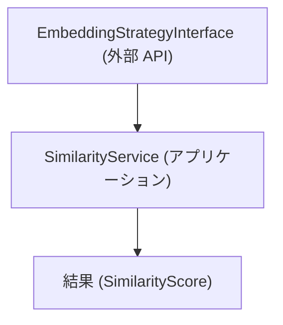
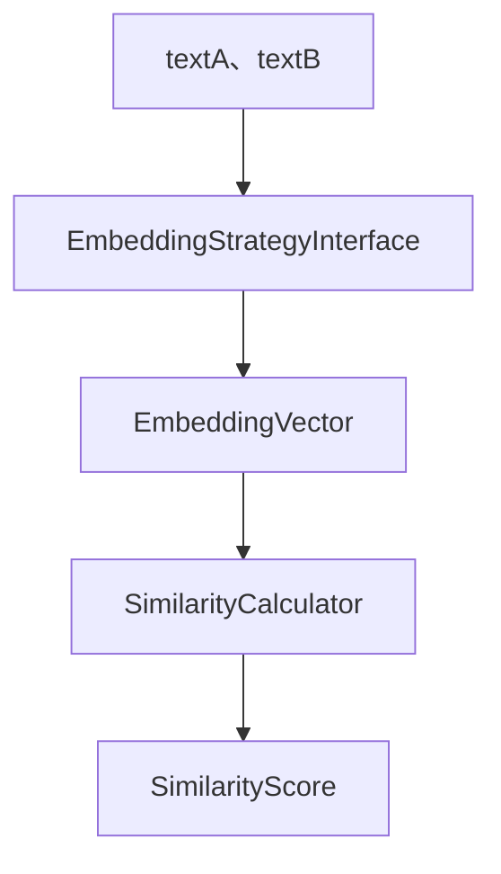
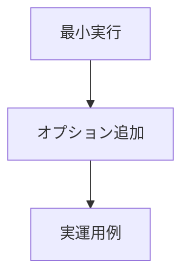
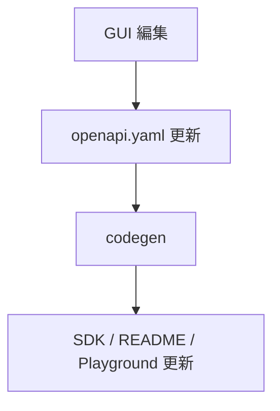
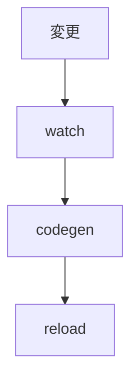
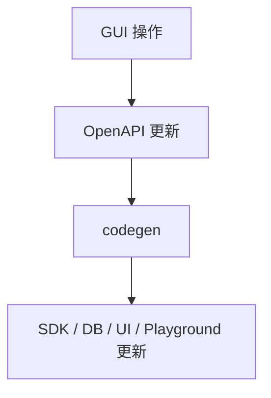
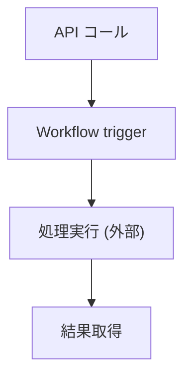

<!--
目的：「使用方法」の明文化
-->

# S2J Similarity Service - 使用方法

本ドキュメントは、本ライブラリの **具体的な使用方法 (PHP、JavaScript)** を定義します。
ユーザーが、最小構成で類似度を算出できることを目的とします。

## 概要

本ライブラリは、以下の機能を提供します。

* テキストから Embedding を生成します。
* 2つのテキストの、類似度を算出します。

ユーザーは、EmbeddingStrategyInterface を注入し、SimilarityService を利用します。

* Contracts 層の変更は、本仕様に影響します。
* Provider は、差し替え可能です。
* 将来的に REST API と併用可能です。

## 設計意図、設計方針、非対象

### 設計意図 (ゴール)

ユーザーが内部実装を意識せず、**シンプルな API で類似度を利用できるようにします。**

### 設計方針 (規約)

* DI (依存性注入) を前提とします。
* Provider を差し替え可能とします。
* 同一インターフェースで PHP、JS を提供します。

### 非対象 (Out of Scope)

* フレームワークの統合 (WordPress、React 等)
* UI コンポーネント
* API キー管理の実装

## 基本構成



## 処理フロー - End-to-End



<!-- 小見出し「ApiClient 仕様 (型安全インターフェース)」は、docs/interfaces/sdk_spec.md に移動 -->

<!-- 小見出し「通信制御 (Retry、Timeout、Circuit Breaker)」は、docs/interfaces/sdk_spec.md に移動 -->

<!-- 小見出し「Fetch Abstraction (通信レイヤ抽象化)」は、docs/interfaces/sdk_spec.md に移動 -->

<!-- 小見出し「HttpClient 実装 (Decorator パターン)」は、docs/interfaces/sdk_spec.md に移動 -->

<!-- 小見出し「エラー型 (DomainError) 統一」は、docs/contracts/data_contract_spec.md に移動 -->

<!-- 小見出し「OpenAPI → Error 型マッピング」は、docs/contracts/codegen_spec.md に移動 -->

<!-- 小見出し「ApiClient の DI (Dependency Injection) 設計」は、docs/interfaces/sdk_spec.md に移動 -->

## PHP 使用例

### 1. 初期化

```php id="php_init"
use App\Infrastructure\OpenAIEmbeddingStrategy;
use App\Application\SimilarityService;

$strategy = new OpenAIEmbeddingStrategy($apiKey);
$service = new SimilarityService($strategy);
```

### 2. 類似度算出

```php id="php_usage"
$textA = "WordPress プラグイン開発";
$textB = "WP plugin development";

$score = $service->similarity(
    $textA,
    $textB,
    $model // optional
);

echo $score; // 0.0 - 1.0
```

### 3. 低レベル利用 (Embedding + Core)

```php id="php_low"
$vectorA = $strategy->embed($textA);
$vectorB = $strategy->embed($textB);

$score = SimilarityCalculator::calculate($vectorA, $vectorB);
```

### ルール

* DI 対象は、常に `strategy` と命名します。
* `provider` という変数名は、使用しません。

### 補足

* `$model` は、省略可能。
* 未指定時は、Strategy のデフォルトモデルが使用される

## JavaScript 使用例

### 1. 初期化

```ts id="ts_init"
import { OpenAIEmbeddingStrategy } from "./infrastructure";
import { SimilarityService } from "./application";

const strategy = new OpenAIEmbeddingStrategy(apiKey);
const service = new SimilarityService(strategy);
```

### 2. 類似度算出

```ts id="ts_usage"
const textA = "WordPress プラグイン開発";
const textB = "WP plugin development";

const score = await service.similarity(textA, textB);

console.log(score);
```

### 3. 低レベル利用

```ts id="ts_low"
const vectorA = await provider.embed(textA);
const vectorB = await provider.embed(textB);

const score = calculateSimilarity(vectorA, vectorB);
```

## 設定

### 設定項目

| 項目 | 説明 |
| ------- | --------------- |
| apiKey | Embedding API キー |
| model | 使用モデル |
| timeout | タイムアウト |

### 例 - PHP

```php id="php_config"
$strategy = new OpenAIEmbeddingStrategy([
    'apiKey' => 'xxx',
    'model' => 'text-embedding-3-small',
]);
```

## API キーの設定

API キーは、アプリケーション側で管理し、Strategy に渡します。

```ts id="usage_api_key"
const strategy = new OpenAIEmbeddingStrategy({
  apiKey: process.env.OPENAI_API_KEY
})
```

## エラーハンドリング

ApiClient は、例外モデルを採用しているため、try/catch により処理します。

```ts id="usage_try_catch"
try {
  const result = await client.similarity(input)
} catch (e) {
  // エラー処理
}
```

### 推奨

* エラー種別 (code) で分岐する。
* ユーザー表示とログを分離する。

### PHP

```php id="php_error"
try {
    $score = $service->similarity($textA, $textB);
} catch (ValidationException $e) {
    // 入力エラー
} catch (ProviderException $e) {
    // APIエラー
}
```

### JavaScript

```ts id="ts_error"
try {
  const score = await service.calculate(textA, textB);
} catch (e) {
  if (e instanceof ValidationError) {
    // 入力エラー
  }
}
```

## ベストプラクティス

### Provider の再利用

* 毎回生成しません。
* シングルトンとして扱います。

### キャッシュ

* Embedding 結果をキャッシュします。
* API コストを削減します。

### 非同期処理 - JavaScript

* 並列実行を可能とします。
* Promise.all を活用します。

<!-- 小見出し「CI での契約検証」は、docs/engineering/build_and_replace.md に移動 -->

<!-- 小見出し「semantic-release (自動バージョニング)」は、docs/engineering/build_and_replace.md に移動 -->

<!-- 小見出し「SDK 配布戦略」は、docs/interfaces/sdk_spec.md に移動 -->

<!-- 小見出し「SDK の分割戦略 (client と core の分離)」は、docs/interfaces/sdk_spec.md に移動 -->

<!-- 小見出し「SDK のマルチバージョン管理」は、docs/interfaces/sdk_spec.md に移動 -->

<!-- 小見出し「モノレポ管理 (pnpm、turborepo)」は、docs/engineering/monorepo.md に移動 -->

<!-- 小見出し「OpenAPI Breaking Change 検出」は、docs/contracts/codegen_spec.md に移動 -->

<!-- 小見出し「Changesets vs semantic-release の比較」は、docs/engineering/build_and_replace.md に移動 -->

<!-- 小見出し「pnpm + Changesets + turborepo の実構成」は、docs/engineering/build_and_replace.md に移動 -->

<!-- 小見出し「`package.json` の具体的な分割設計」は、docs/engineering/build_and_replace.md に移動 -->

<!-- 小見出し「tsconfig 分割設計」は、docs/engineering/build_and_replace.md に移動 -->

<!-- 小見出し「ESLint と Prettier 共通化」は、docs/engineering/build_and_replace.md に移動 -->

<!-- 小見出し「CI フル構成」は、docs/engineering/build_and_replace.md に移動 -->

<!-- 小見出し「Vite、build 最適化」は、docs/engineering/build_and_replace.md に移動 -->

<!-- 小見出し「package exports 戦略 (ESM、CJS 対応)」は、docs/interfaces/runtime_spec.md に移動 -->

<!-- 小見出し「dual package hazard 回避設計」は、docs/interfaces/runtime_spec.md に移動 -->

<!-- 小見出し「NodeNext、bundler 解像度問題」は、docs/interfaces/runtime_spec.md に移動 -->

<!-- 小見出し「edge runtime (CloudFlare Workers 対応)」は、docs/interfaces/runtime_spec.md に移動 -->

<!-- 小見出し「ESM only 化戦略」は、docs/interfaces/runtime_spec.md に移動 -->

<!-- 小見出し「runtime 別 build 出し分け (edge、node)」は、docs/interfaces/runtime_spec.md に移動 -->

<!-- 小見出し「conditional exports の高度設計」は、docs/interfaces/runtime_spec.md に移動 -->

<!-- 小見出し「edge、node の完全分離 (package 分割)」は、docs/interfaces/runtime_spec.md に移動 -->

<!-- 小見出し「browser 専用 build」は、docs/interfaces/runtime_spec.md に移動 -->

<!-- 小見出し「runtime の自動的な検出戦略」は、docs/interfaces/runtime_spec.md に移動 -->

<!-- 小見出し「runtime 自動検出の削除 (完全ビルド依存化)」は、docs/interfaces/runtime_spec.md に移動 -->

<!-- 小見出し「CDN 配布 (unpkg、`esm.sh`)」は、docs/interfaces/runtime_spec.md に移動 -->

<!-- 小見出し「CDN 専用パッケージ分離」は、docs/interfaces/runtime_spec.md に移動 -->

<!-- 小見出し「default パッケージ設計 (入口統一)」は、docs/interfaces/sdk_spec.md に移動 -->

<!-- 小見出し「SDK 命名規則 (かなり重要)」は、docs/interfaces/sdk_spec.md に移動 -->

<!-- 小見出し「README テンプレート設計」は、docs/engineering/codegen_pipeline.md に移動 -->

## 初期化方法

Service は、依存オブジェクトを渡して初期化します。

```ts id="usage_di"
const service = new SimilarityService({
  embeddingStrategy,
  httpClient
})
```

## Quick Start 最適化

本プロジェクトでは、ユーザーが最短で成功体験を得られるように、Quick Start を最適化します。

### 設計意図 (ゴール)

* 初回での成功体験を、最速で提供します。
* 離脱率を下げます。
* 学習コストを最小化します。

### 設計方針 (規約)

* 10行以内で完結します。
* コピー & ペーストで動作します。
* 前提条件を最小化します。

### 責務

* 初回での成功体験を提供すること。
* 導入障壁を低減すること。

### 非責務

* 詳細設定
* 高度なユースケース

### 要件

* 外部依存なし (最低限)
* API キーは、環境変数で説明すること。
* エラー処理は、省略 (後述)

### 成功基準

* 1分以内に動くこと。
* エラーなく実行できること。
* 結果が確認できること。

### Good 例

* 単一ファイル
* 即実行可能
* 結果がすぐ見える

### NG 例

* 設定が多すぎる
* ファイル分割が必要
* 長い説明

### 段階構成



### CDN 版 Quick Start

```html id="quick_cdn"
<script type="module">
  import { createClient } from "https://esm.sh/@s2j/similarity-client-browser";

  const client = createClient({ baseUrl: "..." });
</script>
```

### CLI (任意)

```bash id="quick_cli"
curl -X POST /similarity ...
```

### 最小構成

```ts id="quick_min"
import { createClient } from "@s2j/similarity-client";

const client = createClient({ baseUrl: "..." });

await client.similarity({
  text1: "A",
  text2: "B"
});
```

<!-- 小見出し「README 自動生成 (docs から)」は、docs/engineering/codegen_pipeline.md に移動 -->

<!-- 小見出し「playground (ブラウザ実行環境)」は、docs/engineering/playground.md に移動 -->

<!-- 小見出し「docs → OpenAPI → README → Playground の完全連動」は、docs/engineering/codegen_pipeline.md に移動 -->

<!-- 小見出し「サンプルコード自動同期」は、docs/engineering/codegen_pipeline.md に移動 -->

<!-- 小見出し「examples → テスト → Playground の完全共有」は、docs/engineering/playground.md に移動 -->

<!-- 小見出し「Storybook 的な UI ドキュメント」は、docs/engineering/playground.md に移動 -->

<!-- 小見出し「examples → SDK テスト → E2E 連動」は、docs/engineering/playground.md に移動 -->

<!-- 小見出し「OpenAPI から Story 自動生成」は、docs/engineering/playground.md に移動 -->

<!-- 小見出し「OpenAPI → Playground 自動生成」は、docs/engineering/playground.md に移動 -->

<!-- 小見出し「examples → Story 双方向同期」は、docs/engineering/playground.md に移動 -->

<!-- 小見出し「完全コード生成 (SDK 含む)」は、docs/contracts/codegen_spec.md に移動 -->

## GUI で OpenAPI 編集 → 即反映

本プロジェクトでは、OpenAPI を GUI で編集し、その変更を即座に SDK、ドキュメント、Playground に反映するしくみを提供します。

### 設計意図 (ゴール)

* 非エンジニアでも、仕様編集を可能にします。
* 変更の即時反映による、フィードバックの高速化を目指します。
* 開発体験の向上を目指します。

### 設計方針 (規約)

* OpenAPI を中心にすべて連動させます。
* GUI 編集は、schema を直接更新します。
* 保存時に、自動で codegen を実行します。

### 責務

* OpenAPI 編集 UI を備えること。
* 即時反映すること。

### 非責務

* ビジネスの判断
* リリースの管理

### 構成

```plaintext id="gui_structure"
openapi-editor/
  UI (フォーム)
  schema viewer
  validation
```

### UI 要素

* エンドポイントの追加
* パラメータの編集
* 型の編集
* バリデーションの設定

### 技術例

| ツール | 用途 |
| -------------- | ---- |
| Swagger Editor | 基本 UI |
| Redocly | 表示 |
| custom UI | 拡張 |

### フロー



### リアルタイム反映



### バリデーション

* OpenAPI schema validation
* breaking change 検出
* CI 連携

### 推奨運用

* GUI は、ブランチ上で利用します。
* Pull-Request レビューが必須です。

### 利点

* 非エンジニア対応ができること。
* 変更を即時確認できること。
* 開発速度を向上できること。

### 注意点

* 誤操作リスクが不可避です。
* バージョン管理が重要です。

<!-- 小見出し「OpenAPI → DB schema 連動」は、docs/contracts/codegen_spec.md に移動 -->

## ノーコード化 (完全 GUI 操作)

本プロジェクトでは、OpenAPI を中心とした GUI 操作により、コードを書かずに API、SDK、UI、DB を構築可能とします。

### 設計意図 (ゴール)

* 非エンジニアでも開発可能にします。
* 開発スピードを最大化します。
* 仕様変更のコストを最小化します。

### 設計方針 (規約)

* すべての変更は GUI 経由で OpenAPI に反映します。
* GUI 操作は、codegen パイプラインに接続します。
* 手動コード編集は、最小限に抑えます。

### 責務

* GUI による開発を支援すること。
* ノーコード環境を提供すること。

### 非責務

* 高度アルゴリズムの設計
* パフォーマンスの最適化

### 全体フロー



### GUI 機能

* エンドポイントの作成
* パラメータの定義
* 型の編集
* バリデーションの設定
* 認証の設定

### 制御機構

* バージョンの管理 (Git 連携)
* Breaking change の検出
* Rollback

### 生成対象

| 項目 | 内容 |
| ---- | ------------------ |
| API | エンドポイント |
| SDK | クライアント |
| DB | スキーマ |
| UI | Playground / Story |
| Docs | README |

### UI 構成

```plaintext id="nocode_ui"
API Editor
Schema Builder
Preview (Playground)
Diff Viewer
```

### 推奨

* コア部分は、エンジニアが設計
* GUI は、拡張・運用に利用

### 利点

* 開発の民主化ができること。
* 高速なプロトタイピングができること。
* 一貫した設計ができること。

### 注意点

* 柔軟性が制限されます。
* 高度ロジックの表現が困難になります。

<!-- 小見出し「マルチテナント対応」は、docs/governance/security.md に移動 -->

<!-- 小見出し「RBAC (権限管理)」は、docs/governance/security.md に移動 -->

## ワークフローエンジン連携

本プロジェクトでは、外部ワークフローエンジンと連携し、処理の自動化・状態管理を実現します。

### 設計意図 (ゴール)

* 非同期処理を管理します。
* 業務フローを可視化します。
* 拡張性を確保します。

### 設計方針 (規約)

* ワークフローは、外部エンジンに委譲します。
* SDK は、トリガー・結果取得のみ担当します。
* 状態は、明示的に管理します。

### 責務

* フローを統合すること。
* 状態を管理すること。

### 非責務

* ワークフローの定義
* UI の設計

### フロー



### 連携方法

* Webhook
* Queue (Kafka、SQS)
* REST API

### 状態管理

```plaintext id="workflow_state"
pending
running
completed
failed
```

### 利用例

* バッチ処理
* 承認フロー
* AI 処理パイプライン

### 技術例

| ツール | 用途 |
| -------------- | ------ |
| Temporal | ワークフロー |
| n8n | ノーコード |
| Step Functions | AWS |

### 利点

* 柔軟に処理を制御できること。
* 可視化できること。
* 再実行ができること。

### 注意点

* 複雑性の増加に注意してください。
* デバッグ難易度の増加に注意してください。

<!-- 小見出し「監査ログ (Audit Log)」は、docs/governance/compliance.md に移動 -->

<!-- 小見出し「SLA / Rate Limiting」は、docs/governance/compliance.md に移動 -->

<!-- 小見出し「課金 (Billing)」は、docs/governance/compliance.md に移動 -->

<!-- 小見出し「メトリクス (Observability)」は、docs/sre/observability.md に移動 -->

<!-- 小見出し「アラート設計 (Alerting)」は、docs/sre/observability.md に移動 -->

<!-- 小見出し「コスト最適化 (FinOps)」は、docs/sre/observability.md に移動 -->

<!-- 小見出し「SLO 設計 (より精密な品質管理)」は、docs/sre/reliability.md に移動 -->

<!-- 小見出し「自動復旧 (Self-healing)」は、docs/sre/reliability.md に移動 -->

<!-- 小見出し「カオスエンジニアリング」は、docs/sre/reliability.md に移動 -->

<!-- 小見出し「自動スケーリング戦略」は、docs/sre/scaling.md に移動 -->

<!-- 小見出し「グローバル分散設計」は、docs/sre/scaling.md に移動 -->

<!-- 小見出し「災害復旧 (DR)」は、docs/sre/scaling.md に移動 -->

<!-- 小見出し「マルチクラウド戦略」は、docs/sre/scaling.md に移動 -->

<!-- 小見出し「データガバナンス」は、docs/governance/data_governance.md に移動 -->

<!-- 小見出し「セキュリティ監査 (`SOC2` / ISO)」は、docs/governance/compliance.md に移動 -->

<!-- 小見出し「ゼロトラストセキュリティ」は、docs/governance/security.md に移動 -->

<!-- 小見出し「データレジデンシー対応」は、docs/governance/data_governance.md に移動 -->

<!-- 小見出し「内部統制 (SOX)」は、docs/governance/compliance.md に移動 -->

## 用語・命名規則 (Usage / サンプルコード)

### 設計意図 (ゴール)

ドキュメント上の用語・命名と実装コードを完全一致させ、ユーザー・実装者の認知負荷と誤解を排除します。

### 設計方針 (規約)

* サンプルコードの命名は、実装と完全一致させます。
* 抽象インターフェースは、`EmbeddingStrategyInterface` のみを使用します。
* DI されるインスタンスは、`strategy` と命名します。
* `provider` という用語は、使用しません (概念としてのみ存在し、命名には使わない)。
* 実装クラスは、`*EmbeddingStrategy` 形式で統一します。

### 非対象 (Out of Scope)

* README の文章表現の細かな文言
* UI / CLI における表示用ラベル
* 外部ドキュメントとの命名整合

### 責務

* ドキュメントと実装の命名を一致させること。
* サンプルコードの正確性を保証すること。
* ユーザーが迷わない命名体系を提供すること。

### 非責務

* 内部実装の詳細命名 (private 変数など)
* 外部ライブラリの命名規則
* IDE 補完やコード生成ツールの挙動

### 標準命名

| 概念 | 正式名称 | 使用例 |
|------|----------|--------|
| 抽象 | EmbeddingStrategyInterface | 型ヒント |
| 実装 | OpenAIEmbeddingStrategy | クラス名 |
| 変数 | strategy | `$strategy` |
| サービス | SimilarityService | `$service` |

### PHP 使用例 (正)

```php id="usage_php_correct"
$strategy = new OpenAIEmbeddingStrategy($apiKey);

$service = new SimilarityService($strategy);

$score = $service->similarity($textA, $textB, $model);
```

### TypeScript 使用例 (正)

```ts id="usage_ts_correct"
const strategy = new OpenAIEmbeddingStrategy(apiKey);

const service = new SimilarityService(strategy);

const score = await service.similarity(textA, textB, model);
```

### 用語整理

* Provider (プロバイダ)
  * 外部 API の概念 (OpenAI / Claude / Gemini)
  * **命名としては使用しません**
* Strategy
  * 実装上の抽象および具象クラスの名称として使用します。

### 禁止事項

* `provider` という変数名の使用
* `EmbeddingProvider` という型・クラス名の使用
* インターフェース名をクラス名として使用すること (たとえば、`OpenAIEmbeddingStrategyInterface`)
