<!--
目的：「使用方法」の明文化
-->

# S2J Similarity Service - 使用方法

本ドキュメントは、本ライブラリの **具体的な使用方法 (PHP、JavaScript)** を定義します。
ユーザーが、最小構成で類似度を算出できることを目的とします。

## 概要

本ライブラリは、以下の機能を提供します。

* テキストから Embedding を生成します。
* 2つのテキストの、類似度を算出します。

ユーザーは、EmbeddingProvider を注入し、SimilarityService を利用します。

* Contracts 層の変更は、本仕様に影響します。
* Provider は、差し替え可能です。
* 将来的に REST API と併用可能です。

## 設計意図、設計方針、非対象

### 設計意図 (ゴール)

利用者が内部実装を意識せず、**シンプルな API で類似度を利用できるようにします。**

### 設計方針 (規約)

* DI (依存性注入) を前提とします。
* Provider を差し替え可能とします。
* 同一インターフェースで PHP、JS を提供します。

### 非対象 (Out of Scope)

* フレームワークの統合 (WordPress、React 等)
* UI コンポーネント
* API キー管理の実装

## 基本構成

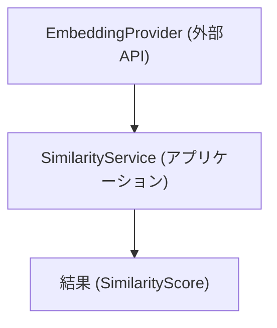

## 処理フロー - End-to-End

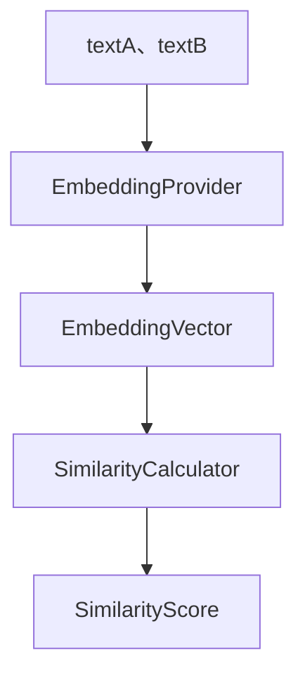

## ApiClient 仕様 (型安全インターフェース)

本セクションでは、外部 API との通信を担う `ApiClient` の仕様を定義します。
本クライアントは、OpenAPI から生成された型 (TypeScript、Zod) を利用し、型安全な API コールを提供します。

* ApiClient は、Interfaces 層に属します。
* Application 層は、ApiClient のみを依存対象とします。
* 実装は、DI により差し替え可能とします。

### 設計意図 (ゴール)

* API コールを、型安全にします。
* 契約 (OpenAPI) と実装の、乖離を防ぎます。
* エラーハンドリングとリトライを、統一します。

### 設計方針 (規約)

* OpenAPI から生成された型のみを使用します。
* raw client (generated/api) は、直接使用しません。
* ApiClient が、唯一の外部 API 窓口となります。
* 入出力は、すべて型で保証します。

### エラーハンドリング方針

* `4xx`: ValidationError
* `5xx`: ServerError
* Network: Retry 対象

### 責務

| 項目 | 内容 |
| ------- | -------------------------- |
| 認証 | API キー付与 |
| 通信 | HTTP リクエスト実行 |
| バリデーション | Zod による runtime validation |
| エラー処理 | HTTP エラーの統一処理 |

### 非責務

| 項目 | 内容 |
| ------- | --------------------- |
| DTO 定義 | generated に委譲 |
| 類似度計算 | Core に委譲 |
| プロバイダ処理 | EmbeddingStrategy に委譲 |

### rawClient との関係

* generated/api の raw client は、低レベル API です。
* ApiClient は、これをラップします。
* raw client の直接使用は、禁止します。

### インターフェース定義

```ts
import { SimilarityRequest, SimilarityResponse } from "@s2j/similarity-client";

export interface ApiClient {
  calculateSimilarity(
    request: SimilarityRequest
  ): Promise<SimilarityResponse>;

  generateEmbedding(
    request: EmbeddingRequest
  ): Promise<EmbeddingResponse>;
}
```

### 実装例 (fetch ベース)

```ts
import { z } from "zod";
import {
  SimilarityRequest,
  SimilarityResponse,
} from "@s2j/similarity-client";
import { SimilarityResponseSchema } from "@s2j/similarity-client";

export class DefaultApiClient implements ApiClient {
  constructor(
    private readonly baseUrl: string,
    private readonly apiKey?: string
  ) {}

  async calculateSimilarity(
    request: SimilarityRequest
  ): Promise<SimilarityResponse> {
    const res = await fetch(`${this.baseUrl}/v1/similarity`, {
      method: "POST",
      headers: {
        "Content-Type": "application/json",
        ...(this.apiKey && { Authorization: `Bearer ${this.apiKey}` }),
      },
      body: JSON.stringify(request),
    });

    if (!res.ok) {
      throw new Error(`API error: ${res.status}`);
    }

    const json = await res.json();

    // runtime validation（Zod）
    return SimilarityResponseSchema.parse(json);
  }
}
```

### 通信制御 (Retry、Timeout、Circuit Breaker)

ApiClient は、外部 API コールにおける信頼性を確保するため、以下の通信制御を提供します。

#### 設計意図 (ゴール)

* 一時的なネットワーク障害からの回復
* API の応答遅延による、処理停止の防止
* 外部サービス障害時の、システム全体への影響の抑制

#### 設計方針 (規約)

* 設定値は、コンストラクタ経由で注入可能とします。
* リトライ対象は、「安全な再実行が可能なリクエスト」のみとします。
* タイムアウトは、全リクエストに適用します。
* サーキットブレーカーは、外部 API 単位で管理します。

#### 責務

* 「通信の信頼性」の確保です。
* エラーの「分類と制御」です。

#### 非責務

* ビジネスロジックのリトライ判断 (Application 側)
* API 仕様変更への対応 (Contracts 側)

#### エラー分類との関係 (Retry、Circuit Breaker)

| エラー種別 | Retry | Circuit Breaker |
| ------------ | ----- | --------------- |
| NetworkError | 可 | 可 |
| `5xx` | 可 | 可 |
| `4xx` | 不可 | 不可 |

#### Circuit Breaker

##### 状態

* `CLOSED`: 通常動作
* `OPEN`: リクエスト遮断
* `HALF-OPEN`: 試験的に1リクエスト許可

##### 遷移条件

| 条件 | 動作 |
| -------- | --------- |
| 連続失敗の回数超過 | OPEN |
| 一定時間の経過 | HALF-OPEN |
| 成功 | CLOSED |
| 再失敗 | OPEN |

##### デフォルト設定

| 項目 | 値 |
| ---- | --- |
| 失敗閾値 | 5回 |
| 回復時間 | 30秒 |

#### Retry

##### ポリシー

* 対象
  * ネットワークエラー
  * `5xx` レスポンス
* 非対象
  * `4xx` (バリデーションエラー等)

##### デフォルト設定

| 項目 | 値 |
| -------- | ----------- |
| 最大リトライ回数 | 2 |
| バックオフ | exponential |
| 初期の待機時間 | 100ms |

#### Timeout

##### ポリシー

* 全リクエストに適用します。
* fetch の AbortController を使用します。

##### デフォルト設定

| 項目 | 値 |
| ------ | ------ |
| タイムアウト | 5000ms |

### Fetch Abstraction (通信レイヤ抽象化)

ApiClient は、HTTP 通信を直接扱わず、抽象化された Fetch インターフェースを経由して実行します。

#### 設計意図 (ゴール)

* 通信実装 (fetch、axios、node-fetch) の差し替えを可能にします。
* テスト容易性を向上させます (Mock 可能)。
* 通信制御 (Retry、Timeout、Circuit Breaker) を一元化します。

#### 設計方針 (規約)

* ApiClient は、Fetch 実装に依存しません。
* Fetch 実装は、DI (依存性注入) で渡します。
* 通信制御は、Fetch 層に集約します。

#### 責務

* 通信を抽象化します。
* 実装差し替えを提供します。
* テスト容易性を確保します。

#### 非責務

* API 仕様の管理 (OpenAPI)
* DTO 定義 (generated)

#### インターフェース定義

```ts
export interface HttpClient {
  request<TResponse>(
    input: RequestInfo,
    init?: RequestInit
  ): Promise<TResponse>;
}
```

#### 実装構成

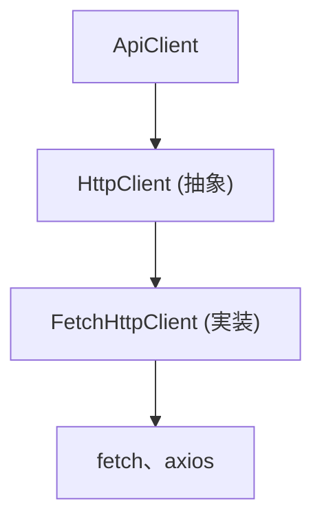

#### デフォルト実装 (FetchHttpClient)

```ts
export class FetchHttpClient implements HttpClient {
  async request<TResponse>(
    input: RequestInfo,
    init?: RequestInit
  ): Promise<TResponse> {
    const res = await fetch(input, init);

    if (!res.ok) {
      throw new Error(`HTTP Error: ${res.status}`);
    }

    return res.json() as Promise<TResponse>;
  }
}
```

#### ApiClient との統合

```ts
export class DefaultApiClient implements ApiClient {
  constructor(
    private readonly http: HttpClient,
    private readonly baseUrl: string
  ) {}

  async calculateSimilarity(request: SimilarityRequest) {
    return this.http.request<SimilarityResponse>(
      `${this.baseUrl}/v1/similarity`,
      {
        method: "POST",
        body: JSON.stringify(request),
        headers: {
          "Content-Type": "application/json",
        },
      }
    );
  }
}
```

#### 拡張ポイント

* RetryHttpClient (デコレータ)
* TimeoutHttpClient (デコレータ)
* CircuitBreakerHttpClient (デコレータ)

#### デコレータ構成例

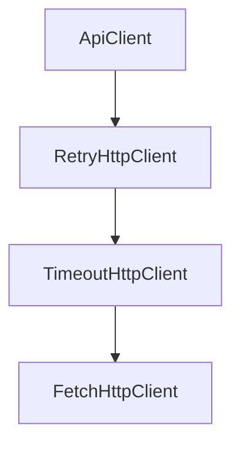

### HttpClient 実装 (Decorator パターン)

本プロジェクトでは、HttpClient に対する機能拡張を、デコレータパターンで実現します。

#### 設計意図 (ゴール)

* Retry、Timeout、Circuit Breaker を、疎結合に追加します。
* 機能の組み合わせを柔軟にします。
* 単一責務を維持します。

#### 設計方針 (規約)

* HttpClient は、最小インターフェースとします。
* 機能は、すべてデコレータとして実装します。
* デコレータは、HttpClient をラップします。

#### 責務

* 各デコレータは、単一の通信機能の提供
* 合成による、機能の拡張

#### 非責務

* API 仕様の解釈 (ApiClient)
* DTO の検証 (Zod)

#### インターフェース

```ts
export interface HttpClient {
  request<TResponse>(
    input: RequestInfo,
    init?: RequestInit
  ): Promise<TResponse>;
}
```

#### ベース実装

```ts
export class FetchHttpClient implements HttpClient {
  async request<TResponse>(
    input: RequestInfo,
    init?: RequestInit
  ): Promise<TResponse> {
    const res = await fetch(input, init);

    if (!res.ok) {
      throw new Error(`HTTP Error: ${res.status}`);
    }

    return res.json() as Promise<TResponse>;
  }
}
```

#### デコレータ例

##### RetryHttpClient

```ts
export class RetryHttpClient implements HttpClient {
  constructor(
    private readonly inner: HttpClient,
    private readonly maxRetries = 2
  ) {}

  async request<T>(input: RequestInfo, init?: RequestInit): Promise<T> {
    let lastError;

    for (let i = 0; i <= this.maxRetries; i++) {
      try {
        return await this.inner.request<T>(input, init);
      } catch (e) {
        lastError = e;
      }
    }

    throw lastError;
  }
}
```

##### TimeoutHttpClient

```ts
export class TimeoutHttpClient implements HttpClient {
  constructor(
    private readonly inner: HttpClient,
    private readonly timeoutMs = 5000
  ) {}

  async request<T>(input: RequestInfo, init?: RequestInit): Promise<T> {
    const controller = new AbortController();
    const id = setTimeout(() => controller.abort(), this.timeoutMs);

    try {
      return await this.inner.request<T>(input, {
        ...init,
        signal: controller.signal,
      });
    } finally {
      clearTimeout(id);
    }
  }
}
```

#### 構成例

```ts
const httpClient =
  new RetryHttpClient(
    new TimeoutHttpClient(
      new FetchHttpClient()
    )
  );
```

### エラー型 (DomainError) 統一

ApiClient では、すべてのエラーを DomainError に正規化します。

#### 設計意図 (ゴール)

* エラー処理を一貫させます。
* UI、Application 層での分岐を、単純化します。
* 外部 API 依存を、隠蔽します。

#### 設計方針 (規約)

* 外部エラーは、直接投げません。
* 必ず DomainError に変換します。
* 型で分類可能にします。

#### 責務

* エラーの分類と標準化
* 型安全なエラーハンドリングの提供

#### 非責務

* UI 表示ロジック
* ログフォーマット

#### エラー型定義

```ts
export type DomainError =
  | NetworkError
  | TimeoutError
  | ValidationError
  | ApiError
  | UnknownError;
```

#### 各エラー

```ts
export class NetworkError extends Error {
  readonly type = "NetworkError";
}

export class TimeoutError extends Error {
  readonly type = "TimeoutError";
}

export class ValidationError extends Error {
  readonly type = "ValidationError";
}

export class ApiError extends Error {
  readonly type = "ApiError";
  constructor(public status: number, message: string) {
    super(message);
  }
}

export class UnknownError extends Error {
  readonly type = "UnknownError";
}
```

#### 変換ルール

| 元エラー | DomainError |
| ------------ | --------------- |
| fetch 失敗 | NetworkError |
| AbortError | TimeoutError |
| Zod 失敗 | ValidationError |
| HTTP `4xx`/`5xx` | ApiError |
| その他 | UnknownError |

### OpenAPI → Error 型マッピング

OpenAPI のレスポンス仕様と DomainError を、対応付けます。

#### 設計意図 (ゴール)

* API 仕様とエラー処理を、一致させます。
* 型安全なエラー処理を、実現します。

#### 設計方針 (規約)

* HTTP ステータスベースで、マッピングします。
* 必要に応じて、レスポンスボディも解析します。

#### 責務

* OpenAPI 仕様とエラー処理の整合性維持
* 型安全なエラー変換

#### 非責務

* エラー UI 表示
* ログ集約

#### マッピング定義

| HTTP Status | DomainError |
| ----------- | --------------- |
| 400 | ValidationError |
| 401 | ApiError |
| 403 | ApiError |
| 404 | ApiError |
| 429 | ApiError |
| 500-599 | ApiError |

#### 実装例

```ts
function mapError(res: Response, body: any): DomainError {
  if (res.status === 400) {
    return new ValidationError(body?.message ?? "Bad Request");
  }

  if (res.status >= 500) {
    return new ApiError(res.status, "Server Error");
  }

  return new ApiError(res.status, body?.message ?? "API Error");
}
```

#### ApiClient 内での利用

```ts
if (!res.ok) {
  const body = await res.json().catch(() => ({}));
  throw mapError(res, body);
}
```

#### 拡張ポイント

* OpenAPI の `default`、`error` スキーマの解析
* エラーコードベースで分岐
* i18n 対応

### ApiClient の DI (Dependency Injection) 設計

ApiClient は、依存性注入 (DI) により、構築されます。
これにより、通信実装・設定・ポリシーを柔軟に差し替え可能とします。

#### 設計意図 (ゴール)

* テスト容易性の向上 (モック可能)
* 環境ごとの差し替え (開発、本番)
* 通信ポリシー (Retry、Timeout) の外部化

#### 設計方針 (規約)

* ApiClient は、具象 HttpClient に依存しません。
* 依存は、すべてコンストラクタで注入します。
* デフォルト構成を、ファクトリで提供します。

#### 責務

* 依存関係の明示化
* 「実装の差し替え性」の確保

#### 非責務

* 設定値の管理 (環境変数など)
* インスタンスのグローバル管理

#### コンストラクタ定義

```ts id="di_ctor"
export class DefaultApiClient implements ApiClient {
  constructor(
    private readonly http: HttpClient,
    private readonly baseUrl: string,
    private readonly apiKey?: string
  ) {}
}
```

#### ファクトリ (推奨)

```ts id="di_factory"
export function createApiClient(config: {
  baseUrl: string;
  apiKey?: string;
  timeoutMs?: number;
  retryCount?: number;
}): ApiClient {
  const base = new FetchHttpClient();

  const http =
    new RetryHttpClient(
      new TimeoutHttpClient(
        base,
        config.timeoutMs ?? 5000
      ),
      config.retryCount ?? 2
    );

  return new DefaultApiClient(http, config.baseUrl, config.apiKey);
}
```

#### テスト時の差し替え

```ts id="di_mock"
const mockHttpClient: HttpClient = {
  request: async () => ({ similarityScore: 0.9 })
};

const client = new DefaultApiClient(mockHttpClient, "http://test");
```

### エラーのロギング戦略

ApiClient は、エラー発生時にログを出力するが、ログ処理は、抽象化された Logger インターフェースを通じて行います。

#### 設計意図 (ゴール)

* ログ出力先は、差し替え (console、Datadog、Sentry) 可能にします。
* エラー観測性を向上させます。
* ドメインロジックとログ処理を分離します。

#### 設計方針 (規約)

* ログは、Logger インターフェース経由で出力します。
* DomainError を、そのままログに出しません (整形します)。
* 個人情報 (PII) は、ログに含めません。

#### 責務

* エラーの観測性向上
* ログ出力の統一

#### 非責務

* ログ保存先の管理
* アラート設定

#### ログポリシー

| 項目 | 内容 |
| --------- | ----- |
| エラー内容 | 必須 |
| HTTP ステータス | 必須 |
| リクエストボディ | 原則非出力 |
| 個人情報 | 出力禁止 |

#### Logger インターフェース

```ts id="logger_if"
export interface Logger {
  error(message: string, meta?: Record<string, unknown>): void;
  warn(message: string, meta?: Record<string, unknown>): void;
  info(message: string, meta?: Record<string, unknown>): void;
}
```

#### デフォルト実装

```ts id="logger_console"
export class ConsoleLogger implements Logger {
  error(msg: string, meta?: any) {
    console.error(msg, meta);
  }
  warn(msg: string, meta?: any) {
    console.warn(msg, meta);
  }
  info(msg: string, meta?: any) {
    console.info(msg, meta);
  }
}
```

#### ApiClient 内での利用

```ts id="logger_use"
try {
  return await this.http.request(...);
} catch (err) {
  this.logger.error("API request failed", {
    errorType: err?.type,
    message: err?.message,
  });
  throw err;
}
```

### OpenAPI Error Schema の拡張

OpenAPI にエラー用スキーマを定義し、DomainError との対応関係を明確化します。

#### 設計意図 (ゴール)

* API エラーの構造を統一します。
* クライアント側で型安全に扱います。
* エラーハンドリングの一貫性を確保します。

#### 設計方針 (規約)

* すべてのエラーは、共通フォーマットで返します。
* `error.code` によって、分類可能とします。
* OpenAPI に、明示的に定義します。

#### 責務

* エラー構造の標準化
* API 契約との整合性確保

#### 非責務

* エラー表示のデザイン
* メッセージ翻訳

#### OpenAPI 例

```yaml id="error_schema"
components:
  schemas:
    ErrorResponse:
      type: object
      required: [code, message]
      properties:
        code:
          type: string
          example: INVALID_INPUT
        message:
          type: string
        details:
          type: object
          nullable: true
```

#### ステータス別レスポンス

```yaml id="error_response"
responses:
  '400':
    description: Validation Error
    content:
      application/json:
        schema:
          $ref: '#/components/schemas/ErrorResponse'
```

#### DomainError との対応

| error.code | DomainError |
| -------------- | --------------- |
| INVALID_INPUT | ValidationError |
| UNAUTHORIZED | ApiError |
| RATE_LIMIT | ApiError |
| INTERNAL_ERROR | ApiError |

#### マッピング実装例

```ts id="error_map2"
function mapErrorResponse(body: any): DomainError {
  switch (body.code) {
    case "INVALID_INPUT":
      return new ValidationError(body.message);
    default:
      return new ApiError(500, body.message);
  }
}
```

#### 拡張ポイント

* エラーコードの、列挙型化 (enum)
* i18n 対応
* フロント UI との連携

## PHP 使用例

### 1. 初期化

```php id="php_init"
use App\Infrastructure\OpenAIEmbeddingProvider;
use App\Application\SimilarityService;

$provider = new OpenAIEmbeddingProvider($apiKey);

$service = new SimilarityService($provider);
```

### 2. 類似度算出

```php id="php_usage"
$textA = "WordPress プラグイン開発";
$textB = "WP plugin development";

$score = $service->calculate($textA, $textB);

echo $score; // 0.0 - 1.0
```

### 3. 低レベル利用 (Embedding + Core)

```php id="php_low"
$vectorA = $provider->embed($textA);
$vectorB = $provider->embed($textB);

$score = SimilarityCalculator::calculate($vectorA, $vectorB);
```

## JavaScript 使用例

### 1. 初期化

```ts id="ts_init"
import { OpenAIEmbeddingProvider } from "./infrastructure";
import { SimilarityService } from "./application";

const provider = new OpenAIEmbeddingProvider(apiKey);
const service = new SimilarityService(provider);
```

### 2. 類似度算出

```ts id="ts_usage"
const textA = "WordPress プラグイン開発";
const textB = "WP plugin development";

const score = await service.calculate(textA, textB);

console.log(score);
```

### 3. 低レベル利用

```ts id="ts_low"
const vectorA = await provider.embed(textA);
const vectorB = await provider.embed(textB);

const score = calculateSimilarity(vectorA, vectorB);
```

## 設定

### 設定項目

| 項目 | 説明 |
| ------- | --------------- |
| apiKey | Embedding API キー |
| model | 使用モデル |
| timeout | タイムアウト |

### 例 - PHP

```php id="php_config"
$provider = new OpenAIEmbeddingProvider([
    'apiKey' => 'xxx',
    'model' => 'text-embedding-3-small',
]);
```

## エラーハンドリング

### PHP

```php id="php_error"
try {
    $score = $service->calculate($textA, $textB);
} catch (ValidationException $e) {
    // 入力エラー
} catch (ProviderException $e) {
    // APIエラー
}
```

### JavaScript

```ts id="ts_error"
try {
  const score = await service.calculate(textA, textB);
} catch (e) {
  if (e instanceof ValidationError) {
    // 入力エラー
  }
}
```

## ベストプラクティス

### Provider の再利用

* 毎回生成しません。
* シングルトンとして扱います。

### キャッシュ

* Embedding 結果をキャッシュします。
* API コストを削減します。

### 非同期処理 - JavaScript

* 並列実行を可能とします。
* Promise.all を活用します。

## CI での契約検証

本プロジェクトでは、OpenAPI (`schema/openapi.yaml`) を唯一の契約 (Source of Truth) とし、CI によって生成物との整合性を自動検証します。

### 設計意図 (ゴール)

* 契約 (OpenAPI) と実装 (生成コード) の乖離を防止します。
* レビュー前に、不整合を検出します。
* リリース品質を担保します。

### 設計方針 (規約)

* 生成物は、常に OpenAPI から再生成します。
* 生成差分がある場合は、CI を失敗させます。
* 生成物の手動編集は、禁止します。

### 責務

* 契約と生成物の同期保証
* 破壊的変更の早期検知

### 非責務

* 実行時のバグ検出 (別途テスト)
* パフォーマンス検証

### 検証フロー

```mermaid id="ci_flow"
flowchart TD
  A["`openapi.yaml` を変更"] --> B["generate スクリプト実行"]
  B --> C["差分チェック (git diff)"]
  C --> D["差分があれば、CI fail"]
```

### 検証対象

| 対象 | 内容 |
| ------------ | --------------------- |
| TypeScript 型 | `generated/models` |
| Zod スキーマ | `generated/schemas` |
| PHP DTO | `php/src/Contracts/DTO` |

### 失敗条件

* 生成結果に差分がある
* codegen エラー
* スキーマ不整合

### 実行コマンド

```bash id="ci_cmd"
./scripts/generate/all.zsh
git diff --exit-code
```

### GitHub Actions 例

```yaml id="ci_yaml"
name: Contract Check

on: [push, pull_request]

jobs:
  contract:
    runs-on: ubuntu-latest

    steps:
      - uses: actions/checkout@v4

      - name: Install dependencies
        run: npm ci

      - name: Generate code
        run: ./scripts/generate/all.zsh

      - name: Check diff
        run: git diff --exit-code
```

## semantic-release (自動バージョニング)

本プロジェクトでは、semantic-release を利用して、バージョニングおよびリリースを自動化します。

### 設計意図 (ゴール)

* バージョン管理の、人為的ミスを防ぎます。
* OpenAPI 変更と SDK バージョンを自動同期します。
* リリースプロセスを標準化します。

### 設計方針 (規約)

* Conventional Commits を必須とします。
* バージョンは、コミット内容から自動決定します。
* 手動での version 更新は、禁止します。

### 責務

* バージョン管理の自動化
* リリースノート生成

### 非責務

* 破壊的変更の検出 (別途ツールで実施)

### リリース対象

* npm (TypeScript SDK)
* GitHub Release

### バージョン決定ルール

| コミット種別 | バージョン |
| --------------- | ----- |
| BREAKING CHANGE | major |
| fix | patch |
| feat | minor |

### OpenAPI との関係

* OpenAPI の変更は、必ずコミットに反映すること。
* breaking change は、`BREAKING CHANGE` を付与すること。

### 設定例

```json id="semantic_release_config"
{
  "branches": ["main"],
  "plugins": [
    "@semantic-release/commit-analyzer",
    "@semantic-release/release-notes-generator",
    "@semantic-release/npm",
    "@semantic-release/github"
  ]
}
```

### GitHub Actions 例

```yaml id="semantic_release_ci"
name: Release

on:
  push:
    branches: [main]

jobs:
  release:
    runs-on: ubuntu-latest

    steps:
      - uses: actions/checkout@v4

      - run: npm ci

      - run: npx semantic-release
```

## OpenAPI Breaking Change 検出

本プロジェクトでは、OpenAPI の変更に対して、breaking change を自動検出します。

### 設計意図 (ゴール)

* API 互換性の破壊を防ぎます。
* 「意図しない breaking change」を検出します。
* semantic-release と連携します。

### 設計方針 (規約)

* OpenAPI の差分を CI で比較します。
* breaking change は、CI を fail させます。
* 明示的に許可する場合のみ、通過させます。

### 責務

* API 互換性の保証
* 破壊的変更の可視化

### 非責務

* ビジネスロジックの変更検出
* パフォーマンス影響分析

### Breaking Change の例

| 変更内容 | 判定 |
| ---------- | -- |
| フィールド削除 | ❌  |
| 型変更 | ❌  |
| required 追加 | ❌  |
| フィールド追加 | ✔  |

### semantic-release との連携

* breaking change 検出時:
  * CI fail
  * または `BREAKING CHANGE` を要求

### 運用ルール

* breaking change は、必ずレビュー対象とすること。
* リリース時は、major version を付与すること。

### 検出ツール

* openapi-diff
* oasdiff (推奨)

### 検証フロー

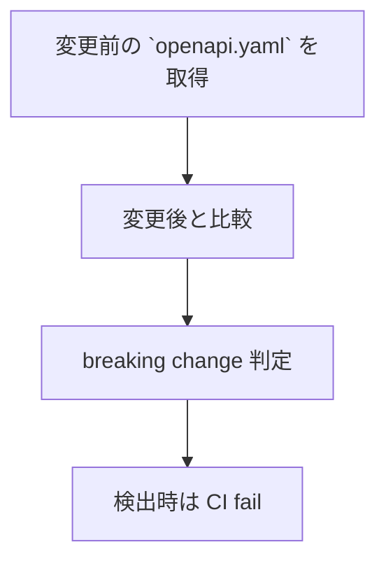

### GitHub Actions 例

```yaml id="oas_ci"
name: OpenAPI Diff

on: [pull_request]

jobs:
  openapi-diff:
    runs-on: ubuntu-latest

    steps:
      - uses: actions/checkout@v4

      - name: Install oasdiff
        run: go install github.com/Tufin/oasdiff@latest

      - name: Compare OpenAPI
        run: |
          oasdiff breaking \
            origin/main:schema/openapi.yaml \
            schema/openapi.yaml
```

## SDK 配布戦略

本プロジェクトは、OpenAPI を起点として複数言語向け SDK を生成・配布します。

### 設計意図 (ゴール)

* フロントエンドとバックエンド間の契約を共有します。
* ユーザーの実装コストを削減します。
* 型安全な API 利用を促進します。

### 設計方針 (規約)

* OpenAPI を、唯一の契約とします。
* SDK は、すべて codegen により生成します。
* 手動実装の SDK は、提供しません。

### 責務

* 契約の配布
* 型安全な利用の提供

### 非責務

* 実装ロジックの提供
* アプリケーション固有処理

### 配布対象

| SDK | 配布方法 |
| ---------- | -------- |
| TypeScript | npm |
| PHP | Composer |

### 非配布対象

* ApiClient (実装)
* HttpClient (通信層)
* Strategy (Embedding)

### バージョン整合性

* OpenAPI version と SDK version を同期させます。
* Git tag を基準とします。

### リリースフロー

```mermaid id="sdk_release"
flowchart TD
  A["`openapi.yaml` 更新"] --> B["generate 実行"]
  B --> C["CI 検証"]
  C --> D["version 更新"]
  D --> E["`npm publish`"]
  D --> F["`composer publish`"]
```

### TypeScript SDK

#### パッケージ

```plaintext id="sdk_ts_pkg"
@s2j/similarity-client
```

#### 内容

* TypeScript 型
* Zod スキーマ
* (任意) raw API client

#### 公開対象

```plaintext id="sdk_ts_files"
dist/
  index.js
  index.d.ts
```

#### バージョニング

* OpenAPI の変更に追従します。
* 破壊的変更 → major
* 互換追加 → minor
* 修正 → patch

### PHP SDK

#### パッケージ

```plaintext id="sdk_php_pkg"
s2j/similarity-client
```

#### 内容

* DTO (`Contracts/DTO`)

#### 配布方法

* Packagist
* GitHub リポジトリ

## SDK の分割戦略 (client と core の分離)

本プロジェクトでは、SDK を責務ごとに分割し、疎結合な構成とします。

### 設計意図 (ゴール)

* 依存関係を最小化します。
* ユーザーの選択肢を拡張します。
* 再利用性を向上させます。

### 設計方針 (規約)

* 契約 (Contracts) と実装 (Client) を、分離します。
* Core ロジックは、独立パッケージとします。
* 各パッケージは、単一責務を持ちます。

### 責務

* SDK の構造設計
* 依存関係の明確化

### 非責務

* アプリケーション統合
* UI 層の設計

### 注意点

* 過剰分割を避けること。
* バージョン整合性を維持すること。

### 利点

* 軽量利用 (型のみ)
* 高度利用 (フル SDK)
* テスト容易性向上

### パッケージ構成

```plaintext id="sdk_split"
packages/
  ts-client/   ← 契約 (型、Zod)
  core/        ← 類似度ロジック
  client/      ← ApiClient 実装
```

### 各パッケージの責務

#### ts-client (Contracts)

* OpenAPI 由来の型
* Zod スキーマ
* raw API client (任意)

#### core (Domain)

* 類似度計算ロジック
* ベクトル操作
* 外部依存なし

#### client (Interfaces)

* ApiClient 実装
* HttpClient、Retry、Timeout
* DomainError、Logger

### 依存関係

```plaintext id="sdk_dep"
core (独立)
ts-client (独立)
client → ts-client
client → core (任意)
```

### 配布戦略

| パッケージ | 配布 |
| --------- | --- |
| ts-client | npm |
| core | npm |
| client | npm |

### 利用例

#### 最小利用 (型のみ)

```ts id="sdk_use1"
import { SimilarityRequest } from "@s2j/similarity-client";
```

#### フル利用 (API コール)

```ts id="sdk_use2"
import { createApiClient } from "@s2j/similarity-client-client";
```

#### コアのみ利用

```ts id="sdk_use3"
import { cosineSimilarity } from "@s2j/similarity-core";
```

## SDK のマルチバージョン管理

本プロジェクトでは、複数バージョンの SDK を並行して維持可能とします。

### 設計意図 (ゴール)

* 既存クライアントの、互換性を維持します。
* 段階的なアップグレードを、可能にします。
* breaking change の影響を、局所化します。

### 設計方針 (規約)

* SemVer に従います。
* major バージョンは、互換性を持ちません。
* 過去バージョンも、一定期間サポートします。

### 責務

* SDK の長期運用
* 互換性維持

### 非責務

* バージョン間の自動移行
* データのマイグレーション

### OpenAPI との対応

* OpenAPI version と SDK version を同期。
* breaking change は、major とします。

### バージョニングモデル

| バージョン | 意味 |
| ----- | ------------------ |
| v1.x | 安定版 |
| v2.x | breaking change 含む |
| v3.x | 新仕様 |

### リリース戦略

```plaintext id="multi_release"
v1: 保守
v2: 開発
v3: 実験
```

### 互換性ポリシー

| 変更 | 対応 |
| ------- | ----- |
| フィールド追加 | minor |
| フィールド削除 | major |
| 型変更 | major |

### 廃止 (Deprecation)

* deprecated フラグを OpenAPI に付与
* SDK に警告を出す

### npm (TypeScript SDK)

* major ごとに、共存可能とします。
* import は、バージョン固定します。

```ts id="sdk_import"
import { SimilarityRequest } from "@s2j/similarity-client@1";
```

### Composer (PHP)

* バージョン制約で管理します。

```json id="composer_req"
{
  "require": {
    "s2j/similarity-client": "^1.0"
  }
}
```

## モノレポ管理 (pnpm、turborepo)

本プロジェクトは、複数パッケージ (TypeScript SDK、PHP DTO、Core) を単一リポジトリで管理するため、モノレポ構成を採用します。

### 設計意図 (ゴール)

* 契約 (OpenAPI) を中心に、複数言語の実装を同期します。
* パッケージ間の整合性を保ちます。
* CI、ビルドの効率化を図ります。

### 設計方針 (規約)

* パッケージは、`packages/` 配下に配置します。
* 依存関係は、ワークスペースで管理します。
* ビルド・生成は、タスクランナーで統合します。

### 責務

* パッケージ間の整合性維持
* ビルドの効率化

### 非責務

* 各パッケージの内部設計
* 外部の配布戦略

### ディレクトリ構成

```plaintext id="monorepo_structure"
packages/
  ts-client/
  php/
src/
schema/
scripts/
```

### 依存関係

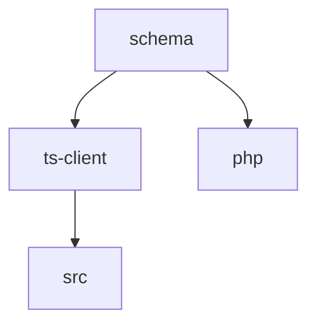

### タスク例

```bash id="monorepo_cmd"
pnpm turbo run generate
pnpm turbo run build
```

### pnpm (パッケージ管理)

#### 特徴

* 高速インストール
* ディスク効率
* ワークスペース対応

#### 設定例

```yaml id="pnpm_workspace"
packages:
  - "packages/*"
```

### turborepo (タスク管理)

#### 特徴

* ビルドキャッシュ
* 並列実行
* タスク依存関係の管理

#### 設定例

```json id="turbo_config"
{
  "pipeline": {
    "generate": {},
    "build": {
      "dependsOn": ["^build"],
      "outputs": ["dist/**"]
    }
  }
}
```

## Changesets vs semantic-release の比較

本プロジェクトでは、リリース管理手法として Changesets と semantic-release を比較し、用途に応じて選択します。

### 設計意図 (ゴール)

* モノレポ環境における、最適なリリース戦略を選択します。
* バージョン管理の透明性と、自動化のバランスを取ります。

### 責務

* バージョン管理方式の定義
* チーム運用の標準化

### 非責務

* API 互換性の保証 (OpenAPI diff に委譲)
* リリース内容のレビュー

### 比較概要

| 項目 | semantic-release | Changesets |
| ------- | ---------------- | --------------- |
| バージョン決定 | 自動 (コミットベース) | 手動 (changeset 記述) |
| モノレポ対応 | 弱い | 強い |
| リリース粒度 | 全体 | パッケージ単位 |
| 学習コスト | 低 | 中 |
| 柔軟性 | 低 | 高 |

### semantic-release の特徴

* Conventional Commits にもとづいて、完全自動化できます。
* リリースに人手は不要です。
* 単一パッケージに最適です。

### Changesets の特徴

* 変更内容を、明示的に記述します。
* バージョン管理は、パッケージ単位です。
* モノレポに最適です。

### 採用方針

本プロジェクトでは、以下を推奨します。

* モノレポ構成においては、Changesets を採用します。
* 将来的に単一 SDK 化する場合は、semantic-release に移行可能とします。

### 本プロジェクトでの推奨

| 条件 | 推奨 |
| ----------- | ---------------- |
| 単一パッケージ | semantic-release |
| モノレポ (複数 SDK) | Changesets |

### Changesets 運用フロー

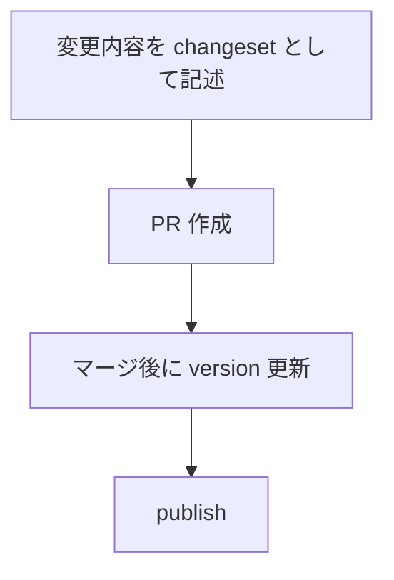

### Changeset 例

```md id="changeset_example"
---
"@s2j/similarity-client": minor
---

Add new embedding endpoint
```

## pnpm + Changesets + turborepo の実構成

本プロジェクトでは、モノレポ管理・バージョン管理・ビルド最適化を統合するため、以下の構成を採用します。

### 設計意図 (ゴール)

* パッケージ間の整合性を維持します。
* リリースを自動化します。
* ビルド効率の最大化を目指します。

### 責務

* モノレポ全体の統合管理
* ビルドとリリースの自動化

### 非責務

* 各パッケージの内部設計
* API 仕様の定義 (OpenAPI)

### 採用技術

| 技術 | 役割 |
| ---------- | ------------ |
| pnpm | パッケージ管理 |
| Changesets | バージョン管理・リリース |
| turborepo | タスク実行・キャッシュ  |

### ディレクトリ構成

```plaintext id="mono_real"
.
├ package.json
├ pnpm-workspace.yaml
├ turbo.json
├ .changeset/
├ packages/
│  ├ ts-client/
│  ├ core/
│  └ client/
├ schema/
├ scripts/
└ src/
```

### リリースフロー

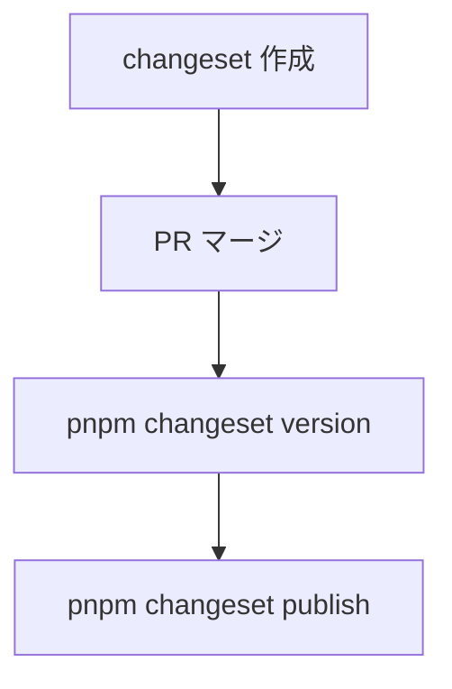

### CI 連携

* generate → build → test → changeset publish
* OpenAPI diff と連携

### `pnpm-workspace.yaml`

```yaml id="pnpm_ws"
packages:
  - "packages/*"
```

### `turbo.json`

```json id="turbo_real"
{
  "pipeline": {
    "generate": {
      "outputs": []
    },
    "build": {
      "dependsOn": ["^build"],
      "outputs": ["dist/**"]
    },
    "lint": {},
    "test": {}
  }
}
```

### ルート `package.json` (抜粋)

```json id="root_pkg"
{
  "private": true,
  "scripts": {
    "generate": "turbo run generate",
    "build": "turbo run build",
    "release": "changeset publish"
  },
  "devDependencies": {
    "turbo": "^1.12.0",
    "@changesets/cli": "^2.26.0"
  }
}
```

### Changesets 初期化

```bash id="changeset_init"
pnpm changeset init
```

## `package.json` の具体的な分割設計

本プロジェクトでは、パッケージごとに責務を分離した `package.json` を定義します。

### 設計意図 (ゴール)

* 各パッケージの独立性を確保します。
* 依存関係を明確化します。
* 配布単位を分離します。

### 責務

* パッケージ単位の構成定義
* 依存関係の明示化

### 非責務

* ビルドツールの設定
* CI の実装

### 依存関係の整理

```plaintext
ts-client   ← 単独 (OpenAPI 依存)
core        ← 単独 (純ロジック)
```

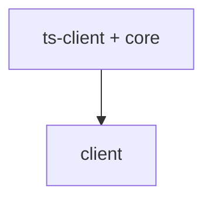

### バージョン管理

* Changesets により、各パッケージ単位で管理します。
* 依存関係は、自動更新します。

### ルート `package.json`

```json id="pkg_root"
{
  "name": "s2j-similarity-service",
  "private": true,
  "scripts": {
    "generate": "turbo run generate",
    "build": "turbo run build",
    "release": "changeset publish"
  }
}
```

### ts-client (Contracts)

```json id="pkg_ts"
{
  "name": "@s2j/similarity-client",
  "version": "0.1.0",
  "main": "dist/index.js",
  "types": "dist/index.d.ts",
  "files": ["dist"],
  "scripts": {
    "generate": "bash ../../scripts/generate/ts.zsh",
    "build": "tsc"
  },
  "dependencies": {
    "zod": "^3.22.0"
  }
}
```

### core (Domain)

```json id="pkg_core"
{
  "name": "@s2j/similarity-core",
  "version": "0.1.0",
  "main": "dist/index.js",
  "types": "dist/index.d.ts",
  "scripts": {
    "build": "tsc"
  },
  "dependencies": {}
}
```

### client (Interfaces)

```json id="pkg_client"
{
  "name": "@s2j/similarity-client-runtime",
  "version": "0.1.0",
  "main": "dist/index.js",
  "types": "dist/index.d.ts",
  "scripts": {
    "build": "tsc"
  },
  "dependencies": {
    "@s2j/similarity-client": "workspace:*",
    "@s2j/similarity-core": "workspace:*"
  }
}
```

### exports (推奨)

```json id="pkg_exports"
{
  "exports": {
    ".": {
      "import": "./dist/index.js",
      "types": "./dist/index.d.ts"
    }
  }
}
```

## tsconfig 分割設計

本プロジェクトでは、モノレポ構成に対応するため、TypeScript 設定を分割し、継承構造で管理します。

### 設計意図 (ゴール)

* 設定の重複を排除します。
* パッケージごとに最適化します。
* ビルドの一貫性を確保します。

### 設計方針 (規約)

* ルートに、共通設定を定義します。
* 各パッケージは、継承します。
* 出力先 (dist) は、パッケージごとに分離します。

### 責務

* TypeScript 設定の統一
* ビルド構造の明確化

### 非責務

* バンドル (Vite など)
* 実行環境の設定

### ビルド方針

* 各パッケージは、独立してビルド可能とします。
* turborepo により、並列ビルド可能とします。

### 構成

```plaintext id="tsconfig_structure"
tsconfig.base.json
packages/
  ts-client/tsconfig.json
  core/tsconfig.json
  client/tsconfig.json
```

### `tsconfig.base.json`

```json id="tsconfig_base"
{
  "compilerOptions": {
    "target": "ES2020",
    "module": "ESNext",
    "moduleResolution": "Node",
    "strict": true,
    "esModuleInterop": true,
    "skipLibCheck": true
  }
}
```

### 各パッケージの tsconfig

```json id="tsconfig_pkg"
{
  "extends": "../../tsconfig.base.json",
  "compilerOptions": {
    "outDir": "dist",
    "rootDir": "src"
  },
  "include": ["src"]
}
```

## ESLint と Prettier 共通化

本プロジェクトでは、コード品質とフォーマットを統一するため、ESLint と Prettier を共通設定として管理します。

### 設計意図 (ゴール)

* コードスタイルを統一します。
* バグの早期検出を目指します。
* チーム開発の効率化を目指します。

### 設計方針 (規約)

* ルートに、共通設定を配置します。
* 各パッケージは、設定を継承します。
* フォーマットは、Prettier に一元化します。

### 責務

* コード品質の統一
* スタイルの標準化

### 非責務

* ビジネスロジックの検証
* パフォーマンス最適化

### CI 連携

* lint エラーで CI fail します。
* format 差分を検出します。

### 構成

```plaintext id="lint_structure"
`eslint.config.js`
`.prettierrc`
```

### ESLint 設定例

```js id="eslint_config"
export default [
  {
    files: ["**/*.ts"],
    languageOptions: {
      parser: "@typescript-eslint/parser"
    },
    rules: {
      "no-unused-vars": "warn"
    }
  }
];
```

### Prettier 設定例

```json id="prettier_config"
{
  "semi": true,
  "singleQuote": true,
  "trailingComma": "all"
}
```

### 実行コマンド

```bash id="lint_cmd"
pnpm lint
pnpm format
```

## CI フル構成

本プロジェクトでは、品質保証のために CI パイプラインを構築します。

### 設計意図 (ゴール)

* 変更による破壊を防ぎます。
* 自動検証による品質を担保します。
* リリースの信頼性を向上します。

### 設計方針 (規約)

* すべての変更は、CI を通過する必要があります。
* 契約・コード・スタイルを検証します。
* 並列実行で高速化します。

### 責務

* 品質保証
* 自動検証

### 非責務

* 手動レビュー
* 本番監視

### 品質ゲート

| チェック | 内容 |
| -------- | ----- |
| generate | 契約同期  |
| lint | コード品質 |
| build | 型チェック |
| test | 動作保証  |
| diff | 生成差分  |

### 失敗条件

* lint でエラーが検出された
* build で失敗した
* generate で差分が検出された
* breaking change が検出された

### パイプライン構成

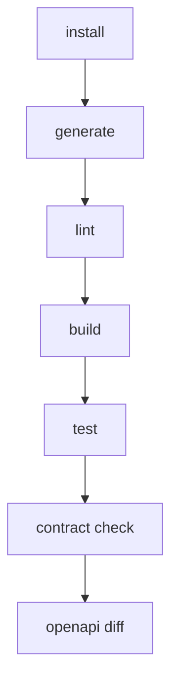

### GitHub Actions 例

```yaml id="ci_full_yaml"
name: CI

on: [push, pull_request]

jobs:
  ci:
    runs-on: ubuntu-latest

    steps:
      - uses: actions/checkout@v4

      - run: npm ci

      - run: ./scripts/generate/all.zsh

      - run: pnpm lint

      - run: pnpm build

      - run: pnpm test

      - run: git diff --exit-code
```

### 並列化 (turborepo)

```bash id="ci_turbo"
pnpm turbo run build --parallel
```

## Vite、build 最適化

本プロジェクトでは、ビルドの高速化と配布物の最適化のために Vite を採用します。

### 設計意図 (ゴール)

* 高速なビルドと開発体験の向上を目指します。
* Tree-shaking による、軽量化を目指します。
* ライブラリとしての最適な出力を目指します。

### 設計方針 (規約)

* 各パッケージは、ライブラリモードでビルドします。
* 不要なコードは、出力しません (Tree-shaking)。
* 依存は、external 指定します。

### 責務

* ビルドの最適化
* 配布物の軽量化

### 非責務

* 型生成 (tsc)
* API 契約生成 (OpenAPI)

### Vite 設定 (ライブラリモード)

```ts id="vite_config"
import { defineConfig } from "vite";

export default defineConfig({
  build: {
    lib: {
      entry: "src/index.ts",
      name: "S2JSimilarity",
      formats: ["es", "cjs"]
    },
    rollupOptions: {
      external: ["zod"],
    }
  }
});
```

### 出力構成

```plaintext id="vite_output"
dist/
  index.es.js
  index.cjs.js
  index.d.ts
```

### 最適化ポイント

#### Tree-shaking

* named export を使用します。
* sideEffects を false に設定します。

#### external 指定

```json id="vite_external"
{
  "sideEffects": false
}
```

#### sourcemap

```ts id="vite_sourcemap"
build: {
  sourcemap: true
}
```

### turborepo との連携

```bash id="vite_turbo"
pnpm turbo run build
```

## package exports 戦略 (ESM、CJS 対応)

本プロジェクトでは、異なる実行環境 (Node.js、Browser) に対応するため、ESM と CJS の両形式を提供します。

### 設計意図 (ゴール)

* Node.js とブラウザの互換性を確保します。
* ユーザーの、環境差異を吸収します。
* 将来的な ESM 移行に対応します。

### 設計方針 (規約)

* ESM を第一優先とします。
* CJS は、互換性のために提供します。
* exports フィールドで、明示的に定義します。

### 責務

* 実行環境の互換性の提供
* 安定した API 公開

### 非責務

* ランタイム・ポリフィル
* レガシー環境対応 (Internet Explorer など)

### 条件分岐

| 環境 | 使用形式 |
| ---------- | ------- |
| Node (ESM) | import |
| Node (CJS) | require |
| Browser | import |

### 互換性

* Node v14+
* bundler (Vite、webpack、Rollup) 対応

### 注意点

* deep import を禁止します。
* exports に定義されたパスのみ、公開します。

### サブパスのエクスポート (任意)

```json id="pkg_subpath"
{
  "exports": {
    "./core": {
      "import": "./dist/core.es.js",
      "require": "./dist/core.cjs.js"
    }
  }
}
```

### `package.json` 設定

```json id="pkg_exports_full"
{
  "type": "module",
  "main": "./dist/index.cjs.js",
  "module": "./dist/index.es.js",
  "types": "./dist/index.d.ts",
  "exports": {
    ".": {
      "import": "./dist/index.es.js",
      "require": "./dist/index.cjs.js",
      "types": "./dist/index.d.ts"
    }
  }
}
```

## dual package hazard 回避設計

本プロジェクトでは、ESM と CJS の両形式を提供する際に発生する「dual package hazard (モジュールの二重読み込み問題)」を回避します。

### 設計意図 (ゴール)

* 同一モジュールが、ESM と CJS で別インスタンスとして読み込まれる問題を防ぎます。
* 状態不整合 (singleton 崩壊) を防止します。
* 利用環境差による、バグを排除します。

### 設計方針 (規約)

* 単一の内部実装に、統一します。
* exports により、entry を制御します。
* 「状態」を持つモジュールを避けます (原則 stateless)。

### 責務

* モジュールの一貫性保証
* 実行時バグの防止

### 非責務

* バンドラ依存の解決
* Node の仕様変更に対応

### 問題例

```plaintext id="dual_problem"
ESM import → instance A
CJS require → instance B

→ 同一モジュールが2つ存在
```

### NG パターン

* 状態を持つキャッシュ
* static singleton
* グローバル変数

### 推奨パターン

* pure function
* factory function
* DI によるインスタンス管理

### 回避戦略

#### 1. 内部実装を単一にする

```plaintext id="dual_strategy1"
src/ (単一ソース)
 ↓
dist/index.es.js
dist/index.cjs.js
```

#### 2. exports で統制

```json id="dual_exports"
{
  "exports": {
    ".": {
      "import": "./dist/index.es.js",
      "require": "./dist/index.cjs.js"
    }
  }
}
```

#### 3. singleton を持たない設計

* グローバル状態を持たない
* DI (Dependency Injection) を使用

## NodeNext、bundler 解像度問題

Node.js (NodeNext) と bundler (Vite、webpack) では、モジュール解決方式が異なるため、互換性を確保します。

### 設計意図 (ゴール)

* Node.js と bundler 間の解像度差異を吸収します。
* import エラーを防止します。
* 型解決と実行解決を一致させます。

### 設計方針 (規約)

* exports フィールドを、唯一の公開インターフェースとします。
* 拡張子を明示します。
* TypeScript の moduleResolution を NodeNext に統一します。

### 責務

* モジュール解決の一貫性確保
* 環境差異の吸収

### 非責務

* 古い Node バージョンの対応
* 特定 bundler の最適化

### 解像度の違い

| 環境 | 解決方法 |
| -------- | ---------- |
| NodeNext | exports 優先 |
| bundler | 拡張子補完あり |

### 推奨ルール

* 相対パスには、拡張子を付与します。
* deep import を禁止します。
* exports に定義されたパスのみ、使用します。

### bundler 対応

* Vite、Rollup は、exports を解釈します。
* webpack は、設定に依存します。

### 問題例

```ts id="resolve_problem"
// NG (NodeNext で失敗)
import { foo } from "./utils";
```

### 正しい記述

```ts id="resolve_ok"
import { foo } from "./utils.js";
```

### TypeScript 設定

```json id="ts_nodenext"
{
  "compilerOptions": {
    "module": "NodeNext",
    "moduleResolution": "NodeNext"
  }
}
```

### exports による統制

```json id="resolve_exports"
{
  "exports": {
    "./utils": {
      "import": "./dist/utils.js"
    }
  }
}
```

## edge runtime (CloudFlare Workers 対応)

本プロジェクトでは、エッジ環境 (CloudFlare Workers など) での実行を考慮して設計します。

### 設計意図 (ゴール)

* 低レイテンシでの API コールを目指します。
* サーバーレス環境への対応を目指します。
* 将来的なエッジ分散処理への拡張を目指します。

### 設計方針 (規約)

* Node.js 固有 API に依存しません。
* fetch ベースの実装を採用します。
* 軽量でバンドル可能な構成とします。

### 責務

* エッジ環境での動作保証
* 軽量実行の実現

### 非責務

* Node.js 専用最適化
* 長時間処理

### 制約

* `fs` / `path` などの Node API は、使用不可とします。
* require (CJS) は、非対応とします。
* 同期処理は、制限されます。

### 対応環境

| 環境 | 対応 |
| ------------------ | ----- |
| CloudFlare Workers | ✔ |
| Vercel Edge | ✔ |
| Deno | ✔ (一部) |

### 実装方針

#### HttpClient

* fetch ベース (標準 API)
* AbortController 対応

#### 依存関係

* 軽量ライブラリのみ使用します。
* Node 専用パッケージは、禁止します。

### 注意点

* 環境依存コードを分離します。
* polyfill に依存しません。

### バンドル

```ts id="edge_vite"
export default {
  build: {
    target: "es2022"
  }
};
```

## ESM only 化戦略

本プロジェクトでは、将来的に ESM (ECMAScript Modules) のみを提供する構成に移行します。

### 設計意図 (ゴール)

* モジュール解決を、簡素化します。
* dual package hazard を完全排除します。
* edge runtime との完全互換を目指します。

### 設計方針 (規約)

* ESM を標準とします。
* CJS は、段階的に廃止します。
* exports フィールドで制御します。

### 責務

* モジュール戦略の統一
* 将来の保守性向上

### 非責務

* 旧環境サポート
* 自動移行ツール提供

### 現状

* ESM + CJS のデュアル構成です。

### 移行ステップ

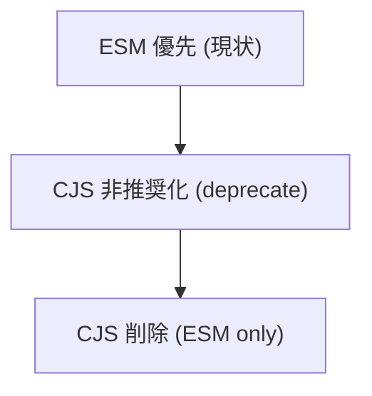

### 変更点

| 項目 | 内容 |
| ------- | ---- |
| require | 使用不可 |
| import | 必須 |
| 拡張子 | 明示 |

### ユーザーへの影響

* Node.js は、v16+ 推奨
* bundler は、対応済み

### 非推奨対応

```plaintext id="esm_warn"
CJS ユーザーには、deprecation warning を表示
```

### 利点

* 設計を単純化できます。
* ビルドを軽量化できます。
* エッジ互換性を向上できます。

### 注意点

* 古い環境との互換性が低下します。
* 移行期間の確保が必要です。

### `package.json`

```json id="esm_pkg"
{
  "type": "module",
  "exports": {
    ".": {
      "import": "./dist/index.js"
    }
  }
}
```

## runtime 別 build 出し分け (edge、node)

本プロジェクトでは、実行環境 (Edge、Node.js) ごとに最適化された、ビルド成果物を出し分けます。

### 設計意図 (ゴール)

* 実行環境ごとの制約差 (API、バンドルサイズ) を吸収します。
* パフォーマンスの最適化 (Edge は軽量。Node は機能重視) を目指します。
* 互換性の維持と将来の拡張性を確保します。

### 設計方針 (規約)

* 単一ソース (src) から複数ターゲットにビルドします。
* 環境差は、entry ポイントで吸収します。
* 実行時分岐ではなく、**ビルド時分岐** を優先します。

### 責務

* 環境ごとの最適ビルドの提供
* 実行時の互換性の担保

### 非責務

* 実行時の環境判定
* polyfill 提供

### ターゲット

| ターゲット | 想定環境 | 特徴 |
| ----- | -------------------------------- | ---------- |
| edge | CloudFlare Workers / Vercel Edge | 軽量・標準 API のみ |
| node | Node.js | フル機能・互換性重視 |

### 実装指針

* `edge.ts`: fetch、Web 標準 API のみ使用します。
* `node.ts`: 必要に応じて、Node API を使用します。
* 共通ロジックは、`index.ts` に集約します。

### 注意点

* Node 専用依存は、edge に含めません (external)。
* 環境判定コード (`process.env` など) は、極力排除します。

### entry 構成

```plaintext id="runtime_entry"
src/
  index.ts        ← 共通
  runtime/
    edge.ts       ← Edge 用
    node.ts       ← Node 用
```

### 出力構成

```plaintext id="runtime_dist"
dist/
  edge.js
  node.es.js
  node.cjs.js
```

### Vite 設定例

```ts id="runtime_vite"
import { defineConfig } from "vite";

export default defineConfig([
  {
    build: {
      lib: {
        entry: "src/runtime/edge.ts",
        formats: ["es"],
        fileName: "edge"
      },
      target: "es2022"
    }
  },
  {
    build: {
      lib: {
        entry: "src/runtime/node.ts",
        formats: ["es", "cjs"],
        fileName: "node"
      },
      target: "node18"
    }
  }
]);
```

## conditional exports の高度設計

本プロジェクトでは、Node.js の conditional exports を利用して、環境ごとに適切な entry ポイントを提供します。

### 設計意図 (ゴール)

* 実行環境に応じた、最適コードを自動選択します。
* 不要なバンドルを回避します。
* API 公開面を明確化します。

### 設計方針 (規約)

* exports を、唯一の公開インターフェースとします。
* 環境ごとに、明示的に entry を分離します。
* deep import を禁止します。

### 責務

* 環境別 entry の提供
* API 公開面の統制

### 非責務

* 実行環境の検出
* bundler 設定の補助

### 基本構成

```json id="exports_basic"
{
  "exports": {
    ".": {
      "edge": "./dist/edge.js",
      "node": {
        "import": "./dist/node.es.js",
        "require": "./dist/node.cjs.js"
      },
      "default": "./dist/node.es.js"
    }
  }
}
```

### 条件一覧

| 条件 | 説明 |
| ------- | ------------ |
| import | ESM |
| require | CJS |
| node | Node.js |
| edge | Edge runtime |
| default | フォールバック |

### 解決の優先順位

```plaintext id="exports_priority"
1. 環境条件 (edge / node)
2. モジュール形式 (import / require)
3. default
```

### サブパス設計

```json id="exports_subpath"
{
  "exports": {
    "./core": {
      "import": "./dist/core.es.js"
    },
    "./client": {
      "import": "./dist/node.es.js"
    }
  }
}
```

### 利用例

```ts id="exports_usage"
// Edge 環境
import { createClient } from "@s2j/similarity-client";

// Node 環境 (自動的に node 版)
import { createClient } from "@s2j/similarity-client";
```

### 注意点

* 条件は、最小限にします (複雑化防止)。
* bundler が、edge 条件を理解しない場合があります。
* default は、必ず定義します。

### 推奨ルール

* すべての公開 API は、exports 経由します。
* 内部ファイルの直接参照は、禁止します。
* バージョン変更時に exports を見直します。
