<!--
目的：「使用方法」の明文化
-->

# S2J Similarity Service - 使用方法

本ドキュメントは、本ライブラリの **具体的な使用方法 (PHP、JavaScript)** を定義します。
ユーザーが、最小構成で類似度を算出できることを目的とします。

## 概要

本ライブラリは、以下の機能を提供します。

* テキストから Embedding を生成します。
* 2つのテキストの、類似度を算出します。

ユーザーは、EmbeddingProvider を注入し、SimilarityService を利用します。

* Contracts 層の変更は、本仕様に影響します。
* Provider は、差し替え可能です。
* 将来的に REST API と併用可能です。

## 設計意図、設計方針、非対象

### 設計意図 (ゴール)

ユーザーが内部実装を意識せず、**シンプルな API で類似度を利用できるようにします。**

### 設計方針 (規約)

* DI (依存性注入) を前提とします。
* Provider を差し替え可能とします。
* 同一インターフェースで PHP、JS を提供します。

### 非対象 (Out of Scope)

* フレームワークの統合 (WordPress、React 等)
* UI コンポーネント
* API キー管理の実装

## 基本構成

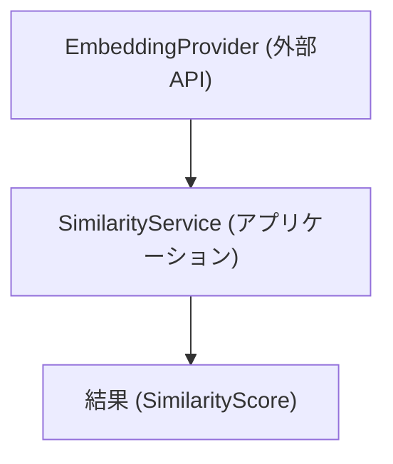

## 処理フロー - End-to-End

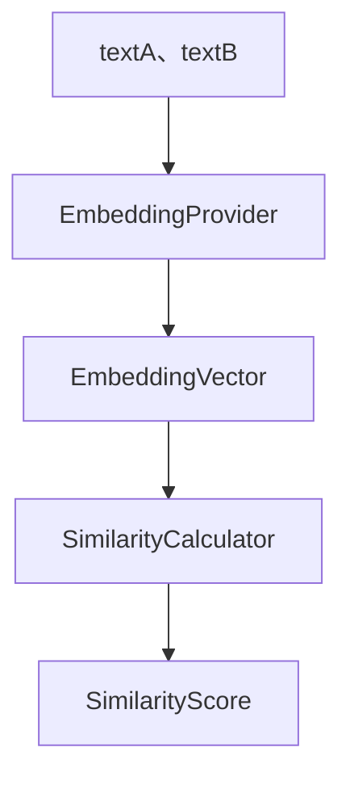

## ApiClient 仕様 (型安全インターフェース)

本セクションでは、外部 API との通信を担う `ApiClient` の仕様を定義します。
本クライアントは、OpenAPI から生成された型 (TypeScript、Zod) を利用し、型安全な API コールを提供します。

* ApiClient は、Interfaces 層に属します。
* Application 層は、ApiClient のみを依存対象とします。
* 実装は、DI により差し替え可能とします。

### 設計意図 (ゴール)

* API コールを、型安全にします。
* 契約 (OpenAPI) と実装の、乖離を防ぎます。
* エラーハンドリングとリトライを、統一します。

### 設計方針 (規約)

* OpenAPI から生成された型のみを使用します。
* raw client (generated/api) は、直接使用しません。
* ApiClient が、唯一の外部 API 窓口となります。
* 入出力は、すべて型で保証します。

### エラーハンドリング方針

* `4xx`: ValidationError
* `5xx`: ServerError
* Network: Retry 対象

### 責務

| 項目 | 内容 |
| ------- | -------------------------- |
| 認証 | API キーを付与すること。 |
| 通信 | HTTP リクエストを実行すること。 |
| バリデーション | Zod による runtime validation を実行すること。 |
| エラー処理 | HTTP エラーの統一処理を実行すること。 |

### 非責務

| 項目 | 内容 |
| ------- | --------------------- |
| DTO 定義 | generated に委譲 |
| 類似度計算 | Core に委譲 |
| プロバイダ処理 | EmbeddingStrategy に委譲 |

### rawClient との関係

* generated/api の raw client は、低レベル API です。
* ApiClient は、これをラップします。
* raw client の直接使用は、禁止します。

### インターフェース定義

```ts
import { SimilarityRequest, SimilarityResponse } from "@s2j/similarity-client";

export interface ApiClient {
  calculateSimilarity(
    request: SimilarityRequest
  ): Promise<SimilarityResponse>;

  generateEmbedding(
    request: EmbeddingRequest
  ): Promise<EmbeddingResponse>;
}
```

### 実装例 (fetch ベース)

```ts
import { z } from "zod";
import {
  SimilarityRequest,
  SimilarityResponse,
} from "@s2j/similarity-client";
import { SimilarityResponseSchema } from "@s2j/similarity-client";

export class DefaultApiClient implements ApiClient {
  constructor(
    private readonly baseUrl: string,
    private readonly apiKey?: string
  ) {}

  async calculateSimilarity(
    request: SimilarityRequest
  ): Promise<SimilarityResponse> {
    const res = await fetch(`${this.baseUrl}/v1/similarity`, {
      method: "POST",
      headers: {
        "Content-Type": "application/json",
        ...(this.apiKey && { Authorization: `Bearer ${this.apiKey}` }),
      },
      body: JSON.stringify(request),
    });

    if (!res.ok) {
      throw new Error(`API error: ${res.status}`);
    }

    const json = await res.json();

    // runtime validation (Zod)
    return SimilarityResponseSchema.parse(json);
  }
}
```

### 通信制御 (Retry、Timeout、Circuit Breaker)

ApiClient は、外部 API コールにおける信頼性を確保するため、以下の通信制御を提供します。

#### 設計意図 (ゴール)

* 一時的なネットワーク障害から回復すること。
* API の応答遅延による、処理停止を防止すること。
* 外部サービス障害時の、システム全体への影響を抑制すること。

#### 設計方針 (規約)

* 設定値は、コンストラクタ経由で注入可能とします。
* リトライ対象は、「安全な再実行が可能なリクエスト」のみとします。
* タイムアウトは、全リクエストに適用します。
* サーキットブレーカーは、外部 API 単位で管理します。

#### 責務

* 「通信の信頼性」を確保すること。
* エラーを分類すること、制御すること。

#### 非責務

* ビジネスロジックのリトライ判断 (Application 側)
* API 仕様変更への対応 (Contracts 側)

#### エラー分類との関係 (Retry、Circuit Breaker)

| エラー種別 | Retry | Circuit Breaker |
| ------------ | ----- | --------------- |
| NetworkError | 可 | 可 |
| `5xx` | 可 | 可 |
| `4xx` | 不可 | 不可 |

#### Circuit Breaker

##### 状態

* `CLOSED`: 通常動作
* `OPEN`: リクエスト遮断
* `HALF-OPEN`: 試験的に1リクエスト許可

##### 遷移条件

| 条件 | 動作 |
| -------- | --------- |
| 連続失敗の回数超過 | OPEN |
| 一定時間の経過 | HALF-OPEN |
| 成功 | CLOSED |
| 再失敗 | OPEN |

##### デフォルト設定

| 項目 | 値 |
| ---- | --- |
| 失敗閾値 | 5回 |
| 回復時間 | 30秒 |

#### Retry

##### ポリシー

* 対象
  * ネットワークエラー
  * `5xx` レスポンス
* 非対象
  * `4xx` (バリデーションエラー等)

##### デフォルト設定

| 項目 | 値 |
| -------- | ----------- |
| 最大リトライ回数 | 2 |
| バックオフ | exponential |
| 初期の待機時間 | 100ms |

#### Timeout

##### ポリシー

* 全リクエストに適用します。
* fetch の AbortController を使用します。

##### デフォルト設定

| 項目 | 値 |
| ------ | ------ |
| タイムアウト | 5000ms |

### Fetch Abstraction (通信レイヤ抽象化)

ApiClient は、HTTP 通信を直接扱わず、抽象化された Fetch インターフェースを経由して実行します。

#### 設計意図 (ゴール)

* 通信実装 (fetch、axios、node-fetch) の差し替えを可能にします。
* テスト容易性を向上させます (Mock 可能)。
* 通信制御 (Retry、Timeout、Circuit Breaker) を一元化します。

#### 設計方針 (規約)

* ApiClient は、Fetch 実装に依存しません。
* Fetch 実装は、DI (依存性注入) で渡します。
* 通信制御は、Fetch 層に集約します。

#### 責務

* 通信を抽象化すること。
* 実装差し替えを提供すること。
* テスト容易性を確保すること。

#### 非責務

* API 仕様の管理 (OpenAPI)
* DTO 定義 (generated)

#### インターフェース定義

```ts
export interface HttpClient {
  request<TResponse>(
    input: RequestInfo,
    init?: RequestInit
  ): Promise<TResponse>;
}
```

#### 実装構成

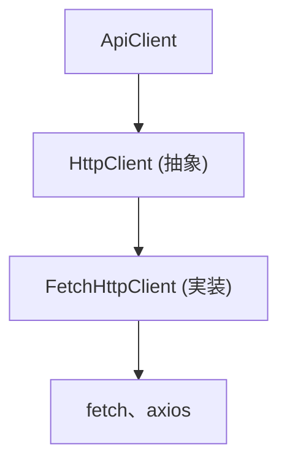

#### デフォルト実装 (FetchHttpClient)

```ts
export class FetchHttpClient implements HttpClient {
  async request<TResponse>(
    input: RequestInfo,
    init?: RequestInit
  ): Promise<TResponse> {
    const res = await fetch(input, init);

    if (!res.ok) {
      throw new Error(`HTTP Error: ${res.status}`);
    }

    return res.json() as Promise<TResponse>;
  }
}
```

#### ApiClient との統合

```ts
export class DefaultApiClient implements ApiClient {
  constructor(
    private readonly http: HttpClient,
    private readonly baseUrl: string
  ) {}

  async calculateSimilarity(request: SimilarityRequest) {
    return this.http.request<SimilarityResponse>(
      `${this.baseUrl}/v1/similarity`,
      {
        method: "POST",
        body: JSON.stringify(request),
        headers: {
          "Content-Type": "application/json",
        },
      }
    );
  }
}
```

#### 拡張ポイント

* RetryHttpClient (デコレータ)
* TimeoutHttpClient (デコレータ)
* CircuitBreakerHttpClient (デコレータ)

#### デコレータ構成例

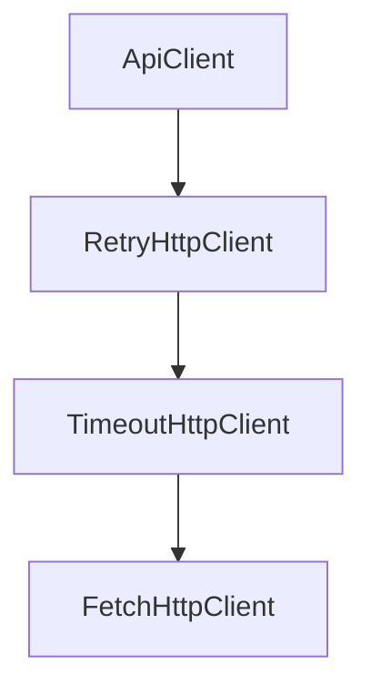

### HttpClient 実装 (Decorator パターン)

本プロジェクトでは、HttpClient に対する機能拡張を、デコレータパターンで実現します。

#### 設計意図 (ゴール)

* Retry、Timeout、Circuit Breaker を、疎結合に追加します。
* 機能の組み合わせを柔軟にします。
* 単一責務を維持します。

#### 設計方針 (規約)

* HttpClient は、最小インターフェースとします。
* 機能は、すべてデコレータとして実装します。
* デコレータは、HttpClient をラップします。

#### 責務

* 各デコレータは、単一の通信機能を提供すること。
* 合成によって、機能を拡張すること。

#### 非責務

* API 仕様の解釈 (ApiClient)
* DTO の検証 (Zod)

#### インターフェース

```ts
export interface HttpClient {
  request<TResponse>(
    input: RequestInfo,
    init?: RequestInit
  ): Promise<TResponse>;
}
```

#### ベース実装

```ts
export class FetchHttpClient implements HttpClient {
  async request<TResponse>(
    input: RequestInfo,
    init?: RequestInit
  ): Promise<TResponse> {
    const res = await fetch(input, init);

    if (!res.ok) {
      throw new Error(`HTTP Error: ${res.status}`);
    }

    return res.json() as Promise<TResponse>;
  }
}
```

#### デコレータ例

##### RetryHttpClient

```ts
export class RetryHttpClient implements HttpClient {
  constructor(
    private readonly inner: HttpClient,
    private readonly maxRetries = 2
  ) {}

  async request<T>(input: RequestInfo, init?: RequestInit): Promise<T> {
    let lastError;

    for (let i = 0; i <= this.maxRetries; i++) {
      try {
        return await this.inner.request<T>(input, init);
      } catch (e) {
        lastError = e;
      }
    }

    throw lastError;
  }
}
```

##### TimeoutHttpClient

```ts
export class TimeoutHttpClient implements HttpClient {
  constructor(
    private readonly inner: HttpClient,
    private readonly timeoutMs = 5000
  ) {}

  async request<T>(input: RequestInfo, init?: RequestInit): Promise<T> {
    const controller = new AbortController();
    const id = setTimeout(() => controller.abort(), this.timeoutMs);

    try {
      return await this.inner.request<T>(input, {
        ...init,
        signal: controller.signal,
      });
    } finally {
      clearTimeout(id);
    }
  }
}
```

#### 構成例

```ts
const httpClient =
  new RetryHttpClient(
    new TimeoutHttpClient(
      new FetchHttpClient()
    )
  );
```

### エラー型 (DomainError) 統一

ApiClient では、すべてのエラーを DomainError に正規化します。

#### 設計意図 (ゴール)

* エラー処理を一貫させます。
* UI、Application 層での分岐を、単純化します。
* 外部 API 依存を、隠蔽します。

#### 設計方針 (規約)

* 外部エラーは、直接投げません。
* 必ず DomainError に変換します。
* 型で分類可能にします。

#### 責務

* エラーを分類することと標準化すること。
* 「型安全なエラーハンドリング」を提供すること。

#### 非責務

* UI 表示ロジック
* ログフォーマット

#### エラー型定義

```ts
export type DomainError =
  | NetworkError
  | TimeoutError
  | ValidationError
  | ApiError
  | UnknownError;
```

#### 各エラー

```ts
export class NetworkError extends Error {
  readonly type = "NetworkError";
}

export class TimeoutError extends Error {
  readonly type = "TimeoutError";
}

export class ValidationError extends Error {
  readonly type = "ValidationError";
}

export class ApiError extends Error {
  readonly type = "ApiError";
  constructor(public status: number, message: string) {
    super(message);
  }
}

export class UnknownError extends Error {
  readonly type = "UnknownError";
}
```

#### 変換ルール

| 元エラー | DomainError |
| ------------ | --------------- |
| fetch 失敗 | NetworkError |
| AbortError | TimeoutError |
| Zod 失敗 | ValidationError |
| HTTP `4xx`/`5xx` | ApiError |
| その他 | UnknownError |

### OpenAPI → Error 型マッピング

OpenAPI のレスポンス仕様と DomainError を、対応付けます。

#### 設計意図 (ゴール)

* API 仕様とエラー処理を、一致させます。
* 型安全なエラー処理を、実現します。

#### 設計方針 (規約)

* HTTP ステータスベースで、マッピングします。
* 必要に応じて、レスポンスボディも解析します。

#### 責務

* OpenAPI 仕様とエラー処理の、整合性を維持すること。
* 型安全なエラーを変換すること。

#### 非責務

* エラー UI 表示
* ログ集約

#### マッピング定義

| HTTP Status | DomainError |
| ----------- | --------------- |
| 400 | ValidationError |
| 401 | ApiError |
| 403 | ApiError |
| 404 | ApiError |
| 429 | ApiError |
| 500-599 | ApiError |

#### 実装例

```ts
function mapError(res: Response, body: any): DomainError {
  if (res.status === 400) {
    return new ValidationError(body?.message ?? "Bad Request");
  }

  if (res.status >= 500) {
    return new ApiError(res.status, "Server Error");
  }

  return new ApiError(res.status, body?.message ?? "API Error");
}
```

#### ApiClient 内での利用

```ts
if (!res.ok) {
  const body = await res.json().catch(() => ({}));
  throw mapError(res, body);
}
```

#### 拡張ポイント

* OpenAPI の `default`、`error` スキーマの解析
* エラーコードベースで分岐
* i18n 対応

### ApiClient の DI (Dependency Injection) 設計

ApiClient は、依存性注入 (DI) により、構築されます。
これにより、通信実装・設定・ポリシーを柔軟に差し替え可能とします。

#### 設計意図 (ゴール)

* テスト容易性を向上します (モック可能)。
* 環境ごとの差し替え (開発、本番) を可能とします。
* 通信ポリシー (Retry、Timeout) を外部化します。

#### 設計方針 (規約)

* ApiClient は、具象 HttpClient に依存しません。
* 依存は、すべてコンストラクタで注入します。
* デフォルト構成を、ファクトリで提供します。

#### 責務

* 依存関係を明示化すること。
* 「実装の差し替え性」を確保すること。

#### 非責務

* 設定値の管理 (環境変数など)
* インスタンスのグローバル管理

#### コンストラクタ定義

```ts id="di_ctor"
export class DefaultApiClient implements ApiClient {
  constructor(
    private readonly http: HttpClient,
    private readonly baseUrl: string,
    private readonly apiKey?: string
  ) {}
}
```

#### ファクトリ (推奨)

```ts id="di_factory"
export function createApiClient(config: {
  baseUrl: string;
  apiKey?: string;
  timeoutMs?: number;
  retryCount?: number;
}): ApiClient {
  const base = new FetchHttpClient();

  const http =
    new RetryHttpClient(
      new TimeoutHttpClient(
        base,
        config.timeoutMs ?? 5000
      ),
      config.retryCount ?? 2
    );

  return new DefaultApiClient(http, config.baseUrl, config.apiKey);
}
```

#### テスト時の差し替え

```ts id="di_mock"
const mockHttpClient: HttpClient = {
  request: async () => ({ similarityScore: 0.9 })
};

const client = new DefaultApiClient(mockHttpClient, "http://test");
```

### エラーのロギング戦略

ApiClient は、エラー発生時にログを出力するが、ログ処理は、抽象化された Logger インターフェースを通じて行います。

#### 設計意図 (ゴール)

* ログ出力先は、差し替え (console、Datadog、Sentry) 可能にします。
* エラー観測性を向上させます。
* ドメインロジックとログ処理を分離します。

#### 設計方針 (規約)

* ログは、Logger インターフェース経由で出力します。
* DomainError を、そのままログに出しません (整形します)。
* 個人情報 (PII) は、ログに含めません。

#### 責務

* エラーの観測性を向上すること。
* ログ出力を統一すること。

#### 非責務

* ログ保存先の管理
* アラート設定

#### ログポリシー

| 項目 | 内容 |
| --------- | ----- |
| エラー内容 | 必須 |
| HTTP ステータス | 必須 |
| リクエストボディ | 原則非出力 |
| 個人情報 | 出力禁止 |

#### Logger インターフェース

```ts id="logger_if"
export interface Logger {
  error(message: string, meta?: Record<string, unknown>): void;
  warn(message: string, meta?: Record<string, unknown>): void;
  info(message: string, meta?: Record<string, unknown>): void;
}
```

#### デフォルト実装

```ts id="logger_console"
export class ConsoleLogger implements Logger {
  error(msg: string, meta?: any) {
    console.error(msg, meta);
  }
  warn(msg: string, meta?: any) {
    console.warn(msg, meta);
  }
  info(msg: string, meta?: any) {
    console.info(msg, meta);
  }
}
```

#### ApiClient 内での利用

```ts id="logger_use"
try {
  return await this.http.request(...);
} catch (err) {
  this.logger.error("API request failed", {
    errorType: err?.type,
    message: err?.message,
  });
  throw err;
}
```

### OpenAPI Error Schema の拡張

OpenAPI にエラー用スキーマを定義し、DomainError との対応関係を明確化します。

#### 設計意図 (ゴール)

* API エラーの構造を統一します。
* クライアント側で型安全に扱います。
* エラーハンドリングの一貫性を確保します。

#### 設計方針 (規約)

* すべてのエラーは、共通フォーマットで返します。
* `error.code` によって、分類可能とします。
* OpenAPI に、明示的に定義します。

#### 責務

* エラー構造を標準化すること。
* API 契約との整合性を確保すること。

#### 非責務

* エラー表示のデザイン
* メッセージ翻訳

#### OpenAPI 例

```yaml id="error_schema"
components:
  schemas:
    ErrorResponse:
      type: object
      required: [code, message]
      properties:
        code:
          type: string
          example: INVALID_INPUT
        message:
          type: string
        details:
          type: object
          nullable: true
```

#### ステータス別レスポンス

```yaml id="error_response"
responses:
  '400':
    description: Validation Error
    content:
      application/json:
        schema:
          $ref: '#/components/schemas/ErrorResponse'
```

#### DomainError との対応

| error.code | DomainError |
| -------------- | --------------- |
| INVALID_INPUT | ValidationError |
| UNAUTHORIZED | ApiError |
| RATE_LIMIT | ApiError |
| INTERNAL_ERROR | ApiError |

#### マッピング実装例

```ts id="error_map2"
function mapErrorResponse(body: any): DomainError {
  switch (body.code) {
    case "INVALID_INPUT":
      return new ValidationError(body.message);
    default:
      return new ApiError(500, body.message);
  }
}
```

#### 拡張ポイント

* エラーコードの、列挙型化 (enum)
* i18n 対応
* フロント UI との連携

## PHP 使用例

### 1. 初期化

```php id="php_init"
use App\Infrastructure\OpenAIEmbeddingProvider;
use App\Application\SimilarityService;

$provider = new OpenAIEmbeddingProvider($apiKey);

$service = new SimilarityService($provider);
```

### 2. 類似度算出

```php id="php_usage"
$textA = "WordPress プラグイン開発";
$textB = "WP plugin development";

$score = $service->calculate($textA, $textB);

echo $score; // 0.0 - 1.0
```

### 3. 低レベル利用 (Embedding + Core)

```php id="php_low"
$vectorA = $provider->embed($textA);
$vectorB = $provider->embed($textB);

$score = SimilarityCalculator::calculate($vectorA, $vectorB);
```

## JavaScript 使用例

### 1. 初期化

```ts id="ts_init"
import { OpenAIEmbeddingProvider } from "./infrastructure";
import { SimilarityService } from "./application";

const provider = new OpenAIEmbeddingProvider(apiKey);
const service = new SimilarityService(provider);
```

### 2. 類似度算出

```ts id="ts_usage"
const textA = "WordPress プラグイン開発";
const textB = "WP plugin development";

const score = await service.calculate(textA, textB);

console.log(score);
```

### 3. 低レベル利用

```ts id="ts_low"
const vectorA = await provider.embed(textA);
const vectorB = await provider.embed(textB);

const score = calculateSimilarity(vectorA, vectorB);
```

## 設定

### 設定項目

| 項目 | 説明 |
| ------- | --------------- |
| apiKey | Embedding API キー |
| model | 使用モデル |
| timeout | タイムアウト |

### 例 - PHP

```php id="php_config"
$provider = new OpenAIEmbeddingProvider([
    'apiKey' => 'xxx',
    'model' => 'text-embedding-3-small',
]);
```

## エラーハンドリング

### PHP

```php id="php_error"
try {
    $score = $service->calculate($textA, $textB);
} catch (ValidationException $e) {
    // 入力エラー
} catch (ProviderException $e) {
    // APIエラー
}
```

### JavaScript

```ts id="ts_error"
try {
  const score = await service.calculate(textA, textB);
} catch (e) {
  if (e instanceof ValidationError) {
    // 入力エラー
  }
}
```

## ベストプラクティス

### Provider の再利用

* 毎回生成しません。
* シングルトンとして扱います。

### キャッシュ

* Embedding 結果をキャッシュします。
* API コストを削減します。

### 非同期処理 - JavaScript

* 並列実行を可能とします。
* Promise.all を活用します。

## CI での契約検証

本プロジェクトでは、OpenAPI (`schema/openapi.yaml`) を唯一の契約 (Source of Truth) とし、CI によって生成物との整合性を自動検証します。

### 設計意図 (ゴール)

* 契約 (OpenAPI) と実装 (生成コード) の乖離を防止します。
* レビュー前に、不整合を検出します。
* リリース品質を担保します。

### 設計方針 (規約)

* 生成物は、常に OpenAPI から再生成します。
* 生成差分がある場合は、CI を失敗させます。
* 生成物の手動編集は、禁止します。

### 責務

* 契約と生成物の同期を保証すること。
* 破壊的変更を早期検知すること。

### 非責務

* 実行時のバグ検出 (別途テスト)
* パフォーマンス検証

### 検証フロー

```mermaid id="ci_flow"
flowchart TD
  A["`openapi.yaml` を変更"] --> B["generate スクリプト実行"]
  B --> C["差分チェック (git diff)"]
  C --> D["差分があれば、CI fail"]
```

### 検証対象

| 対象 | 内容 |
| ------------ | --------------------- |
| TypeScript 型 | `generated/models` |
| Zod スキーマ | `generated/schemas` |
| PHP DTO | `php/src/Contracts/DTO` |

### 失敗条件

* 生成結果に差分がある
* codegen エラー
* スキーマ不整合

### 実行コマンド

```bash id="ci_cmd"
./scripts/generate/all.zsh
git diff --exit-code
```

### GitHub Actions 例

```yaml id="ci_yaml"
name: Contract Check

on: [push, pull_request]

jobs:
  contract:
    runs-on: ubuntu-latest

    steps:
      - uses: actions/checkout@v4

      - name: Install dependencies
        run: npm ci

      - name: Generate code
        run: ./scripts/generate/all.zsh

      - name: Check diff
        run: git diff --exit-code
```

## semantic-release (自動バージョニング)

本プロジェクトでは、semantic-release を利用して、バージョニングおよびリリースを自動化します。

### 設計意図 (ゴール)

* バージョン管理の、人為的ミスを防ぎます。
* OpenAPI 変更と SDK バージョンを自動同期します。
* リリースプロセスを標準化します。

### 設計方針 (規約)

* Conventional Commits を必須とします。
* バージョンは、コミット内容から自動決定します。
* 手動での version 更新は、禁止します。

### 責務

* バージョン管理を自動化すること。
* リリースノートを生成すること。

### 非責務

* 破壊的変更の検出 (別途ツールで実施)

### リリース対象

* npm (TypeScript SDK)
* GitHub Release

### バージョン決定ルール

| コミット種別 | バージョン |
| --------------- | ----- |
| BREAKING CHANGE | major |
| fix | patch |
| feat | minor |

### OpenAPI との関係

* OpenAPI の変更は、必ずコミットに反映すること。
* breaking change は、`BREAKING CHANGE` を付与すること。

### 設定例

```json id="semantic_release_config"
{
  "branches": ["main"],
  "plugins": [
    "@semantic-release/commit-analyzer",
    "@semantic-release/release-notes-generator",
    "@semantic-release/npm",
    "@semantic-release/github"
  ]
}
```

### GitHub Actions 例

```yaml id="semantic_release_ci"
name: Release

on:
  push:
    branches: [main]

jobs:
  release:
    runs-on: ubuntu-latest

    steps:
      - uses: actions/checkout@v4

      - run: npm ci

      - run: npx semantic-release
```

## OpenAPI Breaking Change 検出

本プロジェクトでは、OpenAPI の変更に対して、breaking change を自動検出します。

### 設計意図 (ゴール)

* API 互換性の破壊を防ぎます。
* 「意図しない breaking change」を検出します。
* semantic-release と連携します。

### 設計方針 (規約)

* OpenAPI の差分を CI で比較します。
* breaking change は、CI を fail させます。
* 明示的に許可する場合のみ、通過させます。

### 責務

* API 互換性を保証すること。
* 破壊的変更を可視化すること。

### 非責務

* ビジネスロジックの変更検出
* パフォーマンス影響分析

### Breaking Change の例

| 変更内容 | 判定 |
| ---------- | -- |
| フィールド削除 | ❌  |
| 型変更 | ❌  |
| required 追加 | ❌  |
| フィールド追加 | ✔  |

### semantic-release との連携

* breaking change 検出時:
  * CI fail
  * または `BREAKING CHANGE` を要求

### 運用ルール

* breaking change は、必ずレビュー対象とすること。
* リリース時は、major version を付与すること。

### 検出ツール

* openapi-diff
* oasdiff (推奨)

### 検証フロー

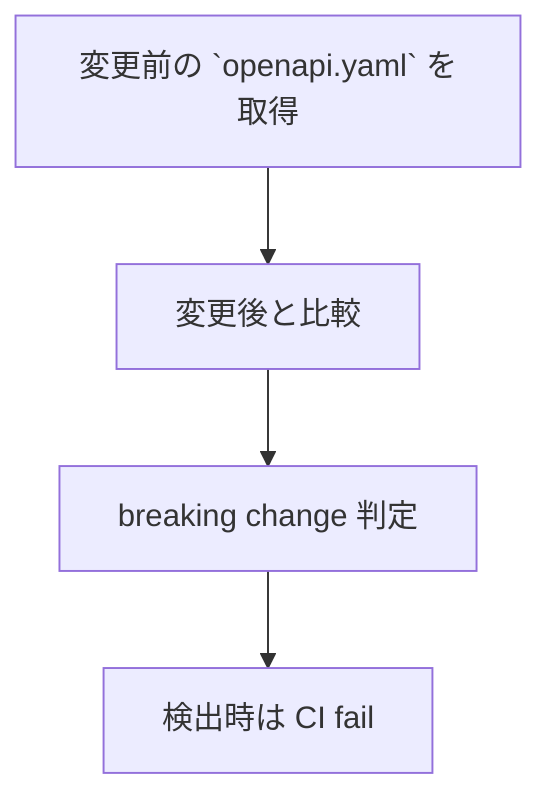

### GitHub Actions 例

```yaml id="oas_ci"
name: OpenAPI Diff

on: [pull_request]

jobs:
  openapi-diff:
    runs-on: ubuntu-latest

    steps:
      - uses: actions/checkout@v4

      - name: Install oasdiff
        run: go install github.com/Tufin/oasdiff@latest

      - name: Compare OpenAPI
        run: |
          oasdiff breaking \
            origin/main:schema/openapi.yaml \
            schema/openapi.yaml
```

## SDK 配布戦略

本プロジェクトは、OpenAPI を起点として複数言語向け SDK を生成・配布します。

### 設計意図 (ゴール)

* フロントエンドとバックエンド間の契約を共有します。
* ユーザーの実装コストを削減します。
* 型安全な API 利用を促進します。

### 設計方針 (規約)

* OpenAPI を、唯一の契約とします。
* SDK は、すべて codegen により生成します。
* 手動実装の SDK は、提供しません。

### 責務

* 契約を配布すること。
* 型安全な利用を提供すること。

### 非責務

* 実装ロジックの提供
* アプリケーション固有処理

### 配布対象

| SDK | 配布方法 |
| ---------- | -------- |
| TypeScript | npm |
| PHP | Composer |

### 非配布対象

* ApiClient (実装)
* HttpClient (通信層)
* Strategy (Embedding)

### バージョン整合性

* OpenAPI version と SDK version を同期させます。
* Git tag を基準とします。

### リリースフロー

```mermaid id="sdk_release"
flowchart TD
  A["`openapi.yaml` 更新"] --> B["generate 実行"]
  B --> C["CI 検証"]
  C --> D["version 更新"]
  D --> E["`npm publish`"]
  D --> F["`composer publish`"]
```

### TypeScript SDK

#### パッケージ

```plaintext id="sdk_ts_pkg"
@s2j/similarity-client
```

#### 内容

* TypeScript 型
* Zod スキーマ
* (任意) raw API client

#### 公開対象

```plaintext id="sdk_ts_files"
dist/
  index.js
  index.d.ts
```

#### バージョニング

* OpenAPI の変更に追従します。
* 破壊的変更 → major
* 互換追加 → minor
* 修正 → patch

### PHP SDK

#### パッケージ

```plaintext id="sdk_php_pkg"
s2j/similarity-client
```

#### 内容

* DTO (`Contracts/DTO`)

#### 配布方法

* Packagist
* GitHub リポジトリ

## SDK の分割戦略 (client と core の分離)

本プロジェクトでは、SDK を責務ごとに分割し、疎結合な構成とします。

### 設計意図 (ゴール)

* 依存関係を最小化します。
* ユーザーの選択肢を拡張します。
* 再利用性を向上させます。

### 設計方針 (規約)

* 契約 (Contracts) と実装 (Client) を、分離します。
* Core ロジックは、独立パッケージとします。
* 各パッケージは、単一責務を持ちます。

### 責務

* SDK の構造を設計すること。
* 依存関係を明確化すること。

### 非責務

* アプリケーション統合
* UI 層の設計

### 利点

* 軽量利用 (型のみ)
* 高度利用 (フル SDK)
* テスト容易性向上

### 注意点

* 過剰分割を避けてください。
* バージョン整合性を維持してください。

### パッケージ構成

```plaintext id="sdk_split"
packages/
  ts-client/   ← 契約 (型、Zod)
  core/        ← 類似度ロジック
  client/      ← ApiClient 実装
```

### 各パッケージの責務

#### ts-client (Contracts)

* OpenAPI 由来の型
* Zod スキーマ
* raw API client (任意)

#### core (Domain)

* 類似度計算ロジック
* ベクトル操作
* 外部依存なし

#### client (Interfaces)

* ApiClient 実装
* HttpClient、Retry、Timeout
* DomainError、Logger

### 依存関係

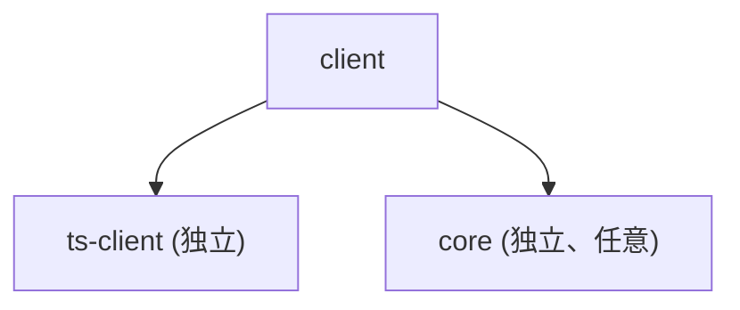

### 配布戦略

| パッケージ | 配布 |
| --------- | --- |
| ts-client | npm |
| core | npm |
| client | npm |

### 利用例

#### 最小利用 (型のみ)

```ts id="sdk_use1"
import { SimilarityRequest } from "@s2j/similarity-client";
```

#### フル利用 (API コール)

```ts id="sdk_use2"
import { createApiClient } from "@s2j/similarity-client-client";
```

#### コアのみ利用

```ts id="sdk_use3"
import { cosineSimilarity } from "@s2j/similarity-core";
```

## SDK のマルチバージョン管理

本プロジェクトでは、複数バージョンの SDK を並行して維持可能とします。

### 設計意図 (ゴール)

* 既存クライアントの、互換性を維持します。
* 段階的なアップグレードを、可能にします。
* breaking change の影響を、局所化します。

### 設計方針 (規約)

* SemVer に従います。
* major バージョンは、互換性を持ちません。
* 過去バージョンも、一定期間サポートします。

### 責務

* SDK を長期運用すること。
* 互換性を維持すること。

### 非責務

* バージョン間の自動移行
* データのマイグレーション

### OpenAPI との対応

* OpenAPI version と SDK version を同期。
* breaking change は、major とします。

### バージョニングモデル

| バージョン | 意味 |
| ----- | ------------------ |
| v1.x | 安定版 |
| v2.x | breaking change 含む |
| v3.x | 新仕様 |

### リリース戦略

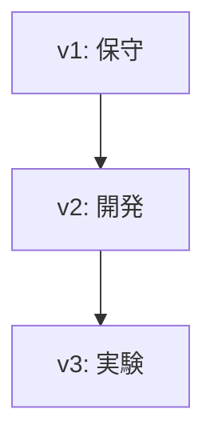

### 互換性ポリシー

| 変更 | 対応 |
| ------- | ----- |
| フィールド追加 | minor |
| フィールド削除 | major |
| 型変更 | major |

### 廃止 (Deprecation)

* deprecated フラグを OpenAPI に付与
* SDK に警告を出す

### npm (TypeScript SDK)

* major ごとに、共存可能とします。
* import は、バージョン固定します。

```ts id="sdk_import"
import { SimilarityRequest } from "@s2j/similarity-client@1";
```

### Composer (PHP)

* バージョン制約で管理します。

```json id="composer_req"
{
  "require": {
    "s2j/similarity-client": "^1.0"
  }
}
```

## モノレポ管理 (pnpm、turborepo)

本プロジェクトは、複数パッケージ (TypeScript SDK、PHP DTO、Core) を単一リポジトリで管理するため、モノレポ構成を採用します。

### 設計意図 (ゴール)

* 契約 (OpenAPI) を中心に、複数言語の実装を同期します。
* パッケージ間の整合性を保ちます。
* CI、ビルドの効率化を図ります。

### 設計方針 (規約)

* パッケージは、`packages/` 配下に配置します。
* 依存関係は、ワークスペースで管理します。
* ビルド・生成は、タスクランナーで統合します。

### 責務

* パッケージ間の整合性を維持すること。
* ビルドを効率化すること。

### 非責務

* 各パッケージの内部設計
* 外部の配布戦略

### ディレクトリ構成

```plaintext id="monorepo_structure"
packages/
  ts-client/
  php/
src/
schema/
scripts/
```

### 依存関係

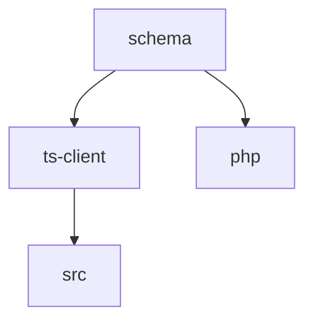

### タスク例

```bash id="monorepo_cmd"
pnpm turbo run generate
pnpm turbo run build
```

### pnpm (パッケージ管理)

#### 特徴

* 高速インストール
* ディスク効率
* ワークスペース対応

#### 設定例

```yaml id="pnpm_workspace"
packages:
  - "packages/*"
```

### turborepo (タスク管理)

#### 特徴

* ビルドキャッシュ
* 並列実行
* タスク依存関係の管理

#### 設定例

```json id="turbo_config"
{
  "pipeline": {
    "generate": {},
    "build": {
      "dependsOn": ["^build"],
      "outputs": ["dist/**"]
    }
  }
}
```

## Changesets vs semantic-release の比較

本プロジェクトでは、リリース管理手法として Changesets と semantic-release を比較し、用途に応じて選択します。

### 設計意図 (ゴール)

* モノレポ環境における、最適なリリース戦略を選択します。
* バージョン管理の透明性と、自動化のバランスを取ります。

### 責務

* バージョン管理方式を定義すること。
* チーム運用を標準化すること。

### 非責務

* API 互換性の保証 (OpenAPI diff に委譲)
* リリース内容のレビュー

### 比較概要

| 項目 | semantic-release | Changesets |
| ------- | ---------------- | --------------- |
| バージョン決定 | 自動 (コミットベース) | 手動 (changeset 記述) |
| モノレポ対応 | 弱い | 強い |
| リリース粒度 | 全体 | パッケージ単位 |
| 学習コスト | 低 | 中 |
| 柔軟性 | 低 | 高 |

### semantic-release の特徴

* Conventional Commits にもとづいて、完全自動化できます。
* リリースに人手は不要です。
* 単一パッケージに最適です。

### Changesets の特徴

* 変更内容を、明示的に記述します。
* バージョン管理は、パッケージ単位です。
* モノレポに最適です。

### 採用方針

本プロジェクトでは、以下を推奨します。

* モノレポ構成においては、Changesets を採用すること。
* 将来的に単一 SDK 化する場合は、semantic-release に移行可能とすること。

### 本プロジェクトでの推奨

| 条件 | 推奨 |
| ----------- | ---------------- |
| 単一パッケージ | semantic-release |
| モノレポ (複数 SDK) | Changesets |

### Changesets 運用フロー

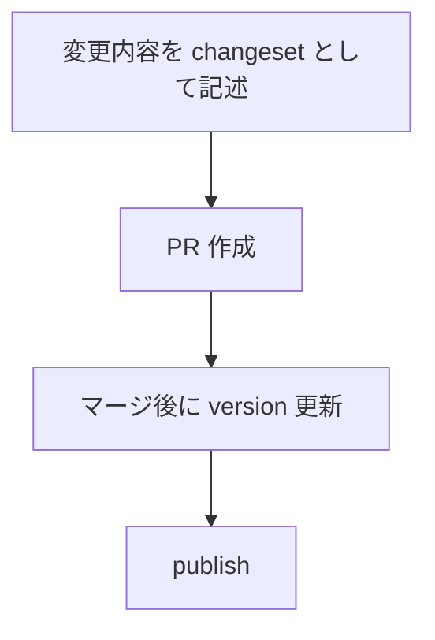

### Changeset 例

```md id="changeset_example"
---
"@s2j/similarity-client": minor
---

Add new embedding endpoint
```

## pnpm + Changesets + turborepo の実構成

本プロジェクトでは、モノレポ管理・バージョン管理・ビルド最適化を統合するため、以下の構成を採用します。

### 設計意図 (ゴール)

* パッケージ間の整合性を維持します。
* リリースを自動化します。
* ビルド効率の最大化を目指します。

### 責務

* モノレポ全体を統合管理すること。
* ビルドとリリースを自動化すること。

### 非責務

* 各パッケージの内部設計
* API 仕様の定義 (OpenAPI)

### 採用技術

| 技術 | 役割 |
| ---------- | ------------ |
| pnpm | パッケージ管理 |
| Changesets | バージョン管理・リリース |
| turborepo | タスク実行・キャッシュ  |

### ディレクトリ構成

```plaintext id="mono_real"
.
├ package.json
├ pnpm-workspace.yaml
├ turbo.json
├ .changeset/
├ packages/
│  ├ ts-client/
│  ├ core/
│  └ client/
├ schema/
├ scripts/
└ src/
```

### リリースフロー

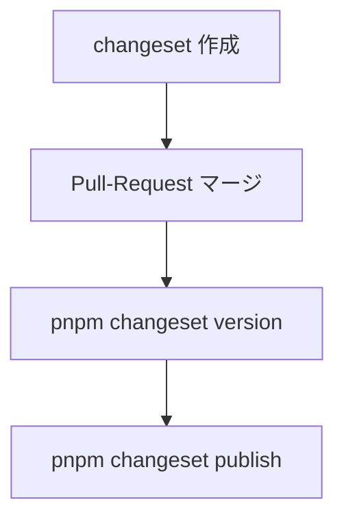

### CI 連携

* generate → build → test → changeset publish
* OpenAPI diff と連携

### `pnpm-workspace.yaml`

```yaml id="pnpm_ws"
packages:
  - "packages/*"
```

### `turbo.json`

```json id="turbo_real"
{
  "pipeline": {
    "generate": {
      "outputs": []
    },
    "build": {
      "dependsOn": ["^build"],
      "outputs": ["dist/**"]
    },
    "lint": {},
    "test": {}
  }
}
```

### ルート `package.json` (抜粋)

```json id="root_pkg"
{
  "private": true,
  "scripts": {
    "generate": "turbo run generate",
    "build": "turbo run build",
    "release": "changeset publish"
  },
  "devDependencies": {
    "turbo": "^1.12.0",
    "@changesets/cli": "^2.26.0"
  }
}
```

### Changesets 初期化

```bash id="changeset_init"
pnpm changeset init
```

## `package.json` の具体的な分割設計

本プロジェクトでは、パッケージごとに責務を分離した `package.json` を定義します。

### 設計意図 (ゴール)

* 各パッケージの独立性を確保します。
* 依存関係を明確化します。
* 配布単位を分離します。

### 責務

* パッケージ単位の構成を定義すること。
* 依存関係を明示化すること。

### 非責務

* ビルドツールの設定
* CI の実装

### 依存関係の整理

```plaintext
ts-client   ← 単独 (OpenAPI 依存)
core        ← 単独 (純ロジック)
```

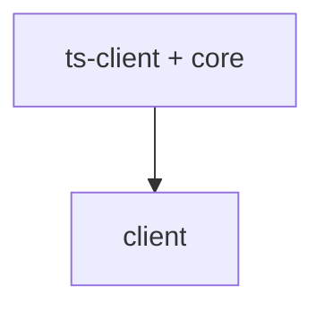

### バージョン管理

* Changesets により、各パッケージ単位で管理します。
* 依存関係は、自動更新します。

### ルート `package.json`

```json id="pkg_root"
{
  "name": "s2j-similarity-service",
  "private": true,
  "scripts": {
    "generate": "turbo run generate",
    "build": "turbo run build",
    "release": "changeset publish"
  }
}
```

### ts-client (Contracts)

```json id="pkg_ts"
{
  "name": "@s2j/similarity-client",
  "version": "0.1.0",
  "main": "dist/index.js",
  "types": "dist/index.d.ts",
  "files": ["dist"],
  "scripts": {
    "generate": "bash ../../scripts/generate/ts.zsh",
    "build": "tsc"
  },
  "dependencies": {
    "zod": "^3.22.0"
  }
}
```

### core (Domain)

```json id="pkg_core"
{
  "name": "@s2j/similarity-core",
  "version": "0.1.0",
  "main": "dist/index.js",
  "types": "dist/index.d.ts",
  "scripts": {
    "build": "tsc"
  },
  "dependencies": {}
}
```

### client (Interfaces)

```json id="pkg_client"
{
  "name": "@s2j/similarity-client-runtime",
  "version": "0.1.0",
  "main": "dist/index.js",
  "types": "dist/index.d.ts",
  "scripts": {
    "build": "tsc"
  },
  "dependencies": {
    "@s2j/similarity-client": "workspace:*",
    "@s2j/similarity-core": "workspace:*"
  }
}
```

### exports (推奨)

```json id="pkg_exports"
{
  "exports": {
    ".": {
      "import": "./dist/index.js",
      "types": "./dist/index.d.ts"
    }
  }
}
```

## tsconfig 分割設計

本プロジェクトでは、モノレポ構成に対応するため、TypeScript 設定を分割し、継承構造で管理します。

### 設計意図 (ゴール)

* 設定の重複を排除します。
* パッケージごとに最適化します。
* ビルドの一貫性を確保します。

### 設計方針 (規約)

* ルートに、共通設定を定義します。
* 各パッケージは、継承します。
* 出力先 (dist) は、パッケージごとに分離します。

### 責務

* TypeScript 設定を統一すること。
* ビルド構造を明確化すること。

### 非責務

* バンドル (Vite など)
* 実行環境の設定

### ビルド方針

* 各パッケージは、独立してビルド可能とします。
* turborepo により、並列ビルド可能とします。

### 構成

```plaintext id="tsconfig_structure"
tsconfig.base.json
packages/
  ts-client/tsconfig.json
  core/tsconfig.json
  client/tsconfig.json
```

### `tsconfig.base.json`

```json id="tsconfig_base"
{
  "compilerOptions": {
    "target": "ES2020",
    "module": "ESNext",
    "moduleResolution": "Node",
    "strict": true,
    "esModuleInterop": true,
    "skipLibCheck": true
  }
}
```

### 各パッケージの tsconfig

```json id="tsconfig_pkg"
{
  "extends": "../../tsconfig.base.json",
  "compilerOptions": {
    "outDir": "dist",
    "rootDir": "src"
  },
  "include": ["src"]
}
```

## ESLint と Prettier 共通化

本プロジェクトでは、コード品質とフォーマットを統一するため、ESLint と Prettier を共通設定として管理します。

### 設計意図 (ゴール)

* コードスタイルを統一します。
* バグの早期検出を目指します。
* チーム開発の効率化を目指します。

### 設計方針 (規約)

* ルートに、共通設定を配置します。
* 各パッケージは、設定を継承します。
* フォーマットは、Prettier に一元化します。

### 責務

* コード品質を統一すること。
* スタイルを標準化すること。

### 非責務

* ビジネスロジックの検証
* パフォーマンス最適化

### CI 連携

* lint エラーで CI fail します。
* format 差分を検出します。

### 構成

```plaintext id="lint_structure"
`eslint.config.js`
`.prettierrc`
```

### ESLint 設定例

```js id="eslint_config"
export default [
  {
    files: ["**/*.ts"],
    languageOptions: {
      parser: "@typescript-eslint/parser"
    },
    rules: {
      "no-unused-vars": "warn"
    }
  }
];
```

### Prettier 設定例

```json id="prettier_config"
{
  "semi": true,
  "singleQuote": true,
  "trailingComma": "all"
}
```

### 実行コマンド

```bash id="lint_cmd"
pnpm lint
pnpm format
```

## CI フル構成

本プロジェクトでは、品質保証のために CI パイプラインを構築します。

### 設計意図 (ゴール)

* 変更による破壊を防ぎます。
* 自動検証による品質を担保します。
* リリースの信頼性を向上します。

### 設計方針 (規約)

* すべての変更は、CI を通過する必要があります。
* 契約、コード、スタイルを検証します。
* 並列実行で高速化します。

### 責務

* 品質を保証すること。
* 自動検証すること。

### 非責務

* 手動レビュー
* 本番監視

### 品質ゲート

| チェック | 内容 |
| -------- | ----- |
| generate | 契約同期  |
| lint | コード品質 |
| build | 型チェック |
| test | 動作保証 |
| diff | 生成差分 |

### 失敗条件

* lint でエラーが検出された
* build で失敗した
* generate で差分が検出された
* breaking change が検出された

### パイプライン構成

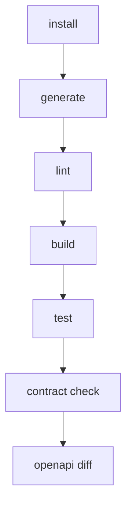

### GitHub Actions 例

```yaml id="ci_full_yaml"
name: CI

on: [push, pull_request]

jobs:
  ci:
    runs-on: ubuntu-latest

    steps:
      - uses: actions/checkout@v4

      - run: npm ci

      - run: ./scripts/generate/all.zsh

      - run: pnpm lint

      - run: pnpm build

      - run: pnpm test

      - run: git diff --exit-code
```

### 並列化 (turborepo)

```bash id="ci_turbo"
pnpm turbo run build --parallel
```

## Vite、build 最適化

本プロジェクトでは、ビルドの高速化と配布物の最適化のために Vite を採用します。

### 設計意図 (ゴール)

* 高速なビルドと開発体験の向上を目指します。
* Tree-shaking により、軽量化を目指します。
* ライブラリとしての最適な出力を目指します。

### 設計方針 (規約)

* 各パッケージは、ライブラリモードでビルドします。
* 不要なコードは、出力しません (Tree-shaking)。
* 依存は、external 指定します。

### 責務

* ビルドを最適化すること。
* 配布物を軽量化すること。

### 非責務

* 型生成 (tsc)
* API 契約生成 (OpenAPI)

### Vite 設定 (ライブラリモード)

```ts id="vite_config"
import { defineConfig } from "vite";

export default defineConfig({
  build: {
    lib: {
      entry: "src/index.ts",
      name: "S2JSimilarity",
      formats: ["es", "cjs"]
    },
    rollupOptions: {
      external: ["zod"],
    }
  }
});
```

### 出力構成

```plaintext id="vite_output"
dist/
  index.es.js
  index.cjs.js
  index.d.ts
```

### 最適化ポイント

#### Tree-shaking

* named export を使用します。
* sideEffects を false に設定します。

#### external 指定

```json id="vite_external"
{
  "sideEffects": false
}
```

#### sourcemap

```ts id="vite_sourcemap"
build: {
  sourcemap: true
}
```

### turborepo との連携

```bash id="vite_turbo"
pnpm turbo run build
```

## package exports 戦略 (ESM、CJS 対応)

本プロジェクトでは、異なる実行環境 (Node.js、Browser) に対応するため、ESM と CJS の両形式を提供します。

### 設計意図 (ゴール)

* Node.js とブラウザの互換性を確保します。
* ユーザーの、環境差異を吸収します。
* 将来的な ESM 移行に対応します。

### 設計方針 (規約)

* ESM を第一優先とします。
* CJS は、互換性のために提供します。
* exports フィールドで、明示的に定義します。

### 責務

* 実行環境の互換性を提供すること。
* 安定した API を公開すること。

### 非責務

* ランタイム・ポリフィル
* レガシー環境対応 (Internet Explorer など)

### 条件分岐

| 環境 | 使用形式 |
| ---------- | ------- |
| Node (ESM) | import |
| Node (CJS) | require |
| Browser | import |

### 互換性

* Node v14+
* bundler (Vite、webpack、Rollup) 対応

### 注意点

* deep import をしないでください。
* exports に定義されたパスのみ、公開してください。

### サブパスのエクスポート (任意)

```json id="pkg_subpath"
{
  "exports": {
    "./core": {
      "import": "./dist/core.es.js",
      "require": "./dist/core.cjs.js"
    }
  }
}
```

### `package.json` 設定

```json id="pkg_exports_full"
{
  "type": "module",
  "main": "./dist/index.cjs.js",
  "module": "./dist/index.es.js",
  "types": "./dist/index.d.ts",
  "exports": {
    ".": {
      "import": "./dist/index.es.js",
      "require": "./dist/index.cjs.js",
      "types": "./dist/index.d.ts"
    }
  }
}
```

## dual package hazard 回避設計

本プロジェクトでは、ESM と CJS の両形式を提供する際に発生する「dual package hazard (モジュールの二重読み込み問題)」を回避します。

### 設計意図 (ゴール)

* 同一モジュールが、ESM と CJS で別インスタンスとして読み込まれる事態を防ぎます。
* 状態不整合 (singleton 崩壊) を防止します。
* 利用環境差による、バグを排除します。

### 設計方針 (規約)

* 単一の内部実装に、統一します。
* exports により、entry を制御します。
* 「状態」を持つモジュールを避けます (原則 stateless)。

### 責務

* モジュールの一貫性を保証すること。
* 実行時バグを防止すること。

### 非責務

* bundler 依存の解決
* Node の仕様変更に対応

### 問題例

下図の場合、同一モジュールが2つ存在してしまいます。

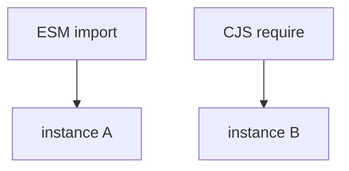

### NG パターン

* 状態を持つキャッシュ
* static singleton
* グローバル変数

### 推奨パターン

* pure function
* factory function
* DI によるインスタンス管理

### 回避戦略

#### 1. 内部実装を単一にする

```plaintext id="dual_strategy1"
src/ (単一ソース)
 ↓
dist/index.es.js
dist/index.cjs.js
```

#### 2. exports で統制

```json id="dual_exports"
{
  "exports": {
    ".": {
      "import": "./dist/index.es.js",
      "require": "./dist/index.cjs.js"
    }
  }
}
```

#### 3. singleton を持たない設計

* グローバル状態を持たない
* DI (Dependency Injection) を使用

## NodeNext、bundler 解像度問題

Node.js (NodeNext) と bundler (Vite、webpack) では、モジュール解決方式が異なるため、互換性を確保します。

### 設計意図 (ゴール)

* Node.js と bundler 間の解像度差異を吸収します。
* import エラーを防止します。
* 型解決と実行解決を一致させます。

### 設計方針 (規約)

* exports フィールドを、唯一の公開インターフェースとします。
* 拡張子を明示します。
* TypeScript の moduleResolution を NodeNext に統一します。

### 責務

* モジュール解決の一貫性を確保すること。
* 環境差異を吸収すること。

### 非責務

* 古い Node バージョンの対応
* 特定 bundler の最適化

### 解像度の違い

| 環境 | 解決方法 |
| -------- | ---------- |
| NodeNext | exports 優先 |
| bundler | 拡張子補完あり |

### 推奨ルール

* 相対パスには、拡張子を付与します。
* deep import を禁止します。
* exports に定義されたパスのみ、使用します。

### bundler 対応

* Vite、Rollup は、exports を解釈します。
* webpack は、設定に依存します。

### 問題例

```ts id="resolve_problem"
// NG (NodeNext で失敗)
import { foo } from "./utils";
```

### 正しい記述

```ts id="resolve_ok"
import { foo } from "./utils.js";
```

### TypeScript 設定

```json id="ts_nodenext"
{
  "compilerOptions": {
    "module": "NodeNext",
    "moduleResolution": "NodeNext"
  }
}
```

### exports による統制

```json id="resolve_exports"
{
  "exports": {
    "./utils": {
      "import": "./dist/utils.js"
    }
  }
}
```

## edge runtime (CloudFlare Workers 対応)

本プロジェクトでは、エッジ環境 (CloudFlare Workers など) での実行を考慮して設計します。

### 設計意図 (ゴール)

* 低レイテンシでの API コールを目指します。
* サーバーレス環境への対応を目指します。
* 将来的なエッジ分散処理への拡張を目指します。

### 設計方針 (規約)

* Node.js 固有 API に依存しません。
* fetch ベースの実装を採用します。
* 軽量でバンドル可能な構成とします。

### 責務

* エッジ環境での動作を保証すること。
* 軽量実行を実現すること。

### 非責務

* Node.js 専用最適化
* 長時間処理

### 制約

* `fs` / `path` などの Node API は、使用不可とします。
* require (CJS) は、非対応とします。
* 同期処理は、制限されます。

### 対応環境

| 環境 | 対応 |
| ------------------ | ----- |
| CloudFlare Workers | ✔ |
| Vercel Edge | ✔ |
| Deno | ✔ (一部) |

### 実装方針

#### HttpClient

* fetch ベース (標準 API)
* AbortController 対応

#### 依存関係

* 軽量ライブラリのみ使用します。
* Node 専用パッケージは、禁止します。

### 注意点

* 環境依存コードを分離してください。
* polyfill に依存しないでください。

### バンドル

```ts id="edge_vite"
export default {
  build: {
    target: "es2022"
  }
};
```

## ESM only 化戦略

本プロジェクトでは、将来的に ESM (ECMAScript Modules) のみを提供する構成に移行します。

### 設計意図 (ゴール)

* モジュール解決を、簡素化します。
* dual package hazard を完全排除します。
* edge runtime との完全互換を目指します。

### 設計方針 (規約)

* ESM を標準とします。
* CJS は、段階的に廃止します。
* exports フィールドで制御します。

### 責務

* モジュール戦略を統一すること。
* 将来の保守性を向上すること。

### 非責務

* 旧環境のサポート
* 自動移行ツールの提供

### 現状

* ESM + CJS のデュアル構成です。

### 移行ステップ

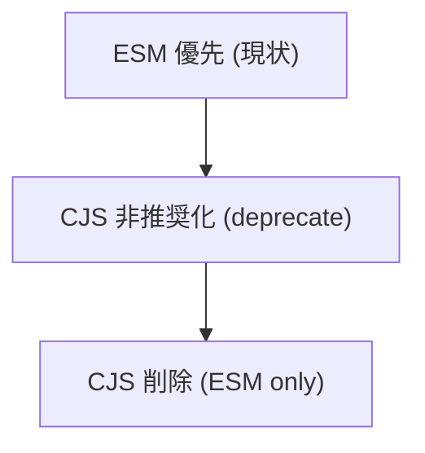

### 変更点

| 項目 | 内容 |
| ------- | ---- |
| require | 使用不可 |
| import | 必須 |
| 拡張子 | 明示 |

### ユーザーへの影響

* Node.js は、v16+ 推奨
* bundler は、対応済み

### 非推奨対応

```plaintext id="esm_warn"
CJS ユーザーには、deprecation warning を表示
```

### 利点

* 設計を単純化できること。
* ビルドを軽量化できること。
* エッジ互換性を向上できること。

### 注意点

* 古い環境との互換性が低下します。
* 移行期間の確保が必要です。

### `package.json`

```json id="esm_pkg"
{
  "type": "module",
  "exports": {
    ".": {
      "import": "./dist/index.js"
    }
  }
}
```

## runtime 別 build 出し分け (edge、node)

本プロジェクトでは、実行環境 (Edge、Node.js) ごとに最適化された、ビルド成果物を出し分けます。

### 設計意図 (ゴール)

* 実行環境ごとの制約差 (API、バンドルサイズ) を吸収します。
* パフォーマンスの最適化 (Edge は軽量。Node は機能重視) を目指します。
* 互換性の維持と将来の拡張性を確保します。

### 設計方針 (規約)

* 単一ソース (src) から複数ターゲットにビルドします。
* 環境差は、entry ポイントで吸収します。
* 実行時分岐ではなく、**ビルド時分岐** を優先します。

### 責務

* 環境ごとの最適ビルドを提供すること。
* 実行時の互換性を担保すること。

### 非責務

* 実行時の環境判定
* polyfill の提供

### ターゲット

| ターゲット | 想定環境 | 特徴 |
| ----- | -------------------------------- | ---------- |
| edge | CloudFlare Workers / Vercel Edge | 軽量・標準 API のみ |
| node | Node.js | フル機能・互換性重視 |

### 実装指針

* `edge.ts`: fetch、Web 標準 API のみ使用します。
* `node.ts`: 必要に応じて、Node API を使用します。
* 共通ロジックは、`index.ts` に集約します。

### 注意点

* Node 専用依存は、edge に含めないでください (external)。
* 環境判定コード (`process.env` など) は、極力排除してください。

### entry 構成

```plaintext id="runtime_entry"
src/
  index.ts        ← 共通
  runtime/
    edge.ts       ← Edge 用
    node.ts       ← Node 用
```

### 出力構成

```plaintext id="runtime_dist"
dist/
  edge.js
  node.es.js
  node.cjs.js
```

### Vite 設定例

```ts id="runtime_vite"
import { defineConfig } from "vite";

export default defineConfig([
  {
    build: {
      lib: {
        entry: "src/runtime/edge.ts",
        formats: ["es"],
        fileName: "edge"
      },
      target: "es2022"
    }
  },
  {
    build: {
      lib: {
        entry: "src/runtime/node.ts",
        formats: ["es", "cjs"],
        fileName: "node"
      },
      target: "node18"
    }
  }
]);
```

## conditional exports の高度設計

本プロジェクトでは、Node.js の conditional exports を利用して、環境ごとに適切な entry ポイントを提供します。

### 設計意図 (ゴール)

* 実行環境に応じた、最適コードを自動選択します。
* 不要なバンドルを回避します。
* API 公開面を明確化します。

### 設計方針 (規約)

* exports を、唯一の公開インターフェースとします。
* 環境ごとに、明示的に entry を分離します。
* deep import を禁止します。

### 責務

* 環境別 entry を提供すること。
* API 公開面を統制すること。

### 非責務

* 実行環境の検出
* bundler 設定の補助

### 注意点

* 条件は、最小限にしてください (複雑化の防止)。
* bundler が、edge 条件を理解しない場合があります。
* default は、必ず定義してください。

### 推奨ルール

* すべての公開 API は、exports を経由すること。
* 内部ファイルの直接参照は、禁止します。
* バージョン変更時に exports を見直すこと。

### 基本構成

```json id="exports_basic"
{
  "exports": {
    ".": {
      "edge": "./dist/edge.js",
      "node": {
        "import": "./dist/node.es.js",
        "require": "./dist/node.cjs.js"
      },
      "default": "./dist/node.es.js"
    }
  }
}
```

### 条件一覧

| 条件 | 説明 |
| ------- | ------------ |
| import | ESM |
| require | CJS |
| node | Node.js |
| edge | Edge runtime |
| default | フォールバック |

### 解決の優先順位

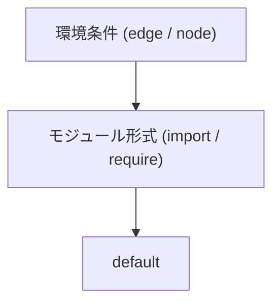

### サブパス設計

```json id="exports_subpath"
{
  "exports": {
    "./core": {
      "import": "./dist/core.es.js"
    },
    "./client": {
      "import": "./dist/node.es.js"
    }
  }
}
```

### 利用例

```ts id="exports_usage"
// Edge 環境
import { createClient } from "@s2j/similarity-client";

// Node 環境 (自動的に node 版)
import { createClient } from "@s2j/similarity-client";
```

## edge、node の完全分離 (package 分割)

本プロジェクトでは、実行環境ごとの最適化をさらに強化するため、Edge 用と Node.js 用のパッケージを完全に分離する構成を採用します。

### 設計意図 (ゴール)

* 環境ごとの依存関係を完全に分離します。
* バンドルサイズの最小化を目指します。
* 実行時の不整合 (環境依存コード) を排除します。

### 設計方針 (規約)

* パッケージ単位で runtime を分離します。
* 共通ロジックは、core に集約します。
* 各 runtime は、独立して配布可能とします。

### 責務

* runtime ごとに完全分離すること。
* 依存関係を明確化すること。

### 非責務

* 単一パッケージの簡便性
* 自動 runtime 選択

### パッケージ構成

```plaintext id="pkg_runtime_split"
packages/
  core/           ← 共通ロジック
  client-node/    ← Node.js 用
  client-edge/    ← Edge 用
  ts-client/      ← Contracts
```

### 依存関係

下図の、`core`、`ts-client` は、それぞれ独立したものです。

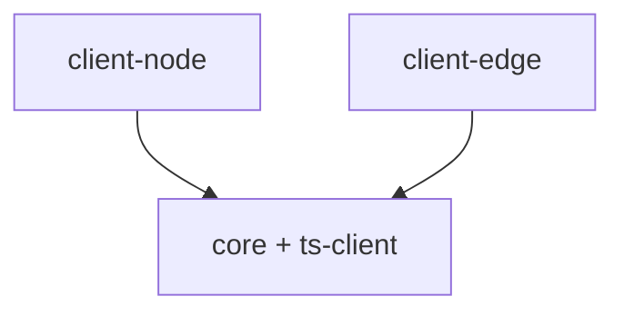

### 特徴

| パッケージ | 特徴 |
| ----------- | ------------------ |
| client-node | Node API 使用可 |
| client-edge | fetch / Web 標準 API のみ |

### conditional exports との関係

* 単一パッケージ方式の代替
* 明示的な依存選択が可能

### 利点

* 環境依存バグを排除できること。
* 明確な責務を分離できること。
* バンドルを最適化できること。

### 注意点

* パッケージ数が増加します。
* バージョン整合性の管理が必要です。

### 推奨ケース

* エッジ最適化が重要な場合
* Node 依存が強い場合

### 利用例

```ts id="runtime_import_node"
import { createClient } from "@s2j/similarity-client-node";
```

```ts id="runtime_import_edge"
import { createClient } from "@s2j/similarity-client-edge";
```

## browser 専用 build

本プロジェクトでは、ブラウザ環境向けに最適化されたビルドを提供します。

### 設計意図 (ゴール)

* フロントエンドでの利用を最適化します。
* バンドルサイズを削減します。
* Node 依存を排除します。

### 設計方針 (規約)

* browser 専用 entry を提供します。
* Node 依存コードを含めません。
* Tree-shaking を最大限活用します。

### 責務

* ブラウザ環境に対応すること。
* 軽量ビルドを提供すること。

### 非責務

* Node 互換性
* サーバーサイド処理

### 制約

* `fs`、`path` などは使用できません。
* `require` には非対応です。
* 環境変数への依存を排除します。

### 最適化ポイント

* `sideEffects: false`
* 小さな依存のみ採用します。
* 動的 import を最小化します。

### 利点

* バンドルが軽量であること。
* フロントエンド適合であること。
* ロードが高速であること。

### 注意点

* SSR との互換性を考慮してください。
* bundler 依存を解決してください。

### entry 構成

```plaintext id="browser_entry"
src/
  runtime/
    browser.ts
```

### `package.json`

```json id="browser_pkg"
{
  "exports": {
    ".": {
      "browser": "./dist/browser.js",
      "import": "./dist/node.es.js"
    }
  }
}
```

### Vite 設定例

```ts id="browser_vite"
export default {
  build: {
    lib: {
      entry: "src/runtime/browser.ts",
      formats: ["es"],
      fileName: "browser"
    },
    target: "es2020"
  }
};
```

### 出力

```plaintext id="browser_dist"
dist/
  browser.js
```

### 利用例

(bundler が、browser フィールドを解決)

```ts id="browser_use"
import { createClient } from "@s2j/similarity-client";
```

## runtime の自動的な検出戦略

本プロジェクトでは、ユーザーの負担を軽減するため、実行環境 (Node、Edge、Browser) を自動検出し、適切な実装を選択するしくみを提供します。

### 設計意図 (ゴール)

* ユーザーが、runtime を意識せずに、使用できます。
* 設定ミスによるバグを防止します。
* DX (開発体験) を向上します。

### 設計方針 (規約)

* 実行環境は、ランタイムで検出します。
* 検出ロジックは。最小限にします。
* 明示指定 (override) を可能にします。

### 責務

* runtime を簡易判定すること。
* 初期選択を自動化すること。

### 非責務

* 完全な環境識別
* build 時最適化 (conditional exports に委譲)

### 検出対象

| runtime | 判定方法 |
| ------- | -------------------------------------- |
| Node.js | `typeof process !== "undefined"` |
| Edge | `typeof WebSocketPair !== "undefined"` |
| Browser | `typeof window !== "undefined"` |

### 推奨

* production では、明示指定すること。
* 開発時のみ、自動検出すること。

### 注意点

* bundler による静的解析と、競合する可能性があります。
* 環境判定は、完全ではありません。

### 実装例

```ts id="runtime_detect"
export function detectRuntime(): "node" | "edge" | "browser" {
  if (typeof WebSocketPair !== "undefined") {
    return "edge";
  }

  if (typeof window !== "undefined") {
    return "browser";
  }

  if (typeof process !== "undefined") {
    return "node";
  }

  return "node";
}
```

### ファクトリ統合

```ts id="runtime_factory"
export function createClientAuto(config: Config) {
  const runtime = detectRuntime();

  switch (runtime) {
    case "edge":
      return createEdgeClient(config);
    case "browser":
      return createBrowserClient(config);
    default:
      return createNodeClient(config);
  }
}
```

### override

```ts id="runtime_override"
createClientAuto({
  runtime: "edge"
});
```

## CDN 配布 (unpkg、`esm.sh`)

本プロジェクトでは、npm パッケージに加えて CDN 経由での利用を可能とします。

### 設計意図 (ゴール)

* ビルド不要での利用を可能とします。
* 試用・プロトタイピングの容易化を目指します。
* ブラウザ環境で直接利用を目指します。

### 設計方針 (規約)

* ESM 形式で配布します。
* CDN 向けに軽量化します。
* browser build を利用します。

### 責務

* ブラウザ直接利用を提供すること。
* 配布チャネルを拡張すること。

### 非責務

* CDN の可用性保証
* キャッシュ制御

### 最適化

* minify (Vite)
* tree-shaking
* sideEffects: false

### バージョン指定

```plaintext id="cdn_version"
https://esm.sh/@s2j/similarity-client@1.2.0
```

### 注意点

* CDN キャッシュ
* バージョン固定を推奨します。
* セキュリティ (信頼性)

### 対応 CDN

| CDN | 特徴 |
| -------- | ----- |
| unpkg | npm 直結 |
| `esm.sh` | ESM 変換 |
| jsDelivr | 高速 CDN |

### 利用例 (unpkg)

```html id="cdn_unpkg"
<script type="module">
  import { createClient } from "https://unpkg.com/@s2j/similarity-client/dist/browser.js";
</script>
```

### 利用例 (`esm.sh`)

```html id="cdn_esm"
<script type="module">
  import { createClient } from "https://esm.sh/@s2j/similarity-client";

  const client = createClient({ baseUrl: "..." });
</script>
```

### `package.json` 設定

```json id="cdn_pkg"
{
  "unpkg": "./dist/browser.js",
  "jsdelivr": "./dist/browser.js"
}
```

## runtime 自動検出の削除 (完全ビルド依存化)

本プロジェクトでは、runtime の自動的な検出戦略を廃止し、ビルド時およびパッケージ選択により、実行環境を確定する方式に移行します。

### 設計意図 (ゴール)

* runtime 判定ロジックの不確実性を排除します。
* bundler、tree-shaking と競合しない設計にします。
* 実行時の分岐をゼロにします。

### 設計方針 (規約)

* runtime は、ビルドまたはパッケージで確定します。
* 実行時の環境判定は、行いません。
* ユーザーに、明示的選択を委ねます。

### 責務

* 実行環境を明示的に選択すること。
* 実行時分岐を排除すること。

### 非責務

* 自動的な最適化
* 環境の推測

### 廃止対象

* `detectRuntime()` のような関数
* runtime 自動切り替えロジック

### conditional exports との関係

* 自動検出の代替として利用します。
* 環境ごとに最適な entry を選択します。

### 利点

* 挙動が完全に決定的になること。
* バンドルサイズを削減できること。
* デバッグ容易性を向上できること。

### 欠点

* ユーザーの選択負担が増加します。

### 推奨

* ドキュメントで明確に誘導すること。
* デフォルトパッケージを (node などで) 用意すること。

### 新しい利用方法

```ts id="no_auto_runtime"
import { createClient } from "@s2j/similarity-client-node";
```

```ts id="no_auto_runtime_edge"
import { createClient } from "@s2j/similarity-client-edge";
```

## CDN 専用パッケージ分離

本プロジェクトでは、CDN 利用を最適化するために、CDN 専用の軽量パッケージを分離します。

### 設計意図 (ゴール)

* CDN 配布用に最適化されたビルドを、提供します。
* 不要なコードや依存を排除します。
* 初期ロード時間を最小化します。

### 設計方針 (規約)

* CDN 用は、専用パッケージとして分離します。
* browser build のみ含めます。
* 依存は、最小限にします。

### 責務

* CDN 配布を最適化すること。
* 軽量 SDK を提供すること。

### 非責務

* フル機能の提供
* サーバーサイドの対応

### CDN パッケージ内容

* browser build (ESM)
* 最小限の API
* 軽量依存のみ

### 最適化

* minify 必須
* tree-shaking 前提
* sideEffects: false

### 利点

* バンドルが最小であること。
* CDN が最適化されること。
* フロントエンドに特化できること。

### 注意点

* Node 機能は、提供しません。
* (軽量化のため) API が制限されます。

### 推奨ケース

* デモ
* 小規模フロントエンド
* CDN 直利用

### パッケージ構成

```plaintext id="cdn_pkg_structure"
packages/
  client-browser/   ← CDN 専用
  client-node/
  client-edge/
  core/
  ts-client/
```

### `package.json`

```json id="cdn_pkg_json"
{
  "name": "@s2j/similarity-client-browser",
  "type": "module",
  "exports": {
    ".": "./dist/browser.js"
  },
  "unpkg": "./dist/browser.js",
  "jsdelivr": "./dist/browser.js"
}
```

### 利用例

```html id="cdn_pkg_use"
<script type="module">
  import { createClient } from "https://esm.sh/@s2j/similarity-client-browser";

  const client = createClient({ baseUrl: "..." });
</script>
```

## default パッケージ設計 (入口統一)

本プロジェクトでは、複数の runtime 向けパッケージが存在する中で、ユーザーが迷わないように「標準入口 (default package)」を定義します。

### 設計意図 (ゴール)

* 初学者・ユーザーの迷いを排除します。
* ドキュメントと実装の入口を統一します。
* ユースケースの80%を簡単にします。

### 設計方針 (規約)

* default は、最も一般的な環境 (Node.js) を指します。
* 他 runtime は、明示的に選択させます。
* default は、薄いラッパーとして実装します。

### 責務

* SDK の入口を統一すること。
* 利用体験を簡素化すること。

### 非責務

* runtime の自動判定
* 最適化の判断

### 利点

* 学習コストが低減できること。
* 導入が簡易化できること。
* 一貫した利用方法であること。

### 注意点

* default の責務を肥大化させないでください。
* runtime 固有ロジックを含めないでください。

### ドキュメント方針

* 基本例は、default を使用します。
* runtime 別は、応用として説明します。

### 実装方針

default パッケージは、内部的に node 実装に委譲します。

```ts id="default_impl"
export * from "@s2j/similarity-client-node";
```

### パッケージ構成

```plaintext id="default_pkg"
@s2j/similarity-client         ← default (Node)
@s2j/similarity-client-node
@s2j/similarity-client-edge
@s2j/similarity-client-browser
```

### 利用例

```ts id="default_use"
import { createClient } from "@s2j/similarity-client";
```

### 明示利用 (上級者)

```ts id="explicit_use"
import { createClient } from "@s2j/similarity-client-edge";
```

## SDK 命名規則 (かなり重要)

本プロジェクトでは、長期運用と可読性を確保するため、パッケージおよびモジュールの命名規則を統一します。

### 設計意図 (ゴール)

* パッケージの役割を、名前から即座に理解できるようにします。
* モノレポ運用での混乱を防ぎます。
* 将来的な拡張に対応します。

### 設計方針 (規約)

* `@s2j/` 接頭辞を統一します。
* `<domain>-<role>-<runtime>` の構造を採用します。
* role は、固定語彙を使用します。

### 責務

* 命名を統一すること。
* 構造を明確化すること。

### 非責務

* 実装内容を保証すること。
* バージョンを管理すること。

### 利点

* 可読性を向上できること。
* 一貫性を確保できること。
* 拡張の容易性を期待できること。

### 注意点

* 命名変更は、breaking change としてください。
* 初期設計で固定してください。

### 禁止事項

* (utils、lib など) あいまいな名前にしないでください。
* runtime を省略した、特殊パッケージにしないでください。
* role が不明確な命名をしないでください。

### 命名フォーマット

```plaintext id="naming_format"
@s2j/<domain>-<role>-<runtime>
```

### 例

```plaintext id="naming_examples"
@s2j/similarity-client          ← default
@s2j/similarity-client-node
@s2j/similarity-client-edge
@s2j/similarity-client-browser
@s2j/similarity-core
@s2j/similarity-contracts
```

### role 定義

| role | 意味 |
| --------- | --------- |
| client | API クライアント |
| core | ドメインロジック |
| contracts | 型・スキーマ |

### runtime 定義

| runtime | 意味 |
| ------- | ------------ |
| node | Node.js |
| edge | Edge runtime |
| browser | Browser |

### import 一貫性

```ts id="naming_import"
import { createClient } from "@s2j/similarity-client-node";
```

### 将来拡張

```plaintext id="naming_future"
@s2j/similarity-client-deno
@s2j/similarity-client-worker
```

## README テンプレート設計

本プロジェクトでは、各パッケージにおいて一貫した README 構造を採用し、ユーザーが最短で理解・導入できるようにします。

### 設計意図 (ゴール)

* 初見ユーザーの理解コストを下げます。
* ドキュメント品質を均一化します。
* Quick Start への導線を最短化します。

### 設計方針 (規約)

* README は、「導入→使用→詳細」の順で構成します。
* すべてのパッケージで、同一テンプレートを使用します。
* 1分以内に動くサンプルを、最上部に置きます。

### 責務

* 初期導入のガイドであること。
* 利用の入口を提供すること。

### 非責務

* 詳細な仕様説明 (docs へ委譲)
* 実装の解説

### 記述ルール

* コードは、最小限にします。
* 冗長な説明は、docs に委譲します。
* 実行可能な例のみ、掲載します。

### Runtime 対応

| runtime | パッケージ |
| ------- | ------------------------------ |
| Node | @s2j/similarity-client |
| Edge | @s2j/similarity-client-edge |
| Browser | @s2j/similarity-client-browser |

### テンプレート構成

```plaintext id="readme_structure"
# パッケージ名

## Overview
## Quick Start (最重要)
## Installation
## Usage
## Runtime対応
## API 概要
## Advanced (任意)
## FAQ
## License
```

### Overview

* 何をするライブラリか
* どの問題を解決するか
* どの環境で使えるか

### Quick Start (例)

```ts id="readme_quick"
import { createClient } from "@s2j/similarity-client";

const client = createClient({ baseUrl: "..." });

const score = await client.similarity({
  text1: "hello",
  text2: "hi"
});

console.log(score);
```

## Quick Start 最適化

本プロジェクトでは、ユーザーが最短で成功体験を得られるように、Quick Start を最適化します。

### 設計意図 (ゴール)

* 初回での成功体験を、最速で提供します。
* 離脱率を下げます。
* 学習コストを最小化します。

### 設計方針 (規約)

* 10行以内で完結します。
* コピー & ペーストで動作します。
* 前提条件を最小化します。

### 責務

* 初回での成功体験を提供すること。
* 導入障壁を低減すること。

### 非責務

* 詳細設定
* 高度なユースケース

### 要件

* 外部依存なし (最低限)
* API キーは、環境変数で説明すること。
* エラー処理は、省略 (後述)

### 成功基準

* 1分以内に動くこと。
* エラーなく実行できること。
* 結果が確認できること。

### Good 例

* 単一ファイル
* 即実行可能
* 結果がすぐ見える

### NG 例

* 設定が多すぎる
* ファイル分割が必要
* 長い説明

### 段階構成

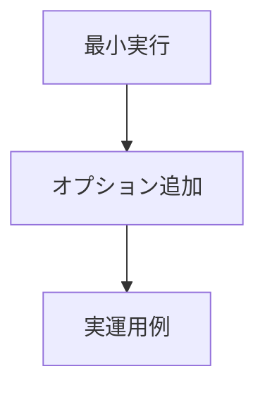

### CDN 版 Quick Start

```html id="quick_cdn"
<script type="module">
  import { createClient } from "https://esm.sh/@s2j/similarity-client-browser";

  const client = createClient({ baseUrl: "..." });
</script>
```

### CLI (任意)

```bash id="quick_cli"
curl -X POST /similarity ...
```

### 最小構成

```ts id="quick_min"
import { createClient } from "@s2j/similarity-client";

const client = createClient({ baseUrl: "..." });

await client.similarity({
  text1: "A",
  text2: "B"
});
```

## README 自動生成 (docs から)

本プロジェクトでは、docs 配下の仕様書を Source of Truth とし、README を自動生成することで、ドキュメントの一貫性を維持します。

### 設計意図 (ゴール)

* ドキュメントの二重管理を防ぎます。
* README と仕様書の乖離を排除します。
* 更新コストを削減します。

### 設計方針 (規約)

* docs を一次情報 (Source of Truth) とします。
* README は、生成物とします (手編集禁止)。
* CI で差分検出・強制同期します。

### 責務

* README を自動生成すること。
* ドキュメントと同期すること。

### 非責務

* docs の内容品質
* Markdown の整形

### 利点

* 常に最新の README を維持できること。
* メンテナンスコストを削減できること。
* ドキュメントの信頼性を向上できること。

### 注意点

* README の手動編集は、禁止にしてください。
* docs の構造変更に注意してください。

### データフロー

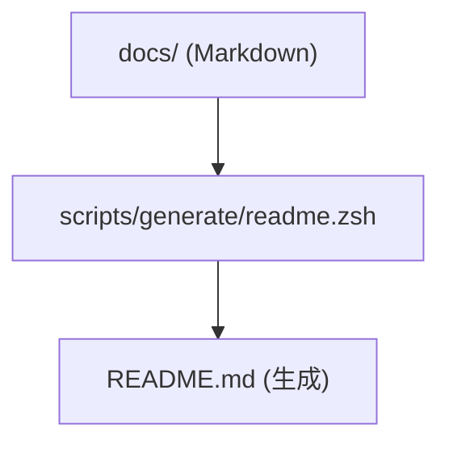

### 対象ソース

| docs | README 反映 |
| ------------- | ------------------- |
| overview.md | Overview |
| usage_spec.md | Usage / Quick Start |
| concept.md | Background |

### 生成戦略

* セクション単位で抽出します。
* Markdown をそのまま転用します。
* 必要に応じてテンプレートに埋め込みます。

### スクリプト例

```bash id="readme_script"
#!/bin/zsh

cat docs/overview.md > README.md
cat docs/interfaces/usage_spec.md >> README.md
```

### CI 検証

```bash id="readme_ci"
./scripts/generate/readme.zsh
git diff --exit-code
```

## playground (ブラウザ実行環境)

本プロジェクトでは、ブラウザ上で SDK を試せる playground を提供します。

### 設計意図 (ゴール)

* インストール不要で試用可能にします。
* 学習コストを下げます。
* 動作確認を容易にします。

### 設計方針 (規約)

* CDN (esm.sh) を利用します。
* ブラウザのみで完結します。
* 最小 UI で提供します。

### 責務

* 試用環境を提供すること。
* UX を向上すること。

### 非責務

* 本番利用
* セキュリティの保証

### 利用用途

* デモ
* 検証
* ドキュメント補助

### 発展

* Monaco Editor 統合
* サンプルテンプレート切替

### 注意点

* API キーの扱い (公開禁止)
* レート制限

### デプロイ

| 方法 | 内容 |
| ---------------- | ------ |
| GitHub Pages | 静的配信 |
| Vercel | 即時デプロイ |
| CloudFlare Pages | Edge 配信 |

### 構成

```plaintext id="playground_structure"
playground/
  index.html
  main.ts
```

### 実装例 (HTML)

```html id="playground_html"
<script type="module">
  import { createClient } from "https://esm.sh/@s2j/similarity-client-browser";

  const client = createClient({ baseUrl: "..." });

  const result = await client.similarity({
    text1: "hello",
    text2: "hi"
  });

  console.log(result);
</script>
```

### UI (最小)

* テキスト入力 (2つ)
* 実行ボタン
* 結果表示

### オプション

* エラーメッセージ表示
* API キー入力欄
* ログ表示

## docs → OpenAPI → README → Playground の完全連動

本プロジェクトでは、ドキュメント・契約・実行環境を一貫したパイプラインで連動させます。

### 設計意図 (ゴール)

* 仕様と実装の乖離を、完全に排除します。
* すべてのアウトプットを、単一の情報源から生成します。
* ドキュメント更新を、即座に実行環境へ反映します。

### 設計方針 (規約)

* Source of Truth は、docs と OpenAPI に限定します。
* README、SDK、Playground は、すべて生成物とします。
* 手動編集は、禁止します。

### 責務

* 全レイヤの同期を保証すること。
* 情報の一貫性を維持すること。

### 非責務

* コンテンツの品質
* UX のデザイン

### 利点

* 常に整合した状態を維持できること。
* ドキュメント信頼性を最大化できること。
* 開発効率を向上できること。

### 注意点

* 初期構築コストが高くなります。
* パイプラインが複雑化します。

### 全体フロー

```mermaid id="full_pipeline"
flowchart TD
	A["docs/"] --> B["OpenAPI (schema/openapi.yaml)"]
	B --> C["codegen (TS / PHP)"]
	C --> D["README 生成"]
	D --> E["Playground 反映"]
```

### 役割分担

| レイヤ | 役割 |
| ---------- | ----- |
| docs | 意図・仕様 |
| OpenAPI | 契約 |
| codegen | 実装補助 |
| README | 利用ガイド |
| Playground | 実行環境  |

### 同期ポイント

* OpenAPI 更新 → 型 / SDK 再生成
* docs 更新 → README 再生成
* Usage 変更 → Playground 更新

### 失敗条件

* README と docs が不一致である。
* OpenAPI と型が不一致である。
* Playground サンプルが不整合である。

### CI フロー

```mermaid id="ci_pipeline"
flowchart TD
	A["docs 変更検出"] --> B["OpenAPI 検証"]
	B --> C["codegen 実行"]
	C --> D["README 生成"]
	D --> E["Playground build"]
	E --> F["差分チェック"]
```

## サンプルコード自動同期

本プロジェクトでは、README、docs、Playground に掲載するサンプルコードを、単一ソースから自動同期します。

### 設計意図 (ゴール)

* サンプルコードの乖離を防ぎます。
* コピー & ペーストで動く保証を維持します。
* メンテナンスコスト削減します。

### 設計方針 (規約)

* サンプルコードは、`/examples/` に集約します。
* README、docs、Playground は、参照のみとします。
* CI で動作検証を行います。

### 責務

* サンプルを一元管理すること。
* 動作を保証すること。

### 非責務

* 実運用コード
* パフォーマンスの最適化

### 利点

* 常に動くサンプルであること。
* ドキュメントの信頼性を向上できること。
* 開発効率を向上できること。

### 注意点

* examples の責務が、肥大化します。
* サンプル粒度を管理する必要があります。

### テスト方針

* すべての examples は、実行可能であること。
* 型エラーがゼロであること。
* API 応答を確認すること。

### NG パターン

* README に直接コードを記述しないでください。
* Playground 専用コードを分岐しないでください。
* 手動で更新しないでください。

### CI 検証

```bash id="example_ci"
pnpm test:examples
```

### Playground 連携

* examples/browser.ts を直接読み込みます。
* UI から切り替えできます。

### ディレクトリ構成

```plaintext id="examples_structure"
examples/
  basic.ts
  node.ts
  edge.ts
  browser.ts
```

### スクリプト例

```bash id="example_sync"
cp examples/basic.ts playground/main.ts
```

### 利用方法

#### README への埋め込み

````md id="example_embed"
```ts
// examples/basic.ts
```
````

(ビルド時に内容を展開)

## examples → テスト → Playground の完全共有

本プロジェクトでは、examples を中心に「実装・テスト・体験」を完全に共有する構成を採用します。

### 設計意図 (ゴール)

* サンプルコードの信頼性を担保します。
* 実装とドキュメントの乖離を防ぎます。
* Playground とテストを統一します。

### 設計方針 (規約)

* examples を、唯一の実行コードとします。
* テストは、examples をそのまま実行します。
* Playground は、examples をロードします。

### 責務

* 実行可能サンプルを管理すること。
* テストと統合すること。

### 非責務

* 実サービスコード
* パフォーマンスの最適化

### 利点

* サンプルが必ず動くこと。
* テストとドキュメントが一致すること。
* 保守コストを削減できること。

### 注意点

* examples の肥大化に注意してください。
* 実運用コードと分離してください。

### データフロー

```mermaid id="examples_flow"
flowchart TD
	A["examples/"] --> B["テスト (実行)"]
	B --> C["Playground (表示)"]
	C --> D["README (埋め込み)"]
```

### ディレクトリ構成

```plaintext id="examples_full"
examples/
  basic.ts
  node.ts
  edge.ts
  browser.ts

tests/
  examples.test.ts

playground/
  main.ts
```

### テスト戦略

```ts id="examples_test"
import example from "../examples/basic";

test("basic example works", async () => {
  const result = await example();
  expect(result).toBeDefined();
});
```

### Playground 連携

```ts id="examples_playground"
import example from "../examples/browser";

await example();
```

### README 連携

* examples/basic.ts をそのまま埋め込みます。
* ビルド時に展開します。

## Storybook 的な UI ドキュメント

本プロジェクトでは、API の利用方法を可視化するために、Storybook 的な UI ドキュメント環境を構築します。

### 設計意図 (ゴール)

* API の動作を、視覚的に理解できるようにします。
* Playground よりも体系的なドキュメントを提供します。
* ユースケースごとの理解を促進します。

### 設計方針 (規約)

* examples をベースに、UI を構築します。
* ストーリー単位でユースケースを定義します。
* インタラクティブ操作を可能にします。

### 責務

* ユースケースを可視化すること。
* 体験型ドキュメントを提供すること。

### 非責務

* 本番 UI
* API 仕様の定義

### 利点

* 視覚的な理解が期待できること。
* デモとして活用できること。
* QA、営業資料として利用できること。

### 注意点

* UI が肥大化します。
* メンテナンスコストが増加します。

### 構成

```plaintext id="storybook_structure"
docs-ui/
  stories/
    basic.ts
    similarity.ts
  components/
    Form.tsx
    Result.tsx
```

### ストーリー例

```ts id="storybook_example"
export const BasicSimilarity = async () => {
  const result = await client.similarity({
    text1: "hello",
    text2: "hi"
  });

  return result;
};
```

### UI 要素

* 入力フォーム
* 実行ボタン
* 結果表示
* エラー表示

### 技術選択 (例)

| ツール | 用途 |
| --------- | ---- |
| Storybook | UI 管理 |
| Vite | ビルド |
| React | UI |

### Playground との違い

| 項目 | Playground | Storybook |
| -- | ---------- | --------- |
| 目的 | 試す | 理解する |
| 構造 | 単一 | 複数シナリオ |
| UI | 最小 | リッチ |

### examples との関係

* stories は、examples をラップします。
* ロジックは、共有します。

## examples → SDK テスト → E2E 連動

本プロジェクトでは、examples を中心に SDK テストおよび E2E テストを連動させることで、実装・契約・体験の完全一致を保証します。

### 設計意図 (ゴール)

* サンプルコードが「常に動く」ことを保証します。
* SDK の実装と API 契約の整合性を検証します。
* 実際の利用シナリオをそのままテストにします。

### 設計方針 (規約)

* examples を唯一の実行シナリオとします。
* SDK テストは、examples を直接実行します。
* E2E テストは、実 API と接続して検証します。

### 責務

* 実行可能シナリオを保証すること。
* SDK 品質を担保すること。

### 非責務

* API サーバーの品質
* パフォーマンスの測定

### 全体フロー

```mermaid id="e2e_flow"
flowchart TD
  A["examples/"] --> B["SDK テスト (ローカル)"]
  B --> C["E2E テスト (API 接続)"]
  B --> D["Playground / Storybook"]
```

### CI フロー

```mermaid id="e2e_ci"
flowchart TD
  A["examples 実行"] --> B["SDK テスト"]
  B --> C["E2E テスト"]
  C --> D["Playground build"]
```

### 利点

* サンプル = テスト = 仕様
* 実環境での動作が保証されること。
* バグが早期検出できること。

### 注意点

* API キー管理 (CI) が必要です。
* 外部依存による「不安定性」を否定できません。

### ディレクトリ構成

```plaintext id="e2e_structure"
examples/
  basic.ts
  similarity.ts

tests/
  sdk/
    examples.test.ts
  e2e/
    similarity.e2e.test.ts
```

### SDK テスト

```ts id="sdk_test"
import example from "../../examples/basic";

test("example works", async () => {
  const result = await example();
  expect(result).toBeDefined();
});
```

### E2E テスト

```ts id="e2e_test"
test("similarity API works", async () => {
  const result = await client.similarity({
    text1: "hello",
    text2: "hi"
  });

  expect(result.score).toBeGreaterThan(0);
});
```

## OpenAPI から Story 自動生成

本プロジェクトでは、OpenAPI 定義から Story (UI ドキュメント) を自動生成し、API 仕様と体験を一致させます。

### 設計意図 (ゴール)

* API 仕様と UI ドキュメントの乖離を防ぎます。
* 新規エンドポイント追加時の負担を軽減します。
* Storybook を自動更新します。

### 設計方針 (規約)

* OpenAPI を唯一の契約定義とします。
* Story は、自動生成します。
* 手動編集は、禁止します (必要な場合は override)。

### 責務

* Story を自動生成すること。
* API 仕様と同期を取ること。

### 非責務

* UI デザインの最適化
* UX の改善

### 生成対象

* エンドポイントごとの Story
* リクエスト入力フォーム
* レスポンス表示

### UI 生成要素

* フォーム (schema から生成)
* バリデーション (Zod)
* レスポンスビュー

### データフロー

```mermaid id="story_flow"
flowchart TD
  A["OpenAPI (schema/openapi.yaml)"] --> B["codegen (Story生成)"]
  B --> C["Storybook"]
```

### 利点

* API 追加時に自動反映できること。
* UI ドキュメントの維持コストを削減できること。
* 一貫性を確保できること。

### 注意点

* UI の柔軟性が制限されます。
* 自動生成コードの可読性に影響があります。

### override

```plaintext id="story_override"
stories/custom/
  similarity.custom.ts
```

### 生成例

```ts id="story_generated"
export const SimilarityStory = async () => {
  const result = await client.similarity({
    text1: "sample1",
    text2: "sample2"
  });

  return result;
};
```

### スクリプト例

```bash id="story_script"
./scripts/generate/story.zsh
```

## OpenAPI → Playground 自動生成

本プロジェクトでは、OpenAPI 定義から Playground を自動生成し、API 仕様と実行環境を完全に一致させます。

### 設計意図 (ゴール)

* Playground の手動更新を不要にします。
* API 仕様変更を即時反映します。
* ドキュメントと実行環境の乖離を排除します。

### 設計方針 (規約)

* OpenAPI を唯一の入力とします。
* Playground UI は、自動生成します。
* 手動編集は、禁止します (override のみ許可)。

### 責務

* Playground を自動生成すること。
* API 仕様と同期すること。

### 非責務

* UI デザインの最適化
* UX のチューニング

### 利点

* API 追加時に自動反映できること。
* Playground を常時最新化できること。
* 仕様書が実行可能であること。

### 注意点

* UI の自由度が制限されます。
* 自動生成コードが複雑化します。

### 生成対象

* エンドポイント一覧
* 入力フォーム (schema ベース)
* レスポンス表示
* エラーハンドリング UI

### UI 構成

```plaintext id="playground_ui"
EndpointSelector
RequestForm
ExecuteButton
ResponseViewer
ErrorViewer
```

### データフロー

```mermaid id="auth_flow"
flowchart TD
  A["OpenAPI (schema/openapi.yaml)"] --> B["codegen (UI / フォーム生成)"]
  B --> C["Playground"]
```

### 技術要素

* Zod (バリデーション)
* React / Vanilla (UI)
* fetch (実行)

### 実装例 (概念)

```ts id="playground_gen"
const schema = loadOpenAPI();

const endpoints = parseEndpoints(schema);

renderUI(endpoints);
```

### override

```plaintext id="playground_override"
playground/custom/
  similarity.tsx
```

## examples → Story 双方向同期

本プロジェクトでは、examples と Story (UI ドキュメント) を双方向に同期し、サンプルコードと可視化ドキュメントを常に一致させます。

### 設計意図 (ゴール)

* examples と Story の乖離を防ぎます。
* UI ドキュメントを常に最新に保ちます。
* サンプルコードを唯一の実装とします。

### 設計方針 (規約)

* examples を Source of Truth とします。
* Story は、examples から生成します。
* 必要に応じて、Story → examples の逆生成も許可します。

### 責務

* examples と Story の同期を取ること。
* UI ドキュメントの整合性を取ること。

### 非責務

* UI の設計
* UX の改善

### データフロー

```mermaid id="story_sync_flow"
flowchart TD
  A["examples/"] --> B["Story生成"]
  B --> C["Storybook"]
  B --> D["(必要に応じて) examples 更新"]
```

### 利点

* サンプルと UI を完全一致できること。
* メンテナンスコストを削減できること。
* 開発効率を向上できること。

### 注意点

* 双方向同期の複雑性を考慮する必要があります。
* override の管理が必要になります。

### 推奨

* 基本は examples → Story の一方向にすること。
* 双方向は、必要最小限にすること。

### 自動生成スクリプト

```bash id="story_sync_script"
./scripts/generate/story-from-examples.zsh
```

### CI 検証

```bash id="story_sync_ci"
git diff --exit-code
```

### 同期方法

#### examples → Story

```ts id="story_from_examples"
import example from "../../examples/similarity";

export const SimilarityStory = async () => {
  return await example();
};
```

#### Story → examples (オプション)

```plaintext id="story_reverse"
UI編集 → コード生成 → examples更新
```

## 完全コード生成 (SDK 含む)

本プロジェクトでは、OpenAPI を単一の契約 (Source of Truth) とし、SDK、型、バリデーション、クライアント実装までを自動生成します。

### 設計意図 (ゴール)

* 手書きコードを最小化します。
* 契約と実装の乖離を、完全に排除します。
* 開発速度と品質を、同時に向上させます。

### 設計方針 (規約)

* OpenAPI を唯一の入力とします。
* 生成コードは、手動編集を禁止とします。
* カスタマイズは、Adapter / Wrapper で行います。

### 責務

* SDK を自動生成すること。
* 契約との一致を保証すること。

### 非責務

* ビジネスロジック
* UI の実装

### 対象生成物

| 対象 | 内容 |
| ------------ | ------------------ |
| TypeScript 型 | DTO 型 |
| Zod スキーマ | runtime validation |
| API Client | fetch wrapper |
| PHP DTO | サーバー連携用 |
| エラーモデル | DomainError |

### データフロー

```mermaid id="codegen_full"
flowchart TD
  A["OpenAPI (schema/openapi.yaml)"] --> B["codegen"]
  B --> C["TS / PHP / Client"]
  C --> D["SDK"]
```

### 生成構成

```plaintext id="codegen_structure"
packages/
  ts-client/generated/
    models/
    schemas/
    api/

  php/src/Contracts/DTO/
```

### カスタマイズ戦略

```mermaid id="codegen_custom"
flowchart TD
  A["generated/ (編集禁止)"] --> B["wrapper (手書き)"]
  B --> C["アプリケーション利用"]
```

### CI フロー

```mermaid id="codegen_ci"
flowchart TD
  A["OpenAPI 変更"] --> B["codegen 実行"]
  B --> C["差分チェック"]
  C --> D["build"]
```

### 利点

* 手書きコードが削減されること。
* 一貫性が保証されること。
* 多言語への対応が容易であること。

### 注意点

* generator に依存する可能性があります。
* カスタマイズに制約が課される可能性があります。

### 例 (ラップ)

```ts id="codegen_wrap"
import { rawSimilarity } from "./generated/api";

export async function similarity(input) {
  return rawSimilarity(input);
}
```

## GUI で OpenAPI 編集 → 即反映

本プロジェクトでは、OpenAPI を GUI で編集し、その変更を即座に SDK、ドキュメント、Playground に反映するしくみを提供します。

### 設計意図 (ゴール)

* 非エンジニアでも、仕様編集を可能にします。
* 変更の即時反映による、フィードバックの高速化を目指します。
* 開発体験の向上を目指します。

### 設計方針 (規約)

* OpenAPI を中心にすべて連動させます。
* GUI 編集は、schema を直接更新します。
* 保存時に、自動で codegen を実行します。

### 責務

* OpenAPI 編集 UI を備えること。
* 即時反映すること。

### 非責務

* ビジネスの判断
* リリースの管理

### 構成

```plaintext id="gui_structure"
openapi-editor/
  UI (フォーム)
  schema viewer
  validation
```

### UI 要素

* エンドポイントの追加
* パラメータの編集
* 型の編集
* バリデーションの設定

### 技術例

| ツール | 用途 |
| -------------- | ---- |
| Swagger Editor | 基本 UI |
| Redocly | 表示 |
| custom UI | 拡張 |

### フロー

```mermaid id="gui_flow"
flowchart TD
  A["GUI 編集"] --> B["openapi.yaml 更新"]
  B --> C["codegen"]
  C --> D["SDK / README / Playground 更新"]
```

### リアルタイム反映

```mermaid id="gui_realtime"
flowchart TD
  A["変更"] --> B["watch"]
  B --> C["codegen"]
  C --> D["reload"]
```

### バリデーション

* OpenAPI schema validation
* breaking change 検出
* CI 連携

### 推奨運用

* GUI は、ブランチ上で利用します。
* Pull-Request レビューが必須です。

### 利点

* 非エンジニア対応ができること。
* 変更を即時確認できること。
* 開発速度を向上できること。

### 注意点

* 誤操作リスクが不可避です。
* バージョン管理が重要です。

## OpenAPI → DB schema 連動

本プロジェクトでは、OpenAPI を契約の Source of Truth とし、DB スキーマ (テーブル、カラム、制約) を自動生成・同期します。

### 設計意図 (ゴール)

* API 仕様と DB 構造の乖離を、排除します。
* データモデルの一貫性を保証します。
* スキーマ変更の影響範囲を明確化します。

### 設計方針 (規約)

* OpenAPI の schema/components をもとに、DB を定義します。
* 生成物 (DDL、マイグレーション) は、手動編集を禁止します。
* カスタムは、拡張レイヤで対応します。

### 責務

* DB スキーマを生成すること。
* データ構造の一貫性を維持すること。

### 非責務

* クエリーの最適化
* インデックスの設計 (高度調整)

### マッピングルール

| OpenAPI | DB |
| ------- | -------------- |
| string | VARCHAR / TEXT |
| integer | INT |
| number | FLOAT |
| boolean | BOOLEAN |
| object | JSON / テーブル |
| array | JSON / リレーション |

### データフロー

```mermaid id="db_flow"
flowchart TD
  A["OpenAPI (schema/openapi.yaml)"] --> B["schema parser"]
  B --> C["DB schema (DDL / migration)"]
  C --> D["Database"]
```

### 生成物

```plaintext id="db_output"
db/
  migrations/
    001_create_similarity.sql
  schema.sql
```

### マイグレーション戦略

* 差分ベースで生成します。
* backward compatibility を考慮します。
* breaking change は、明示します。

### 拡張ポイント

```mermaid id="db_extend"
flowchart TD
  A["generated/"] --> B["custom/"]
  B --> C["DB 適用"]
```

### 利点

* API と DB の完全一致ができること。
* スキーマ管理が簡素化できること。
* 開発速度が向上できること。

### 注意点

* 正規化 vs JSON の設計判断が必要です。
* 複雑なリレーションの表現制限が必要です。

## ノーコード化 (完全 GUI 操作)

本プロジェクトでは、OpenAPI を中心とした GUI 操作により、コードを書かずに API、SDK、UI、DB を構築可能とします。

### 設計意図 (ゴール)

* 非エンジニアでも開発可能にします。
* 開発スピードを最大化します。
* 仕様変更のコストを最小化します。

### 設計方針 (規約)

* すべての変更は GUI 経由で OpenAPI に反映します。
* GUI 操作は、codegen パイプラインに接続します。
* 手動コード編集は、最小限に抑えます。

### 責務

* GUI による開発を支援すること。
* ノーコード環境を提供すること。

### 非責務

* 高度アルゴリズムの設計
* パフォーマンスの最適化

### 全体フロー

```mermaid id="auth_flow"
flowchart TD
  A["GUI 操作"] --> B["OpenAPI 更新"]
  B --> C["codegen"]
  C --> D["SDK / DB / UI / Playground 更新"]
```

### GUI 機能

* エンドポイントの作成
* パラメータの定義
* 型の編集
* バリデーションの設定
* 認証の設定

### 制御機構

* バージョンの管理 (Git 連携)
* Breaking change の検出
* Rollback

### 生成対象

| 項目 | 内容 |
| ---- | ------------------ |
| API | エンドポイント |
| SDK | クライアント |
| DB | スキーマ |
| UI | Playground / Story |
| Docs | README |

### UI 構成

```plaintext id="nocode_ui"
API Editor
Schema Builder
Preview (Playground)
Diff Viewer
```

### 推奨

* コア部分は、エンジニアが設計
* GUI は、拡張・運用に利用

### 利点

* 開発の民主化ができること。
* 高速なプロトタイピングができること。
* 一貫した設計ができること。

### 注意点

* 柔軟性が制限されます。
* 高度ロジックの表現が困難になります。

## マルチテナント対応

本プロジェクトでは、複数の顧客・組織 (テナント) を単一基盤上で安全に分離・運用するためのマルチテナント設計を採用します。

### 設計意図 (ゴール)

* 複数顧客を同時運用します。
* データ分離により、セキュリティを確保します。
* スケーラビリティ向上を目指します。

### 設計方針 (規約)

* すべてのリクエストは、`tenant_id` を持ちます。
* データアクセスは、tenant 単位で制限します。
* テナント境界を越えるアクセスは、禁止します。

### 責務

* テナントを分離すること。
* データアクセスを制御すること。

### 非責務

* 認証方式の定義
* UI の分離

### 分離戦略

| 方式 | 特徴 |
| ------------ | ---------- |
| Row-level | 軽量 / 単一 DB |
| Schema-level | 中規模 |
| DB-level | 高分離 / 高コスト |

### 推奨方式

* 初期: Row-level (tenant_id カラム)
* 拡張: Schema-level に移行可能

### データモデル

```plaintext id="tenant_model"
table: similarity_requests
  id
  tenant_id
  input
  output
```

### API 設計

* ヘッダー or トークンから tenant_id を取得します。
* middleware で強制適用します。

### セキュリティ

* tenant_id の改竄防止
* 認証と連携 (JWT 等)

### 利点

* スケーラブルであること。
* 運用効率が向上できること。
* セキュリティを確保できること。

### 注意点

* クエリー漏れによる、データ混在の可能性があります。
* テナントごとの制限管理が必要です。

## RBAC (権限管理)

本プロジェクトでは、Role Base Access 制御 (RBAC) により、ユーザーの権限を管理します。

### 設計意図 (ゴール)

* 権限を明確化します。
* セキュリティを強化します。
* 操作制御を一元化します。

### 設計方針 (規約)

* Role → Permission → Action の構造を採用します。
* API レベルで権限チェックを行います。
* フロントは、補助的に制御します。

### 責務

* アクセスを制御すること。
* 権限を管理すること。

### 非責務

* 認証 (別レイヤ)
* UI 制御の完全保証

### モデル

```mermaid id="rbac_model"
flowchart TD
  A["User"] --> B["Role"]
  B --> C["Permissions"]
  C --> D["Actions (API)"]
```

### 例

| Role | 権限 |
| ------ | ------ |
| admin | 全操作 |
| editor | 作成・更新 |
| viewer | 読み取りのみ |

### API 連携

* middleware で権限チェック
* エンドポイント単位で制御

### OpenAPI 連携

```yaml id="rbac_openapi"
security:
  - bearerAuth: []
```

### フロント連携

* UI 表示制御
* ボタン非表示

### 利点

* 柔軟に権限を管理できること。
* セキュリティを強化できること。

### 注意点

* Role 設計の複雑化に注意する必要があります。
* 過剰な権限に注意する必要があります。

## ワークフローエンジン連携

本プロジェクトでは、外部ワークフローエンジンと連携し、処理の自動化・状態管理を実現します。

### 設計意図 (ゴール)

* 非同期処理を管理します。
* 業務フローを可視化します。
* 拡張性を確保します。

### 設計方針 (規約)

* ワークフローは、外部エンジンに委譲します。
* SDK は、トリガー・結果取得のみ担当します。
* 状態は、明示的に管理します。

### 責務

* フローを統合すること。
* 状態を管理すること。

### 非責務

* ワークフローの定義
* UI の設計

### フロー

```mermaid id="workflow_flow"
flowchart TD
  A["API 呼び出し"] --> B["Workflow trigger"]
  B --> C["処理実行 (外部)"]
  C --> D["結果取得"]
```

### 連携方法

* Webhook
* Queue (Kafka、SQS)
* REST API

### 状態管理

```plaintext id="workflow_state"
pending
running
completed
failed
```

### 利用例

* バッチ処理
* 承認フロー
* AI 処理パイプライン

### 技術例

| ツール | 用途 |
| -------------- | ------ |
| Temporal | ワークフロー |
| n8n | ノーコード |
| Step Functions | AWS |

### 利点

* 柔軟に処理を制御できること。
* 可視化できること。
* 再実行ができること。

### 注意点

* 複雑性の増加に注意してください。
* デバッグ難易度の増加に注意してください。

## 監査ログ (Audit Log)

本プロジェクトでは、すべての重要操作およびデータアクセスを記録する、監査ログを実装します。

### 設計意図 (ゴール)

* セキュリティインシデントを追跡します。
* 操作履歴を可視化します。
* コンプライアンス対応 (監査証跡) します。

### 設計方針 (規約)

* すべての変更系操作をログ対象とします。
* tenant 単位でログを分離します。
* 改竄耐性 (append-only) を確保します。

### 責務

* 操作履歴を記録すること。
* 監査証跡を提供すること。

### 非責務

* リアルタイム分析
* BI の可視化

### 対象イベント

| 種別 | 内容 |
| ----- | ------------------------ |
| API 操作 | create / update / delete |
| 認証 | login / logout |
| 権限変更 | role 更新 |
| 設定変更 | config 更新 |

### データモデル

```plaintext id="audit_model"
audit_logs
  id
  tenant_id
  user_id
  action
  resource
  payload
  timestamp
```

### 保存戦略

* append-only (更新禁止)
* 長期保存 (S3 / BigQuery 等)

### 出力形式

* JSON (構造化ログ)
* 外部ログ基盤連携 (Datadog 等)

### 利点

* トレーサビリティを確保できること。
* セキュリティを強化できること。
* 問題解析を高速化できること。

### 注意点

* ログ肥大化に注意してください。
* 個人情報の扱いに注意してください。

## SLA / Rate Limiting

本プロジェクトでは、サービス品質保証 (SLA) およびリクエスト制御 (Rate Limiting) を実装します。

### 設計意図 (ゴール)

* サービスの安定性を確保します。
* 過負荷を防止します。
* プランごとに差別化します。

### 設計方針 (規約)

* tenant 単位で制限を適用します。
* SLA と Rate Limit を連動させます。
* API レイヤで制御します。

### 責務

* リクエストを制御すること。
* SLA を保証すること。

### 非責務

* トラフィックの予測
* 自動スケーリング

### Rate Limiting

| 単位 | 例 |
| -- | ------------- |
| 秒 | 10req/sec |
| 分 | 1000req/min |
| 日 | 10000req/day |

### 実装方式

* Token Bucket
* Redis ベースカウンタ

### SLA 指標

| 指標 | 内容 |
| ----- | ------- |
| 可用性 | 99.9% |
| レイテンシ | < 200ms |
| エラー率 | < 1% |

### エラーレスポンス

```json id="rate_error"
{
  "error": "rate_limit_exceeded",
  "retry_after": 60
}
```

### プラン連動

| プラン | 制限 |
| ---------- | -- |
| Free | 低 |
| Pro | 中 |
| Enterprise | 高 |

### 利点

* サービスを安定化できること。
* 公平性を確保できること。
* 商用化に対応できること。

### 注意点

* 過度な制限に注意してください。
* バーストに対応してください。

## 課金 (Billing)

本プロジェクトでは、利用量に応じた課金およびプラン管理を実装します。

### 設計意図 (ゴール)

* サービスを収益化します。
* 利用量に応じた、公平な料金を設定します。
* プランを差別化します。

### 設計方針 (規約)

* usage ベース課金を基本とします。
* tenant 単位で課金を管理します。
* 外部決済サービスと連携します。

### 責務

* 利用量を計測すること。
* 課金を処理すること。

### 非責務

* 会計処理
* 税務対応

### 課金モデル

| モデル | 内容 |
| ------------ | ----- |
| usage-based | API 回数 |
| subscription | 月額 |
| hybrid | 両方 |

### データモデル

```plaintext id="billing_model"
usage_logs
  tenant_id
  endpoint
  count

plans
  name
  limits
  price
```

### フロー

```mermaid id="billing_flow"
flowchart TD
  A["API 利用"] --> B["usage 記録"]
  B --> C["集計"]
  C --> D["請求"]
```

### 決済連携

* Stripe
* Paddle
* PayPal

### プラン例

| プラン | 内容 |
| ---------- | ---- |
| Free | 制限あり |
| Pro | 高制限 |
| Enterprise | カスタム |

### 利点

* 収益化に対応できること。
* 柔軟な料金体系にできること。
* スケーラビリティに対応できること。

### 注意点

* 課金の精度に注意してください。
* 不正利用に注意してください。

## メトリクス (Observability)

本プロジェクトでは、システムの状態を可視化するために、メトリクス、ログ、トレースを統合した Observability を実装します。

### 設計意図 (ゴール)

* システムの健全性を把握します。
* 問題を早期検知し、原因特定します。
* SLA 達成状況を可視化します。

### 設計方針 (規約)

* Metrics、Logs、Traces の「トリニティ」で収集します。
* tenant 単位で可視化を可能にします。
* すべての主要処理に計測を埋め込みます。

### 責務

* システム状態を可視化すること。
* 計測データを提供すること。

### 非責務

* 分析結果の判断
* ビジネス意思決定

### 技術例

| ツール | 用途 |
| ------------- | ----- |
| Prometheus | メトリクス |
| Grafana | 可視化 |
| OpenTelemetry | トレース |

### メトリクス分類

| 種別 | 内容 |
| --- | --------------------------------- |
| RED | Rate / Errors / Duration |
| USE | Utilization / Saturation / Errors |

### ログ

* 構造化ログ (JSON)
* correlation_id による追跡

### トレース

* 分散トレーシング (OpenTelemetry)
* API → 外部 API → DB の流れを追跡

### 主な指標

| 指標 | 内容 |
| ------------- | ------ |
| request_count | リクエスト数 |
| error_rate | エラー率 |
| latency | 応答時間 |
| throughput | スループット |

### 利点

* 可視化による安心感に接続できること。
* 障害対応を高速化できること。
* パフォーマンスを改善できること。

### 注意点

* 計測コストに注意してください。
* データ量の増加に注意してください。

## アラート設計 (Alerting)

本プロジェクトでは、異常状態を自動検知し通知するアラート機構を設計します。

### 設計意図 (ゴール)

* 障害を即時検知します。
* SLA 違反を防止します。
* 運用負荷を軽減します。

### 設計方針 (規約)

* メトリクスベースで、アラートを発火します。
* ノイズを最小化します (過剰通知の防止)。
* 優先度 (Severity) を定義します。

### 責務

* 異常を検知すること。
* 通知すること。

### 非責務

* 問題解決
* 自動復旧 (別設計)

### アラート分類

| レベル | 内容 |
| -------- | ------ |
| Critical | 即時対応が必要 |
| Warning | 注意 |
| Info | 参考 |

### 例

```plaintext id="alert_example"
error_rate > 5% → Critical
latency > 500ms → Warning
```

### 抑制戦略

* デバウンス (一定時間の継続)
* グルーピング

### 通知手段

* Slack
* Email
* PagerDuty

### フロー

```mermaid id="alert_flow"
flowchart TD
  A["メトリクス収集"] --> B["閾値判定"]
  B --> C["アラート発火"]
  C --> D["通知"]
```

### 利点

* 迅速な対応が期待できること。
* SLA を維持できること。
* 運用効率を向上できること。

### 注意点

* 「アラート疲れ」を招かない様、閾値を調整してください。

## コスト最適化 (FinOps)

本プロジェクトでは、クラウドおよび外部 API コストを最適化するための FinOps 戦略を導入します。

### 設計意図 (ゴール)

* コストを可視化します。
* 無駄な支出を削減します。
* 利益率を最大化します。

### 設計方針 (規約)

* 使用量を常に計測します。
* tenant 単位でコストを追跡します。
* 自動最適化を導入します。

### 責務

* コストを管理すること。
* 最適化施策

### 非責務

* 価格戦略
* ビジネス判断

### 可視化

* コストダッシュボード
* tenant 別利用量

### コスト対象

| 対象 | 内容 |
| ----- | ------------- |
| 外部 API | Embedding API |
| インフラ | DB / compute |
| ストレージ | ログ / データ |

### 最適化手法

* キャッシュ (embedding 結果)
* バッチ処理
* レート制御
* モデル選択 (コスト差)

### フロー

```mermaid id="finops_flow"
flowchart TD
  A["利用計測"] --> B["コスト算出"]
  B --> C["分析"]
  C --> D["最適化"]
```

### 利点

* コストを削減できること。
* 収益を最大化できること。
* 運用を持続可能にできること。

### 注意点

* 過度な最適化による、品質低下に注意してください。
* 可視化不足に注意してください。

## SLO 設計 (より精密な品質管理)

本プロジェクトでは、サービス品質を定量的に管理するために SLO (Service Level Objective) を定義し、継続的に測定・改善します。

### 設計意図 (ゴール)

* SLA を実現するための内部指標を定義します。
* 品質を数値で管理します。
* 改善サイクルを回します。

### 設計方針 (規約)

* SLI → SLO → Error Budget の構造を採用します。
* SLO は、現実的かつ測定可能な値にします。
* Error Budget を意思決定に利用します。

### 責務

* 品質目標を定義すること。
* 継続的に測定すること。

### 非責務

* SLA の契約
* ビジネス判断

### 運用

* SLO 違反時 → リリース制限
* Error Budget 消費 → 改善優先

### 用語

| 用語 | 内容 |
| --- | ----------- |
| SLI | 指標 (例: 成功率) |
| SLO | 目標 (例: 99.9%) |
| SLA | 外部契約 |

### 主要 SLI

| 指標 | 内容 |
| ------------ | ---- |
| availability | 可用性 |
| latency | 応答時間 |
| error_rate | エラー率 |

### SLO 例

```plaintext id="slo_example"
availability ≥ 99.9%
latency p95 ≤ 200ms
error_rate ≤ 1%
```

### Error Budget

```plaintext id="error_budget"
許容エラー = 0.1%
```

### 利点

* 品質を可視化できること。
* 客観的に判断できること。
* 継続的に改善できること。

### 注意点

* 「測定の難しさ」から、過剰な目標設定に陥る可能性があります。

## 自動復旧 (Self-healing)

本プロジェクトでは、障害発生時に自動的に回復するしくみ (Self-healing) を導入します。

### 設計意図 (ゴール)

* 障害対応を自動化します。
* ダウンタイムを最小化します。
* 運用負荷を削減します。

### 設計方針 (規約)

* 「検知→対応→回復」を自動化します。
* 小さな障害は、自動復旧します。
* 重大障害は、人間にエスカレーションします。

### 責務

* 自動的な回復処理であること。
* 障害対応を簡素化すること。

### 非責務

* 根本原因の解決
* 手動運用の完全排除

### パターン

| パターン | 内容 |
| --------------- | ------- |
| Retry | 再試行 |
| Circuit Breaker | 障害遮断 |
| Fallback | 代替処理 |
| Restart | プロセス再起動 |

### フロー

```mermaid id="self_healing_flow"
flowchart TD
  A["障害検知"] --> B["自動対応"]
  B --> C["復旧確認"]
  C --> D["ログ記録"]
```

### 実装例

* API retry
* Worker 再起動
* キャッシュ fallback

### 利点

* 可用性を高いものにできること。
* MTTR を短縮できること。
* 運用効率を向上できること。

### 注意点

* 誤復旧にならない様、注意してください。
* 無限ループに陥らない様、注意してください。

## カオスエンジニアリング

本プロジェクトでは、意図的に障害を発生させることで、システムの耐障害性を検証・改善します。

### 設計意図 (ゴール)

* 障害耐性を検証します。
* 未知の問題を発見します。
* 信頼性を向上します。

### 設計方針 (規約)

* 本番環境に近い条件で、実施します。
* 小さく始めて、徐々に拡大します。
* 影響範囲を制御します。

### 責務

* 耐障害性を検証すること。
* 改善サイクル

### 非責務

* 障害発生そのもの
* SLA の保証

### 実験例

| 内容 | 目的 |
| ------- | ---------- |
| API 停止 | フェイルオーバー確認 |
| レイテンシ増加 | タイムアウト検証 |
| エラー注入 | Retry 確認 |

### フロー

```mermaid id="chaos_flow"
flowchart TD
  A["仮説"] --> B["実験"]
  B --> C["観測"]
  C --> D["改善"]
```

### ツール例

| ツール | 用途 |
| ------------ | ---- |
| Chaos Monkey | 障害注入 |
| Gremlin | 実験管理 |

### 利点

* 信頼性を向上できること。
* 障害対応力を強化できること。
* 想定外の検出を期待できること。

### 注意点

* 本番に影響しない様、「実施タイミング」に注意してください。

## 自動スケーリング戦略

本プロジェクトでは、負荷に応じてリソースを動的に増減させる自動スケーリングを採用します。

### 設計意図 (ゴール)

* トラフィック変動に対応します。
* コストを最適化します。
* SLA を維持します。

### 設計方針 (規約)

* メトリクス駆動でスケールします。
* 水平スケーリングを基本とします。
* スケールイン/スケールアウトの閾値を、明確化します。

### 責務

* リソースを調整すること。
* 負荷を分散すること。

### 非責務

* アプリケーションの最適化
* DB のスケーリング

### スケーリング指標

| 指標 | 内容 |
| ------ | ------------ |
| CPU 使用率 | 70%超でスケールアウト |
| レイテンシ | 200ms 超 |
| キュー長 | backlog 増加 |

### スケーリング方式

| 種類 | 内容 |
| ---- | ------ |
| HPA | Pod 単位 |
| VPA | リソース調整 |
| KEDA | イベント駆動 |

### フロー

```mermaid id="scaling_flow"
flowchart TD
  A["メトリクス取得"] --> B["閾値判定"]
  B --> C["スケール実行"]
```

### 利点

* 柔軟に負荷対応できること。
* コストを削減できること。
* 可用性を高いものにできること。

### 注意点

* スケール遅延に陥らない様、注意してください。
* スロースタートに注意してください。

## グローバル分散設計

本プロジェクトでは、複数リージョンにサービスを分散配置し、低レイテンシおよび高可用性を実現します。

### 設計意図 (ゴール)

* ユーザー体験を向上します。
* 障害耐性を強化します。
* 地理的に分散します。

### 設計方針 (規約)

* マルチリージョンに配置します。
* リード/ライトを分離します。
* フェイルオーバーに対応します。

### 責務

* 分散配置すること。
* フェイルオーバー

### 非責務

* アプリロジック
* UI 最適化

### データ戦略

| モデル | 内容 |
| -------------- | ---- |
| Active-Active | 双方向 |
| Active-Passive | 片系待機 |

### ルーティング

* Geo routing
* Latency based routing

### 構成

```mermaid id="global_structure"
flowchart TD
  A["Client"] --> B["CDN / Edge"]
  B --> C["Region A / Region B"]
```

### 利点

* 遅延を低いものにできること。
* 可用性を高いものにできること。
* 災害に対する耐性ができること。

### 注意点

* データ整合性に注意してください。
* 運用の複雑化が不可避です。

## 災害復旧 (DR)

本プロジェクトでは、大規模障害やリージョン障害に備えた災害復旧 (Disaster Recovery) 戦略を設計します。

### 設計意図 (ゴール)

* 事業継続性を確保します。
* データを保護します。
* SLA を維持します。

### 設計方針 (規約)

* RTO、RPO を明確化します。
* バックアップと復旧手順を定義します。
* 定期的に、復旧テストを行います。

### 責務

* 復旧戦略であること。
* データを保護すること。

### 非責務

* 障害の防止
* 通常運用

### 戦略

| 種類 | 内容 |
| ---------------- | -- |
| バックアップ & リストア | 基本 |
| Warm Standby | 中 |
| Hot Standby | 高 |

### 指標

| 指標 | 内容 |
| --- | ------- |
| RTO | 復旧時間 |
| RPO | データ損失許容 |

### 例

```plaintext id="dr_example"
RTO ≤ 1時間
RPO ≤ 5分
```

### フロー

```mermaid id="dr_flow"
flowchart TD
  A["障害発生"] --> B["切替"]
  B --> C["復旧"]
```

### 利点

* 事業を継続できること。
* リスクを低減できること。
* 信頼性を向上できること。

### 注意点

* コストの増加に注意してください。
* テストの不足に注意してください。

## マルチクラウド戦略

本プロジェクトでは、単一クラウド依存を回避し、可用性・可搬性・ベンダーロックイン回避を目的としてマルチクラウド戦略を採用します。

### 設計意図 (ゴール)

* ベンダーロックインを回避します。
* 可用性を向上 (クラウド障害耐性) します。
* コストと性能を最適化します。

### 設計方針 (規約)

* クラウド依存部分を抽象化します。
* IaC (Infrastructure as Code) で、環境を統一します。
* データ層は、クラウド間で冗長化します。

### 責務

* クラウド間に分散すること。
* 可搬性を確保すること。

### 非責務

* 各クラウド固有機能の最適化
* 単一クラウド特化設計

### 抽象化レイヤ

| 層 | 対応 |
| ------- | ------------- |
| Compute | Kubernetes |
| Storage | S3互換 |
| DB | マネージド or 分散 DB |

### デプロイ戦略

* Active-Active (複数クラウド同時稼働)
* Active-Passive (待機系)

### 構成例

```mermaid id="multicloud_structure"
flowchart TD
  A["Client"] --> B["CDN"]
  B --> C["AWS / GCP / Azure"]
```

### 利点

* 可用性を高いものにできること。
* 柔軟にリソース選択できること。
* リスクを分散できること。

### 注意点

* 運用の複雑性が増加します。
* コストの増加に注意してください。
* データの同期問題が不可避です。

## データガバナンス

本プロジェクトでは、データの品質・セキュリティ・ライフサイクルを統制するためのデータガバナンスを定義します。

### 設計意図 (ゴール)

* データの信頼性を確保します。
* セキュリティ・コンプライアンスに対応します。
* 適切にデータ管理します。

### 設計方針 (規約)

* データ分類を定義します (機密・公開など)。
* アクセス制御を適用します。
* ライフサイクル (保存・削除) を管理します。

### 責務

* データを管理すること。
* セキュリティを統制すること。

### 非責務

* ビジネスの活用判断
* 分析設計

### データ分類

| レベル | 内容 |
| --------- | ---- |
| Public | 公開可能 |
| Internal | 社内限定 |
| Sensitive | 機密 |

### 管理項目

* データ保持期間
* 暗号化 (at rest / in transit)
* アクセスログ

### ポリシー

* 最小権限アクセス
* データマスキング
* 定期監査

### 利点

* セキュリティを向上できること。
* 法令に対応できること。
* データ品質を維持できること。

### 注意点

* 運用負荷に注意してください。
* ポリシーが過剰なものに陥らない様、注意してください。

## セキュリティ監査 (`SOC2` / ISO)

本プロジェクトでは、`SOC2` や `ISO27001` などのセキュリティ基準に準拠した監査体制を整備します。

### 設計意図 (ゴール)

* 信頼性を担保します。
* 「企業導入」要件を満たし込みます。
* リスクを管理します。

### 設計方針 (規約)

* 監査ログを完全に保持します。
* コントロール (統制項目) を定義します。
* 定期的に内部監査・外部監査を実施します。

### 責務

* セキュリティを統制すること。
* 監査に対応すること。

### 非責務

* 事業戦略
* UI/UX

### 対応領域

| 領域 | 内容 |
| ------ | ------------ |
| アクセス管理 | IAM / RBAC |
| ログ管理 | Audit Log |
| インフラ | セキュリティ設定 |
| 開発 | CI/CD セキュリティ |

### `SOC2` 観点

* Security
* Availability
* Confidentiality

### `ISO27001` 観点

* リスク管理
* 資産管理
* インシデント対応

### フロー

```mermaid id="audit_flow"
flowchart TD
  A["ポリシー定義"] --> B["実装"]
  B --> C["監査"]
  C --> D["改善"]
```

### 利点

* 企業の信頼性を向上できること。
* セキュリティを強化できること。
* 「契約要件」に対応できること。

### 注意点

* ドキュメント整備の負荷が増加し、コスト増加が不可避です。

## ゼロトラストセキュリティ

本プロジェクトでは、「何も信頼しない (ever Trust, Always Verify)」を前提とした「ゼロトラストセキュリティ」モデルを採用します。

### 設計意図 (ゴール)

* 内部セキュリティ/外部セキュリティの境界に依存しません。
* 高度化する脅威に対応します。
* 「エンタープライズ」要件を満たし込みます。

### 設計方針 (規約)

* すべてのアクセスを検証します。
* 最小権限の原則を徹底します。
* 継続的に認証・認可します。

### 責務

* 全アクセスを検証すること。
* 継続的に認可すること。

### 非責務

* UI/UX の最適化
* 業務ロジック

### コア原則

| 原則 | 内容 |
| ----------------- | ---- |
| Verify explicitly | 常に検証 |
| Least privilege | 最小権限 |
| Assume breach | 侵害前提 |

### 実装要素

* 強固な認証 (OAuth2 / OIDC / MFA)
* RBAC / ABAC による認可
* mTLS による通信保護
* デバイス／コンテキスト検証

### アーキテクチャー

```mermaid id="zero_trust_flow"
flowchart TD
  A["Client"] --> B["認証"]
  B --> C["Identity Provider"]
  C --> D["検証"]
  D --> E["API Gateway"]
  E --> F["認可"]
  F --> G["Service"]
```

### 利点

* セキュリティを強化できること。
* 横断的にアクセス制御できること。
* 内部脅威に対して対策できること。

### 注意点

* パフォーマンスに影響するので、実装の複雑性に注意してください。

## データレジデンシー対応

本プロジェクトでは、地域ごとの法規制に対応するため、データの保存場所を制御するデータレジデンシーを実装します。

### 設計意図 (ゴール)

* 各国のデータ保護法に対応します (例: GDPR)。
* 「顧客」要件に満たし込みます。
* データ主権を確保します。

### 設計方針 (規約)

* データ保存リージョンを明示的に指定します。
* テナント単位でリージョンを管理します。
* データの越境を制御します。

### 責務

* データ配置を制御すること。
* 法令に対応すること。

### 非責務

* 法律の解釈
* ビジネスの判断

### 実装

* リージョン別 DB
* Geo routing
* データ分離

### 制御

* クロスリージョンアクセス禁止
* レプリケーション制限

### モデル

```plaintext id="residency_model"
tenant
  └ region: APAC / EU / US
```

### 利点

* 法令に遵守できること。
* 「顧客信頼性」を向上できること。
* リスクを低減できること。

### 注意点

* データ分断を招かない様に注意してください。
* 運用の複雑化が不可避です。

## 内部統制 (SOX)

本プロジェクトでは、財務報告の信頼性を確保するため、SOX (サーベンス・オクスリー法) に準拠した内部統制を整備します。

### 設計意図 (ゴール)

* 「上場企業」要件に対応します。
* 財務データの信頼性を確保します。
* 不正を防止します。

### 設計方針 (規約)

* 職務分掌 (Separation of Duties) を徹底します。
* 変更管理を厳格に行います。
* 監査証跡を保持します。

### 責務

* 内部統制を実装すること。
* 監査に対応すること。

### 非責務

* 財務戦略
* 経営判断

### 開発プロセス

```mermaid id="sox_flow"
flowchart TD
  A["開発"] --> B["レビュー"]
  B --> C["承認"]
  C --> D["デプロイ"]
```

### コントロール

| 項目 | 内容 |
| ------ | ---------- |
| アクセス管理 | 権限分離 |
| 変更管理 | Pull-Request / 承認フロー |
| ログ | 監査ログ |

### 技術統制

* CI/CD の承認フロー
* 本番アクセス制限
* ログ監査

### 利点

* 不正を防止できること。
* 信頼性を向上できること。
* 監査に対応できること。

### 注意点

* プロセスの増加に注意してください。
* 開発速度の低下に注意してください。
