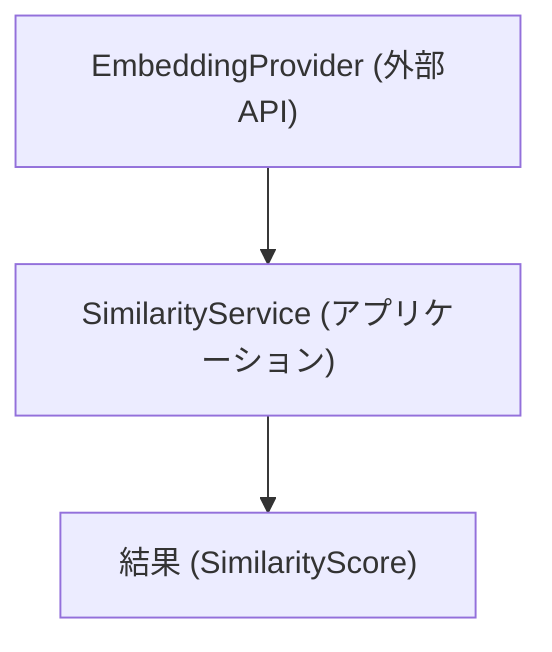
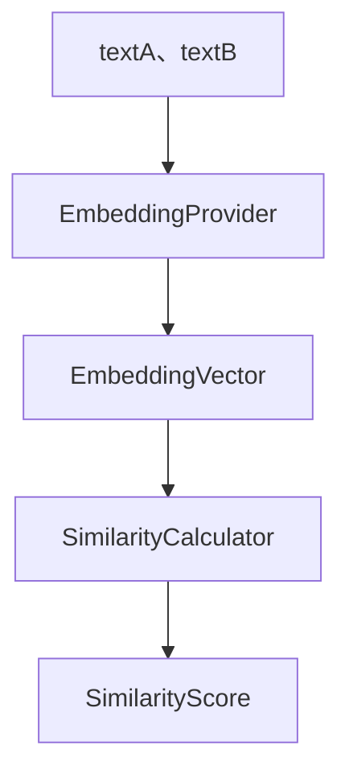

<!--
目的：「使用方法」の明文化
-->

# S2J Similarity Service - 使用方法

本ドキュメントは、本ライブラリの **具体的な使用方法 (PHP、JavaScript)** を定義します。
ユーザーが、最小構成で類似度算出を実行できることを目的とします。

## 概要

本ライブラリは、以下の機能を提供します。

* テキストから Embedding を生成します。
* 2つのテキストの、類似度を算出します。

ユーザーは、EmbeddingProvider を注入し、SimilarityService を利用します。

* Contracts 層の変更は、本仕様に影響します。
* Provider は、差し替え可能です。
* 将来的に REST API と併用可能です。

## 設計意図、設計方針、非対象

### 設計意図 (ゴール)

利用者が内部実装を意識せず、**シンプルな API で類似度を利用できるようにします。**

### 設計方針 (規約)

* DI (依存性注入) を前提とします。
* Provider を差し替え可能とします。
* 同一インターフェースで PHP、JS を提供します。

### 非対象 (Out of Scope)

* フレームワークの統合 (WordPress、React 等)
* UI コンポーネント
* API キー管理の実装

## 基本構成



## 処理フロー - End-to-End



## PHP 使用例

### 1. 初期化

```php id="php_init"
use App\Infrastructure\OpenAIEmbeddingProvider;
use App\Application\SimilarityService;

$provider = new OpenAIEmbeddingProvider($apiKey);

$service = new SimilarityService($provider);
```

### 2. 類似度算出

```php id="php_usage"
$textA = "WordPress プラグイン開発";
$textB = "WP plugin development";

$score = $service->calculate($textA, $textB);

echo $score; // 0.0 - 1.0
```

### 3. 低レベル利用 (Embedding + Core)

```php id="php_low"
$vectorA = $provider->embed($textA);
$vectorB = $provider->embed($textB);

$score = SimilarityCalculator::calculate($vectorA, $vectorB);
```

## JavaScript 使用例

### 1. 初期化

```ts id="ts_init"
import { OpenAIEmbeddingProvider } from "./infrastructure";
import { SimilarityService } from "./application";

const provider = new OpenAIEmbeddingProvider(apiKey);
const service = new SimilarityService(provider);
```

### 2. 類似度算出

```ts id="ts_usage"
const textA = "WordPress プラグイン開発";
const textB = "WP plugin development";

const score = await service.calculate(textA, textB);

console.log(score);
```

### 3. 低レベル利用

```ts id="ts_low"
const vectorA = await provider.embed(textA);
const vectorB = await provider.embed(textB);

const score = calculateSimilarity(vectorA, vectorB);
```

## 設定

### 設定項目

| 項目 | 説明 |
| ------- | --------------- |
| apiKey | Embedding API キー |
| model | 使用モデル |
| timeout | タイムアウト |

### 例 - PHP

```php id="php_config"
$provider = new OpenAIEmbeddingProvider([
    'apiKey' => 'xxx',
    'model' => 'text-embedding-3-small',
]);
```

## エラーハンドリング

### PHP

```php id="php_error"
try {
    $score = $service->calculate($textA, $textB);
} catch (ValidationException $e) {
    // 入力エラー
} catch (ProviderException $e) {
    // APIエラー
}
```

### JavaScript

```ts id="ts_error"
try {
  const score = await service.calculate(textA, textB);
} catch (e) {
  if (e instanceof ValidationError) {
    // 入力エラー
  }
}
```

## ベストプラクティス

### Provider の再利用

* 毎回生成しません。
* シングルトンとして扱います。

### キャッシュ

* Embedding 結果をキャッシュします。
* API コストを削減します。

### 非同期処理 - JavaScript

* 並列実行を可能とします。
* Promise.all を活用します。
