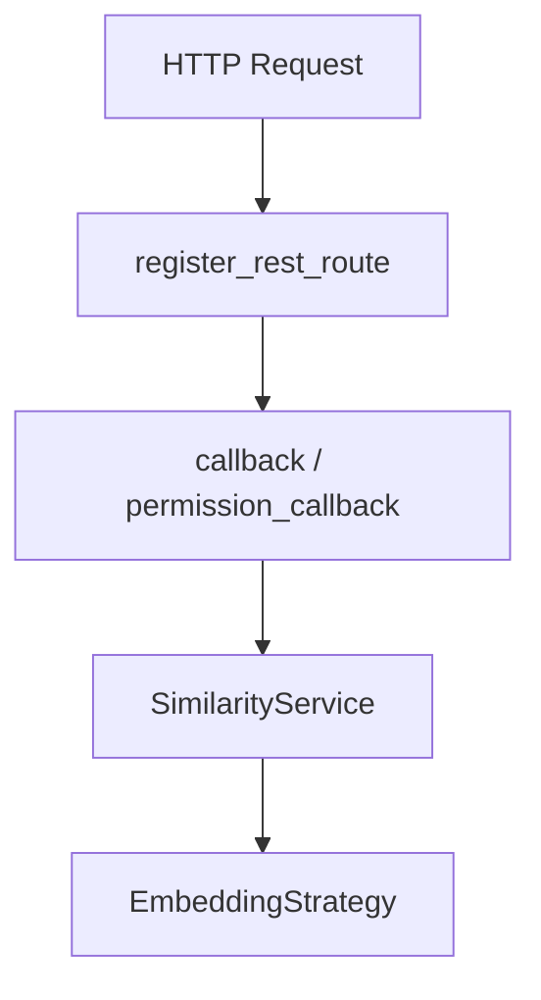
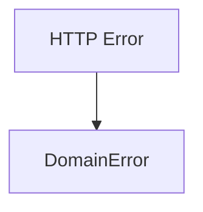

<!-- 
目的：「プロジェクトの存在理由、概要、基本情報」の明文化
 -->

# S2J Similarity Service - 概要

本ドキュメントは、本プロジェクトの **基本情報および前提理解** を目的とします。
本ライブラリが、どのような位置付けで提供され、何を責務とし、何を扱わないかを明確にします。

## はじめに

本プロジェクトは、テキスト間の「意味的な近さ (semantic similarity)」を定量化するためのライブラリです。

従来の文字列比較では困難であった下記の課題に対し、Embedding ベースの類似度計算を用いることで、より人間の感覚に近い「似ている」を数値として扱えるようにします。

* 言い換えや表記揺れを含む、類似性の検出
* 意味的な近さの、定量評価

本ライブラリは、これらの処理を抽象化し、ユーザーが **類似度計算の利用に集中できる環境** を提供します。

## 概要

本プロジェクトは、PHP 環境における再利用可能な **Composer パッケージ** として提供されます。

主な特徴は、以下の通りです。

* Embedding ベースの類似度の算出機能を提供します。
* 外部 Embedding API (OpenAI 等) との統合を抽象化します。
* プロバイダ差し替えを可能な設計とします。
* フレームワークに依存しません (WordPress 等に依存しない)。
* npm モジュールとしての利用も想定した設計です。

### 提供機能

* テキストから (外部 API 経由で) Embedding の生成
* 2つのテキストの、類似度の算出
* 類似度スコア (0.0〜1.0) の提供

### 利用環境 (想定)

* PHP (Composer)
* Node.js (npm)

※ WordPress 等のフレームワークからの利用は可能だが、本ライブラリはそれらに依存しません。

## Composer パッケージの責務と非対応スコープ

これらの機能は、アプリケーション層または外部サービスに委ねることを前提とします。

本ライブラリはあくまでも、「類似度算出」というドメイン機能に特化したコンポーネントとして設計されています。

### 責務

本ライブラリは、以下の責務を持ちます。

* Embedding を用いて、類似度算出を抽象化すること。
* 外部 API コールの、統一インターフェースを提供すること。
* 入出力データ契約を、明確化すること。
* プロバイダ差異を、吸収すること。

### 非対応スコープ (Out of Scope)

本ライブラリは、以下を対象としません。

* 大規模検索エンジン (全文検索・ランキング最適化)
* ベクトルデータベース (保存・インデックス管理)
* UI コンポーネントの提供
* (WordPress 等の) 特定フレームワークへの直接依存
* API キー管理や認証基盤の提供
* 機械学習モデルの学習・チューニング

## WordPress REST API を HTTP Runtime として利用

### 概要

本 Composer ライブラリは、単独の Web アプリケーションとして動作することよりも、下記に組み込まれることを主目的として設計しています。そのため、本ライブラリにおける HTTP runtime は、WordPress Core が提供する [WordPress REST API](https://ja.wordpress.org/team/handbook/plugin-development/rest-api/rest-api-overview/) (以降、`register_rest_route`) を前提とします。

* WordPress プラグイン
* WordPress テーマ
* WordPress を基盤とする業務システム

### 設計方針 (規約)

```plaintext id="wp_runtime_principle"
WordPress を runtime として利用する
ビジネスロジックは、WordPress 非依存に保つ
```

### 非対象 (Out of Scope)

* 独立 HTTP サーバとしての提供
* Slim / Laravel 同梱
* WordPress 外での standalone runtime 提供
* 独自 Router 実装

### Adapter の責務

#### callback

* Request → DTO に変換すること。
* Validation すること。
* SimilarityService 呼び出しすること。
* Response に変換すること。

#### permission_callback

* 認証すること。
* 権限を判定すること。
* Rate limiting を判定すること (必要に応じて)。

### 採用理由

#### 1. WordPress 自身が HTTP 基盤を提供している

WordPress は、下記に相当する仕組みを、既に備えています。

* Routing
* Controller
* Request / Response
* Authentication
* Permission
* Error handling

たとえば

```php id="wp_runtime_route"
register_rest_route(
    's2j/v1',
    '/similarity',
    [
        'methods'  => 'POST',
        'callback' => [...],
        'permission_callback' => [...],
    ]
);
```

#### 2. 二重 HTTP スタックを避ける

本ライブラリでは、下記の様なサードパーティー製ツール等を同梱し、WordPress 内部に別 HTTP runtime を構築することは行いません。

* Slim
* Laravel
* Symfony

その理由として、下記を挙げておきます。

* Routing が二重化する
* Authentication が分裂する
* Response 形式が混在する
* 運用コストが増加する

#### 3. WordPress の流儀に統一する

HTTP 層は、WordPress の規約に寄せます。

| 項目 | WordPress 標準 |
|------|----------------|
| Routing | `register_rest_route` |
| Response | `WP_REST_Response` |
| Error | `WP_Error` |
| Permission | `permission_callback` |
| Authentication | WordPress / Application Passwords / JWT 等 |

### アーキテクチャ上の位置づけ

#### 方針

* `register_rest_route` の callback / permission_callback を、REST Adapter (Controller) として扱います。

#### 構成



### REST API 仕様との整合

[REST API 仕様](docs/interfaces/rest_api_spec.md) における、下記に挙げる様な責務は、WordPress REST API 上で実現します。

* Routing
* Controller
* Authentication
* Error mapping

### Core / Application との関係

#### 原則

* Core / Application は WordPress に依存しない。
* WordPress 依存コードは Adapter 層に限定する。

### 補足

本ライブラリは、Composer package として提供されるが、主用途は WordPress エコシステムへの組み込みです。そのため、下記との整合性を優先します。

* WordPress のライフサイクル
* WordPress の認証モデル
* WordPress REST API

## WordPress 前提の Codegen / SDK 配布方針

### 概要

本ライブラリは、WordPress プラグイン・テーマへ組み込まれることを主用途としています。そのため、下記ケースを前提に、codegen、SDK、配布方針を設計しています。

* Node.js が本番環境に存在しない。
* Composer のみで導入される。
* shared hosting 上で動作する。

### 設計原則

```plaintext id="wp_sdk_principle"
生成物は、内部に閉じ込め
WordPress 利用者には、安定 API を公開する
```

### 非対象 (Out of Scope)

* 本番環境での Node 実行
* runtime codegen
* generated client の直接利用推奨
* standalone TS SDK 配布

### SDK が吸収する責務

#### 1. 安定メソッド名

```plaintext id="wp_sdk_methods"
similarity()
embed()
```

#### 2. エラー変換



#### 3. WordPress 向け通信設定

下記を標準化します。

* timeout
* retry
* authentication

#### 4. ドメイン型への変換

REST Response を、下記に変換します。

* DTO
* Domain 型

### OpenAPI と Codegen

#### Source of Truth

OpenAPI schema を契約定義の source of truth とします。

```plaintext id="wp_codegen_sot"
schema/openapi.yaml
```

#### Codegen 実行タイミング

##### 方針

生成処理 (codegen) は、下記でのみ実行し、本番 WordPress 環境では実行しません。

* 開発環境
* CI
* release build

##### 理由

WordPress 実運用では、下記ケースが多いためです。

* Node.js が存在しない。
* pnpm / npm が使用できない。
* build step を前提にできない。

### 配布方針

#### PHP DTO

生成済み PHP DTO は Composer 配布物に含めます。

たとえば

```plaintext id="wp_codegen_php"
src/Contracts/DTO/Generated/
```

#### TypeScript / Zod

TypeScript / Zod 生成物は、下記の様な開発用途に限定します。

* 管理画面
* Playground
* block editor
* build を伴う管理 UI

#### 本番 WordPress

PHP のみで動作可能であることを優先します。

### SDK 公開方針

#### 公開 API

公開 API は、下記を中心に安定化します。

* contracts
* client

#### contracts

役割は、下記となり、OpenAPI codegen の成果物として安定提供します。

* DTO
* 型契約
* ErrorResponse
* Domain 型

#### client

役割は、下記となります。

* WordPress ユーザー向けの、下記を特徴とする、高レベル API を提供します。
	* 安定したメソッド名
	* 安定した戻り値
	* DomainError
	* timeout / retry の吸収

たとえば

```php id="wp_sdk_client"
$client->similarity(...)
```

#### raw client の扱い

* raw client は、公開 API としません。
* OpenAPI generated client は、内部実装として扱います。

generated client を直接公開すると、下記に挙げる様なことがユーザーに漏出しやすいためです。

* HTTP 差異
* runtime 差異
* エラー形式
* retry 方針

#### ClientInterface

* ユーザーは、generated client ではなく、安定した ClientInterface を使用します。

たとえば

```php id="wp_sdk_interface"
interface ClientInterface
{
    public function similarity(
        string $a,
        string $b,
        ?string $model = null
    ): float;
}
```

### 補足

本ライブラリでは、下記として責務分離を行います。

```plaintext id="wp_sdk_boundary"
OpenAPI = 契約
generated = 内部実装
client = 公開入口
```

これにより、下記を SDK 内部に閉じ込めることを目的とします。

* WordPress 環境依存
* runtime 差異
* HTTP 実装差異
