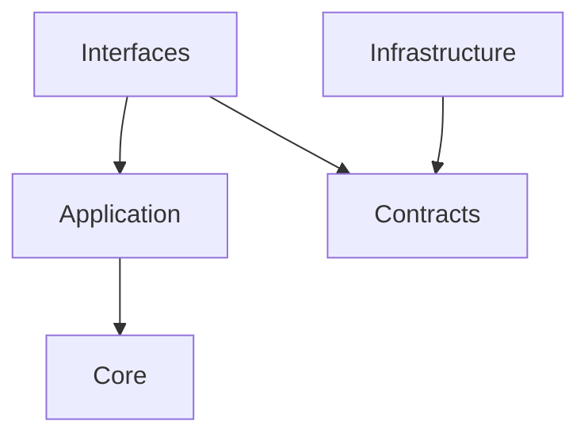

<!-- 
 設計原則
 -->

# S2J Similarity Service - 設計原則

## 設計意図、設計方針、非対象

### 設計意図 (ゴール)

本プロジェクトの、全仕様に共通する設計ルールを定義します。

### 原則

#### 1. Source of Truth

* API 契約は OpenAPI に集約する
* docs は人間向け説明
* 生成物は派生物

#### 2. 生成物の扱い

* generated ディレクトリは編集禁止
* 変更は必ず OpenAPI 経由

#### 3. 依存方向

#### 4. 責務分離

| 層 | 責務 |
| --- | --- |
| Core | 純粋ロジック |
| Contracts | 型 |
| Infrastructure | 外部依存 |
| Interfaces | I/O |

#### 5. runtime 戦略

* runtime 分岐はビルドで解決
* 実行時判定は禁止

#### 6. examples 中心設計

* examples が唯一の実行コード
* README / Playground / Test は全てそこから生成
