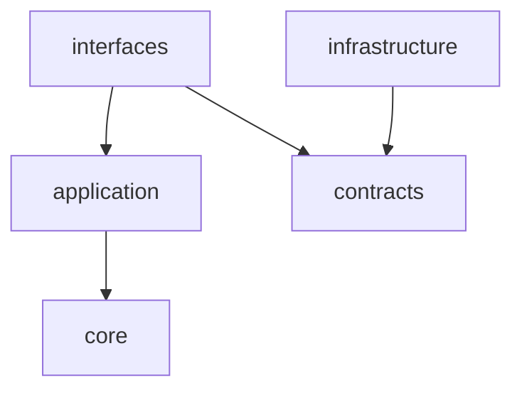

# S2J Similarity Service - 仕様書の起点

本プロジェクトの仕様は、以下のドキュメントに分散して定義しています。
各ドキュメントへの導線のみを提供し、詳細な仕様は個別ファイルに委譲します。

## 読み方ガイド

本ドキュメント群は、「Why → What → How → Usage → Operations」の順で理解することを前提とします。

目的に応じて、以下の順序で参照してください。

### 推奨読み順 (初読)

1. **concept.md**
   * なぜこのプロジェクトが存在するか (目的、課題、ユースケース)

2. **contracts/**
   * システムの外部契約 (データ構造、API 仕様)
   * OpenAPI を中心とした Source of Truth

3. **architecture.md**
   * システム構造 (レイヤ構成、責務分離、依存関係)

4. **core/**
   * ドメインロジック (類似度算出など)

5. **interfaces/**
   * 外部との接続点 (REST API、SDK、使用方法)

6. **governance/**
   * 統制、コンプライアンス、セキュリティ、データ管理、ドキュメント整合など。ガバナンスの全体像は、本ページの一覧を参照し、詳細は **governance/** 配下の個別ドキュメントへ委ねます。

### 役割別読み順

#### 利用者 (SDK / API ユーザー)

1. interfaces/usage_spec.md
2. interfaces/rest_api_spec.md

#### 実装者 (ライブラリ開発者) / ドキュメント編集者

1. architecture.md
2. contracts/*
3. core/*
4. interfaces/sdk_spec.md
5. [ドキュメンテーションガバナンス](./governance/documentation_governance.md) (README、使用方法の整合、公開 API のユーザー向けドキュメント)

#### インフラストラクチャ・運用担当

1. sre/*
2. governance/*
3. engineering/*

#### CI / ビルド担当

1. engineering/codegen_pipeline.md
2. engineering/build_and_release.md
3. engineering/monorepo.md

## ドキュメント一覧

### Why (基本情報)

| ドキュメント | 内容 |
|--------------|------|
| [概要](./overview.md) | プロジェクト概要、責務、前提条件 |
| [コンセプト](./concept.md) | 背景、課題、ユースケース、処理フロー |
| [アーキテクチャー](./architecture.md) | システム構造、レイヤ責務、設計原則 |

### Domain (コア)

| ドキュメント | 内容 |
|--------------|------|
| [類似度算出の仕様](./core/similarity_spec.md) | 類似度算出ロジック |

### What (契約)

| ドキュメント | 内容 |
|--------------|------|
| [入出力仕様](./contracts/data_contract_spec.md) | 入出力仕様 (DTO) |
| [データ定義](./contracts/data_dictionary.md) | データ定義 (型、構造) |
| [外部 API 仕様](./contracts/embedding_api_spec.md) | 外部 API 仕様 |
| [OpenAPI 契約統合仕様](./contracts/openapi_spec.md) | API 契約の統合 (OpenAPI 形式) |
| [コード生成仕様](./contracts/codegen_spec.md) | OpenAPI からのコード生成仕様 |

### How - 接続 (インターフェイス)

| ドキュメント | 内容 |
|--------------|------|
| [REST API エンドポイント仕様](./interfaces/rest_api_spec.md) | REST API エンドポイント仕様 |
| [型安全な SDK 設計](./interfaces/sdk_spec.md) | SDK / ApiClient 設計 |
| [Runtime 仕様](./interfaces/runtime_spec.md) | runtime (node / edge / browser) 設計 |
| [使用方法](./interfaces/usage_spec.md) | 使用方法 (PHP、JavaScript) |

### エンジニアリング (開発基盤)

| ドキュメント | 内容 |
|--------------|------|
| [コード生成パイプライン](./engineering/codegen_pipeline.md) | docs → OpenAPI → SDK → README の連動 |
| [ビルドおよびリリース](./engineering/build_and_release.md) | CI/CD、リリース戦略 |
| [モノレポ構成とパッケージ管理](./engineering/monorepo.md) | pnpm / turborepo 構成 |
| [Playground 環境と `examples`](./engineering/playground.md) | Playground / examples / UI ドキュメント |

### SRE (運用・信頼性)

| ドキュメント | 内容 |
|--------------|------|
| [システム可視化](./sre/observability.md) | メトリクス、ログ、トレース |
| [信頼性](./sre/reliability.md) | SLO、自動復旧、カオスエンジニアリング |
| [スケール戦略](./sre/scaling.md) | スケーリング、分散、DR、マルチクラウド |

### ガバナンス (統制)

| ドキュメント | 内容 |
|--------------|------|
| [セキュリティ設計](./governance/security.md) | 認証・認可、ゼロトラスト |
| [コンプライアンス](./governance/compliance.md) | 監査、SLA、課金、SOC2 / SOX |
| [データガバナンス](./governance/data_governance.md) | データ管理、レジデンシー |
| [ドキュメンテーションガバナンス](./governance/documentation_governance.md) | README、使用方法の整合、公開 API のユーザー向けドキュメント SoT |

### その他

| ドキュメント | 内容 |
|--------------|------|
| [実装状況](./status.md) | 実装状況、Backlog、品質レポート |

## 依存関係ルール

本プロジェクトでは、ドキュメントおよび実装の依存方向を、厳密に制御します。

### 許可される依存方向

### 禁止事項

* 下位レイヤーが、上位レイヤーに依存しない。
* Core が、外部 API に依存しない。
* Contracts に、ビジネスロジックを持たない。
* Interfaces に、ドメインロジックを持たない。

## 依存禁止ルール (補足)

### Core の制約

* Core は、完全に純粋関数で構成します。
* 外部依存だけでなく、インターフェース依存も持ちません。

### Application の役割

* 外部との接続 (Embedding 取得) を担います。
* Core と Infrastructure の橋渡しを行います。

## Source of Truth (SoT)

契約・コード生成と、ユーザー向け説明文では、参照の軸が異なります。

* **API 契約・コード生成:** **[OpenAPI](./contracts/openapi_spec.md)** に集約します。生成物 (`generated`) は派生物とし、直接編集を禁止します。すべての型・DTO・SDK は、OpenAPI から生成されます。
* **ユーザー向けドキュメント (公開 API の説明・命名・例):** プロジェクトルートの **[README](../README.md)** および **[使用方法](./interfaces/usage_spec.md)** の整合は、**[ドキュメンテーションガバナンス](./governance/documentation_governance.md)** で定義します。契約と矛盾する場合は、実装および OpenAPI を正とし、README・使用方法を追随させます。

## 用語統一ルール

ユーザー向けドキュメントと実装の表記を揃えるための正式名称・禁止語・運用 (たとえば strategy の呼び方) は、**[ドキュメンテーションガバナンス](./governance/documentation_governance.md)** に集約します。本ページでは二重メンテナンスを避けるため、詳細ルールは同文書を参照してください。

## 補足

* 各仕様は、「責務・非責務」により、境界が定義されます。
* 新規仕様追加時は、必ず既存レイヤーに分類します。
* 分類できない場合は、新規レイヤーを追加せず、再設計します。
