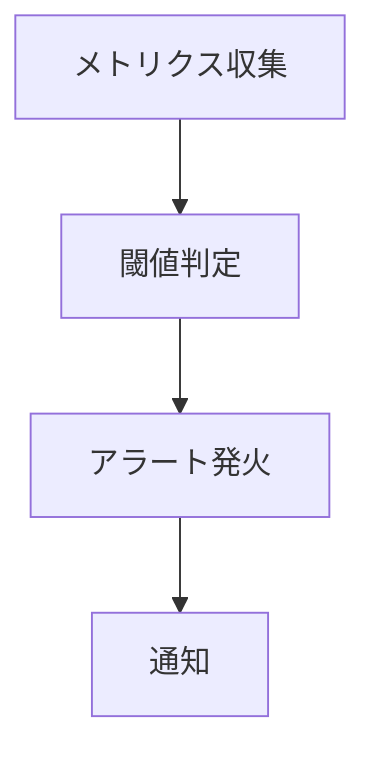
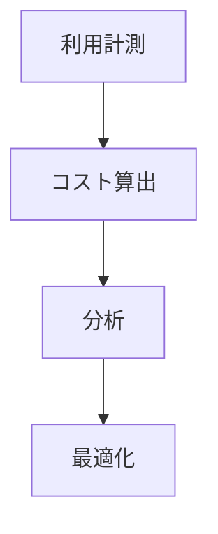

<!-- 
observability
 -->

# S2J Similarity Service - システム可視化

## 概要

本仕様は、メトリクス・ログ・トレースによるシステム可視化を定義します。

## 設計意図、設計方針、非対象

### 設計意図 (ゴール)

* システム状態の可視化します。
* 問題を早期検知します。
* コスト最適化の基盤を構築します。

### 設計方針 (規約)

* Metrics / Logs / Traces を統合します。
* tenant 単位で可視化します。
* correlation_id により追跡します。

### 非対象 (Out of Scope)

* 自動復旧
* スケーリング
* ビジネス分析

## メトリクス (Observability)

本プロジェクトでは、システムの状態を可視化するために、メトリクス、ログ、トレースを統合した Observability を実装します。

### 設計意図 (ゴール)

* システムの健全性を把握します。
* 問題を早期検知し、原因特定します。
* SLA 達成状況を可視化します。

### 設計方針 (規約)

* Metrics、Logs、Traces の「トリニティ」で収集します。
* tenant 単位で可視化を可能にします。
* すべての主要処理に計測を埋め込みます。

### 責務

* システム状態を可視化すること。
* 計測データを提供すること。

### 非責務

* 分析結果の判断
* ビジネス意思決定

### 技術例

| ツール | 用途 |
| ------------- | ----- |
| Prometheus | メトリクス |
| Grafana | 可視化 |
| OpenTelemetry | トレース |

### メトリクス分類

| 種別 | 内容 |
| --- | --------------------------------- |
| RED | Rate / Errors / Duration |
| USE | Utilization / Saturation / Errors |

### ログ

* 構造化ログ (JSON)
* correlation_id による追跡

### トレース

* 分散トレーシング (OpenTelemetry)
* API → 外部 API → DB の流れを追跡

### 主な指標

| 指標 | 内容 |
| ------------- | ------ |
| request_count | リクエスト数 |
| error_rate | エラー率 |
| latency | 応答時間 |
| throughput | スループット |

### 利点

* 可視化による安心感に接続できること。
* 障害対応を高速化できること。
* パフォーマンスを改善できること。

### 注意点

* 計測コストに注意してください。
* データ量の増加に注意してください。

## アラート設計 (Alerting)

本プロジェクトでは、異常状態を自動検知し通知するアラート機構を設計します。

### 設計意図 (ゴール)

* 障害を即時検知します。
* SLA 違反を防止します。
* 運用負荷を軽減します。

### 設計方針 (規約)

* メトリクスベースで、アラートを発火します。
* ノイズを最小化します (過剰通知の防止)。
* 優先度 (Severity) を定義します。

### 責務

* 異常を検知すること。
* 通知すること。

### 非責務

* 問題解決
* 自動復旧 (別設計)

### アラート分類

| レベル | 内容 |
| -------- | ------ |
| Critical | 即時対応が必要 |
| Warning | 注意 |
| Info | 参考 |

### 例

```plaintext id="alert_example"
error_rate > 5% → Critical
latency > 500ms → Warning
```

### 抑制戦略

* デバウンス (一定時間の継続)
* グルーピング

### 通知手段

* Slack
* Email
* PagerDuty

### フロー



### 利点

* 迅速な対応が期待できること。
* SLA を維持できること。
* 運用効率を向上できること。

### 注意点

* 「アラート疲れ」を招かない様、閾値を調整してください。

## コスト最適化 (FinOps)

本プロジェクトでは、クラウドおよび外部 API コストを最適化するための FinOps 戦略を導入します。

### 設計意図 (ゴール)

* コストを可視化します。
* 無駄な支出を削減します。
* 利益率を最大化します。

### 設計方針 (規約)

* 使用量を常に計測します。
* tenant 単位でコストを追跡します。
* 自動最適化を導入します。

### 責務

* コストを管理すること。
* 最適化施策

### 非責務

* 価格戦略
* ビジネス判断

### 可視化

* コストダッシュボード
* tenant 別利用量

### コスト対象

| 対象 | 内容 |
| ----- | ------------- |
| 外部 API | Embedding API |
| インフラ | DB / compute |
| ストレージ | ログ / データ |

### 最適化手法

* キャッシュ (embedding 結果)
* バッチ処理
* レート制御
* モデル選択 (コスト差)

### フロー



### 利点

* コストを削減できること。
* 収益を最大化できること。
* 運用を持続可能にできること。

### 注意点

* 過度な最適化による、品質低下に注意してください。
* 可視化不足に注意してください。
