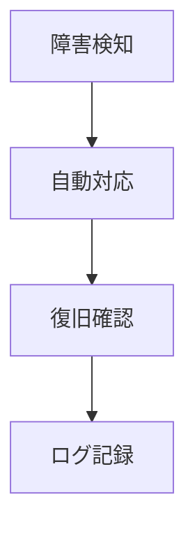
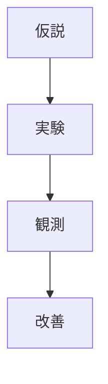

<!-- 
 SLO / self-healing / chaos
 -->

# S2J Similarity Service - 信頼性

## 概要

本仕様は、SLO (Service Level Objective)、自動復旧、カオスエンジニアリングによる、信頼性設計を定義します。

## 設計意図、設計方針、非対象

### 設計意図 (ゴール)

* 高可用性を実現します。
* 障害耐性を向上します。
* 継続的に改善します。

### 設計方針 (規約)

* SLO を定義し測定します。
* 自動復旧を導入します。
* 定期的に障害検証します。

### 責務

* SLO を定義することと測定すること。
* 自動復旧 (Self-healing) を設計すること。
* カオスエンジニアリングにより、検証すること。

### 非責務

* スケーリング戦略
* コスト最適化
* インフラ構成

### 非対象 (Out of Scope)

* スケーリング
* インフラ設計
* コスト管理

## SLO 設計 (より精密な品質管理)

本プロジェクトでは、サービス品質を定量的に管理するために SLO (Service Level Objective) を定義し、継続的に測定・改善します。

### 設計意図 (ゴール)

* SLA を実現するための内部指標を定義します。
* 品質を数値で管理します。
* 改善サイクルを回します。

### 設計方針 (規約)

* SLI → SLO → Error Budget の構造を採用します。
* SLO は、現実的かつ測定可能な値にします。
* Error Budget を意思決定に利用します。

### 責務

* 品質目標を定義すること。
* 継続的に測定すること。

### 非責務

* SLA の契約
* ビジネス判断

### 運用

* SLO 違反時 → リリース制限
* Error Budget 消費 → 改善優先

### 用語

| 用語 | 内容 |
| --- | ----------- |
| SLI | 指標 (例: 成功率) |
| SLO | 目標 (例: 99.9%) |
| SLA | 外部契約 |

### 主要 SLI

| 指標 | 内容 |
| ------------ | ---- |
| availability | 可用性 |
| latency | 応答時間 |
| error_rate | エラー率 |

### SLO 例

```plaintext id="slo_example"
availability ≥ 99.9%
latency p95 ≤ 200ms
error_rate ≤ 1%
```

### Error Budget

```plaintext id="error_budget"
許容エラー = 0.1%
```

### 利点

* 品質を可視化できること。
* 客観的に判断できること。
* 継続的に改善できること。

### 注意点

* 「測定の難しさ」から、過剰な目標設定に陥る可能性があります。

## 自動復旧 (Self-healing)

本プロジェクトでは、障害発生時に自動的に回復するしくみ (Self-healing) を導入します。

### 設計意図 (ゴール)

* 障害対応を自動化します。
* ダウンタイムを最小化します。
* 運用負荷を削減します。

### 設計方針 (規約)

* 「検知→対応→回復」を自動化します。
* 小さな障害は、自動復旧します。
* 重大障害は、人間にエスカレーションします。

### 責務

* 自動的な回復処理であること。
* 障害対応を簡素化すること。

### 非責務

* 根本原因の解決
* 手動運用の完全排除

### パターン

| パターン | 内容 |
| --------------- | ------- |
| Retry | 再試行 |
| Circuit Breaker | 障害遮断 |
| Fallback | 代替処理 |
| Restart | プロセス再起動 |

### フロー



### 実装例

* API retry
* Worker 再起動
* キャッシュ fallback

### 利点

* 可用性を高いものにできること。
* MTTR を短縮できること。
* 運用効率を向上できること。

### 注意点

* 誤復旧にならない様、注意してください。
* 無限ループに陥らない様、注意してください。

## カオスエンジニアリング

本プロジェクトでは、意図的に障害を発生させることで、システムの耐障害性を検証・改善します。

### 設計意図 (ゴール)

* 障害耐性を検証します。
* 未知の問題を発見します。
* 信頼性を向上します。

### 設計方針 (規約)

* 本番環境に近い条件で、実施します。
* 小さく始めて、徐々に拡大します。
* 影響範囲を制御します。

### 責務

* 耐障害性を検証すること。
* 改善サイクル

### 非責務

* 障害発生そのもの
* SLA の保証

### 実験例

| 内容 | 目的 |
| ------- | ---------- |
| API 停止 | フェイルオーバー確認 |
| レイテンシ増加 | タイムアウト検証 |
| エラー注入 | Retry 確認 |

### フロー



### ツール例

| ツール | 用途 |
| ------------ | ---- |
| Chaos Monkey | 障害注入 |
| Gremlin | 実験管理 |

### 利点

* 信頼性を向上できること。
* 障害対応力を強化できること。
* 想定外の検出を期待できること。

### 注意点

* 本番に影響しない様、「実施タイミング」に注意してください。
