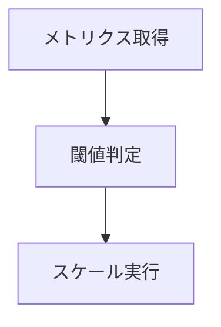
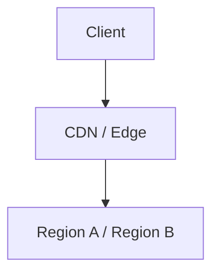
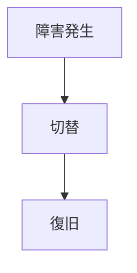
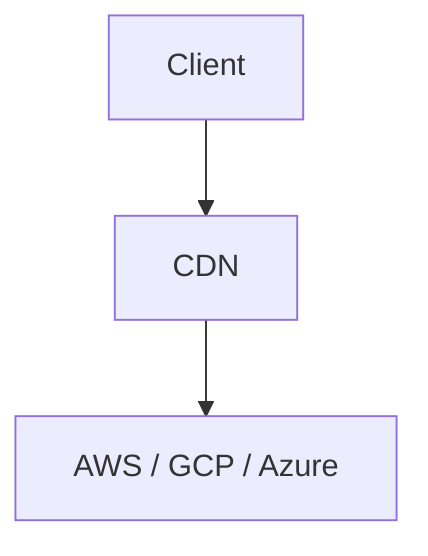

<!-- 
 autoscale / global / DR
 -->

# S2J Similarity Service - スケール戦略

## 概要

本仕様は、スケーリング、分散、災害復旧を含む、スケール戦略を定義します。

## 設計意図、設計方針、非対象

### 設計意図 (ゴール)

* 負荷に応じて、スケールします。
* 高可用性を確保します。
* 災害耐性を確保します。

### 設計方針 (規約)

* 水平スケーリングを基本とします。
* マルチリージョンを構成します。
* DR 戦略を明確化します。

### 責務

* スケーリング戦略 (Auto Scaling) を定義すること。
* グローバル分散に設計すること。
* 災害復旧 (DR) およびマルチクラウドに対応すること。

### 非責務

* SLO 定義
* 監査対応
* アプリケーションロジック

### 非対象 (Out of Scope)

* アプリケーション最適化
* SLO 定義
* コスト最適化

## 自動スケーリング戦略

本プロジェクトでは、負荷に応じてリソースを動的に増減させる自動スケーリングを採用します。

### 設計意図 (ゴール)

* トラフィック変動に対応します。
* コストを最適化します。
* SLA を維持します。

### 設計方針 (規約)

* メトリクス駆動でスケールします。
* 水平スケーリングを基本とします。
* スケールイン/スケールアウトの閾値を、明確化します。

### 責務

* リソースを調整すること。
* 負荷を分散すること。

### 非責務

* アプリケーションの最適化
* DB のスケーリング

### スケーリング指標

| 指標 | 内容 |
| --- | --- |
| CPU 使用率 | 70%超でスケールアウト |
| レイテンシ | 200ms 超 |
| キュー長 | backlog 増加 |

### スケーリング方式

| 種類 | 内容 |
| --- | --- |
| HPA | Pod 単位 |
| VPA | リソース調整 |
| KEDA | イベント駆動 |

### フロー



### 利点

* 柔軟に負荷対応できること。
* コストを削減できること。
* 可用性を高いものにできること。

### 注意点

* スケール遅延に陥らない様、注意してください。
* スロースタートに注意してください。

## バッチ処理とスケーリング

### 設計意図 (ゴール)

バッチ処理による負荷増大を制御します。

### 設計方針 (規約)

* concurrency 上限を設けます。
* レート制限を考慮します。
* 必要に応じて、キューイングします。

### 注意

大規模 `N×N` 計算は、計算量 `O = (N²)` のため、分割処理を検討します。

## グローバル分散設計

本プロジェクトでは、複数リージョンにサービスを分散配置し、低レイテンシおよび高可用性を実現します。

### 設計意図 (ゴール)

* ユーザー体験を向上します。
* 障害耐性を強化します。
* 地理的に分散します。

### 設計方針 (規約)

* マルチリージョンに配置します。
* リード/ライトを分離します。
* フェイルオーバーに対応します。

### 責務

* 分散配置すること。
* フェイルオーバー

### 非責務

* アプリロジック
* UI 最適化

### データ戦略

| モデル | 内容 |
| --- | --- |
| Active-Active | 双方向 |
| Active-Passive | 片系待機 |

### ルーティング

* Geo routing
* Latency based routing

### 構成



### 利点

* 遅延を低いものにできること。
* 可用性を高いものにできること。
* 災害に対する耐性ができること。

### 注意点

* データ整合性に注意してください。
* 運用の複雑化が不可避です。

## 災害復旧 (DR)

本プロジェクトでは、大規模障害やリージョン障害に備えた災害復旧 (Disaster Recovery) 戦略を設計します。

### 設計意図 (ゴール)

* 事業継続性を確保します。
* データを保護します。
* SLA を維持します。

### 設計方針 (規約)

* RTO、RPO を明確化します。
* バックアップと復旧手順を定義します。
* 定期的に、復旧テストを行います。

### 責務

* 復旧戦略であること。
* データを保護すること。

### 非責務

* 障害の防止
* 通常運用

### 戦略

| 種類 | 内容 |
| --- | --- |
| バックアップ & リストア | 基本 |
| Warm Standby | 中 |
| Hot Standby | 高 |

### 指標

| 指標 | 内容 |
| --- | --- |
| RTO | 復旧時間 |
| RPO | データ損失許容 |

### 例

```plaintext id="dr_example"
RTO ≤ 1時間
RPO ≤ 5分
```

### フロー



### 利点

* 事業を継続できること。
* リスクを低減できること。
* 信頼性を向上できること。

### 注意点

* コストの増加に注意してください。
* テストの不足に注意してください。

## マルチクラウド戦略

本プロジェクトでは、単一クラウド依存を回避し、可用性・可搬性・ベンダーロックイン回避を目的としてマルチクラウド戦略を採用します。

### 設計意図 (ゴール)

* ベンダーロックインを回避します。
* 可用性を向上 (クラウド障害耐性) します。
* コストと性能を最適化します。

### 設計方針 (規約)

* クラウド依存部分を抽象化します。
* IaC (Infrastructure as Code) で、環境を統一します。
* データ層は、クラウド間で冗長化します。

### 責務

* クラウド間に分散すること。
* 可搬性を確保すること。

### 非責務

* 各クラウド固有機能の最適化
* 単一クラウド特化設計

### 抽象化レイヤ

| 層 | 対応 |
| --- | --- |
| Compute | Kubernetes |
| Storage | S3互換 |
| DB | マネージド or 分散 DB |

### デプロイ戦略

* Active-Active (複数クラウド同時稼働)
* Active-Passive (待機系)

### 構成例



### 利点

* 可用性を高いものにできること。
* 柔軟にリソース選択できること。
* リスクを分散できること。

### 注意点

* 運用の複雑性が増加します。
* コストの増加に注意してください。
* データの同期問題が不可避です。
