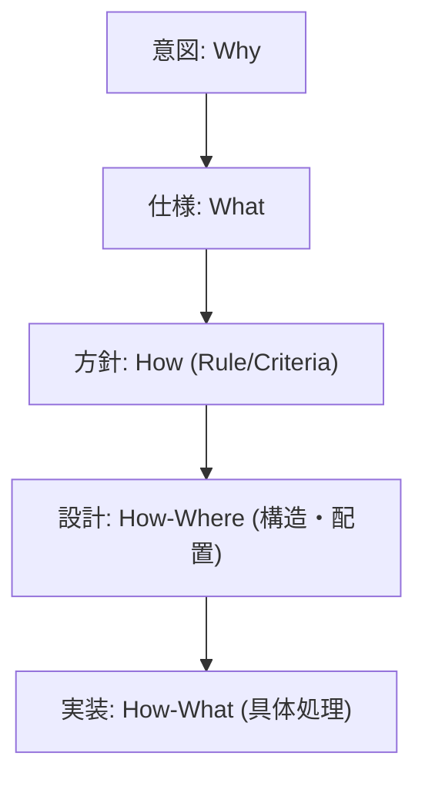

# S2J Similarity Service - 仕様書の起点

本プロジェクトの仕様は、以下のドキュメントに分割して管理しています。  
AI 伴走開発・メンテナンス時は、タスクに応じて該当ファイルを参照してください。

| ドキュメント | 内容 |
|--------------|------|
| [概要](overview.md) | プロジェクトの存在理由、提供価値、特徴 |
| [類似度算出の仕様](similarity_spec.md) | 類似度算出ロジック |
| [OpenAI Embedding API 利用仕様](embedding_api_spec.md) | Embedding API (OpenAI) の契約、エラー扱い |
| [データ入出力の仕様](data_contract_spec.md) | 入出力の定義 (パラメータ、戻り値) |
| [アーキテクチャー](architecture.md) | フォルダー構成、主要ファイル、技術スタック、ビルド、責務 |
| [Composer パッケージ仕様](composer_package_spec.md) | Composer パッケージ仕様 |

## 読み方ガイド

* 各仕様で散見される「意図・方針」について:
  * 「意図 = ゴール」、「方針 = 意図を実現するための規約」という関係にあります。

---

## 細分化の考え方

仕様をどこまで分けるかの方針は [SPEC_STRUCTURE.md](SPEC_STRUCTURE.md) にまとめてあります。  
WordPress プラグイン / PHP ライブラリ全般のベター・プラクティスとして参照できます。

---

## 統合版

従来どおり1ファイルで全体を確認したい場合は [SPEC.md](SPEC.md) を参照してください。  
上記の分割仕様を統合した内容です。
